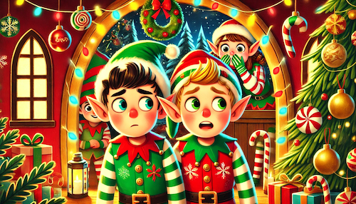

# Day 2: 🎄 Help Us Find the Stolen Vectors

This challenge will have you break the fourth wall of a holiday film, where for a few minutes, you'll be walking a line between fiction and reality.

🔍 **Challenge Objective:**

For today's challenge, we're going to be visiting the fictional universe of the Weaviate Elves in the film "A Very Weaviate Christmas". There seems to be some trouble brewing. Something has been stolen from them. Your challenge is to find out what's going on and who is behind it.

You will know that you've successfully completed the challenge if you can answer the question "Who is the culprit?"

🎄 **Some things to get you started** 
In the starter Colab you will find:
- A `WeaviateDocumentStore` which has access to information about many many movies
- Lots of hints to help you along the way
- Links to documentation that will be useful in your quest!

> 🩵 Here's the [Starter Colab](https://colab.research.google.com/drive/1KOTtFXVwBtmgQ3TB3BSMcYSi-5Ltg2YS?usp=sharing)