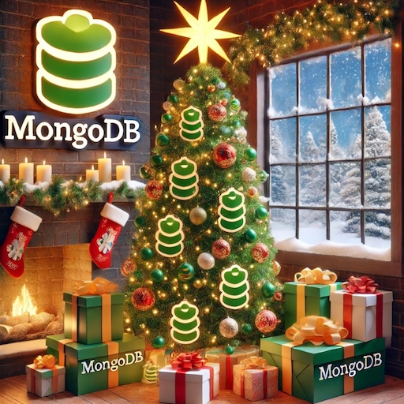

# Santa's Self-Reflecting Gift Agent 🎁

Elf Pash at the North Pole has a challenge. Every year, Santa needs to process millions of gift requests and optimize his gift selections based on children's wishlists and budget constraints. Other elves often ask questions like "_What gifts should we get for a 9-year-old who loves science?_" or "_How can we maximize joy while staying within budget?_" 🎁

This year, elf Pash has an idea to solve this: create a self-reflecting agent that can optimize gift selections automatically! As he experiments with LLMs, he realizes that simple gift suggestions aren't enough - the agent needs to reflect on its choices to ensure they're optimal. Being a Haystack elf, Pash knows how to solve this: SELF-REFLECTION! 💭

So, he comes up with a plan. Santa will create a gift recommendation system using Haystack's RAG pipeline with MongoDB Atlas vector search, enhanced with a self-reflecting component that optimizes gift selections based on budget, age appropriateness, and joy factor! ✨

For this challenge, you must help elf Pash create a pipeline that can suggest and optimize gift selections through self-reflection.

Here are the components you'll need for this challenge:
- [`OpenAITextEmbedder`](https://docs.haystack.deepset.ai/docs/openaitextembedder) for  query embedding
- [`MongoDBAtlasEmbeddingRetriever`](https://docs.haystack.deepset.ai/docs/) for finding relevant gifts
- [`PromptBuilder`](https://docs.haystack.deepset.ai/docs/promptbuilder) for creating the prompt
- `GiftChecker` for self-reflection
- [`OpenAIGenerator`](https://docs.haystack.deepset.ai/docs/openaigenerator) for  generating responses

### 🎯 Requirements:

- [OpenAI API Key](https://platform.openai.com/api-keys)
- [MongoDB Atlas project](https://www.mongodb.com/docs/atlas/getting-started/) with an Atlas cluster (free tier works). Take a note of your [connection string](https://www.mongodb.com/docs/atlas/tutorial/connect-to-your-cluster/#connect-to-your-atlas-cluster) and have `0.0.0.0/0` address in your network access list. Visit [detailed tutorial](https://www.mongodb.com/docs/guides/atlas/cluster/#create-a-cluster) for step by step guide.
- Implement a self-reflecting agent that can optimize gift selections
- Use MongoDB Atlas vector search for semantic gift matching
- Include price, age range, and category in gift considerations
- Ensure all suggestions stay within the specified budget

> ### 💝 Some Hints:
> - Use [`OpenAIDocumentEmbedder`](https://docs.haystack.deepset.ai/docs/openaidocumentembedder) with `meta_fields_to_embed` to include gift metadata in embeddings
> - Create a custom component for gift optimization checks
> - Use the `max_runs_per_component` parameter in Pipeline for controlled self-reflection
> - You've seen how to build pipelines in previous days!

> 💚 Here is the [Starter Colab](https://colab.research.google.com/drive/1FUfVB1BjUEn24jWqontGMqfCHAzW0FXf?usp=sharing)

