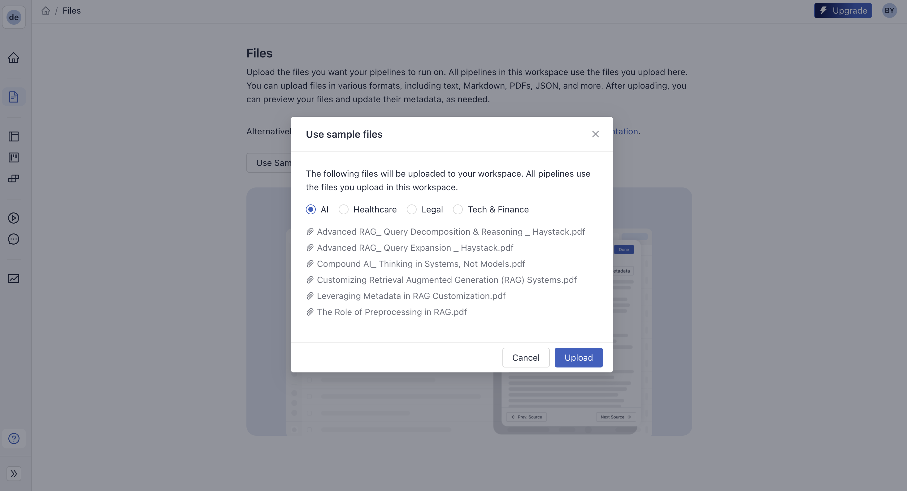
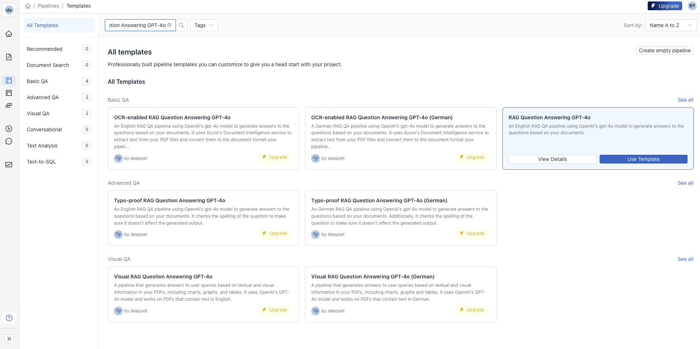
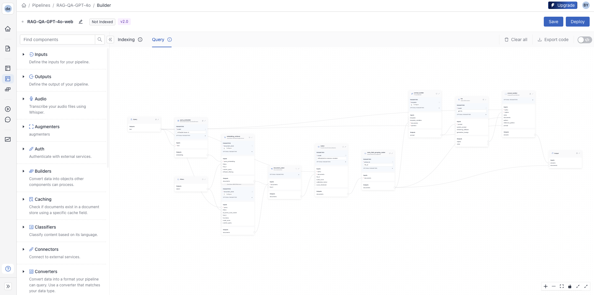
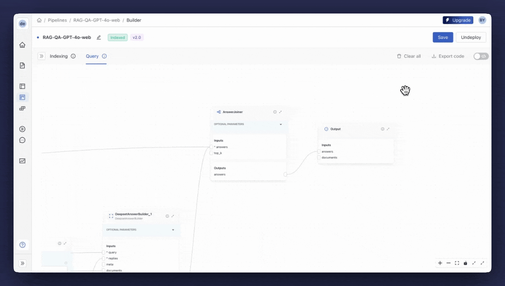
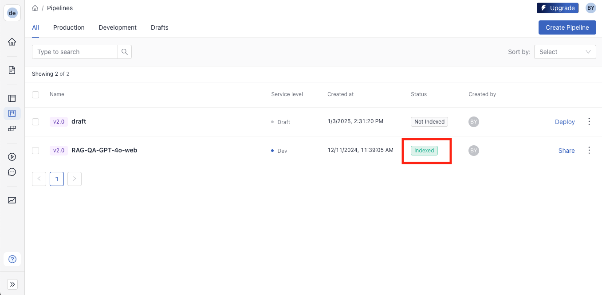

---
layout: blog-post
title: Build an Agentic RAG Pipeline in deepset Studio
description: Use deepset Studio to build an agentic Haystack pipeline with a fallback mechanism for dynamic web search
featured_image: thumbnail.png
images: ["blog/agentic-rag-in-deepset-studio/thumbnail.png"]
toc: True
date: 2025-01-14
last_updated:  2025-01-14
authors:
  - Bilge Yucel
tags: ["Agent", "deepset Studio", "Advanced Use Cases"]
---	

In this article, we’ll explore how to build an **agentic Retrieval Augmented Generation (RAG) pipeline** on deepset Studio, the AI application prototyping tool for developers. We’ll first build a basic RAG pipeline and then extend the pipeline with a fallback mechanism that can perform a web search if the answer to the user query cannot be found in the database. 

> This article also serves as a solution to Day 5 challenge of Advent of Haystack 2024: [Elves’ Secret for Faster Development 💨](https://haystack.deepset.ai/advent-of-haystack/day-5)
> 

Let’s dive in and create a pipeline that doesn’t just search but actively decides.

## Creating a deepset Studio Account

**deepset Studio is a development environment for Haystack.** It allows you to visually build and test Haystack pipelines. It’s free and open to everyone. Learn more about Studio and its features in [the announcement blog post](https://haystack.deepset.ai/blog/announcing-studio).

To start building a pipeline on deepset Studio, you need to have an account. If you don’t have one yet, sign up [here](https://landing.deepset.ai/deepset-studio-signup) to get access.

Once you’re in, you can complete the onboarding tutorial or return to it later in the left sidebar. The left sidebar also has some relevant tabs, such as “Files,” “Pipeline Templates,” and “Pipelines.”


## Adding Files

For the sake of simplicity, we’ll use the "AI" sample files that come with Studio. Of course, you can use your own files in Studio. If you want to upload your own files, you have two options: you can either use the built-in database that Studio uses, which is an [OpenSearch](https://haystack.deepset.ai/integrations/opensearch-document-store) instance, or you can connect to your [Weaviate](https://haystack.deepset.ai/integrations/weaviate-document-store), [Pinecone](https://haystack.deepset.ai/integrations/pinecone-document-store), [Qdrant](https://haystack.deepset.ai/integrations/qdrant-document-store), [ElasticSearch](https://haystack.deepset.ai/integrations/elasticsearch-document-store/) instance remotely. 



## Building the Initial RAG Pipeline

> Check out [Create a Pipeline in Pipeline Builder](https://docs.cloud.deepset.ai/docs/create-a-pipeline-in-studio) for more detailed explanation.
> 

To start building the pipeline, we need to switch to the “Pipeline Templates” tab. Here, you can find several pre-built pipelines (with components, models, and optimal parameters) for different use cases (RAG, chat, summarization, document similarity, etc.) to speed up the building process and avoid starting from scratch.



Locate “RAG Question Answering GPT-4o” and click “Use Template.” On the modal screen, you can change the default name or leave it as is. Clicking "Create Pipeline" takes you to the Pipeline Builder, the drag-and-drop interface for creating and editing the pipeline. 

This pipeline template comes with a comprehensive indexing pipeline that processes all file types, splits them into chunks and creates embeddings using the [`intfloat/e5-base-v2`](https://huggingface.co/intfloat/e5-base-v2) model. The query pipeline has [hybrid retrieval](https://haystack.deepset.ai/tutorials/33_hybrid_retrieval) with a [Ranker](https://docs.haystack.deepset.ai/docs/rankers) and uses `gpt-4o` from OpenAI for generation.  

> ⚠️ If you’re using your own database instance, you’ll need to update your indexing pipeline accordingly. For more information, see [Connect to an External Document Store](https://docs.cloud.deepset.ai/docs/connect-to-external-database).
> 



We’ll leave the indexing pipeline as it is, but update the query pipeline to incorporate the web search fallback mechanism. 

## Incorporating a Fallback Mechanism into a RAG pipeline

We want our pipeline to exhibit agentic behavior by dynamically deciding its course of action. Specifically, it will first perform RAG on our database, and if the query cannot be resolved, it will intelligently shift to a web search fallback. This decision-making capability mirrors an agentic design, enhancing the pipeline's robustness and flexibility. 

We already have a working RAG pipeline that we'll extend with additional components to include the web fallback mechanism. 

> Read the [Tutorial: Building Fallbacks to Websearch with Conditional Routing](https://haystack.deepset.ai/tutorials/36_building_fallbacks_with_conditional_routing) to understand how to design a Haystack pipeline with a fallback mechanism.
> 

### Update the default prompt

In the extended RAG pipeline, the LLM used in the Generator component will have a dual function. In addition to generating the answer based on the documents in the database, it should also indicate when an answer cannot be generated based on the given documents. The template pipeline already comes with an extensive prompt, so all you need to do is tweak the prompt slightly with instructions to return `NO_ANSWER` if the documents cannot answer the question. Here's the new prompt we'll use: 

```markdown
You are a technical expert.
You answer questions truthfully based on provided documents.
Ignore typing errors in the question.
For each document check whether it is related to the question.
Only use documents that are related to the question to answer it.
Ignore documents that are not related to the question.
If the answer exists in several documents, summarize them.
Only answer based on the documents provided. Don't make things up.
Just output the structured, informative and precise answer and nothing else.
If the documents can't answer the question, say "NO_ANSWER".
Always use references in the form [NUMBER OF DOCUMENT] when using information from a document, e.g. [3] for Document[3].
Never name the documents, only enter a number in square brackets as a reference.
The reference must only refer to the number that comes in square brackets after the document.
Otherwise, do not use brackets in your answer and reference ONLY the number of the document without mentioning the word document.
These are the documents:

Document[{{ loop.index }}]:
Name of Source File: {{ document.meta.file_name }}
{{ document.content }}


Question: {{ question }}
Answer:
```

### Add ConditionalRouter

In Haystack, routing is the most convenient way to build a fallback mechanism into a pipeline and enable agentic behavior. [Router components](https://docs.haystack.deepset.ai/docs/routers) can help direct input to different branches based on some condition or specification of the input, such as metadata or file type. 

For this example, we will add the [`ConditionalRouter`](https://docs.haystack.deepset.ai/docs/conditionalrouter) component to help the pipeline decide whether to proceed with the database query results or invoke the web search branch based on the LLM's response. This component will be connected to the [`OpenAIGenerator`](https://docs.haystack.deepset.ai/docs/openaigenerator) and check the LLM response. If the response has the keyword `NO_ANSWER`, it will direct the query to the web search branch. If not, the search will be terminated. Here’s how you need to [define the conditions in `ConditionalRouter`](https://docs.cloud.deepset.ai/docs/non-standard-component-connections#routing-data-based-on-a-condition) to achieve this:

```yaml
- condition: '{{''NO_ANSWER'' in replies[0]}}'
  output: '{{query}}'
  output_name: go_to_web
  output_type: str
- condition: '{{''NO_ANSWER'' not in replies[0]}}'
  output: '{{replies}}'
  output_name: replies
  output_type: typing.List[str]
```

These conditions will create two outputs/edges for the `ConditionalRouter` : “replies” and “go_to_web”. The “replies” edge will be connected to the [`AnswerBuilder`](https://docs.haystack.deepset.ai/docs/answerbuilder) as it completes the search, and the “go_to_web” edge will be connected to the web search branch.

### Create the Web Search Branch

The fallback branch will be a simple RAG pipeline but this time, we’ll use [`SerperDevWebSearch`](https://docs.haystack.deepset.ai/docs/serperdevwebsearch) instead of the Retriever, which is one of the [WebSearch components](https://docs.haystack.deepset.ai/docs/websearch). This component will get the query from the `ConditionalRouter` and retrieve relevant information from the web. The web search pipeline will continue with a new [`PromptBuilder`](https://docs.haystack.deepset.ai/docs/promptbuilder), [`Generator`](https://docs.haystack.deepset.ai/docs/generators) and `AnswerBuilder`. As a prompt, we can use a shorter one this time: 

```text
Answer the following query given the documents retrieved from the web.
Your answer should indicate that your answer was generated from websearch.

Documents:

  {{document.content}}


Query: {{query}}
```

For the generator, we can again use the `gpt-4o` model through `OpenAIGenerator` 

### Tie Up the Loose Ends

In deepset Studio, a query pipeline must end with an “Output” node that can return a list of Answers, a list of Documents, or both. `AnswerBuilder` is a handy component that builds the Answer object using the query, LLM answers, and other optional information such as documents or meta. Since we are getting Answer objects from two different branches here, we also need an [`AnswerJoiner`](https://docs.haystack.deepset.ai/docs/answerjoiner) to concatenate the list of Answers and pass it to the “Output” node. 

The pipeline should look like this when it is complete.


⚠️ Don’t forget to press “Save” to keep all these changes before moving forward 🙂

## Adding API Keys

Before we deploy and begin testing our pipeline, we need to add `OPENAI_API_KEY` and `SERPERDEV_API_KEY` to deepset Studio. You need to use “[Connections](https://docs.cloud.deepset.ai/docs/connect-with-model-providers)” for OpenAI and “[Secrets](https://docs.cloud.deepset.ai/docs/add-secrets)” for Serper under the menu in the top right corner.



## Deploying and Testing the Pipeline

Once you’re done with all the steps above, [deploy the pipeline](https://docs.cloud.deepset.ai/docs/deploy-a-pipeline). This process might take some time as after deployment, deepset Studio sets up a document store instance, processes all files, creates embeddings, and indexes them. When everything is complete, you’ll see `Indexed` tag on the pipeline. 



When the deployment is complete, you can [test your pipeline in the Playground](https://docs.cloud.deepset.ai/docs/run-a-search). You can find the “Playground” tab on the sidebar. This UI gives you the ability to run some queries on your pipeline and investigate the response. You can give it a go with the query, “What’s Compound AI?”. Then, ask Santa’s birthday to confirm that the pipeline uses the fallback branch when required. 


## 💡Tips

- Try some queries and rate each answer with the buttons. This will help you [collect feedback](https://docs.cloud.deepset.ai/docs/collect-feedback) systematically and understand how your pipeline performs.
- If you’re working with other people, you can [share your pipeline](https://docs.cloud.deepset.ai/docs/share-a-pipeline-prototype) with them.
- When you’re done with the development and testing, you can easily export your pipeline in Python or in YAML format to deploy in your own infrastructure or [upgrade](https://cloud.deepset.ai/upgrade) to deepset Cloud, the enterprise version of deepset Studio.

## Conclusion

In this article, we demonstrated how to build, deploy, and test an agentic Haystack pipeline in deepset Studio that intelligently switches from database search to web search, all without worrying about the underlying infrastructure. 

Haystack’s modular design, combined with deepset Studio’s user-friendly environment, makes developing sophisticated AI applications accessible for everyone, from beginners to seasoned developers. [Get started with Haystack](https://haystack.deepset.ai/overview/quick-start) and [get your free deepset Studio account](https://landing.deepset.ai/deepset-studio-signup) now!
