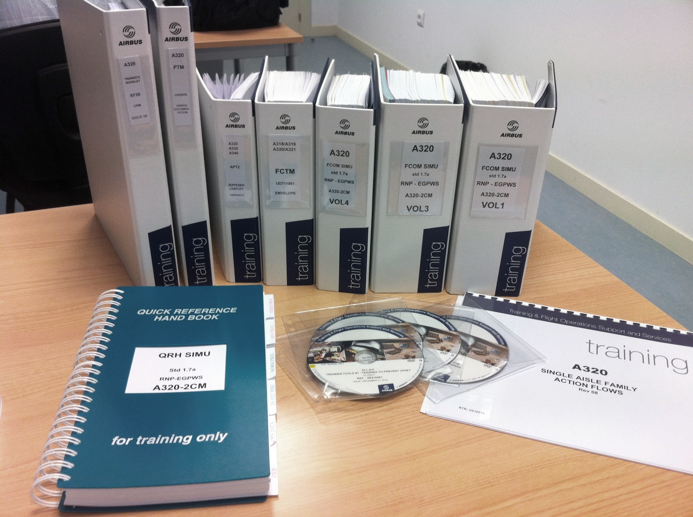
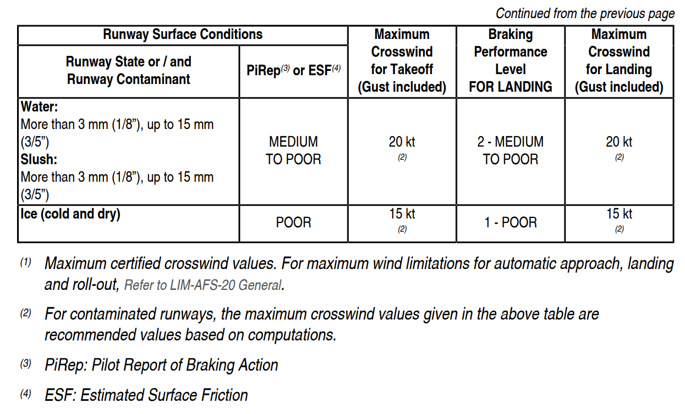
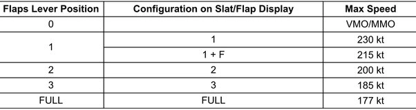
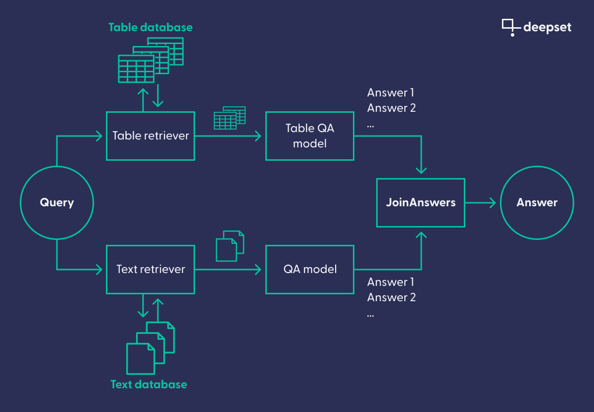

---
layout: blog-post
title: Question Answering in the Cockpit
description: How Airbus used Haystack to build a combined table and text QA system for pilots, aircraft maintenance workers, and others
featured_image: thumbnail.png
images: ["blog/airbus-case-study/thumbnail.png"]
featured_image_caption: Photo by [Andrés Dallimonti](https://unsplash.com/@dallimonti)
alt_image: Controls in an A330 cockpit.
toc: True
date: 2023-07-26
last_updated:  2023-07-26
authors:
  - Isabelle Nguyen
---	
Large language models (LLMs) are incredibly powerful, and we at deepset are stoked about their seemingly limitless potential. But while models like Llama 2 and GPT-4 continue to make waves, a related but less buzzworthy technology has consistently been delivering great value for a range of use cases. 

Based on smaller, open-source Transformer models, extractive question answering (QA) is one of the most compelling knowledge management techniques to emerge from NLP in recent years. As a result, organizations are beginning to recognize the opportunities that extractive QA can bring to large knowledge bases.

One such company is Airbus. Using our open-source framework [Haystack](https://haystack.deepset.ai/) for applied NLP, they built a complex QA system to extract answers from their extensive manuals for pilots, which are used both in training and during flight. What makes this use case particularly interesting is that the manuals contain not only text but also a lot of tables. Thankfully, modern QA systems can handle those too, using a special technique known as table question answering (Table QA).

This case study describes [Airbus’ artificial intelligence research unit](https://www.airbus.com/en/innovation/industry-4-0/artificial-intelligence)’s investigation into how NLP can help human agents find solutions in critical situations, based on their technical documentation. They solved the complex problem of processing both normal text and tables, using Haystack. The result of their work, a complex composite QA system for text and tables, will make the work of different teams in the company easier and more efficient.

## The problem

Aircraft are complex machines, and flying them requires a high degree of mental and physical fitness. Airbus’ Flight Crew Operating Manual (FCOM) serves to address all the issues a pilot might encounter during training or even while flying the airplane. Questions such as “What is the standard procedure when the cockpit windshield has been cracked by a bird?” or “Under which weather conditions is it unsafe to land?” are all answered in the manual, which spans thousands of pages.

Modern commercial aircraft like the Airbus A320 are actually quite good at detecting issues through the use of sensors, and handling them in an automated fashion according to protocol. But sensors can fail, and there are problems that can’t be detected by sensors, such as a passenger being sick. In those cases, it is crucial for pilots to find the solution in the minimum amount of time.

Currently, Airbus pilots are using a digitized version of the manual, which they can search using basic keyword-based functionalities. On this blog, we have written extensively about keyword searches, and how they are [surpassed by semantic search systems](https://www.deepset.ai/blog/understanding-semantic-search) in many respects.

A major downside of the keyword-based approach is that users need to know the exact words that are used to describe an issue. Users can sometimes struggle to find the exact combination of words that will lead them to the correct result, which can waste valuable time, especially in critical situations. This meant that Airbus' existing information retrieval system had significant potential for improvement in terms of both speed and relevance.

It should be stressed that the current system works quite well for most of the experienced pilots, who have worked with it for many years, and have gotten very good at finding the information they need. But the AI team at Airbus wanted to see if it was possible to use newer, more advanced approaches to build a more intuitive system with a flatter learning curve that would return more accurate information within a shorter time.

>_**In stressful situations especially, pilots need to get to the info as quickly as possible to be able to react in time. We wanted to assess whether a deep learning-based system for advanced question answering could reduce the retrieval time._** — Alexandre Arnold, AI research unit, Airbus

Like many technical documents, the FCOM contains a lot of tables. During the project’s initial phase, the Airbus team realized that tables play such an integral part in the pilots’ information extraction process that their system wouldn’t be complete without a module that could do question answering on tables. Luckily, [TaPas](https://huggingface.co/docs/transformers/model_doc/tapas) — Google’s popular Table QA model — does just that. Having worked with [deepset](https://www.deepset.ai/) before and knowing of our expertise in working with TaPas-based models, the AI team at Airbus found it easy to decide on Haystack as the framework of choice for implementing a QA system for pilots that could handle both text and tables.

### What does it mean to do question answering on tables?

Tables contain a lot of information in an extremely condensed format. They differ from text in that they come in a predictable, structured form, and can typically provide answers to many different questions. For instance, we could ask “What is the maximum crosswind for takeoff when the ground is frozen?” and a human agent could, with perhaps some initial difficulties, retrieve the answer from the following table. Then we could go on to ask questions about other actions and weather conditions, all equally answerable by looking at this table alone.

Table QA models like TaPas can do much the same. They combine the deep language model’s capacity for understanding the semantics of natural language (such a model would be able to grasp that the word “frozen” in our question refers to the condition of “ice” in the table) with the additional knowledge about how to navigate a table’s rows and columns to retrieve the right cell. That combination results in a powerful technology able to extract information from thousands of tables much more quickly than even the most experienced human could ever accomplish.

Even more than that, these models can do aggregations on tables — just like a SQL query, but in natural language. For instance, we could ask “What is the maximum velocity when the flaps are in the first position?” and Table QA would return “230 kt” — the larger of the two values associated with flaps lever position 1 in the table below.

If you want to learn more about Table QA, be sure to check out [our tutorial](https://haystack.deepset.ai/tutorials/15_tableqa) and [blog post](https://www.deepset.ai/blog/question-answering-on-structured-data) on the topic. But of course, Airbus’ actual task is much more complex than the use cases illustrated so far. First of all, the final system wouldn’t know whether the answer to a given query could be found in a table or in a piece of text. And second, it would have to retrieve the relevant table or text from the collection of FCOM pages itself.

## Data annotation and preparation

For a machine learning model to really shine, it has to be adapted to the specific data that it will encounter in the real world. This is especially true for technical domains like the aerospace industry. So the first step for Airbus was to annotate some training data that could be used for fine-tuning both the general language model (for handling text) and the TaPas model (for handling tables).

[Annotation, for QA](https://www.deepset.ai/blog/labeling-data-with-haystack-annotation-tool), consists of coming up with questions and highlighting the text passages that answer them. For instance, we could ask “How should the crew handle illness in the cabin?” and a possible answer span could be “In case of a sick passenger, first verify if there is a medical doctor on board.” The variation in wording and sentence structure makes sure that the system learns to match questions and answers on the basis of meaning, rather than the words used.

To annotate the first set of data, the team organized an internal hackathon and invited operations experts with deep knowledge of the documentation — some of whom had even helped write the manual. These experts were invited to come up with questions that are representative of what a pilot would ask in a real-world scenario — like the one in the previous paragraph — and identify the answers in the manual.

For the annotation of the tabular data, on the other hand, the team made use of the fact that tables follow a much more structured format than natural language. They came up with a set of 240 question templates, which they filled with different values, matching each question to its answer in a semi-automated fashion. For instance, given the tables above, one could come up with questions like “What is the maximum speed of the aircraft?” or “What is the maximum crosswind for landing?”

Finally, one of the biggest sources of confusion in FCOMs is the fact that different problems and solutions can be described in very similar terms. Context is key in that case, and is often provided by headers or captions. For instance, different sections could talk about “engine failure,” but which specific engine was concerned would be clarified by the chapter or section header.

Using the traditional, keyword-based approach, an experienced pilot could quickly determine which engine a text is talking about by considering additional information found on the page. However, since the language model can only parse text passages of about 200 words at a time, that additional information would have to be included elsewhere. Thankfully, [Haystack’s nodes](https://docs.haystack.deepset.ai/docs/nodes_overview) — the modular building blocks which make up the final NLP system — make it easy to include and retrieve such information in the form of metadata that is added to a textual or tabular data point during preprocessing.

## The solution

The final system uses a [retriever-reader pipeline](https://docs.haystack.deepset.ai/docs/ready_made_pipelines#extractiveqapipeline) — a classic architecture for question answering. Because the computationally expensive question answering model itself shouldn’t be run on the entire corpus, such a pipeline uses a [retriever](https://docs.haystack.deepset.ai/docs/retriever). It preselects the documents that to be processed by the reader, which contains the QA model. In Airbus’ case, however, the team actually used two separate retriever-reader pipelines (one for text and one for tables), which consisted of a single entry point for the query and then were joined at the end.

This complex setup is needed because, when a pilot asks a question, the system doesn’t know whether the answer to the query will be found in a table or in text. It therefore runs the query through both the Table QA pipeline and the “classic” text QA pipeline. The results are then joined in the final node, which picks the correct answer based on the confidence values attached to the results.

## Results and outlook

The team at Airbus is excited about the results, especially about the performance of the table section of the pipeline: “These documents are so long and have so much information encoded in tables,” Alexandre explains. “Being able to pinpoint the right cell in a table within more than a thousand pages, and on that basis, provide the right answer in less than one second: that is a big value.” 

While the system in its current form may still be too experimental for critical “life and death” situations, it can already be used for many other applications, such as in engineering and pilot training. 

Alexandre and his team had started the project to find out whether NLP technologies could be used in highly technical domains with strict accuracy requirements — or whether the quest for “browsing documentation in a more natural way,” as Alexandre puts it, was still out of reach. After concluding this phase of the project, Alexandre is confident: 

>**_The results are promising. While we still need to work on the robustness of such systems and the operational performance before any imaginable deployment, we now see the value and the potential of the technology. We want to make sure that we keep up to speed with the space of NLP, so that our organization can leverage it from day one once it's really perfectly useful for operations. This is really a gold mine._**

The team also stresses that while the current system may still be too experimental to be applied in a critical “life-and-death” situation, it can be used for many other applications, such as in engineering and training. Having the proof of concept that modern applied NLP is fit for use, Alexandre and his team are confident about the future.

## Take your information retrieval system to new heights

As an extremely active field of research, NLP is coming up with new, ingenious solutions for real-world applications all the time. You can use natural language to retrieve documents, tables, [and even images](https://docs.haystack.deepset.ai/docs/retriever#multimodal-retrieval): there are fewer and fewer limits to what kind of information these systems can process. 

If you want to see the results of such a system in action, [get started with Haystack](https://haystack.deepset.ai/overview/quick-start) today.

We’re always happy to see new members join our community of applied-NLP enthusiasts. Head over to our [community page](https://haystack.deepset.ai/community) to join the deepset Discord server or [find us on GitHub](https://github.com/deepset-ai/haystack).