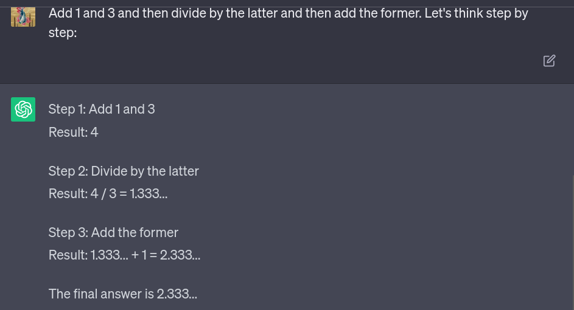

---
layout: blog-post
title: The Beginner's Guide to LLM Prompting
description: How to engineer your natural language prompts to get the best answers from a large language model
featured_image: thumbnail.png
images: ["blog/beginners-guide-to-llm-prompting/thumbnail.png"]
alt_image: Tester12345, CC BY-SA 3.0 <http://creativecommons.org/licenses/by-sa/3.0/>, via Wikimedia Commons
toc: False
date: 2023-06-13
last_updated:  2023-06-13
authors:
  - Isabelle Nguyen
---	

Large language models (LLMs) have made it possible for everyone to interact with an AI – not through code but using prompts in natural language. The fact that language now acts as an interface to complex models makes it necessary to investigate the prompts we use more closely.

  

When used correctly, generative models can produce highly valuable results for businesses. Getting your prompts right is therefore necessary to harness LLMs’ enormous potential, especially when you’re looking to incorporate it into your product. That is why an entire industry has formed around the topic of “prompt engineering.” In this post, we’ll explain our approach to this technique and share the dos and don'ts of prompting.

## What is a prompt?

A prompt is an instruction to an LLM. If you have interacted with an LLM like ChatGPT, you have used prompts. Ideally, a prompt elicits an answer that is correct, adequate in form and content, and has the right length.

  

Essentially, prompting is about packaging your intent in a natural-language query that will cause the model to return the desired response.

## How to come up with good prompts

Good prompts follow two basic principles: clarity and specificity. Clarity describes the use of simple, unambiguous language that avoids jargon and overly complex vocabulary. So rather than keeping your queries short and snappy, better take the long-winded way to make your point sufficiently clear to the LLM.

  

Example of an unclear prompt:

  
``
Who won the election?
``
  

Example of a clear prompt:

  
``
Which party won the 2023 general election in Paraguay?
``
  

Specificity, on the other hand, refers to the need for context. Tell your model as much as it needs to know to answer your question. Sometimes, this can veer almost into storytelling territory.

  
  
Example of an unspecific prompt:

  
``
Generate a list of titles for my autobiography.
``
  

Example of a specific prompt:

  
``
Generate a list of ten titles for my autobiography. The book is about my journey as an adventurer who has lived an unconventional life, meeting many different personalities and finally finding peace in gardening.
``
  

Let’s look at a few tricks to make our prompts even better.

## Prompt engineering hacks

Prompting is not a science, and calling it “engineering” may be a slight stretch. But researchers and users of LLMs have identified some tricks that consistently improve the models’ responses.

### Do say “do,” don’t say “don’t”

This point actually continues our specificity theme because “do” instructions are by nature more specific than “don’t”. So rather than telling the model what not to do, it’s usually better to specify exactly what we want it to do – if we know what that is.

  

Let’s imagine that, in our previous example, we want to make sure that the LLM doesn’t produce overly long titles (as those models tend to do). Rather than saying:

  
``
Don't make the titles too long
``
  

it is better to be specific:

  
``
Each title should be between two and five words long.
``
### Use few-shot prompting

In our example, we asked for a particular item (the title for an autobiography) of a certain length (two to five words). This type of instruction without any concrete examples is known as “zero-shot prompting.”

  

Most models, however, benefit from “few-shot prompting,” where you feed your model some examples to learn the desired pattern. In our prompt, we can add a few existing titles as examples to help the model get a feel for what we’re looking for.

  
``
Here are some examples: Long walk to freedom, Wishful drinking, I know why the caged bird sings.
``
### Structure your prompt in a meaningful way

Elements like quotation marks, bullet points, line breaks, etc. make it easier for humans to parse a text. And guess what? The same is true for LLMs. Let’s apply that insight to our previous example and spell out the full prompt once more.

  

    Generate a list of ten titles for my autobiography. The book is about my journey as an adventurer who has lived an unconventional life, meeting many different personalities and finally finding peace in gardening. Each title should be between two and five words long.
        
          
    ### Examples of great titles ###  
      
    - “Long walk to freedom”  
    - “Wishful drinking”  
    - “I know why the caged bird sings”
     

 

Now that we’ve perfected our prompt, what does the LLM’s output look like? Here’s what ChatGPT came up with in response:

  

  

“Seeking Skies, Finding Roots” is hilarious and I would absolutely consider reading that book.
  

### Use leading words

Sometimes, the simplest techniques are the most effective. Researchers from Tokyo University have shown that telling a model to “think step by step” before its response can [generate more accurate results](https://arxiv.org/pdf/2205.11916.pdf) and help the model correct its own mistakes. This method is known as using “leading words,” because we gently guide the model towards a more effective plan for problem-solving.

  

The model is forced to break down its solution into multiple, more manageable steps rather than being allowed to just hazard a guess. Seeing how this simple trick improves the model’s performance is pretty striking. Here is an example of a math puzzle that requires just a bit of recursive thinking:
  

  

The LLM confidently responds – with the wrong answer. Here’s what happens when we ask it to “think step by step:”
  

  

And this time, the final answer is correct.

## Prompting pitfalls

In addition to these techniques for improvement, it helps to know which elements in an instruction can throw the model off. Some people, for example, try to incorporate requests for short, one-word answers into their prompts to prevent the models from rambling.

  

However, as the last example has shown, wordier answers might not be a bad thing when it comes to LLMs – but rather, a technique these models use to arrive at a correct response. LLMs may soon learn to keep their thought processes to themselves. In the meantime, we should let them ramble and refrain from requests for one-word answers.

  

Another problem happens when you exceed the model’s context length. Due to the nature of these large Transformer models, an LLM’s “context window” (which is the portion of text it can process at once) comprises both the prompt and its response. If you exceed a model’s context length, its output will deteriorate.

  

While this is a fascinating topic, it is also a fairly complex one – context lengths vary widely between models, and it isn’t even trivial to measure the length of your prompt. Just remember that if the length of your prompt becomes an issue, you should look into breaking the problem down into smaller steps.

## Become a better prompter

This article leans heavily on Vladimir Blagojevic’s [webinar on “Prompting LLMs Using Haystack](https://www.youtube.com/watch?v=-TfPkX3IoUQ).” In it, Vladimir, who is a member of the core engineering team here at deepset, takes a deep dive into the art of prompting and shows how Haystack, our open source framework for NLP, offers just the right tools to get prompting right.

For even more tips on how to come up with great prompts, have a look at our [guidelines for prompt engineering](https://docs.haystack.deepset.ai/docs/prompt-engineering-guidelines).

  

Prompts also play a huge role in Agents: the latest fascinating trend that lets you harness the power of LLMs. Agents receive a sort of “super-prompt” that instructs the LLM to break its reasoning into manageable steps and delegate those to the tools it deems most capable of solving the tasks. Have a look at our [blog post on Agents](https://haystack.deepset.ai/blog/introducing-haystack-agents) to learn more.

  

Finally, you don’t always need to write your own prompts. Head over to our [prompt hub](https://prompthub.deepset.ai/), where you find prompts for all kinds of applications, which you can use out of the box or tune to your liking, to get the best answers from your LLM.
