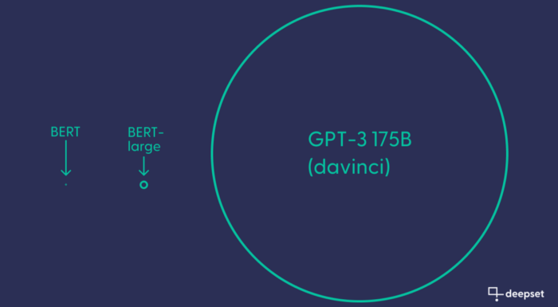
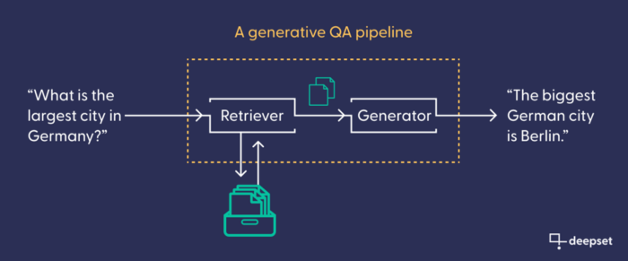

If you’ve been online lately, then you’ve likely seen the excitement about OpenAI’s newest language model, ChatGPT. ChatGPT is astonishingly good at many things, including debugging code and rewriting text in whatever style you ask it. As an offshoot of GPT-3.5, a large language model (LLM) with billions of parameters, ChatGPT owes its impressive amount of knowledge to the fact that it’s seen a large portion of the internet during training — in the form of the Common Crawl corpus and other data.

After decades of chatbots that couldn’t even remember what they said a moment ago, it’s understandable that people are excited by a language model that can hold a conversation and create a solid semblance of intelligence. But when it comes to the validity of answers generated by these huge models, we need to stay critical. LLMs especially are  [prone to hallucinations](https://www.unite.ai/preventing-hallucination-in-gpt-3-and-other-complex-language-models/): producing text that sounds sensible at first but doesn’t hold up to closer scrutiny, and presenting things as fact that are made up entirely.

[Semantic search engines](https://www.deepset.ai/blog/how-to-build-a-semantic-search-engine-in-python)  — our specialty here at deepset — are often powered by extractive question answering models. These models return snippets from the knowledge base verbatim, rather than generating text from scratch the way ChatGPT does. However, many applications can benefit from the abilities of generative LLMs. That’s why  [Haystack](https://haystack.deepset.ai/), deepset’s open-source framework for applied natural language processing (NLP), allows you to leverage multiple GPT models in your pipeline. With this approach, you can build a GPT-powered semantic search engine that uses your own data as ground truth and bases its natural-language answers on the information it contains.

You can think of Haystack as a comprehensive and highly flexible toolbox whose primary goal is to make building different flavors of NLP systems easy and fast, yet transparent. Besides providing a comfortable entry point to the  [OpenAI API](https://openai.com/api/), Haystack offers all the other components you need to successfully implement an end-to-end NLP system with GPT: a vector database, a module for retrieval, and the pipeline that combines all those elements into one queryable system.

**In this article, we’ll demonstrate how to build a generative question answering system that uses the GPT-3 “**[**davinci-00**](https://beta.openai.com/docs/models/overview)**3” model to present results in convincing natural language.**

## The advent of large language models

Aren’t all modern language models large? It’s true — ever since the Transformer was introduced as a baseline-beating architecture for all kinds of NLP tasks, models have grown in size. But while the  [largest BERT model](https://huggingface.co/bert-large-uncased)  has 336 million parameters, OpenAI’s largest  [GPT-3.5 model](https://beta.openai.com/docs/model-index-for-researchers/models-referred-to-as-gpt-3-5)  — which ChatGPT is based on — has 520 times as many.



So what does GPT do with all its additional capacity? From observation, we can say that GPT is exceptionally good at understanding implication and intent. It can remember what’s been discussed earlier in the conversation, including figuring out what you’re referring to with words like “he” or “before that,” and it can tell you when your question doesn’t make sense. All of these properties account for the increased sense of actual intelligence. It also has to generate language from scratch, a much harder task than returning the right section from a corpus. But it has been shown, too, that GPT uses a lot of its parameters to store facts — actual information, which it then uses for tasks like code debugging and answering general-knowledge questions.

But here’s the problem: GPT can still make massive mistakes, and these are harder to detect because it is so good at conversing and making its answers and code examples  _look_  right. Early in December, the programming Q&A forum  [Stack Overflow temporarily banned ChatGPT-generated solutions](https://www.theverge.com/2022/12/5/23493932/chatgpt-ai-generated-answers-temporarily-banned-stack-overflow-llms-dangers). Meanwhile, hallucinations in large language models have spawned a new  [field of research](https://dl.acm.org/doi/10.1145/3571730).

However, there is a way to use GPT models in a way that is safer and generates value. By connecting the generative model to a textual database with curated, domain-specific content — say, a corpus of product reviews, a collection of financial reports, or a database with research papers — you can combine factual accuracy with GPT’s conversational prowess. With Haystack, you can set up such a GPT-based search engine in no time. The search engine is placed on top of your textual database, and returns natural-language answers in reply to an input query.

## Different types of search engines

Semantic search engines come in different varieties and can roughly be distinguished by the type of answer they return. The answers could consist of matching documents (in document search), answer spans (in extractive QA), or newly generated answers (in generative QA).

### The GenerativeQAPipeline: Haystack’s component for a generative search engine

For each of those search paradigms, Haystack offers ready-made pipelines: search engine configurations with placeholders for language models for maximum efficiency. In this tutorial, we use the GenerativeQAPipeline. It consists of a retriever (to find relevant documents) and a generator (to write text), chained together. The retriever connects to the database. Like the generator, it is often (but not necessarily) based on a Transformer model. Its task is to retrieve the documents from the database that are most likely to contain valuable information, based on a user’s input query. Our generative model then uses those documents as a factual basis to write its answer.



## How to build a search engine using GPT-3

Before we get started, let’s quickly talk about the tools you need to follow along.

### Prerequisites

-   You need to install Haystack. We use version 1.13.
-   To use the  [OpenAI API](https://openai.com/api/), you need to make an account and  [generate an API key](https://beta.openai.com/account/api-keys). Note that while the first queries are free, you need to pay once you reach a certain limit. (OpenAI grants you an initial budget of $18, which is more than enough to complete this tutorial and play around with the pipeline.)
-   Here we use a small dataset of 18 Wikipedia articles about Berlin, the capital city of Germany. You can, of course, use your own dataset.
-   Since our embeddings and answers are provided through the OpenAI API, it’s not necessary to use GPUs for this guide. However, if you want to experiment with different models, we recommend that you work in a  [Colab notebook](https://colab.research.google.com/)  and activate the GPU (under “Runtime -> Change runtime type”).

### Converting and preprocessing

Before you can set up the pipeline, you need to preprocess your data and add them to the document store, or database. There are many options for document stores in Haystack. This tutorial uses FAISS, which is a vector database.

Before you can feed data into the document store, you need to get it into the right format. The DocumentStore expects data to be supplied in the form of a Haystack data type called Document — a dictionary data type that stores information as a set of related fields (such as the document text and its metadata). The convert_files_to_docs function retrieves your files from a directory and converts them into Haystack documents. If you’re working with articles from Wikipedia, you can use the clean_wiki_text cleaning function that removes some Wikipedia-specific boilerplate.
```python
from haystack.utils import convert_files_to_docs, clean_wiki_text  
  
docs = convert_files_to_docs(dir_path=DOC_DIR, clean_func=clean_wiki_text, split_paragraphs=True)
```
Depending on your own data’s format, you may need to follow a slightly different procedure for preprocessing. With Haystack, you can extract data from websites, or convert different file formats like pdf, txt, or docx files. Have a look at our  [preprocessing tutorial](https://haystack.deepset.ai/tutorials/08_preprocessing)  and the documentation page of the  [FileConverter](https://docs.haystack.deepset.ai/docs/file_converters)  to learn more.

Many documents, including Wikipedia articles about popular topics, can be very long. You need to make sure that the documents in your database are short enough for the embedding model to properly capture their meaning. To do this, you can use the  [PreProcessor](https://docs.haystack.deepset.ai/docs/preprocessor)  to split them into shorter text snippets. We suggest a split length of 100 tokens per snippet, and an overlap of three tokens, to make sure no information gets lost.
```python
from haystack.nodes import PreProcessor  
  
preprocessor = PreProcessor(  
 clean_empty_lines=True,  
 clean_whitespace=True,  
 clean_header_footer=False,  
 split_by="word",  
 split_length=100,  
 split_overlap=3,  
 split_respect_sentence_boundary=False,  
)  
  
processed_docs = preprocessor.process(docs)
```
What do these processed documents look like? Let’s have a look at one of them:
```python
processed_docs[0]
```
```python
<Document: {'content': 'The Berlin U-Bahn (German: [ˈuː baːn]; short for Untergrundbahn, "underground railway") is a rapid transit system in Berlin, the capital and largest city of Germany, and a major part of the city\'s public transport system. Together with the S-Bahn, a network of suburban train lines, and a tram network that operates mostly in the eastern parts of the city, it serves as the main means of transport in the capital.\nOpened in 1902, the U-Bahn serves 175 stations[1] spread across nine lines, with a total track length of 155.4 kilometres (96 miles 45 chains),[3] about 80% of which is underground.[4]  Trains run',   
'content_type': 'text',   
'score': None,   
'meta': {'name': 'Berlin U-Bahn.txt', '_split_id': 0},   
'embedding': None,   
'id': 'd2bf58a531b2500250650b43b1cce290'}>
```
Every document has been turned into an object of the Document class, which is a dictionary that contains not only the document’s text, but also some automatically generated metadata, like which file the text came from.

### Initializing the DocumentStore

Time to set up the document store — for example, the vector-optimized FAISS database. When you initialize the document store, you need to know the length of your retriever’s document  [vector embeddings](https://www.deepset.ai/blog/the-beginners-guide-to-text-embeddings)  — its internal representations that it will produce for each document. Since you’ll be working with the high-dimensional text-embedding-ada-002 model from OpenAI, you need to set the vectors’ embedding_dim to 1536.
```python
from haystack.document_stores import FAISSDocumentStore  
  
document_store = FAISSDocumentStore(faiss_index_factory_str="Flat", embedding_dim=1536)
```
Now, delete any existing documents in the database, and add the preprocessed documents that you generated earlier.
```python
document_store.delete_documents()  
document_store.write_documents(processed_docs)
```
Note that so far, the database only contains the plain-text documents. To add the high-dimensional vector embeddings — the representations of each document that make sense to the language model and that it can use for semantic search — you need to set up the model for retrieval.

### Retriever

The retriever is the module that matches your query to the documents in the database, and retrieves those that it deems most likely to contain the answer. Retrievers can be keyword-based (like tf-idf and BM25), or they can encode semantic similarity through the use of Transformer-generated text vectors. In the latter case, the retriever is also used to  _index_ the documents in your database — that is, turn them into high-dimensional embeddings that the retriever can then search.

You’ll be working with  [OpenAI’s most recent retrieval model](https://openai.com/blog/new-and-improved-embedding-model/), text-embedding-ada-002. To initialize it in Haystack, you need to provide your OpenAI API key.
```python
from haystack.nodes import EmbeddingRetriever  
  
retriever = EmbeddingRetriever(  
 document_store=document_store,  
 embedding_model="text-embedding-ada-002",  
 batch_size = 32,  
 api_key=MY_API_KEY,  
 max_seq_len = 1024  
)
```
When you set up the retriever, you connect it directly to your document store. Now you can use the update_embeddings method to turn the raw documents in the document store into high-dimensional vectors that the retrieval model can search and compare.
```python
document_store.update_embeddings(retriever)
```
### Generator

You are now ready to initialize the GPT model that will generate text for you. The  [OpenAIAnswerGenerator node](https://docs.haystack.deepset.ai/reference/answer-generator-api#openaianswergenerator)  can use four different GPT models. You can use the highest performing GPT-3.5 model, text-davinci-003.
```python
from haystack.nodes import OpenAIAnswerGenerator  
  
generator = OpenAIAnswerGenerator(api_key=MY_API_KEY, model="text-davinci-003", temperature=.5, max_tokens=30)
```
We recommend increasing the max_tokens parameter from the default value of 13 to 30, so that the GPT model can produce longer sequences. We also suggest you set the temperature to .5 (default is .2), which gives the model slightly more liberty in generating its answers. The lower the temperature, the more faithful the model remains to the underlying source texts.

### Pipeline

Now that all the individual elements of your GPT search engine are set up, it’s time to pass them to your generative QA pipeline.
```python
from haystack.pipelines import GenerativeQAPipeline  
  
gpt_search_engine = GenerativeQAPipeline(generator=generator, retriever=retriever)
```
And that’s it! Your GPT-powered search engine is ready for querying.

## Querying the pipeline

Now you can ask your system some general questions about Berlin (or whatever other topic your dataset is about). In addition to the query itself, you can pass a few parameters to the search engine, like the number of documents that the retriever should deliver to the generator and the number of answers that should be generated (both designated “top_k”).
```python
query = "What is Berlin known for?"
params = {"Retriever": {"top_k": 5}, "Generator": {"top_k": 1}}  
  
answer = gpt_search_engine.run(query=query, params=params)
```
To print the answer generated by your pipeline, import Haystack’s handy print_answers function. It lets you determine the amount of detail that you want to see when printing the answer. Setting it to minimum will print only the answer string. So what’s the search engine’s answer to the question above?
```python
from haystack.utils import print_answers  
  
print_answers(answer, details="minimum")

>>> Query: What is Berlin known for?  
Answers:  
[ { 'answer': "Berlin is known for its diverse culture, its nightlife, its contemporary arts, and its high quality of life."}]
```
Note that this answer is generated from scratch: it’s not a quotation from any of the Wikipedia articles, but has been written based on the content in them.

### Generated answers are context-dependent

Remember how we said earlier that the GPT-3 model generates its answers on the basis of the documents that it receives? You can now test that by running the generator in isolation, without the retriever. You can’t run it without any documents at all, though, so you need to pass it a single snippet. Here’s what happens if you use the snippet about the U-Bahn that was printed out above.
```python
generator.predict("What is Berlin known for?", documents=[processed_docs[0]])

>>> Query: What is Berlin known for?  
Answers:  
[ { "answer": "The Berlin U-Bahn."}]
```
The system answers that Berlin is well known for its underground railway, because that’s all the knowledge it has from that one document.

Now, go back to the full version of the search engine — the one that’s ingested your whole dataset (for example, all 18 Wikipedia articles about Berlin) — and ask it a few more questions, to get a better feeling for how your search engine operates.

### Example 1
```python
Query: When is the best time to visit Berlin?  
Answers:  
[ { "answer": """ Berlin is a great city to visit year-round, 
but the besttime to visit is during the summer months, from June to 
 August."""}]
```
### Example 2
```python
Query: Do people from Berlin have a dialect?  
Answers:  
[ { "answer": """ Yes, people from Berlin have a dialect, which is a variant   
 of the Brandenburgish dialect."""}]
```
### Example 3
```python
Query: Tell me about some interesting buildings in Berlin.  
Answers:  
[ { "answer": """The Berlin TV Tower is a TV Tower in Berlin, Germany. It   
 is Berlin’s tallest structure, at a height of 1,207 feet. """}]
```
### Example 4
```python
Query: How was the TV tower built?  
Answers:  
[ { "answer": """The TV tower was built by a team of architects between   
 1965 and 1969. The tower was built in a record-breaking 
 time of just 53 months,"""}]
```
One interesting fact about GPT is that it doesn’t always return the same answers. When prompted multiple times with the same query, it will try to come up with different answers. When we worked through this tutorial ourselves, our model came up with a major hallucination, after receiving the same question multiple times. Have a look at this answer:
```python
Query: How was the TV tower built?  
Answers:  
[ { "answer": """ The TV Tower was built by the Soviet troops by setting the   
 contents on fire and turning the tower into a makeshift  
 chimney."""}]
```
This answer — which was ranked lower than the correct answer — is rather absurd. But it should serve as a reminder that the output of a generative model, even when it looks like a well-formed answer, can be entirely hallucinated and should be fact-checked.

### Example 5
```python
Query: Is Berlin a good place for clubbing?  
Answers:  
[ { "answer": """Yes, Berlin is a good place for clubbing. There are many 
  nightclubs, including the Watergate, Tresor, and Berghain."""}]
```
### Comparing generative QA to extractive QA

Like this generative pipeline, a search engine that’s based on extractive QA returns answers about a corpus of documents in response to a query in natural language. But because the extractive QA system extracts its answers verbatim from the document text itself, it has some restrictions compared to the GPT search engine.

An extractive QA model is unable to produce the kind of conversational elements you can see in the examples above, like answering “Yes,” or repeating parts of the question in its answer. More significantly, it cannot answer questions as comprehensively as the GPT model, because it isn’t able to aggregate information from different texts.

In the last example, GPT affirmed that Berlin is a good place for clubbing, before going on to list some examples of famous night clubs.

But when an extractive QA model is asked the same question, it can only answer the question in an implicit manner, by extracting the text spans that it deems most relevant to the query. Here are two answers returned by such an extractive QA search engine, including the section (“context”) from which they were extracted:
```python
Query: Is Berlin a good place for clubbing?  
Answers:  
[ { "answer": """ Partygoers in Germany often toast the New Year with a glass   
 of sparkling wine""",  
 "context": """ke place throughout the entire city. Partygoers in Germany   
 often toast the New Year with a glass of sparkling wine.\n  
 Berlin is home to 44 theaters and """},  
 { "answer": "Berlin’s club scene a premier nightlife venue”,  
 "context": """rticularly those in Western and Central Europe, made 
 Berlin’s club scene a premier nightlife venue. After the   
 fall of the Berlin Wall in 1989, many hi"""}]
```
## Should you use generative or extractive QA?

The advantages of generative versus extractive QA are clear: it has better conversational skills, produces well-formed sentences in natural language, and can aggregate knowledge from multiple sources in a single answer. But, as we have seen, it also has some downsides. You should consider using extractive over generative QA in the following cases:

-   When you want to work with smaller, open-source models. As we’ve seen, GPT models are huge, and once you’ve reached a certain limit of queries, you need to pay to use the API. The  [Hugging Face model hub](https://huggingface.co/models), on the other hand, hosts thousands of open-source, pre-trained models that you can download for free.
-   When you want transparency over where the model gets its information from. Extractive models don’t hallucinate. Naturally, these models can return wrong answers, too. But these are much easier to detect by checking the context from which they were extracted.
-   When you want to use the answers in a downstream task. One of the most popular applications for extractive question answering is in  [information extraction systems](https://www.deepset.ai/blog/automating-information-extraction-with-question-answering). Such systems have no use for the conversational abilities of a generative search engine. Rather, they require a search functionality that can extract factual information from large corpora quickly and reliably.

## Haystack: the main framework for building search engines

Generative QA, extractive QA, translation, summarization and much, much more: with Haystack you can build the system that is best suited to solve your specific problem, using the hottest new architectures.

Our application-focused approach to NLP provides you with the modular building blocks to set up your own system in the shortest amount of time. Check out the  [Haystack repository](https://github.com/deepset-ai/haystack)  to learn more, or have a look at our  [documentation](https://docs.haystack.deepset.ai/docs).

Want to chat about GPT-3, search engines, and all things NLP?  [Join our Discord](https://discord.com/invite/VBpFzsgRVF)!
