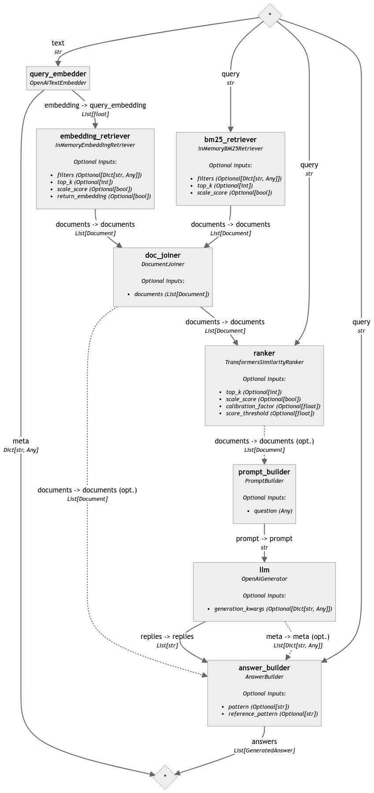
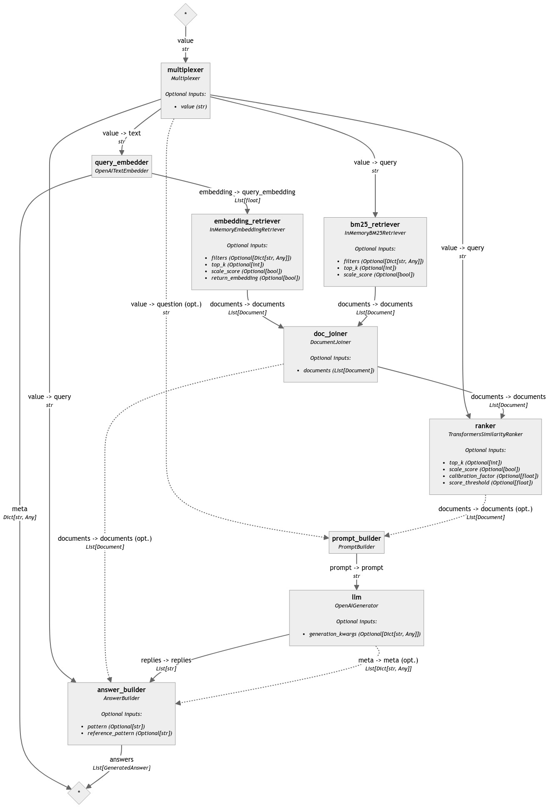
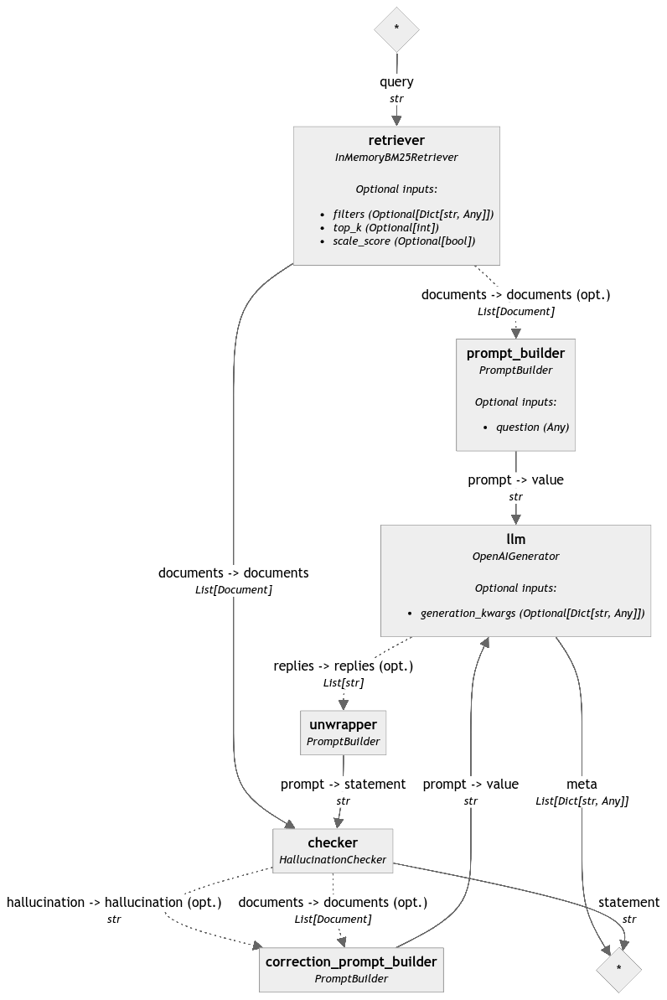
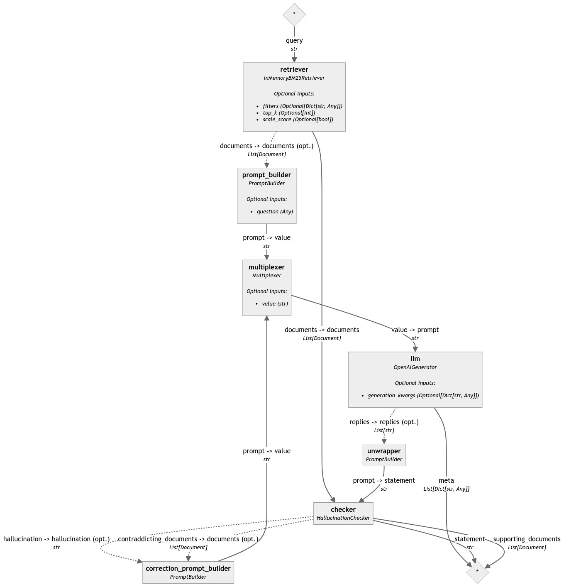
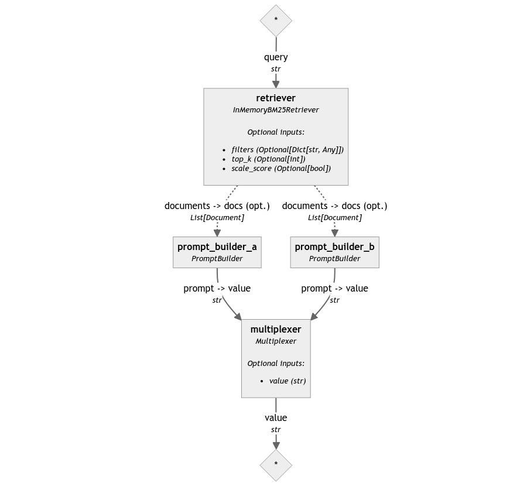

Building Haystack Pipelines is not always easy and fun. When Pipelines start including several components, branches, loops and so on, connecting everything together if often a complex task. Sometimes it even looks impossible without writing your own components!

In this blog post we will explore a small component that often flies under the radar of even expert Haystack 2.0 users, a component that can help a lot building complex pipelines without wrappers and custom components. This component is the [`Multiplexer`](https://docs.haystack.deepset.ai/v2.0/docs/multiplexer).

Specifically, we will see how to use it to deal with two common scenarios:

1. [Managing inputs](#managing-inputs)
2. [Closing loops](#closing-loops)


## Managing inputs

> 💡 *Do you want to see the code in action? Check out Tutorial __: [Managing Pipeline inputs with Multiplexer](#)*

If you've ever build a Haystack pipeline with more than 3-4 components, you probably noticed an annoying problem: the number of inputs to pass to the `run()` method of the pipeline seems to grow endlessly. New components take some of their input from the other components of a pipeline, but many of them also require additional input from the user. As a result, the dictionary input of `pipeline.run()` grows and grows until it becomes very repetitive.

One common example of this problem is **hybrid search pipelines**, like this one:

```python
from haystack import Pipeline
from haystack.components.retrievers.in_memory import InMemoryBM25Retriever, InMemoryEmbeddingRetriever
from haystack.components.generators import OpenAIGenerator
from haystack.components.builders.answer_builder import AnswerBuilder
from haystack.components.builders.prompt_builder import PromptBuilder
from haystack.components.embedders import OpenAITextEmbedder
from haystack.components.rankers import TransformersSimilarityRanker
from haystack.components.joiners import DocumentJoiner

prompt_template = """
Given these documents, answer the question.\nDocuments:

    {{ doc.content }}

\nQuestion: {{question}}
\nAnswer:
"""
pipe = Pipeline()

pipe.add_component("query_embedder", OpenAITextEmbedder())
pipe.add_component("embedding_retriever", InMemoryEmbeddingRetriever(document_store=document_store))
pipe.add_component("bm25_retriever", InMemoryBM25Retriever(document_store=document_store))
pipe.add_component("doc_joiner", DocumentJoiner(sort_by_score=False))
pipe.add_component("ranker", TransformersSimilarityRanker(model="intfloat/simlm-msmarco-reranker", top_k=10))
pipe.add_component("prompt_builder", PromptBuilder(template=prompt_template))
pipe.add_component("llm", OpenAIGenerator())
pipe.add_component("answer_builder", AnswerBuilder())

pipe.connect("query_embedder", "embedding_retriever.query_embedding")
pipe.connect("embedding_retriever", "doc_joiner.documents")
pipe.connect("bm25_retriever", "doc_joiner.documents")
pipe.connect("doc_joiner", "ranker.documents")
pipe.connect("ranker", "prompt_builder.documents")
pipe.connect("prompt_builder", "llm")
pipe.connect("llm.replies", "answer_builder.replies")
pipe.connect("llm.meta", "answer_builder.meta")
pipe.connect("doc_joiner", "answer_builder.documents")
```



In this pipeline there are several component that need the value of `query` to operate:

- the Query Embeddder
- the BM25 Retriever
- the Ranker
- the Prompt Builder
- the Answer Builder

Five components that need the same identical input, directly from the user! This means that the `run()` call is going to be huge and repetitive.

```python
question = "What's the capital of France?"

result = pipe.run(
    {
        "query_embedder": {"text": question},
        "bm25_retriever": {"query": question},
        "ranker": {"query": question},
        "prompt_builder": {"question": question},
        "answer_builder": {"query": question},
    }
)
```

This approach clearly doesn't scale. However, this is exactly where Multiplexer can help. 

By putting a Multiplexer at the top of the pipeline and connecting all the components that need `query` to it, the `run()` method can be drastically simplified.

Let's see how to modify the pipeline.

```python
from haystack.components.others import Multiplexer

pipe = Pipeline()

# Add a Multiplexer to the pipeline
# Note that you have to initialize the Multiplexer with the type of input to
# expect (in this case `str`) to enable validation of connections.
pipe.add_component("multiplexer", Multiplexer(str))

pipe.add_component("query_embedder", OpenAITextEmbedder())
pipe.add_component("embedding_retriever", InMemoryEmbeddingRetriever(document_store=document_store))
pipe.add_component("bm25_retriever", InMemoryBM25Retriever(document_store=document_store))
pipe.add_component("doc_joiner", DocumentJoiner(sort_by_score=False))
pipe.add_component("ranker", TransformersSimilarityRanker(model="intfloat/simlm-msmarco-reranker", top_k=10))
pipe.add_component("prompt_builder", PromptBuilder(template=prompt_template))
pipe.add_component("llm", OpenAIGenerator())
pipe.add_component("answer_builder", AnswerBuilder())

# Connect the Multiplexer to all the components that need the query
pipe.connect("multiplexer.value", "query_embedder.text")
pipe.connect("multiplexer.value", "bm25_retriever.query")
pipe.connect("multiplexer.value", "ranker.query")
pipe.connect("multiplexer.value", "prompt_builder.question")
pipe.connect("multiplexer.value", "answer_builder.query")

pipe.connect("query_embedder", "embedding_retriever.query_embedding")
pipe.connect("embedding_retriever", "doc_joiner.documents")
pipe.connect("bm25_retriever", "doc_joiner.documents")
pipe.connect("doc_joiner", "ranker.documents")
pipe.connect("ranker", "prompt_builder.documents")
pipe.connect("prompt_builder", "llm")
pipe.connect("llm.replies", "answer_builder.replies")
pipe.connect("llm.meta", "answer_builder.meta")
pipe.connect("doc_joiner", "answer_builder.documents")
```



With this setup, only the Multiplexer expects an input from the user. This makes the `run()` statement very straightforward once again.

```python
result = pipe.run({"multiplexer": {"value": "What's the capital of France?"}})
```

## Closing Loops

> 💡 *Do you want to see the code in action? Check out Tutorial __: [Spot LLM hallucinations with the HallucinationChecker](#)*

When your pipeline loops, there is often one component that needs to receive input from several sources: at first by the user, who sets off the loop, and later from other components, when the loop comes around and needs to start again.

An example of a looping pipeline is a **self-correcting RAG pipeline**. It's like a basic RAG pipeline with a Retriever, a PromptBuilder and a Generator, plus an additional component at the end that checks whether the answer given by the LLM really relates with the content of at least one of the documents that were returned by the Retriever. If the check fails, the reply is likely to be a hallucination, so the pipeline loops back and asks the LLM to try again.

Haystack 2.0 doesn't have such component yet, but we can take inspiration from a similar component that was available for Haystack 1, called [`EntailmentChecker`](https://haystack.deepset.ai/integrations/entailment-checker).

I'm going to create a similar component for Haystack 2.0, which we will call `HallucinationChecker`. If you're interested in the exact implementation of this component, you can check it out own here, but given that custom components are not the focus of this post, I won't describe the process. If you're interested, check out [this guide](https://docs.haystack.deepset.ai/v2.0/docs/custom-components) on the topic.

<details>

<summary>HallucinationChecker</summary>

```python
from typing import List

from transformers import AutoModelForSequenceClassification, AutoTokenizer, AutoConfig
import torch

from haystack import component
from haystack.dataclasses import Document

@component
class HallucinationChecker:

    def __init__(self, model: str = "roberta-large-mnli", entailment_threshold: float = 0.5):
        self.model_name_or_path = model
        self.entailment_threshold = entailment_threshold

    def warm_up(self):
        self.tokenizer = AutoTokenizer.from_pretrained(self.model_name_or_path)
        self.model = AutoModelForSequenceClassification.from_pretrained(pretrained_model_name_or_path=self.model_name_or_path)
        self.model.to("cuda")
        id2label = AutoConfig.from_pretrained(self.model_name_or_path).id2label
        self.labels = [id2label[k].lower() for k in sorted(id2label)]

    @component.output_types(statement=str, supporting_documents=List[Document], hallucination=str, contraddicting_documents=List[Document])
    def run(self, statement: str, documents: List[Document]):
        print(f"Checking the statement: '{statement}' against these documents: " + " | ".join([d.content for d in documents]))
        scores, agg_con, agg_neu, agg_ent = 0, 0, 0, 0
        entailment_info_batch = self.get_entailment_batch(
            premise_batch=[doc.content for doc in documents], 
            hypothesis_batch=[statement] * len(documents)
        )
        agg_ent = 0
        entailing_docs = []
        contraddicting_docs = []
        for i, (doc, entailment_info) in enumerate(zip(documents, entailment_info_batch)):
            if entailment_info["entailment"] > entailment_info["contradiction"]:
                agg_ent += entailment_info["entailment"]
                entailing_docs.append(doc)
                if agg_ent / len(entailing_docs) > self.entailment_threshold:
                    print("The statement is not a hallucination")
                    return {"statement": statement, "supporting_documents": entailing_docs}
            elif entailment_info["contradiction"] > entailment_info["neutral"]:
                contraddicting_docs.append(doc)

        print("The statement is a hallucination")
        return {"hallucination": statement, "contraddicting_documents": contraddicting_docs}

    def get_entailment_batch(self, premise_batch: List[str], hypothesis_batch: List[str]):
        formatted_texts = [
            f"{premise}{self.tokenizer.sep_token}{hypothesis}"
            for premise, hypothesis in zip(premise_batch, hypothesis_batch)
        ]
        with torch.inference_mode():
            inputs = self.tokenizer(formatted_texts, return_tensors="pt", padding=True, truncation=True).to("cuda")
            out = self.model(**inputs)
            probs_batch = torch.nn.functional.softmax(out.logits, dim=-1).detach().cpu().numpy()
        return [{k.lower(): v for k, v in zip(self.labels, probs)} for probs in probs_batch]
```

</details>

With this new component ready we can now start to build the pipeline. 

Our first attempt may look like this:



Let's try to write it in code:

```python
# Tip: when your pipeline has loops is always a good idea to set a low number
# for the max_loops_allowed parameter. The default is 100.
pipe = Pipeline(max_loops_allowed=5)

template = """
Given these documents, answer the question.
Documents:

    {{ doc.content }}

Question: {{question}}
""" 

correction_template = """
Given these documents, rewrite the statement to make it correct.
Documents:

    {{ doc.content }}

Statement: {{ hallucination }}
""" 

pipe.add_component("retriever", InMemoryBM25Retriever(document_store=document_store))
pipe.add_component("prompt_builder", PromptBuilder(template=template))
pipe.add_component("llm", OpenAIGenerator())
pipe.add_component("unwrapper", PromptBuilder("{{ reply }} "))
pipe.add_component("checker", HallucinationChecker())
pipe.add_component("correction_prompt_builder", PromptBuilder(template=correction_template))

pipe.connect("retriever", "prompt_builder")
pipe.connect("prompt_builder", "llm")
pipe.connect("llm.replies", "unwrapper.replies")
pipe.connect("unwrapper.prompt", "checker.statement")
pipe.connect("retriever", "checker.documents")
pipe.connect("checker.hallucination", "correction_prompt_builder.hallucination")
pipe.connect("checker.contraddicting_documents", "correction_prompt_builder.documents")

# This connection will fail!
pipe.connect("correction_prompt_builder", "llm")  

# >> PipelineConnectError: Cannot connect 'correction_prompt_builder.prompt' 
#    with 'llm.prompt': llm.prompt is already connected to ['prompt_builder'].
```

The error message is reasonable: the LLM is already receiving a prompt from another PromptBuilder and it does not expect more than one. How can we close this loop?

In these cases, a Multiplexer needs to be placed in front of the prompt input of the Generator. Multiplexer has a variadic input, which means that you can connect any number of components to it as long as the type is correct. Multiplexer then makes sure that the Generator always receives only one prompt at a time, so it can run effectively.

Here is how the pipeline looks like with a Multiplexer:



```python
pipe = Pipeline(max_loops_allowed=5)

pipe.add_component("retriever", InMemoryBM25Retriever(document_store=document_store, top_k=3))
pipe.add_component("prompt_builder", PromptBuilder(template=template))
pipe.add_component("llm", OpenAIGenerator())
pipe.add_component("unwrapper", PromptBuilder("{{ reply }} "))
pipe.add_component("checker", HallucinationChecker())
pipe.add_component("correction_prompt_builder", PromptBuilder(template=correction_template))
pipe.add_component("multiplexer", Multiplexer(str))

pipe.connect("retriever", "prompt_builder")
pipe.connect("prompt_builder", "multiplexer")
pipe.connect("multiplexer", "llm")
pipe.connect("llm.replies", "unwrapper.replies")
pipe.connect("unwrapper.prompt", "checker.statement")
pipe.connect("retriever", "checker.documents")
pipe.connect("checker.hallucination", "correction_prompt_builder.hallucination")
pipe.connect("checker.contraddicting_documents", "correction_prompt_builder.documents")
pipe.connect("correction_prompt_builder", "multiplexer")

result = pipe.run({"retriever": {"query": "Where does Giorgio live?"}})
```

## A gotcha

In either of these pipelines is impossible for Multiplexer to ever receive more than one value at a time. However, if your pipeline gets more complex, you have to make sure this assumption is correct, because Multiplexer will throw an exception if it receives multiple values at the same time.

For example, this (meaningless) pipeline accepts all the connections, but will fail at runtime:

```python
pipeline = Pipeline()

pipeline.add_component("retriever", InMemoryBM25Retriever(document_store=InMemoryDocumentStore()))
pipeline.add_component("prompt_builder_a", PromptBuilder("Docs A: {{ docs }}"))
pipeline.add_component("prompt_builder_b", PromptBuilder("Docs B: {{ docs }}"))
pipeline.add_component("multiplexer", Multiplexer(str))

pipeline.connect("retriever", "prompt_builder_a")
pipeline.connect("retriever", "prompt_builder_b")
pipeline.connect("prompt_builder_a", "multiplexer")
pipeline.connect("prompt_builder_b", "multiplexer")

results = pipeline.run({
    "prompt_builder_a": {"question": "a?"},
    "prompt_builder_b": {"question": "b?"},
})

# >> ValueError: Multiplexer expects only one input, but 2 were received.
```




# Conclusions

`Multiplexer` is a very versatile component that enhances the capabilities of Pipeline in different ways, and helps you connecting components into non-trivial ways.

To learn more about it, check its official documentation as well: [Multiplexer](https://docs.haystack.deepset.ai/v2.0/docs/multiplexer).
