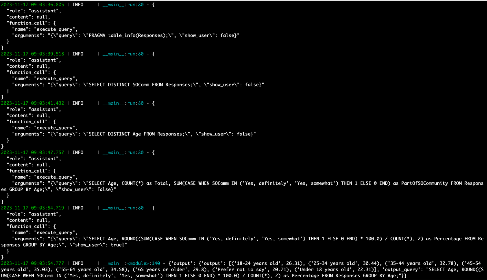
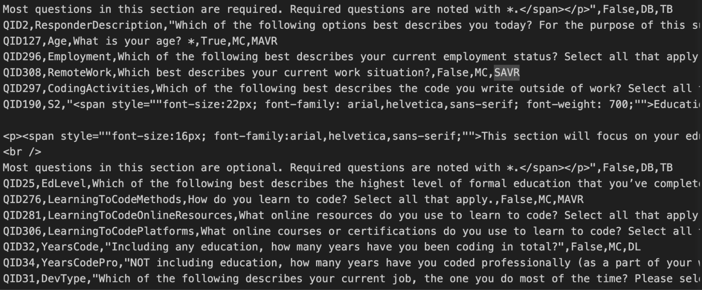
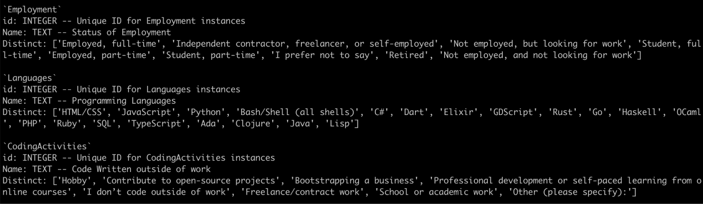
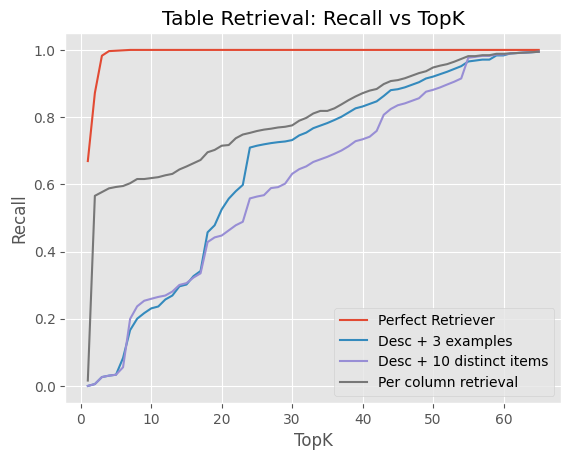
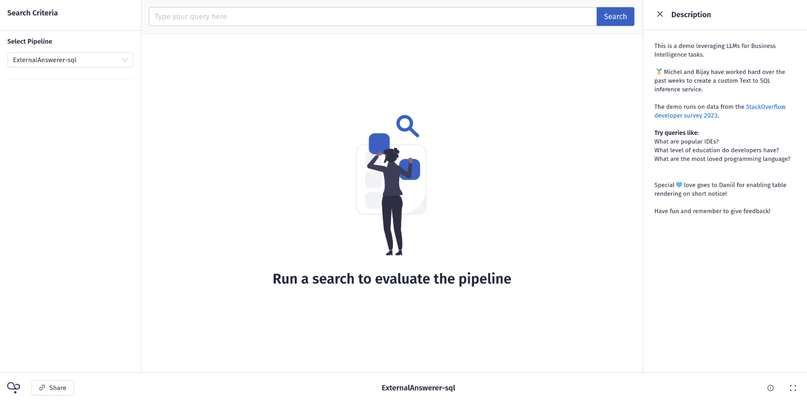
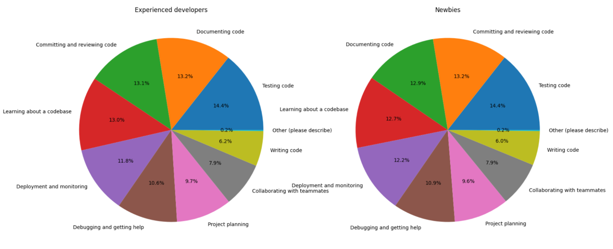

In organizations with large collections of data in tabular form, it’s the job of a data analyst to make sense of that data by extracting, transforming, and building stories around it. An analyst's primary tool for accessing the data is SQL. Given the impressive capabilities of large language models (LLMs), it's natural to wonder if AI can help us translate our information needs into well-formed SQL queries.

Granted, most LLMs can output at least some SQL queries based on natural language input. But can they handle large, multi-table databases in a real-world setting? In other words, can they do the job of a data analyst? A small team here at deepset set out to answer that question. Over the course of three months, we tried to find the best way to generate SQL queries on a real dataset.

Their findings in a nutshell: business intelligence (BI) is hard, and so is evaluating BI use cases. Current approaches that claim high accuracy probably don't tell the whole story, and GPT-4 is one of the best models available for generating SQL queries. If you want to learn more about our findings – and find out which of the approaches we evaluated performed the best – then this article is for you. We’re also releasing our benchmark: [the code used to prompt and evaluate the LLMs](https://github.com/deepset-ai/biqa-llm), as well as the [dataset we created for this project](https://huggingface.co/datasets/deepset/stackoverflow-survey-2023-text-sql). We hope you find them useful 🙂!

## BIQA is different from Table QA

At [deepset](https://www.deepset.ai/), we have long been interested in the task of using language models to answer questions based on tabular data. Most recently, we wrote about [our project with Airbus](https://haystack.deepset.ai/blog/airbus-case-study/), which involved retrieving tables from pilot manuals and extracting answers from them – sometimes even using simple aggregation functions such as finding the maximum or average value of a column.

BI use cases, however, operate on a completely different scale. A query language like SQL can execute much more powerful operations on much larger tables; for example, it can perform queries across multiple tables, join them, and reorder them according to complex criteria. To distinguish this problem from the simpler (and mostly solved) [task of Table QA](https://www.deepset.ai/blog/question-answering-on-structured-data), we call it "Business Intelligence Question Answering," or BIQA for short. It's also often referred to as "Text to SQL".

The BI use case is difficult, even for humans. This is because of the inherent ambiguity of natural language, which becomes particularly apparent when we try to map it to a formal language such as SQL. As a result, a question in natural language can have multiple interpretations in SQL. Let’s say we want to find out how many developers use Python in their day-to-day work. When we formulate this as an SQL query, we have to be specific: who exactly counts as a developer? How do we define "day-to-day"?

High standards for data quality can go a long way toward simplifying the ambiguity problem: aptly named columns, thorough schema descriptions, and logically organized tables all contribute to tabular databases that are easier to manage, for both humans and machines.

## The project

The goal of our BIQA project was to find the best solution for converting natural language text into valid SQL queries that produce the correct result for the user. The generated query is returned along with the result so that users with some knowledge of SQL can verify that it is correct.

The ability to query large databases in natural language would save people a lot of time. The LLM approach also means that you can make typos, query in languages other than English, and even integrate the SQL capability into a more complex workflow – it could be used as a [tool for an agent](https://haystack.deepset.ai/blog/introducing-haystack-agents), for example.

### Existing approaches

When we started, it seemed like we had a wide range of approaches to choose from. Over the past few months, many teams have tried to use the natural language understanding (NLU) capabilities of LLMs to generate SQL queries.

But when we looked more closely at their results, we found that they were lacking: Often, the best-performing model only solved a very specific problem at hand and wasn't able to generalize to other BI use cases. This also meant that models performed very differently across benchmarks. Because we wanted data points that best reflected a common, real-world use case – and to ensure that the evaluation set consisted of data that the LLMs hadn’t seen before – we decided to create our own dataset and benchmark.

### The dataset

For our dataset, we used the latest [Developer Survey by StackOverflow](https://survey.stackoverflow.co/2023/). Every year, the platform polls developers and community members at large about their use of programming languages and other tools. The survey results are displayed as interactive charts on their website. In addition, StackOverflow publishes the entire dataset of questions and answers. For our dataset, we reverse-engineered SO’s SQL queries and ended up with about 120 query-answer pairs.

To make the database more like a real production environment, we normalized the database schema. For example, we split tables whose columns allowed multiple values at once into separate, related tables. Each data point consists of a natural language query and a corresponding label, the SQL equivalent of the query.

### The conundrum of evaluating text to SQL

In our deep dive into existing approaches, we also found that even when they reported high-accuracy results, they were often based on questionable evaluation methods. Due to the ambiguity of natural language described above, the evaluation of text to SQL is still an unsolved problem with no standardized approaches. In our opinion, it always requires at least a manual component. This is an uncomfortable truth that is often glossed over by research teams - perhaps because they don't want to talk about the fact that they only used a tiny evaluation dataset to make up for the time-consuming practice of manually evaluating the results.

 After trying several methods, we settled on a semi-automated evaluation procedure. Our evaluation script pre-processed the output of the LLM, classifying each result as either correct (if it fully matched the ground truth in our evaluation dataset), incorrect (if the result was None), or requiring manual evaluation. We then manually processed this last set of results to verify that the result was indeed incorrect, or that the model had simply chosen a different SQL query that still produced the same result.

Obviously, this approach is very time-consuming. That's why, over time, we added several accepted queries to our benchmark dataset. This allowed us to iterate faster because we spent less time manually evaluating.

## Summarizing our approaches

We tried a number of different approaches that allowed us to explore the full range of NLP pipelines with LLMs: agents, retrieval augmentation, fine-tuning, and more. Here we summarize our results. At the end of the section, we provide an overview of all the approaches and their performance.

### Schema-aware prompting

**Approach**: In our baseline approach, we included the schema of our database in the prompt to the LLM. The schema describes the layout of the database: table names and descriptions, along with column names. This approach gives the LLM a lot of context.

We also experimented with including rows from the database in the prompt to help the model better parse ambiguous column names and to give it more information about what to expect from a given cell. For instance, in the example below, we can see that HTML/CSS is counted as one language in the Languages table. This way, the model understands that the two are always combined, and can adjust its queries to the database accordingly.

**Observations**: Schema-aware prompting produces very long prompts. We have 66 tables in our database, and including detailed information about each of them resulted in a prompt with about 3000 tokens. That's not only expensive, it also means that the model has to process more information at once, which can negatively affect its output. The simple combination of schema-aware prompting and GPT-4 got us to about 48 percent accuracy. The model errors ranged from invalid SQL queries that didn't match the actual schema, to more subtle errors where the SQL query returned a result that wasn't the correct answer to the question. Including sample rows in the prompt certainly improved performance.

### Agent-driven navigation of the database

**Approach**: An [agent](https://docs.haystack.deepset.ai/docs/agent) is an LLM that can act autonomously, given a set of tools. For example, it can iterate on the output of another LLM before returning it to the user. In our approach, we instruct the model to navigate through the database using increasingly complex SQL queries. This means that we don't have to provide the database schema ourselves, but can let the model figure it out on a need-to-know basis. In fact, we asked the agent to begin its exploration by retrieving information about all the tables in the database. From there, it had to figure out the rest of the strategy on its own.
 
**Observations**: The agent approach allowed us to have the LLM fix invalid queries. One benefit was that the queries were always ultimately valid SQL. Here's an example of the agent-driven approach in action (there's a breakdown of the individual steps after the screenshot):

*# Question: How many respondents consider themselves to be "definitely" or "somewhat" a part of the Stack Overflow community by age in %?*

**{"query": "PRAGMA table_info(Responses);", "show_user": false}**

*# First up the agent gets the info for the Responses table.*  
  
**{"query": "SELECT DISTINCT SOComm FROM Responses;", "show_user": false}**

*# It figures out that it needs to look at the SOComm column, specifically the distinct values.*

**{"query": "SELECT DISTINCT Age FROM Responses;", "show_user": false}**

*# It also checks the Age column.*

**{"query": "SELECT Age, COUNT(*) as Total, SUM(CASE WHEN SOComm IN ('Yes, definitely', 'Yes, somewhat') THEN 1 ELSE 0 END) as PartOfSOCommunity FROM Responses GROUP BY Age;", "show_user": false}**

*# Performs the necessary operation but still has show_user: false.*

**{"query": "SELECT Age, ROUND((SUM(CASE WHEN SOComm IN ('Yes, definitely', 'Yes, somewhat') THEN 1 ELSE 0 END) * 100.0) / COUNT(*), 2) as Percentage FROM Responses GROUP BY Age;", "show_user": true}**

*# Rounds out the percentage answer and sets show_user: true to end the generation.*

While this approach allowed us to initially enter shorter prompts, the agent's iterative method meant that the historical data was passed along with each new step the agent took: the prompt grew. So we're faced with the same problem of a large prompt that's hard for the model to manage and results in increasingly expensive API calls. There's also a problem with the black-box nature of the agent approach, which sometimes resulted in errors that were harder to understand than with schema-aware prompting.

### Include raw schema descriptions

**Approach**: In this approach, we provided not only the schema generated by the database, but also StackOverflow's descriptions of what the columns mean. We prepended these raw descriptions in the prompt before any table schema descriptions. These hand-written descriptions contain valuable information, such as the questions used to elicit the answers. Therefore, they are expected to clarify any ambiguities in the database schema. For example, in the following screenshot, we see that the `YearsCode` column is defined as years of programming experience "including any education".

**Observations**: Adding the descriptions for each column made the prompt even longer (~7k tokens). It improved accuracy by 10 percentage points to 58%.

### Including column-level descriptions and distinct values

**Approach**: In this approach, we sought to enrich the column-level information available to the LLM by including descriptions for each column as part of the schema. We also included up to 20 distinct values that a column could contain along with the descriptions. This resulted in a query of ~6.5k tokens.

**Observations**: This further improved the results, bringing the accuracy up to 65%.

### Including few-shot examples and custom instructions

**Approach**: After analyzing some of the problems the model was encountering, we tried modifying the prompt and adding few-shot examples to mitigate the error. A common mistake the LLM made was counting people repeatedly if they appeared in multiple rows. Instead, we want it to add a `DISTINCT` clause to the `COUNT()` function to remove the repeated appearance of the same data.

Therefore, we added the following instruction to the prompt:

*Also, for percentage calculations over responses use either the main table "responses" accounting for nulls or distinct values from the Associative table. Not full counts from the Associative Tables.*

In addition, we included some examples to show the LLM the desired behavior.

It could be argued that this goes beyond prompt engineering for the database or domain and comes close to overfitting the evaluation set. Nevertheless, it is a demonstration of the LLM's responsiveness to these changes.
  
**Observations**: The model responded to the instruction and examples and mostly stopped making the observed mistakes. This brought the accuracy to 70%.

### Retrieval augmentation

**Approach**: The model doesn't need to know all the tables in the database to answer a question. For example, most of the questions in the evaluation set could be answered using five or fewer of the 66 tables. A retrieval module could retrieve the right tables, which would shorten the prompt and help the model focus on only relevant information. It's important to note, however, that no retriever tuned for the specific task of matching a natural language query to a table schema was available. We used [all-mpnet-base-v2](https://huggingface.co/deepset/all-mpnet-base-v2-table), which we had seen perform well on previous table retrieval tasks.

**Observations**: The retrieval component didn't work very well. The embedding model simply wasn't able to select the relevant tables per query. The graph below plots the number of tables retrieved on the x-axis against the recall (i.e., the percentage of tables retrieved correctly) on the y-axis. It shows that even with an increased `top_k` value, the retrieval component didn't manage to identify all the relevant tables. Of course, this results in the LLM not seeing the right context to generate its SQL queries in the first place.

Column-level retrieval (i.e., embedding columns separately and returning the whole table if a column has a high value) performed better than table-level retrieval. This is probably because it's easier to match queries to individual columns, since a table with many columns that are irrelevant to the query can drown out the signal from a single column. Also, we're dealing with a setup where a specific table ("Responses") with a large number of columns should almost always be retrieved.

We also tried Perfect Retrieval (passing only the schemas for relevant tables) to determine the upper bound for the retrieval-based approach. Much to our surprise, it performed worse than just passing all tables (60% vs. 65.8%), due to an increased number of errors made by the LLM.

The poor performance of the RAG approach is partly due to the unbalanced dataset, where the number of columns varies greatly between tables. We could try to improve it (e.g. by switching to a better retrieval model or reformulating the setup), but given the underperformance of even Perfect Retrieval on this dataset, this exploration would be better done on a different dataset/setup.

### Other models

**Approach**: Besides GPT-4, we also tried many open weight models: Starcoderbase, New Hope, Codegen 2.5, sqlcoder models, etc.
  
**Observations**: Among them, the recently released sqlcoder-34b-alpha (loaded in 8bit) gave the most promising results (with 35.8%), but fell short of GPT-4. The main problem we encountered was that it often hallucinated non-existent columns, e.g. `work_exp`, `response_op_sys_professional_use`.

### Fine-tuning an existing OSS model

**Approach**: We can use a smaller open source LLM and fine-tune it on a suitable dataset. For that purpose, we fine-tuned a number of models on an EC2 instance using the resource-efficient [QLoRA approach](https://arxiv.org/abs/2305.14314) and a subset of the [Spider dataset](https://yale-lily.github.io/spider). These models included Llama 2 70 b and, in particular, all code-specific models available at the time (e.g., Starcoderbase, New Hope, Codegen 2.5).

**Observations**: Unfortunately, all of our OSS approaches failed, most likely because the dataset we used for fine-tuning wasn't up to the task. The Spider dataset is academically oriented and doesn't really capture the real-world business use cases that we were interested in (and that our evaluation dataset reflects quite accurately). The performance scores were correspondingly low, around 10%.

## An improved schema + evaluation results

From our qualitative analysis of model predictions and error patterns, we noticed that many table or column names were difficult to map back to the original question. This seemed to be confirmed by the better performance of the LLM when it was given descriptions of the columns in addition to the schema.

The initial task was therefore akin to giving a new business analyst a tangled database with dozens of tables and an arcane schema without any documentation or help, and then expecting them to come up with the right answers to our questions. We felt we hadn't given the model a fair chance to do the job.

Good data hygiene is essential for BI, so we decided to sit down and change the schema, structure the tables in a way that was easier to understand, and change the column naming to be self-explanatory. For example, we renamed a column from `LearnCode` to `LearningToCodeMethods`, which greatly reduced the ambiguity of the initial column name.

All of the evaluation results we report in this article are based on the new schema, which has significantly improved the performance of various approaches across the board.

| Approach                                                          | Overall % Correct |
|:------------------------------------------------------------------|  :---: |
| Agent-driven                                                      | 40.8              |
| Schema-aware                                                      | 48.3              |
| Schema-aware + raw descriptions                                   | 58.3              |
| Schema-aware + column-level descriptions + distinct-20            | 65.8              |
| Schema-aware + perfect retrieval + distinct-20                    | 60.0              |
| Schema-aware + column-level descriptions + distinct-20 + few-shot | 70.0              |
| Schema-aware + perfect retrieval (sqlcoder-34b-alpha @ 8bit)      | 35.8              |

## Challenges and Takeaways

Creating a general-purpose, LLM-driven solution for business intelligence in SQL is still a largely unsolved problem - which makes it all the more interesting to explore further. The main challenges relate to the following two factors:

### Dataset creation and evaluation is very time-consuming

Creating a dataset for evaluating BIQA approaches is much harder than for, say, extractive question answering. Essentially, you have to write a piece of code (the SQL query) for each data point. That query needs to be tested and debugged before it can go into the dataset.

And it's not just the creation of the dataset - the evaluation itself is time-consuming because, as we described earlier, it cannot be fully automated. BIQA evaluation, as we can do it now, isn't exactly scalable. Projects that want an accurate evaluation of their methods need to take into account that it will take a lot of their time.

### The ambiguity of language and databases

As we've seen, natural language queries can be quite ambiguous, making them difficult to translate into SQL queries. On the other hand, there is often more than one correct way to extract a piece of information from a database, and our evaluation dataset may not consider all of them. This brings us back to the fact that we need to at least partially evaluate the results of the model by hand after each run.

Another factor that comes into play here is that databases themselves can be ambiguous - even more so if the schema isn't particularly well designed. That's why it helps to have someone in the loop who knows the database well - it will help you to better evaluate the generated queries. You can even use the model's output as a sort of check on your naming practices - if a model keeps misusing a column, for example, that might be a sign that it's time to rename it or update its description.

## Demo

In addition to our dataset and benchmarks, we also published a [demo](https://dev.cloud.dpst.dev/shared_prototypes?share_token=prototype_eyJhbGciOiJIUzI1NiIsInR5cCI6IkpXVCJ9.eyJleHAiOjE3Mjk3NzIxNTcuNDg4LCJhdWQiOiJleHRlcm5hbCB1c2VyIiwiaXNzIjoiZEMiLCJ3b3Jrc3BhY2VfaWQiOiJmNWU5NDI1MC0xZmVkLTRkNTgtOGQ5MC1kZmUxMjY5ZWUzMjUiLCJ3b3Jrc3BhY2VfbmFtZSI6InN0YWNrb3ZlcmZsb3ctc3VydmV5Iiwib3JnYW5pemF0aW9uX2lkIjoiMGZiMzIyNDYtOWQ5OS00YTE1LWE0YzYtMzk3OWYyNDM1NzNhIiwic2hhcmVfaWQiOiI3ZDk4ZGI1Ny1mZWY3LTRlZDctOTc2My1jNDc2YWJmMzYxNGIifQ.ohlV-FwNa_0H_e4p86uS3MaKboLBn_dlKxPt4XcYYHg) of our best-performing BIQA approach to share with colleagues, friends, and now you, our readers. It serves to validate whether our accuracy results are representative of a real-world scenario. We found that user feedback was quite close to our results. The demo is hosted on deepset's [enterprise platform, deepset Cloud](https://www.deepset.ai/deepset-cloud), which creates an out-of-the-box user interface. Here's what it looks like:

Let’s try to recreate a question from the developer survey:

*How are experienced developers vs newbies planning to use AI tools in the future? Please provide the numbers.*

The result is a table followed by the generated query itself. Let’s have a look at the query first:

Note that the LLM has decided to come up with its own definition of who counts as an “experienced developer,” namely someone who has been coding for more than five years. This is an example of how the model has to compensate for the ambiguity in our natural language query. Here is a snapshot of the table we get as a result:

We can now reuse this generated content by copying the table into a csv file (or other structured file format). We can even visualize it using tools such as the Python libraries pandas and matplotlib:

Now we can see that even though the class of newbies (as defined by the LLM) is much larger than the cohort of experienced developers, the expectations of both groups from AI tools seem to be very similar. 

This is just a glimpse of what the BIQA approach can do. Feel free to play around with the demo and give us your feedback!

## Conclusion

The executive's dream of simply asking AI for any insight or dashboard without going through a business analyst won't come true anytime soon. The approaches we have tested are still too fragile to blindly trust their results for business-critical decisions.

However, in the same way that Copilot increases developer productivity, an AI companion for BI could significantly increase the productivity of any business analyst. They could use the LLM to generate an initial query, review the generated SQL and output, and only edit if necessary. Just from using the tool ourselves, we're sure it would boost analyst productivity in a similar way to how code assistants have impacted developers.

It's really hard to create a general-purpose SQL model – most success stories involve very specific use cases. For now, you can create specialized models with better fine-tuning datasets for specific use cases only. But keep in mind that creating datasets is time consuming.

A robust evaluation that still allows you to move quickly is essential to making progress. If your organization has good data management practices in place, you're likely to be more successful in your BIQA efforts.
  
Interested in moving beyond the AI hype and using LLMs where they can add real value? Check out our [Haystack repo](https://github.com/deepset-ai/haystack) on GitHub and [join us on Discord](https://discord.com/invite/VBpFzsgRVF)!
