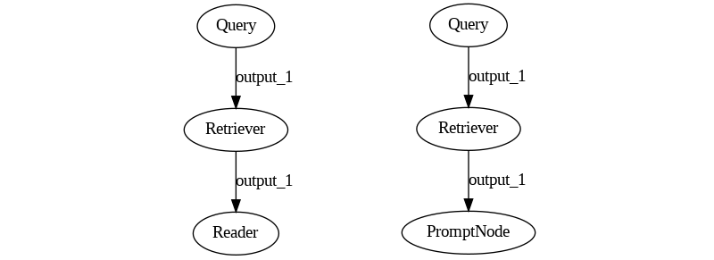
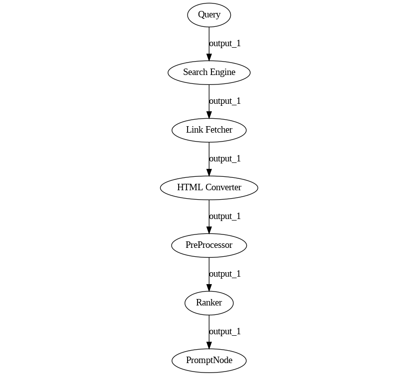
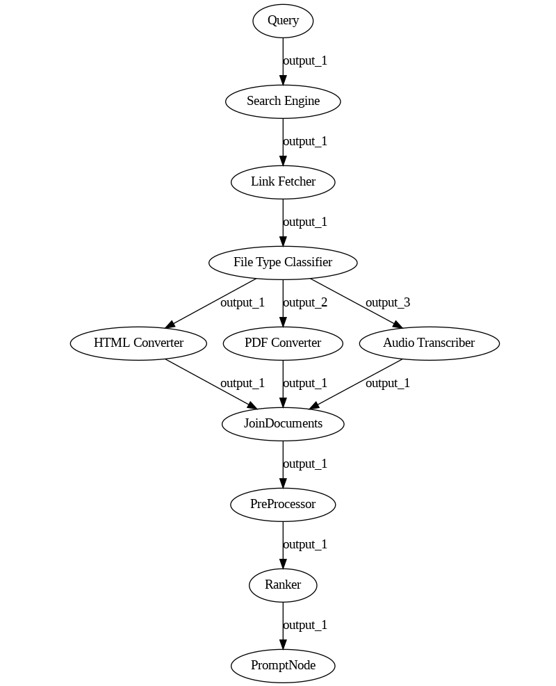
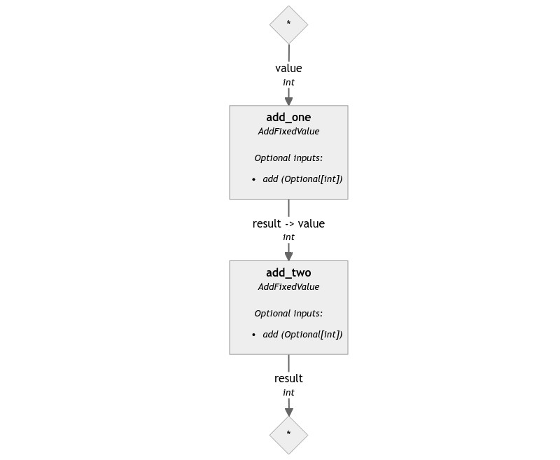

As we have seen in [the previous episode of this series](https://haystack.deepset.ai/blog/haystack-pipeline-a-deep-dive), Haystack's Pipeline is a powerful concept that comes with its set of benefits and shortcomings. In Haystack 2.0, the pipeline was one of the first items that we focused our attention on, and it was the starting point of the entire rewrite.

What does this mean in practice? Let's look at what Haystack Pipelines in 2.0 will be like, how they differ from their 1.x counterparts, and the pros and cons of this new paradigm.

## New Use Cases

I've already written [at length](https://haystack.deepset.ai/blog/haystack-pipeline-a-deep-dive) about what made the original Pipeline concept so powerful and its weaknesses. Pipelines were overly effective for the use cases we could conceive while developing them, but they didn't generalize well on unforeseen situations.

For a long time, Haystack was able to afford not focusing on use cases that didn't fit its architecture, as I have mentioned in my [previous post](https://haystack.deepset.ai/blog/haystack-rewrite-why) about the reasons for the rewrite. The pipeline was then more than sufficient for its purposes.

However, the situation flipped as LLMs and Generative AI "entered" the scene abruptly at the end of 2022 (although it's certainly been around for longer). Our `Pipeline` although useable and still quite powerful in many LLM use-cases, seemingly overfit the original use-cases it was designed for.

Let's take one of these use cases and see where it leads us.

## RAG Pipelines

Let's take one typical example: [retrieval augmented generation](https://www.deepset.ai/blog/llms-retrieval-augmentation), or RAG for short. This technique has been used since the very early days of the Generative AI boom as an easy way to strongly [reduce hallucinations](https://haystack.deepset.ai/blog/generative-vs-extractive-models) and improve the alignment of LLMs. The basic idea is: instead of asking directly a question, such as `"What's the capital of France?"`, we send to the model a more complex prompt, that includes both the question and the answer. Such a prompt might be:

```text
Given the following paragraph, answer the question.

Paragraph: France is a unitary semi-presidential republic with its capital in Paris, 
the country's largest city and main cultural and commercial centre; other major urban 
areas include Marseille, Lyon, Toulouse, Lille, Bordeaux, Strasbourg and Nice.

Question: What's the capital of France?

Answer:
```

In this situation, the task of the LLM becomes far easier: instead of drawing facts from its internal knowledge, which might be lacking, inaccurate, or out-of-date, the model can use the paragraph's content to answer the question, improving the model's performance significantly.

We now have a new problem, though. How can we provide the correct snippets of text to the LLM? This is where the "retrieval" keyword comes up.

One of Haystack's primary use cases had been [Extractive Question Answering](https://huggingface.co/tasks/question-answering): a system where a Retriever component searches a Document Store (such as a vector or SQL database) for snippets of text that are the most relevant to a given question. It then sends such snippets to a Reader (an extractive model), which highlights the keywords that answer the original question.

By replacing a Reader model with an LLM, we get a Retrieval Augmented Generation Pipeline. Easy!



So far, everything checks out. Supporting RAG with Haystack feels not only possible but natural. Let's take this simple example one step forward: what if, instead of getting the data from a document store, I want to retrieve data from the Internet?

## Web RAG

At first glance, the task may not seem daunting. We surely need a special Retriever that, instead of searching through a DB, searches through the Internet using a search engine. But the core concepts stay the same, and so, we assume, should the pipeline's graph. The end result should be something like this:


However, the problem doesn't end there. Search engines return links, which need to be accessed, and the content of the webpage downloaded. Such pages may be extensive and contain artifacts, so the resulting text needs to be cleaned, reduced into paragraphs, potentially embedded by a retrieval model, ranked against the original query, and only the top few resulting pieces of text need to be passed over to the LLM. Just by including these minimal requirements, our pipeline already looks like this:



And we still need to consider that URLs may reference not HTML pages but PDFs, videos, zip files, and so on. We need file converters, zip extractors, audio transcribers, and so on.



You may notice how this use case moved quickly from looking like a simple query pipeline into a strange overlap of a query and an indexing pipeline. As we've learned in the previous post, indexing pipelines have their own set of quirks, one of which is that they can't simultaneously process files of different types. But we can only expect the Search Engine to retrieve HTML files or PDFs if we filter them out on purpose, which makes the pipeline less effective. In fact, a pipeline that can read content from different file types, such as the one above, can't really be made to work.

And what if, on top of this, we need to cache the resulting documents to reduce latency? What if I wanted to get the results from Google's page 2, but only if the content of page 1 did not answer our question? At this point, the pipeline is hard to imagine, let alone draw.

Although Web RAG is somewhat possible in Haystack, it stretches far beyond what the pipeline was designed to handle. Can we do better?

## Pinpointing the issue

When we went back to the drawing board to address these concerns, the first step was pinpointing the issue. 

The root problem, as we realized, is that Haystack Pipelines treats each component as a locomotive treats its wagons. They all look the same from the pipeline's perspective, they can all be connected in any order, and they all go from A to B rolling over the same pair of rails, passing all through the same stations.


In Haystack 1, components are designed to serve the pipeline's needs first. A good component is identical to all the others, provides the exact interface the pipeline requires, and can be connected to any other in any order. The components are awkward to use outside of a pipeline due to the same `run()` method that makes the pipeline so ergonomic. Why does the Ranker, which needs only a query and a list of Documents to operate, also accept `file_paths` and `meta` in its `run()` method? It does so uniquely to satisfy the pipeline's requirements, which in turn only exist to make all components forcefully compatible with each other.

Just like a locomotive, the pipeline pushes the components over the input data one by one. When seen in this light, it's painfully obvious why the indexing pipeline we've seen earlier can't work: the "pipeline train" can only go on one branch at a time. Component trains can't split mid-execution. They are designed to all see the same data all the time. Even when branching happens, all branches always see the same data. Sending different wagons onto different rails is not possible by design.

## Breaking it down

The issue's core is more evident when seen in this light. The pipeline is the only object that drives the execution, while components tend to be as passive and uniform as possible. This approach doesn't scale: components are fundamentally different, and asking them to all appear equal forces them to hide their differences, making bugs and odd behavior more likely. As the number of components to handle grows, their variety will increase regardless, so the pipeline must always be aware of all the possibilities to manage them and progressively add edge cases that rapidly increase its complexity.

Therefore, the pipeline rewrite for Haystack 2.0 focused on one core principle: the components will define and drive the execution process. There is no locomotive anymore: every component needs to find its way, such as grabbing the data they need from the producers and sending their results to whoever needs them by declaring the proper connections. In the railway metaphor, it's like adding a steering wheel to each container: the result is a truck, and the resulting system looks now like a highway.


Just as railways are excellent at going from A to B when you only need to take a few well-known routes and never another, highways are unbeatable at reaching every possible destination with the same effort, even though they need a driver for each wagon. A "highway" Pipeline requires more work from the Components' side, but it frees them to go wherever they need to with a precision that a "railway" pipeline cannot accomplish.

## The Pipeline Structure of Haystack 2.0

By design, pipelines in Haystack 2.0 is not geared toward specific NLP use cases, but it's a minimal, generic [ETL](https://en.wikipedia.org/wiki/Extract,_transform,_load)-like class.

The new pipelines brings two core elements to the table:

- The `Component` protocol, a well-defined API that Python classes need to respect to be understood by the pipeline.

- The `Pipeline` object, the graph resolver and execution engine that also performs validation and provides a few utilities on top.

Let's explore these two concepts one by one.

### The Pipeline API

The new `Pipeline` object may remind vaguely of Haystack's original pipeline, and using one should feel very familiar. For example, this is how you assemble a simple Pipeline that performs word additions in Haystack 2.0.

```python
Re-write with a language example.
```

Creating the pipeline requires no special attention: however, you can now pass a `max_loops_allowed` parameter, to limit looping when it's a risk. On the contrary, old Haystack 1.x Pipelines did not support loops at all.

Next, components are added by calling the `Pipeline.add_component(name, component)` method. This is also subject to very similar requirements to the previous `pipeline.add_node`:
- Every component needs a unique name.
- Some are reserved (for now, only `_debug`).
- Instances are not reusable.
- The object needs to be a component.
However, we no longer connect the components to each other using this function because, although it is possible to implement in principle, it feels more awkward to use in the case of loops.

Consequently, we introduced a new method, `Pipeline.connect()`. This method follows the syntax `("producer_component.output_name_", "consumer_component.input_name")`: so we don't simply line up two components one after the other, but we connect one of their outputs to one of their inputs in an explicit manner.

This change allows pipelines to perform a much more careful validation of such connections. As we will discover soon, pipeline components in Haystack 2.0 must declare the type of their inputs and outputs. In this way, pipelines not only can make sure that the inputs and outputs exist for the given component, but they can also check whether their types match and can explain connection failures in great detail. For example, if there were a type mismatch, `Pipeline.connect()` will return an error such as:

```markdown
Rewrite with NLP example
```

Once the components are connected together, the resulting pipeline can be drawn. Pipeline drawings in Haystack 2.0 show far more details than their predecessors because the components are forced to share much more information about what they need to run, the types of these variables, and so on. The pipeline above draws the following image:



You can see how the components classes, their inputs and outputs, and all the connections are named and typed.

So, how do you run such a pipeline? By just providing a dictionary of input values. Each starting component should have a small dictionary with all the necessary inputs. In the example above, we pass `1` to the `value` input of `add_one`. The results mirror the input's structure: `add_two` is at the end of the pipeline, so the pipeline will return a dictionary where under the `add_two` key there is a dictionary: `{"result": 4}`.

By looking at the diagram, you may have noticed that these two components have optional inputs. They're not necessary for the pipeline to run, but they can be used to dynamically control the behavior of these components. In this case, `add` controls the "fixed value" this component adds to its primary input. For example:

```python
pipeline.run({"add_one": {"value": 1, "add": 2}})
# returns '{"add_two": {"result": 5}}'
```

```python
pipeline.run({"add_one": {"value": 1}, "add_two": {"add": 10}})
# returns '{"add_two": {"result": 12}}'
```

One evident difficulty of this API is that it might be challenging to understand what to provide to the run method for each component. This issue has also been considered: the pipeline offers a `Pipeline.inputs()` method that returns a structured representation of all the expected input. For our pipeline, it looks like:

```python
{
    "add_one": {
        "value": {
            "type": int, 
            "is_optional": False
        }, 
        "add": {
            "type": typing.Optional[int], 
            "is_optional": True
        }
    }, 
    "add_two": {
        "add": {
            "type": typing.Optional[int], 
            "is_optional": True
        }
    }
}
```


## The Component API

Now that we covered the Pipeline's API, let's have a look at what it takes for a Python class to be treated as a pipeline component.

You are going to need:

- **A `@component` decorator**. All component classes must be decorated with the `@component` decorator. This allows a pipeline to discover and validate them.

- **A `run()` method**. This is the method where the main functionality of the component should be carried out. It's invoked by `Pipeline.run()` and has a few constraints, which we will describe later.

- **A `@component.output_types()` decorator for the `run()` method**. This allows the pipeline to validate the connections between components.
  
- Optionally, **a `warm_up()` method**. It can be used to defer the loading of a heavy resource (think a local LLM or an embedding model) to the warm-up stage that occurs right before the first execution of the pipeline. Components that use `warm_up()` can be added to a Pipeline and connected before the heavy operations are carried out. In this way, the validation that a `Pipeline` performs can happen before resources are wasted.

To summarize, a minimal component can look like this:

```python
Rewrite with language exampole
```

### Pipeline Validation
Note how the `run()` method has a few peculiar features. One is that all the method parameters need to be typed: if `value` was not declared as `value: int`, the pipeline would raise an exception demanding for typing.

This is the way components declare to the pipeline which inputs they expect and of which type: this is the first half of the information needed to perform the validation that `Pipeline.connect()` carries out.

The other half of the information comes from the `@component.output_types` decorator. Pipelines demand that components declare how many outputs the component will produce and of what type. One may ask why not rely on typing for the outputs, just as we've done for the inputs. So why not simply declare components as:


```python
@component
class Double:

    def run(self, value: int) -> int:
        return value * 2
```

For `Double`, this is a legitimate solution. However, let's see an example with another component called `CheckParity`: if a component's input value is even, it sends it unchanged over the `even` output, while if it's odd, it will send it over the `odd` output. The following clearly doesn't work: we're not communicating anywhere to Canals which output is even and which one is odd.

```python
@component
class CheckParity:

    def run(self, value: int) -> int:
        if value % 2 == 0:
            return value
        return value
```

How about this instead?

```python
@component
class CheckParity:

    def run(self, value: int) -> Dict[str, int]:
        if value % 2 == 0:
            return {"even": value}
        return {"odd": value}
```

This approach carries all the information required. However, such information is only available after the `run()` method is called. Unless we parse the method to discover all return statements and their keys (which is not always possible), pipelines cannot know all the keys the return dictionary may have. So, it can't validate the connections when `Pipeline.connect()` is called.

The decorator bridges the gap by allowing the class to declare in advance what outputs it will produce and of which type. Pipeline trusts this information to be correct and validates the connections accordingly.

Okay, but what if the component is very dynamic? The output type may depend on the input type. Perhaps the number of inputs depends on some initialization parameter. In these cases, pipelines allow components to declare the inputs and output types in their init method as such:

```python
@component
class HighlyDynamicComponent:

    def __init__(self, ...):
        component.set_input_types(self, input_name=input_type, ...)
        component.set_output_types(self, output_name=output_type, ...)

    def run(self, **kwargs):
        ...
```

Note that there's no more typing on `run()`, and the decorator is gone. The information provided in the init method is sufficient for the pipeline to validate the connections.

One more feature of the inputs and output declarations relates to optional and variadic values. Pipelines in Haystack 2.0 support this both through a mix of type checking and signature inspection. For example, let's have a look at how the `AddFixedValue` we've seen earlier looks like:

**TODO: change to language example**
```python
from typing import Optional
from canals import component


@component
class AddFixedValue:
    """
    Adds two values together.
    """

    def __init__(self, add: int = 1):
        self.add = add

    @component.output_types(result=int)
    def run(self, value: int, add: Optional[int] = None):
        """
        Adds two values together.
        """
        if add is None:
            add = self.add
        return {"result": value + add}
```

You can see that `add`, the optional parameter we met before, has a default value. Adding a default value to a parameter in the `run()` signature tells the pipeline that the parameter itself is optional, so the component can run even if that specific input doesn't receive any value from the pipeline's input or other components.

Another component that generalizes the sum operation is `Sum`, which instead looks like this:

**TODO: change to language example**
```python
from canals import component
from canals. component.types import Variadic

@component
class Sum:
    """
    Adds all its inputs together.
    """

    @component.output_types(total=int)
    def run(self, values: Variadic[int]):
        """
        :param values: the values to sum
        """
        return {"total": sum(v for v in values if v is not None)}
```

In this case, we used the special type `Variadic` to tell the pipeline that the `values` input can receive data from multiple producers, instead of just one. Therefore, `values` is going to be a list type, but it can be connected to single `int` outputs, making it a valuable aggregator.

## Serialization

Just like old Haystack Pipelines, the new pipelines can be serialized. However, this feature suffered from similar problems plaguing the execution model,  so it was changed radically.

The original pipeline gathered intrusive information about each of its components when initialized, leveraging the shared `BaseComponent` class. Conversely, the `Pipeline` delegates the serialization process entirely to its components.

If a component wishes to be serializable, it must provide two additional methods, `to_dict` and `from_dict`, which perform serialization and deserialization to a dictionary. The pipeline limits itself to calling each of its component's methods, collecting their output, grouping them together with some limited extra information (such as the connections between them), and returning the result.

For example, if `AddFixedValue` were serializable, its serialized version could look like this:

**TODO: Change to language example**
```python
{
    "type": "AddFixedValue",
    "init_parameters": {
        "add": 1
    }
}
```

The entire pipeline we used above would end up as follows:

```python
{
    "max_loops_allowed": 100,
    "components": {
        "add_one": {
            "type": "AddFixedValue",
            "init_parameters": {
                "add": 1
            }
        },
        "add_two": {
            "type": "AddFixedValue",
            "init_parameters": {
                "add": 2
            }
        }
    },
    "connections": [
        {
            "sender": "add_one.result", 
            "receiver": "add_two.value",
        }
    ]
}
```

Notice how the components are free to perform serialization in the way they see fit. The only requirement imposed by the `Pipeline` is the presence of two top-level keys, `type` and `init_parameters`, which are necessary for the pipeline to deserialize each component into the correct class.

This is useful, especially if the component's state includes some non-trivial values, such as objects, API keys, or other special values. Pipeline no longer needs to know how to serialize everything the Components may contain: the task is fully delegated to them, which always knows best what needs to be done.

## But... do we need any of this?

Having done a tour of the new `Pipeline` features, one might have noticed one detail. There's a bit more work involved in using a Pipeline than there was before: you can't just chain every component after every other. There are connections to be made, validation to perform, graphs to assemble, and so on.

In exchange, the pipeline is now way more powerful than before. Sure, but so is a plain Python script. Do we *really* need the Pipeline object? And what do we need it for?

- **Validation**. While components normally validate their inputs and outputs, the pipeline does all the validation before the components run, even before loading heavy resources. This makes the whole system far less likely to fail at runtime for a simple input/output mismatch, which can be priceless for complex applications.

- **Serialization**. Redistributing code is always tricky: redistributing a JSON file is much safer. Pipelines make it possible to represent complex systems in a readable JSON file that can be edited, shared, stored, deployed, and re-deployed on different backends at need. 

- **Drawing**: The new Pipeline offers a way to see your system clearly and automatically, which is often very handy for debugging, inspecting the system, and collaborating on the pipeline's design.

- **Branching**:
- **Loops**:
- **Flexible input and output types with customizable connections**:
  
- On top of this, the pipeline abstraction promotes flatter API surfaces by discouraging components nesting one within the other and providing easy-to-use, single-responsibility components that are easy to reason about.

Having said all of this, however, we don't believe that the pipeline design makes Haystack win or lose. Pipelines are just a bonus on top of what provides the real value: a broad set of components that reliably perform well-defined tasks. That's why the Component API does not make the `run()` method awkward to use outside of a Pipeline: calling `Sum.run(values=[1, 2, 3])` feels Pythonic outside of a pipeline and always will.
