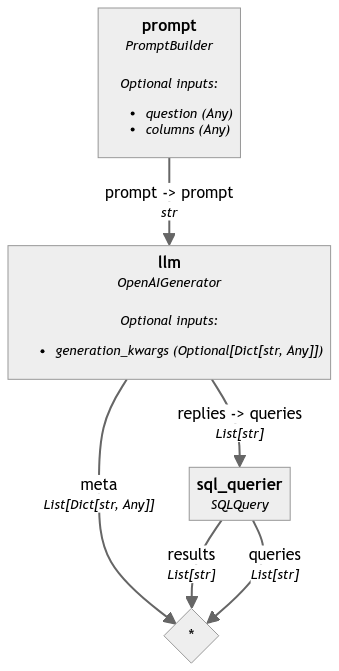
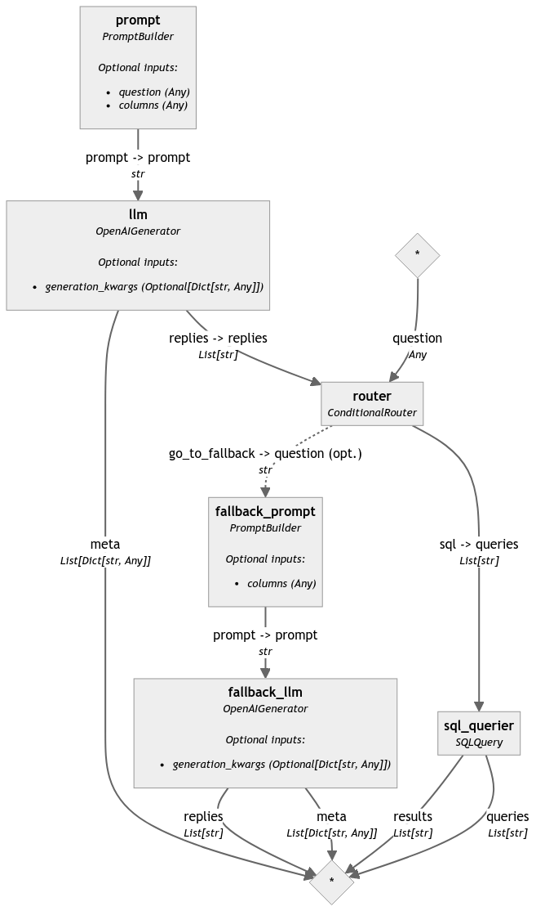

Let’s talk about how we build AI applications that can interact with, even chat to SQL databases. Heads-up that this is a mini project that I tried out, and it’s objectively a simple approach to interacting with SQL with natural language. I’m *certain* that this is not a golden bullet that works with all types of SQL tables etc. But, nonetheless, it’s cool, it works, and you can try it along with me.

My aim setting off with this project was to be able to ask questions in natural language, and get back an answer based on the contents in a SQL database. For example, assuming we have a database that stores information on employees and their time spent at work; “*How many people spend more than 8 hours at work a day?*”, “*A total of 20 employees spend more than 8 hours at work a day.*”. 

A few struggles I knew I might get with a system based on a generative LLM:

- What if the question is *unrelated* to the contents in the SQL database?
- I can get the LLM to maybe produce a SQL query, but how do I actually query the database?
- What if the SQL query is just *wrong?* 🙂

So, here are 4 things I did and that I’m showing you here. Not all solve all of the problems above, but they’re a good starting point. And as a heads up, I used Haystack for this project, so the following walk-through has some Haystack terminology.

- I created **a component that can query a SQL database** given a query. I used SQLite for this.
- I created a **pipeline using an LLM that can ingest a question, produce a SQL query based on the structure of my database, and query it**
- Next, to resolve the problem of ‘what if the query is unrelated’, I “upgraded” my pipeline to use ***conditional routing.***
- Finally, so as to have a proper chat experience, I changed tactics and defined everything as a function and used the ***function-calling*** capabilities of the latest LLMs. I then wrapped that into a mini Gradio app that you can run from within the Cookbook I’ve provided.

Before we dive in, a quick note on the data at hand. I won’t show all the code to get that into the database here because, frankly, it’s the most boring step… A few bullet points:

- I used a CSV file called ‘Absenteeism_at_work’ that the JupySQL team uses to show their examples. Very handy! I took inspiration from [the first demo we created with them](https://ploomber.io/blog/jupysql-haystack-agent/) and wrote this table to my SQLite database.
- The resulting table has the following columns: 
```bash
ID;Reason_for_absence;Month_of_absence;Day_of_the_week;Seasons;Transportation_expense;Distance_from_Residence_to_Work;Service_time;Age;Work_load_Average_day_;Hit_target;Disciplinary_failure;Education;Son;Social_drinker;Social_smoker;Pet;Weight;Height;Body_mass_index;Absenteeism_time_in_hours
```
- I’ve populated a database called `absenteeism.db` that represents this table, which we will be using here on out.

> 🧑‍🍳 You can see and run all the code required for the SQL database setup in the [provided Cookbook](https://colab.research.google.com/github/deepset-ai/haystack-cookbook/blob/main/notebooks/chat_with_SQL_3_ways.ipynb)

> [Part 1: Query SQL with Natural Language](#part-1-query-sql-with-natural-language)
>
> [Part 2: Skip Unrelated Questions with Conditional Routing](#part-2-skip-unrelated-questions-with-conditional-routing)
>
> [Part 3: Build a Chat App with Function Calling (& Gradio)](#part-3-build-a-chat-app-with-function-calling--gradio)

## Part 1: Query SQL with Natural Language

First, let’s tackle the easiest of the lot. Let’s create a pipeline that:

1. Accepts a question
2. Creates a SQL query
3. Actually queries our DB.

To this end, here’s something we’re going to need. A `SQLQuery` component which Haystack does not have. But Haystack *does* provide a uniform interface for component creation. And here’s what mine looks like:

```python
import sqlite3
from typing import List
from haystack import component

@component
class SQLQuery:

    def __init__(self, sql_database: str):
      self.connection = sqlite3.connect(sql_database, check_same_thread=False)

    @component.output_types(results=List[str], queries=List[str])
    def run(self, queries: List[str]):
        results = []
        for query in queries:
          result = pd.read_sql(query, self.connection)
          results.append(f"{result}")
        return {"results": results, "queries": queries}
```

Now I have an `SQLQuery` component, I can initialize it with `sql_query = SQLQuery('absenteeism.db)`.

To test it, I can run the following SQL query with this component:

```python
result = sql_query.run(queries=['SELECT Age, SUM(Absenteeism_time_in_hours) as Total_Absenteeism_Hours FROM absenteeism WHERE Disciplinary_failure = 0 GROUP BY Age ORDER BY Total_Absenteeism_Hours DESC LIMIT 3;'])
print(result["results"][0])
```

Resulting in:

```bash
   Age  Total_Absenteeism_Hours
0   28                      651
1   33                      538
2   38                      482
```

### Build the SQL Query Pipeline

Now that we have a component that can ingest SQL queries and query our desired database, let’s add it as a step in a full AI application. We will build a Haystack pipeline that:

- Uses a prompt that instructs an LLM (as an example here, we’re using GPT-4, if you want to stick to this one you’ll have to provide your API key as the `OPENAI_API_KEY` environment variable) to generate a SQL query based on the `columns` present in our database and the natural language `question` that we provide
- Forwards the generated SQL query to our newly creates `SQLQuery` component

```python
from haystack import Pipeline
from haystack.components.builders import PromptBuilder
from haystack.components.generators.openai import OpenAIGenerator

prompt = PromptBuilder(template="""Please generate an SQL query. The query should answer the following Question: {{question}};
            The query is to be answered for the table is called 'absenteeism' with the following
            Columns: {{columns}};
            Answer:""")
            
sql_query = SQLQuery('absenteeism.db')
llm = OpenAIGenerator(model="gpt-4")

sql_pipeline = Pipeline()
sql_pipeline.add_component("prompt", prompt)
sql_pipeline.add_component("llm", llm)
sql_pipeline.add_component("sql_querier", sql_query)

sql_pipeline.connect("prompt", "llm")
sql_pipeline.connect("llm.replies", "sql_querier.queries")
```

The resulting `sql_pipeline` looks like this (produces with `sql_pipeline.show()` in the cookbook) 👇



Let’s try running it, and here’s what we get 👇

```python
result = sql_pipeline.run({"prompt": {"question": "On which days of the week does the average absenteeism time exceed 4 hours?",
                            "columns": columns}})

print(result["sql_querier"]["results"][0])
#   Day_of_the_week
#0                2
#1                3
#2                4
#3                5
#4                6
```

## Part 2: Skip Unrelated Questions with Conditional Routing

Next, let’s add a simple improvement. What if the provided `question` is unrelated? It’s better if we skip it, rather than querying the database with a SQL query that’s going to result in an error. 

For this step, I used the `[ConditionalRouter](https://docs.haystack.deepset.ai/docs/conditionalrouter)` that comes with Haystack 2.0.

To start with, let’s have an LLM reply with `no_answer` if the provided question cannot be answered with the SQL table we have:

```python
from haystack.components.builders import PromptBuilder
from haystack.components.generators.openai import OpenAIGenerator

prompt = PromptBuilder(template="""Please generate an SQL query. The query should answer the following Question: {{question}};
            If the question cannot be answered given the provided table and columns, return 'no_answer'
            The query is to be answered for the table is called 'absenteeism' with the following
            Columns: {{columns}};
            Answer:""")

llm = OpenAIGenerator(model="gpt-4")
```

Next, let’s define some routes, and our `ConditionalRouter`. What we want to accomplish here is:

- If the reply from our LLM is `no_answer` we want to go down the `go_to_fallback` branch of our pipeline
- If there’s no `no_answer`, we want to go down the `sql` route.

```python
from haystack.components.routers import ConditionalRouter

routes = [
     {
        "condition": "{{'no_answer' not in replies[0]}}",
        "output": "{{replies}}",
        "output_name": "sql",
        "output_type": List[str],
    },
    {
        "condition": "{{'no_answer' in replies[0]}}",
        "output": "{{question}}",
        "output_name": "go_to_fallback",
        "output_type": str,
    },
]

router = ConditionalRouter(routes)
```

Finally, let’s decide on what to do if we want to go down the fallback route. For this example, I’ve simply created a `fallback_llm` that is going to tell the user *why* the question cannot be answered:

```python
fallback_prompt = PromptBuilder(template="""User entered a query that cannot be answerwed with the given table.
                                            The query was: {{question}} and the table had columns: {{columns}}.
                                            Let the user know why the question cannot be answered""")
fallback_llm = OpenAIGenerator(model="gpt-4")
```

When we add all of these, and our `sql_query` component into a pipeline, it looks like this 👇

```python
from haystack import Pipeline

conditional_sql_pipeline = Pipeline()
conditional_sql_pipeline.add_component("prompt", prompt)
conditional_sql_pipeline.add_component("llm", llm)
conditional_sql_pipeline.add_component("router", router)
conditional_sql_pipeline.add_component("fallback_prompt", fallback_prompt)
conditional_sql_pipeline.add_component("fallback_llm", fallback_llm)
conditional_sql_pipeline.add_component("sql_querier", sql_query)

conditional_sql_pipeline.connect("prompt", "llm")
conditional_sql_pipeline.connect("llm.replies", "router.replies")
conditional_sql_pipeline.connect("router.sql", "sql_querier.queries")
conditional_sql_pipeline.connect("router.go_to_fallback", "fallback_prompt.question")
conditional_sql_pipeline.connect("fallback_prompt", "fallback_llm")
```



If I ask the question “On which days of the week does the average absenteeism time exceed 4 hours?” to this pipeline I get:

```python
question = "On which days of the week does the average absenteeism time exceed 4 hours?"
result = conditional_sql_pipeline.run({"prompt": {"question": question,
                                                  "columns": columns},
                                       "router": {"question": question},
                                       "fallback_prompt": {"columns": columns}})
if 'sql_querier' in result:
  print(result['sql_querier']['results'][0])
elif 'fallback_llm' in result:
  print(result['fallback_llm']['replies'][0])
   
#   Day_of_the_week
#0                2
#1                3
#2                4
#3                5
#4                6
```

But if I ask “When is my birthday?” I get the following reply: 

> The query cannot be answered as the provided table does not contain information regarding the user's personal data such as birthdays. The table primarily focuses on absence-related data for presumably work or similar situations. Please provide the relevant data to get the accurate answer.
> 

## Part 3: Build a Chat App with Function Calling (& Gradio)

The last thing I tried was to use function calling instead of conditional routing. The aim here is to have a human-like discussion with our SQL database. By doing this, we allow the LLM to *decide* whether the tool (our function) should be selected to resolve a question. The resulting system has the following flow:

1. User asks question
2. LLM decides whether any of the tools (functions) provided to it can resolve the question
3. The LLM generates the inputs for the tool it has selected to use. These inputs should be what the tool needs to actually run
4. We run the tool with the generated inputs.
5. The LLM then generates a human-like answer based on the returned result from the tool.

I already have a `SQLQuery` component that is pretty straightforward, so here’s how I wrapped that into a function:

```python
sql_query = SQLQuery('absenteeism.db')

def sql_query_func(queries: List[str]):
    try:
      result = sql_query.run(queries)
      return {"reply": result["results"][0]}

    except Exception as e:
      reply = f"""There was an error running the SQL Query = {queries}
              The error is {e},
              You should probably try again.
              """
      return {"reply": reply}
```

Since I’m using GPT-4 as my demo LLM here, I’ll be providing this function as a tool:

```python
tools = [
    {
        "type": "function",
        "function": {
            "name": "sql_query_func",
            "description": f"This a tool useful to query a SQL table called 'absenteeism' with the following Columns: {columns}",
            "parameters": {
                "type": "object",
                "properties": {
                    "queries": {
                        "type": "array",
                        "description": "The query to use in the search. Infer this from the user's message. It should be a question or a statement",
                        "items": {
                            "type": "string",
                        }
                    }
                },
                "required": ["question"],
            },
        },
    }
]
```

Once I had this in place, I simply added this as a tool to an `OpenAIChatGenerator` and followed it up by creating a mini app that keeps track of conversation history. I used Gradio (thank you for the example in the [Building a Chat Application Tutorial](https://haystack.deepset.ai/tutorials/40_building_chat_application_with_function_calling) Bilge!!) to wrap this into a demo app. 

> See the cookbook for the full code example
> 

```python
demo = gr.ChatInterface(
    fn=chatbot_with_fc,
    examples=[
        "Find the top 3 ages with the highest total absenteeism hours, excluding disciplinary failures",
        "On which days of the week does the average absenteeism time exceed 4 hours?",
        "Who lives in London?",
    ],
    title="Chat with your SQL Database",
)
demo.launch()
```


### Wrapping it up: Chatting with SQL and Haystack three ways

In this post, you’ve learned a few approaches to chat with your SQL databases using Haystack 👇

- Building a Haystack custom component to serve as a SQL query interface, and using that component in a pipeline.
- Improving the pipeline by skipping irrelevant queries with conditional routing.
- Using function calling, tools, and Gradio to build a full stack text to SQL app 🚀

Thanks for following along! 

If you’re hungry to learn more about SQL + LLMs, check out our post on **[Using Generative AI to Query Large BI Tables](https://haystack.deepset.ai/blog/business-intelligence-sql-queries-llm)**