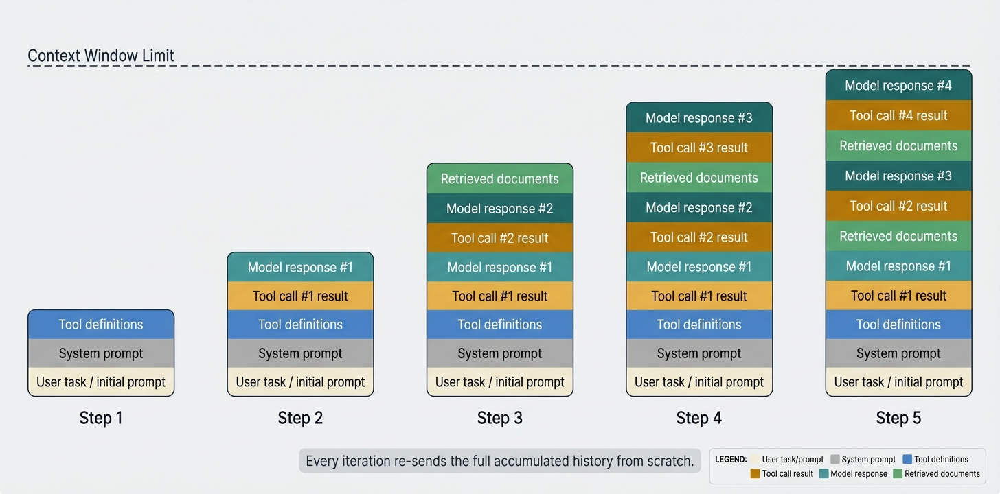
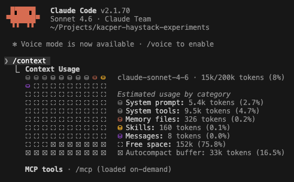

Every new generation of Large Language Models arrives with a bigger context window - and the temptation to use it fully. If the model can read a million tokens, why not feed it everything? In practice, more context doesn't reliably mean better answers: it often means higher costs, slower responses, and a model that loses track of what actually matters. **Context engineering** is the discipline of deciding not just *what* to put in the context window, but *how much*, *in what form*, and *when to leave things out* - and it's quickly becoming one of the most important skills in building reliable agentic systems.

## Why context is so important for agentic systems

An LLM has exactly two sources of information when generating a response:

- **Internal state ("knowledge")** - what was baked in during training. It is static, potentially stale, and opaque to the developer.
- **Context ("prompt")** - everything provided at inference time. That's the only thing we can actively control.

Training knowledge is fixed. We can't update it without retraining, and we can't know exactly what the model does or doesn't know. Context is the lever we actually have. Everything a model knows about the current task, the current user, the tools available to it, and the world right now has to come through the context window.

Today's leading models offer context windows that would have seemed impossibly large just a few years ago - millions of tokens, enough to fit entire codebases, legal contracts, or a stack of research papers in a single prompt. Yet in practice, agentic systems burn through these limits surprisingly fast. A system prompt, a set of tool definitions, all tool calls and results, a few retrieved documents, and a handful of conversation turns can easily consume tens of thousands of tokens before the agent has done anything meaningful. And even when the hard limit isn't reached, performance often degrades long before it is - the model starts losing track of earlier instructions, repeating itself, or missing relevant details buried under layers of accumulated context.



At step 1, the context holds little more than the user's task. By step N, it has grown to include every tool call, every result, every model response, and any retrieved documents - all concatenated and re-sent from scratch on every iteration.

The difference from one-shot prompting is stark. A single prompt is small, hand-crafted, and fully under control. An agentic system operates in a loop - reasoning, calling tools, receiving results, and repeating, potentially dozens of times. Because LLMs are stateless, every iteration re-sends the entire accumulated history from scratch. The context isn't a fixed input, but more of a growing log, and context engineering is about managing that growth.

### When less is more

Transformers work by letting every token attend to every other token in the context. This is what makes them so powerful at integrating information - but it also means the model's capacity is spread across all tokens simultaneously. Think of it as an **[attention budget](https://www.anthropic.com/engineering/effective-context-engineering-for-ai-agents)**: every new token you introduce depletes it by some amount, regardless of whether that token is useful or not.

The practical consequence is that irrelevant or redundant content doesn't just waste space - it actively competes with the information that actually matters. A critical instruction buried under pages of tool outputs may receive less attention than if it had been sent alone. [Research from Anthropic](https://www.anthropic.com/engineering/effective-context-engineering-for-ai-agents) confirms this: models remain capable at longer contexts but show reduced precision for information retrieval and long-range reasoning compared to shorter ones. A million-token context window is not a free pass to include everything - it's a budget, and every token you add is a trade-off.

### The cost dimension

Most hosted LLMs charge per input token, which means every byte of context has a price tag. A single call with a 50,000-token context costs roughly 50× more than one with 1,000 tokens - and in an agentic loop that runs dozens of iterations, that multiplier compounds with every step. Context management is therefore not just a quality concern but a cost concern: a bloated context window can turn a cheap pipeline into an expensive one without producing any better answers.

---

## What fills the context window in an agentic system

We've already touched on some of the components that fill an agent's context window - system prompts, tool definitions, retrieved documents. Let's map out the full picture, because the list is longer than many developers expect.

- **System prompt** - standing instructions, persona, constraints, output format. Usually fixed but can be large.
- **Conversation history** - the full back-and-forth between user and agent across the current session.
- **Memory** - retrieved facts from past sessions or external knowledge stores. See also: [Good Listener: How Memory Enables Conversational Agents](/blog/memory-conversational-agents/).
- **Retrieval output** - documents or chunks returned by a RAG pipeline. Each retrieved chunk adds tokens.
- **Tool definitions** - every tool the model *could* call must be described in the context (name, description, parameters schema). With MCP toolsets, this can easily balloon into hundreds of tool descriptions.
- **Tool call results** - the output of previously executed tools, so the model can reason over them.
- **Few-shot examples** - demonstration input/output pairs used to guide model behaviour.

> **The iceberg effect.** A user sees a single answer. Behind the scenes, the model may have received 50,000 tokens or more on that one turn - a system prompt (perhaps 10k tokens), tool definitions (5k), retrieved documents (20k), and accumulated conversation history (15k). The answer is the tip, while the context is everything below the surface.

### What the context actually looks like



The screenshot above shows Claude Code's `/context` command, which breaks down exactly where tokens are being spent: system prompt, tool definitions, conversation history, open files, etc. Knowing this makes it possible to identify which component is responsible for a bloated context and whether that cost is justified. With this visibility, optimisation is a bit easier.

---

## Building a Haystack agent

```python
from haystack.components.agents import Agent
from haystack_integrations.components.generators.anthropic import AnthropicChatGenerator
from haystack.dataclasses import ChatMessage
from haystack.tools import tool

@tool
def get_weather(city: str) -> str:
    """Get the current weather for a city."""
    return f"It's sunny and 22°C in {city}."

agent = Agent(
    chat_generator=AnthropicChatGenerator(),
    system_prompt="You are a helpful assistant.",
    tools=[get_weather],
)

result = agent.run(messages=[ChatMessage.from_user("What's the weather in Paris?")])
print(result["last_message"].text)
```

When you create an agent in Haystack, much of the context is assembled automatically. Tool descriptions are serialised and injected into the prompt under the hood - you define a tool once, and the framework ensures the model receives everything it needs to call it: the name, description, and parameter schema. The same applies to conversation history, which is maintained across turns without any manual concatenation. The context you see in your code is just the surface, but the model receives considerably more on every call.

---

## Strategies for managing context growth

Context explosion is not inevitable. Once you understand what's filling the window, you can start making choices about what actually needs to be there. There are several proven techniques for keeping context short without sacrificing quality.

### Delegation to subagents

Another way to keep context small is to never let it grow large in the first place. Instead of one agent accumulating the full history of a complex task, you can split the work across specialised subagents - each one receiving only the slice of context relevant to its job. The orchestrator maintains a thin, high-level context, while the worker agents get focused, task-specific contexts. The total token count across the system may be similar, but no single model call is burdened with everything at once. For a practical example of this pattern in Haystack, see [Building a Swarm of Agents](/blog/swarm-of-agents/).

```python
from haystack.components.agents import Agent
from haystack_integrations.components.generators.anthropic import AnthropicChatGenerator
from haystack.dataclasses import ChatMessage
from haystack.tools import tool

@tool
def search_web(query: str) -> str:
    """Search the web for up-to-date information on a topic."""
    return f"Search results for '{query}': ..."

# Worker agent: only receives context relevant to its task
researcher = Agent(
    chat_generator=AnthropicChatGenerator(),
    system_prompt="You are a research assistant. Answer questions concisely.",
    tools=[search_web],
)

from haystack.tools import ComponentTool

delegate_research = ComponentTool(
    component=researcher,
    name="delegate_research",
    description="Delegate a research question to a specialised agent.",
    outputs_to_string={"source": "last_message"},
)

# Orchestrator: only sees compact summaries from worker agents
orchestrator = Agent(
    chat_generator=AnthropicChatGenerator(),
    system_prompt="Break down tasks and delegate them to specialised agents.",
    tools=[delegate_research],
)

result = orchestrator.run(messages=[ChatMessage.from_user("Compare quantum and classical computing.")])
print(result["last_message"].text)
```

### Improving retrieval quality

In RAG pipelines, retrieval quality directly determines how many tokens land in the context. Poor retrieval returns irrelevant chunks that add noise without adding value - each one consuming part of the attention budget. Better precision means fewer chunks are needed, which means a smaller, cleaner context.

A related problem is redundancy: when retrieved passages are near-duplicates, the model sees the same information repeated multiple times without gaining anything new. This is why **diversity** matters as much as relevance - a set of chunks that each cover a different facet of the question is far more efficient than a set of very similar top matches. Techniques like [hybrid retrieval](/blog/hybrid-retrieval/), [HyDE](/blog/optimizing-retrieval-with-hyde/), [query decomposition](/blog/query-decomposition/), and [auto-merging retrieval](/blog/improve-retrieval-with-auto-merging/) all help surface results that are both more relevant and more varied.

```python
from haystack import Pipeline
from haystack.components.embedders import SentenceTransformersTextEmbedder
from haystack.components.rankers import TransformersSimilarityRanker
from haystack.components.retrievers import InMemoryEmbeddingRetriever
from haystack.document_stores.in_memory import InMemoryDocumentStore

document_store = InMemoryDocumentStore()

rag = Pipeline()
rag.add_component("embedder", SentenceTransformersTextEmbedder())
# Retrieve 10 candidates, then rerank to the 3 most relevant
rag.add_component("retriever", InMemoryEmbeddingRetriever(document_store, top_k=10))
rag.add_component("ranker", TransformersSimilarityRanker(top_k=3))

rag.connect("embedder.embedding", "retriever.query_embedding")
rag.connect("retriever.documents", "ranker.documents")

result = rag.run({
    "embedder": {"text": "climate change"},
    "ranker": {"query": "climate change"},
})
# result["ranker"]["documents"] now contains at most 3 highly relevant chunks
```

### Summarisation and compaction

As a conversation grows, the raw message history becomes the biggest consumer of context. Compaction addresses this by periodically replacing the accumulated history with a condensed summary - retaining the essential facts and decisions while discarding the verbatim back-and-forth. The agent continues with a much shorter context, and the summary is updated with each new turn.

This pattern is well-established in practice. Popular coding agents' context compaction feature works exactly this way: when the context approaches its limit, it summarises the conversation so far and continues from the summary rather than truncating or failing.

```python
from haystack.components.agents import Agent
from haystack.components.builders import ChatPromptBuilder
from haystack_integrations.components.generators.anthropic import AnthropicChatGenerator
from haystack.dataclasses import ChatMessage
from haystack.tools import tool

@tool
def get_current_date() -> str:
    """Return today's date."""
    from datetime import date
    return date.today().isoformat()

compactor = ChatPromptBuilder(template=[
    ChatMessage.from_user(
        "Summarise the key facts from the conversation below in 3-5 bullet points.\n\n{{ history }}"
    )
])
summariser = AnthropicChatGenerator()

def compact_history(messages: list[ChatMessage]) -> list[ChatMessage]:
    history_text = "\n".join(f"{m.role}: {m.text}" for m in messages if m.text)
    prompt = compactor.run(template_variables={"history": history_text})["prompt"]
    summary = summariser.run(messages=prompt)["replies"][0].text
    return [ChatMessage.from_system(f"Conversation so far (summary):\n{summary}")]

agent = Agent(
    chat_generator=AnthropicChatGenerator(),
    system_prompt="You are a helpful assistant.",
    tools=[get_current_date],
)

# Simulate a growing conversation history
messages = [ChatMessage.from_user("What day is it today?")]
result = agent.run(messages=messages)
messages = result["messages"]

# Compact the history when it grows too long
if len(messages) > 3:
    messages = compact_history(messages)

# Continue the conversation with a compacted history
result = agent.run(messages=messages + [ChatMessage.from_user("What month are we in?")])
print(result["last_message"].text)
```

### Adding only relevant tools to the context

Tool definitions can be a surprisingly large slice of the context window, especially when connecting to MCP servers that expose dozens or hundreds of tools. Listing every tool upfront means the model receives all those descriptions on every single call, regardless of which tool is actually needed.

[`SearchableToolset`](https://docs.haystack.deepset.ai/docs/searchabletoolset), introduced in Haystack 2.25, inverts this approach. Instead of exposing the full catalog, the agent starts with a single `search_tools` function and uses it to dynamically discover relevant tools via BM25 keyword search. Only the tools it actually needs are loaded into the context for that turn.

```python
from haystack.components.agents import Agent
from haystack_integrations.components.generators.anthropic import AnthropicChatGenerator
from haystack.dataclasses import ChatMessage
from haystack.tools import Tool, SearchableToolset

# Create a catalog of tools
catalog = [
    Tool(name="get_weather", description="Get weather for a city", ...),
    Tool(name="search_web", description="Search the web", ...),
    # ... 100s more tools
]
toolset = SearchableToolset(catalog=catalog)

agent = Agent(chat_generator=AnthropicChatGenerator(), tools=toolset)

# The agent is initially provided only with the search_tools tool
# and will use it to find relevant tools on demand.
result = agent.run(messages=[ChatMessage.from_user("What's the weather in Milan?")])
```

### Offloading notes (scratchpad / working memory)

An agent's intermediate reasoning - the chain of thoughts it builds up while working through a multi-step task - does not have to live inside the context window. A simple alternative is to give the agent two dedicated tools: one to write a note to an external store, and one to read notes back. Instead of accumulating its internal monologue in the prompt, the agent can offload conclusions, partial results, and reminders to storage and retrieve only what it needs at each step.

This keeps the context lean: rather than carrying the full trace of every intermediate thought, the agent holds a minimal working state and queries its own notes on demand. The pattern is especially useful for long-horizon tasks where the reasoning chain would otherwise grow without bound, and it has the side effect of making the agent's thinking inspectable and debuggable from outside the model.

---

## What's coming next in this series

This article is the foundation of a series on context engineering. Future posts will go deeper on specific topics - measuring whether your context actually helps the model, keeping context manageable in long-running agent loops, diversifying retrieval results, tracking token usage across pipelines, and more. If there is a particular area you would like us to cover first, let us know.

To stay up to date with the series and everything else happening in Haystack, star the [Haystack GitHub repository](https://github.com/deepset-ai/haystack) and join the conversation on [Discord](https://discord.gg/Dr63fr9NDS).
