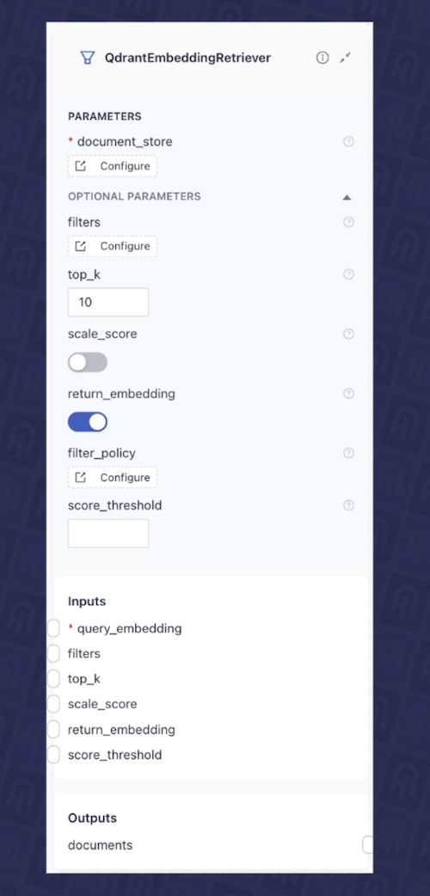
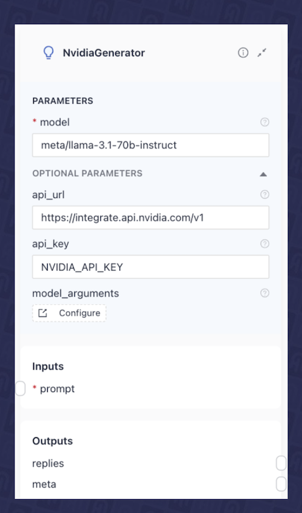

---
layout: blog-post
title: 'Design Haystack AI Applications Visually with deepset Studio & NVIDIA NIMs'
featured_image: thumbnail.png
images: ["blog/deepset-studio-and-nvidia-nims/thumbnail.png"]
toc: True
date: 2024-10-31
last_updated:  2024-10-31
authors:
  - Tuana Celik
  - Anshul Jindal
  - Meriem Bendris
tags: ["Integrations", "RAG"]
---	

In our [previous article](https://haystack.deepset.ai/blog/haystack-nvidia-nim-rag-guide), we explored how to build and deploy two key AI pipelines in a Retrieval Augmented Generation (RAG) application using Haystack and NVIDIA NIMs:

-   Indexing pipeline: Prepares data by preprocessing, chunking, and embedding PDF files, finally storing them in a vector database.  
-   Retrieval Augmented Generation (RAG) pipeline: Designed to answer questions based on the contents of the uploaded PDF files.
    

In this article, we’ll take a step further by showing you how to visually design the architecture of these AI pipelines using [deepset Studio](https://haystack.deepset.ai/blog/announcing-studio), a newly released visual AI pipeline editor. With this tool, you can map out the entire structure of your AI workflows, from data ingestion to retrieval, while seamlessly integrating NVIDIA hosted ([NVIDIA API Catalog](https://build.nvidia.com/explore/retrieval)) or self-hosted Generative AI models powered by NVIDIA NIMs.

By visually building these pipelines, you’ll not only see the logical flow of your AI applications but also iterate quickly on the design before committing to code. Once finalized, deepset Studio allows you to export your pipeline as Python code or YAML definitions, ready to be deployed.

By the end of this article, you’ll know how to build AI pipelines with [deepset Studio](https://haystack.deepset.ai/blog/announcing-studio) while leveraging a retrieval embedding and LLM NIMs from the [NVIDIA API Catalog](https://build.nvidia.com/explore/retrieval). We’ll also guide you through the process of self-hosting NIMs and demonstrate how to configure them for use in [deepset Studio](https://haystack.deepset.ai/blog/announcing-studio), should you opt for a self-hosted deployment.

## deepset Studio: A Visual AI Pipeline Editor

Most AI applications are composed of many moving parts that work together to serve a final use case. Whether that be Retrieval Augmented Generation (RAG), preparing and embedding documents, chatting with a database or something else, we are involving different models, prompts, decision steps, preprocessors and more. Furthermore, committing to the final design can also often involve multiple stakeholders.

A visual layer representing the logical flow of the application helps us reason about the application within a simple interface that’s easy to decipher. It also helps with quick iterations with a diverse set of stakeholders.

Now we will see how we can visually create these pipelines using deepset Studio (for which you can [join the waitlist here](https://landing.deepset.ai/deepset-studio-waitlist)), the new visual pipeline editor that allows you to design, build, and export these pipelines within a drag-and-drop UI. For each step that requires a Generative AI model, such as an embedding model or LLM generator, we will use NVIDIA-hosted models on the API Catalog. Finally, we will show how to self-host Generative AI models with NVIDIA NIMs.

## NVIDIA Inference Microservices - NIMs


[NVIDIA Inference Microservices (NIMs)](https://www.nvidia.com/en-us/ai/) is a suite of containerized microservices built to optimize the inference of cutting-edge AI models. These containers incorporate various components to efficiently serve AI models and expose them through standard APIs. The models are optimized using either TensorRT or TensorRT-LLM (depending on the model type), utilizing techniques such as quantization, model partitioning, optimized kernels/runtimes, and dynamic or continuous batching. This allows for further performance tuning to maximize efficiency.

NIMs offer a simplified integration, production-ready optimised Generative AI deployment allowing developers to focus on building their applications. NIMs support several Generative AI models as optimised containers, each including optimised models, the necessary runtime components and industry-standard APIs.

NVIDIA provides [LLM NIMs](https://build.nvidia.com/explore/reasoning) dedicated to most popular LLM models as well as [retrieval-specific NIMs](https://build.nvidia.com/explore/retrieval) such as text embedding and reranking AI models. Developers can easily get started with NVIDIA NIMs through the NVIDIA-hosted [API Catalog](https://build.nvidia.com/explore/discover) by generating a free API key, or by self-hosting the NIMs in their own environment by pulling NIM containers, available through the [NVIDIA Developer Program](https://developer.nvidia.com/developer-program) for research and testing purposes.

## Building a RAG Application with deepset Studio

An often overlooked but essential step in building an effective RAG application is [data preparation and context embedding](https://www.deepset.ai/blog/preprocessing-rag) - a process that can be quite time-consuming. Before diving into decisions about which LLM to use or how we augment a prompt, it's critical to first focus on embedding and storing your documents (especially if you're not relying on external APIs for data retrieval).

Most RAG applications revolve around two core pipelines: Indexing and RAG. Fig. 1 shows a high-level overview of the two pipelines using haystack and NVIDIA NIMs. We will be using [Qdrant](https://qdrant.tech/) as the vector database in this article but can be replaced with any other.


In the following sections, we’ll break down each pipeline in detail and guide you through building them using [deepset Studio](https://haystack.deepset.ai/blog/announcing-studio).

### Indexing Pipeline

The indexing pipeline is responsible for preparing the data that creates the context for a LLM’s response. This pipeline may include components for data cleaning, chunking, embedding, and ultimately storing the processed data i.e. embeddings in a vector database to create a searchable context.

The NVIDIA NeMo Retriever provides fundamental building blocks for semantic search applications (like RAG), delivering accurate and optimised document indexing and search at scale. You can use [NeMo Retriever Text Embedding NIM](https://docs.nvidia.com/nim/nemo-retriever/text-embedding/latest/overview.html) for vectorizing documents and further refine the search with [NeMo Retriever Text Reranking NIM](https://docs.nvidia.com/nim/nemo-retriever/text-reranking/latest/overview.html).

This pipeline involves indexing a PDF file into a vector database (here [Qdrant](https://qdrant.tech/) database), which includes preprocessing, cleaning, splitting, and embedding the data. Haystack offers a variety of components to build this type of pipeline. In this example, we’ll be using the following components:
 
-   `PyPDFtoDocument`: A PDF converter that transforms a PDF file into Document dataclass which Haystack can use within the pipeline.
-   `DocumentCleaner`: A preprocessing document cleaner component that removes unnecessary elements such as empty lines, headers, and footers, ensuring cleaner data.    
-   `DocumentSplitter`: This component breaks down large documents into smaller, manageable chunks for embedding and storage. You can customize the split by word, sentence, or passage, and define the length of each chunk and the overlap between them. This helps navigate challenges like LLM context limits and ensures that during the retrieval phase, only the most relevant segments are fetched for processing.
-   `NvidiaDocumentEmbedder`: This component enables document embedding using an [NeMo Retriever Text Embedding NIM](https://docs.nvidia.com/nim/nemo-retriever/text-embedding/latest/overview.html), which can either be hosted via the [NVIDIA API Catalog](https://build.nvidia.com/explore/retrieval) or self-hosted within your own infrastructure. In this article, we'll be using the [nvidia/nv-embedqa-e5-v5](https://build.nvidia.com/nvidia/nv-embedqa-e5-v5)  NIM for document embedding.

We can configure each of these components individually and connect them together in the deepset Studio to build the indexing pipeline. Fig. 2 shows the final visual design of the built indexing pipeline in the deepset Studio.


### RAG Pipeline

After you’ve completed the data preparation steps, you can move on to implementing the retrieval augmentation step. It’s crucial to identify which embedding NIM was used to generate the document embeddings, as we typically need the same model for retrieval.
  
In most use cases, RAG pipelines consist of three to four components. In this article, we’ll be using the following components for building the RAG pipeline:

-   Text Embedder: This component embeds incoming user queries using the same embedding model employed during the data indexing pipeline.  For this, we’ll use the [`NvidiaTextEmbedder`](https://docs.haystack.deepset.ai/docs/nvidiatextembedder), which we configured to leverage a NVIDIA-hosted [NVIDIA NeMo Retriever Text Embedding NIM](https://docs.nvidia.com/nim/nemo-retriever/text-embedding/latest/overview.html) from the NVIDIA API Catalog ([nvidia/nv-embedqa-e5-v5](https://build.nvidia.com/nvidia/nv-embedqa-e5-v5)). To set this up, you will need to provide the model's [api_url](https://build.nvidia.com/snowflake/arctic-embed-l?snippet_tab=Python) and [NVIDIA_API_KEY](https://org.ngc.nvidia.com/setup/personal-keys) as shown in Fig. 3.


-   Retriever: In this case, we will use the [`QdrantEmbeddingRetriever`](https://docs.haystack.deepset.ai/docs/qdrantembeddingretriever), which takes the query embedding from the previous component and retrieves the most relevant documents from the Qdrant database. Fig. 4 shows the configuration of this component in the deepset Studio.



-   Prompt Construction Component: This component is responsible for creating the instruction (prompt) that will be sent to a large language model (LLM), representing the 'augmentation' step. In Haystack, this is handled by the [`PromptBuilder`](https://docs.haystack.deepset.ai/docs/promptbuilder). It allows you to create a prompt template using [Jinja](https://jinja.palletsprojects.com/en) and dynamically detects inputs based on the template's contents. For our use case, we have developed a prompt template shown in Fig. 5 using PromptBuilder in the deepset Studio, which expects query and documents as input.


-   LLM Component: Finally, we will add a LLM component that receives our final augmented prompt and generates a response. In this example, we will use the [llama-3_1-70b-instruct](https://build.nvidia.com/meta/llama-3_1-70b-instruct) NIM from the [NVIDIA API Catalog](https://build.nvidia.com/nim). In this case, we use the [`NvidiaGenerator`](https://docs.haystack.deepset.ai/docs/nvidiagenerator) from Haystack and configure it to use the meta/llama-3.1-70b-instruct model. Fig. 6 shows the configuration of this component in the deepset Studio.
    


As you can see, each of these individual components expects certain inputs, and produces various outputs. You can learn more about the pipeline architecture and how components are connected [here](https://docs.haystack.deepset.ai/docs/creating-pipelines). We can now connect them in deepset Studio to create the final RAG pipeline as shown in Fig. 7.


### Use Self-hosted NIMs for the Pipelines

The indexing and RAG Haystack pipelines described above use NIMs from the NVIDIA API Catalog. However, you can also self-host and deploy the NIMs in your own environment. In this case, you can simply substitute the NIMs from the API Catalog with self-hosted NIMs. Next, we will see how to do that.

To begin, you'll need to deploy the NIMs in your environment. This deployment can be done using either Docker or Kubernetes. In our [previous article](https://haystack.deepset.ai/blog/haystack-nvidia-nim-rag-guide), we explained in detail the deployment of NIMs on Kubernetes clusters. However, for quicker prototyping, we’ll outline here the steps to deploy the NIMs using Docker.

The following command will deploy the meta/llama-3.1-70b-instruct LLM NIM on a server equipped with a supported GPU. You can refer to the [support matrix](https://docs.nvidia.com/nim/large-language-models/latest/support-matrix.html) for compatibility with different GPU models.

  
```
export NGC_API_KEY=<PASTE_API_KEY_HERE>
export LOCAL_NIM_CACHE=~/.cache/nim
mkdir -p "$LOCAL_NIM_CACHE"
docker run -it --rm \
--gpus all \
--shm-size=16GB \
-e NGC_API_KEY \
-v "$LOCAL_NIM_CACHE:/opt/nim/.cache" \
-u $(id -u) \
-p 8000:8000 \
nvcr.io/nim/meta/llama-3.1-70b-instruct:1.1.2
```

This command will pull the NIM container, which first checks the underlying GPU. Based on this detection, it will download the [optimized model](https://docs.nvidia.com/nim/large-language-models/latest/profiles.html) from the [NGC hub](https://catalog.ngc.nvidia.com/) that is suitable for the identified GPU infrastructure.

You can follow the same deployment procedure for the embedding models with the [NVIDIA NeMo Retriever Text Embedding NIM](https://docs.nvidia.com/nim/nemo-retriever/text-embedding/latest/overview.html), with instructions available [here](https://docs.nvidia.com/nim/nemo-retriever/text-embedding/latest/getting-started.html#launching-the-nim). 

Once the NIMs are deployed, whether through Docker or Kubernetes, simply update the api_url in each of the embedding and LLM components in the pipelines to point to your self-hosted NIM URL (example: [http://your_server_ip_address:8000/v1/](http://your_server_ip_address:8000/v1/)), as illustrated in Fig. 8 for the [NvidiaGenerator](https://docs.haystack.deepset.ai/docs/nvidiagenerator) i.e. LLM component.


### Export Pipelines and Deploy RAG Application

After building the final layout of our application in deepset Studio, we can export the pipelines in one of the two formats for deployment by clicking the export button:

-   YAML: In our [previous article](https://haystack.deepset.ai/blog/haystack-nvidia-nim-rag-guide#indexing-files-and-deploying-the-haystack-rag-pipeline), we created similar indexing and RAG pipelines, demonstrating how to serialize them to YAML and use [Hayhooks](https://docs.haystack.deepset.ai/docs/hayhooks) for deployment. You may choose this option if you want to follow the same approach.   
-   Python: Alternatively, you can export the pipeline as a standard Python script for local execution.
    
Fig. 9 shows an example of exporting the RAG pipeline in the deepset Studio in Python format.


Following Python code snippet shows the exported code of the RAG pipeline from the deepset Studio.

```python
from  haystack  import  Pipeline
from  haystack_integrations.components.embedders.nvidia.text_embedder  import  NvidiaTextEmbedder
from  haystack_integrations.document_stores.qdrant.document_store  import  QdrantDocumentStore
from  haystack_integrations.components.retrievers.qdrant.retriever  import  QdrantEmbeddingRetriever
from  haystack.components.builders.prompt_builder  import  PromptBuilder
from  haystack_integrations.components.generators.nvidia.generator  import  NvidiaGenerator

  

nvidiatextembedder  =  NvidiaTextEmbedder(model="snowflake/arctic-embed-l",  api_url="https://ai.api.nvidia.com/v1/retrieval/snowflake/arctic-embed-l")
document_store  =  QdrantDocumentStore(embedding_dim=1024,  host="qdrant")
qdrantembeddingretriever  =  QdrantEmbeddingRetriever(top_k=10,  return_embedding=True,  document_store=document_store)
promptbuilder  =  PromptBuilder(template="Answer the question given the context.\nQuestion: {{ query }}\nContext:\n\n {{ document.content }}\n\nAnswer:")
nvidiagenerator  =  NvidiaGenerator(model="meta/llama-3.1-70b-instruct",  api_url="https://integrate.api.nvidia.com/v1",  model_arguments={"max_tokens":  1024})

pipeline  =  Pipeline()
pipeline.add_component("nvidiatextembedder",  nvidiatextembedder)
pipeline.add_component("qdrantembeddingretriever",  qdrantembeddingretriever)
pipeline.add_component("promptbuilder",  promptbuilder)
pipeline.add_component("nvidiagenerator",  nvidiagenerator)

pipeline.connect("nvidiatextembedder.embedding",  "qdrantembeddingretriever.query_embedding")
pipeline.connect("qdrantembeddingretriever.documents",  "promptbuilder.documents")
pipeline.connect("promptbuilder.prompt",  "nvidiagenerator.prompt")
```

Now that we have our runnable pipeline, we can choose one of the following options to deploy the RAG application:

1.  Use [Hayhooks](https://docs.haystack.deepset.ai/docs/hayhooks) to self-host the pipeline in a containerized environment. Deployment instructions via docker can be found in our [previous article](https://haystack.deepset.ai/blog/haystack-nvidia-nim-rag-guide#indexing-files-and-deploying-the-haystack-rag-pipeline). Or if you want to deploy it via Kubernetes, instructions can be found [here](https://docs.haystack.deepset.ai/docs/kubernetes). 
2.  Coming soon: Deploy from deepset Studio (limitations apply). [Sign up to the waitlist to learn more when we launch](https://landing.deepset.ai/deepset-studio-waitlist). 
3.  If you’re a deepset Cloud customer: Deploy directly from deepset Studio to [deepset Cloud](https://www.deepset.ai/deepset-cloud), a fully managed AI workbench. This option enables you to collaborate with your team on the application design, evaluate your application, and manage its deployment effectively.
  
## Summary

Designing the final layout of an AI application requires careful integration of multiple components and, importantly, several iterations. In this article, we saw how to visually design the architecture of AI pipelines using deepset Studio. This tool allows you to map out the entire structure of your AI workflows - from data ingestion to retrieval - while seamlessly integrating models from the NVIDIA API Catalog or self-hosted NIMs. With deepset Studio, you can visualize the architecture of your application without making compromises about critical technical decisions, including your hosting options for language models. This tool allows you to reason about complex pipeline architectures within a visual layer, before committing to code. Once your design is complete, deepset Studio enables you to export the pipeline as Python code or YAML definitions, making it ready for deployment.