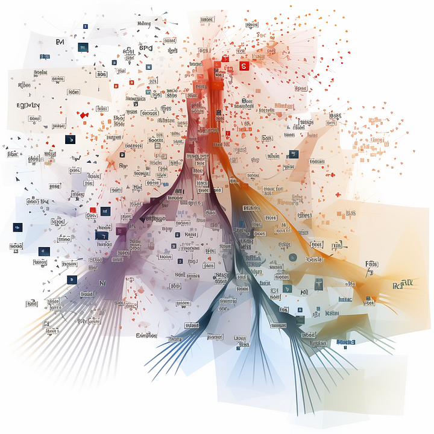
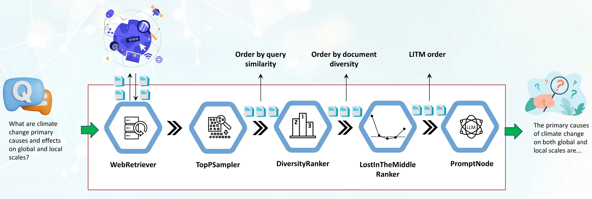

The recent improvements in Natural Language Processing (NLP) and Long-Form Question Answering (LFQA) would have, just a few years ago, sounded like something from the domain of science fiction. Who could have thought that nowadays we would have systems that can answer complex questions with the precision of an expert, all while synthesizing these answers on the fly from a vast pool of sources? LFQA is a type of Retrieval-Augmented Generation (RAG) which has recently made significant strides, utilizing the best retrieval and generation capabilities of Large Language Models (LLMs).

But what if we could refine this setup even further? What if we could optimize how RAG selects and utilizes information to enhance its performance? This article introduces two innovative components aiming to improve RAG with concrete examples drawn from LFQA, based on the latest research and our experience — the DiversityRanker and the LostInTheMiddleRanker.

Consider the LLM’s context window as a gourmet meal, where each paragraph is a unique, flavorful ingredient. Just as a culinary masterpiece requires diverse, high-quality ingredients, LFQA question-answering demands a context window filled with high-quality, varied, relevant, and non-repetitive paragraphs.

In the intricate world of LFQA and RAG, making the most of the LLM’s context window is paramount. Any wasted space or repetitive content limits the depth and breadth of the answers we can extract and generate. It’s a delicate balancing act to lay out the content of the context window appropriately. This article presents new approaches to mastering this balancing act, which will enhance RAG’s capacity for delivering precise, comprehensive responses.

Let’s explore these exciting advancements and how they improve LFQA and RAG.

## Background

Haystack is an open-source framework providing end-to-end solutions for practical NLP builders. It supports a wide range of use cases, from question-answering and semantic document search all the way to LLM agents. Its modular design allows the integration of state-of-the-art NLP models, document stores, and various other components required in today’s NLP toolbox.

One of the key concepts in Haystack is the idea of a pipeline. A pipeline represents a sequence of processing steps that a specific component executes. These components can perform various types of text processing, allowing users to easily create powerful and customizable systems by defining how data flows through the pipeline and the order of nodes that perform their processing steps.

The pipeline plays a crucial role in web-based long-form question answering. It starts with a WebRetriever component, which searches and retrieves query-relevant documents from the web, automatically stripping HTML content into raw text. But once we fetch query-relevant documents, how do we make the most of them? How do we fill the LLM’s context window to maximize the quality of the answers? And what if these documents, although highly relevant, are repetitive and numerous, sometimes overflowing the LLM context window?

This is where the components we’ll introduce today come into play — the DiversityRanker and the LostInTheMiddleRanker. Their aim is to address these challenges and improve the answers generated by the LFQA/RAG pipelines.

The DiversityRanker enhances the diversity of the paragraphs selected for the context window. LostInTheMiddleRanker, usually positioned after DiversityRanker in the pipeline, helps to mitigate the LLM performance degradation observed when models must access relevant information in the middle of a long context window. The following sections will delve deeper into these two components and demonstrate their effectiveness in a practical use case.

## DiversityRanker

The DiversityRanker is a novel component designed to enhance the diversity of the paragraphs selected for the context window in the RAG pipeline. It operates on the principle that a diverse set of documents can increase the LLM’s ability to generate answers with more breadth and depth.

The DiversityRanker uses sentence transformers to calculate the similarity between documents. The sentence transformers library offers powerful embedding models for creating meaningful representations of sentences, paragraphs, and even whole documents. These representations, or embeddings, capture the semantic content of the text, allowing us to measure how similar two pieces of text are.

DiversityRanker processes the documents using the following algorithm:

1. It starts by calculating the embeddings for each document and the query using a sentence-transformer model.

2. It then selects the document semantically closest to the query as the first selected document.

3. For each remaining document, it calculates the average similarity to the already selected documents.

4. It then selects the document that is, on average, least similar to the already selected documents.

5. This selection process continues until all documents are selected, resulting in a list of documents ordered from the document contributing the most to the overall diversity to the document that contributes the least.

A technical note to keep in mind: the DiversityRanker uses a greedy local approach to select the next document in order, which might not find the most optimal overall order for the documents. DiversityRanker focuses on diversity more than relevance, so it should be placed in the pipeline after another component like TopPSampler or another similarity ranker that focuses more on relevance. By using it after a component that selects the most relevant documents, we ensure that we select diverse documents from a pool of already relevant documents.

## LostInTheMiddleRanker

The LostInTheMiddleRanker optimizes the layout of the selected documents in the LLM’s context window. This component is a way to work around a problem identified in recent research [1] that suggests LLMs struggle to focus on relevant passages in the middle of a long context. The LostInTheMiddleRanker alternates placing the best documents at the beginning and end of the context window, making it easy for the LLM’s attention mechanism to access and use them. To understand how LostInTheMiddleRanker orders the given documents, imagine a simple example where documents consist of a single digit from 1 to 10 in ascending order. LostInTheMiddleRanker will order these ten documents in the following order: [1 3 5 7 9 10 8 6 4 2].

Although the authors of this research focused on a question-answering task — extracting the relevant spans of the answer from the text — we are speculating that the LLM’s attention mechanism will also have an easier time focusing on the paragraphs in the beginning and the end of the context window when generating answers.

[1]")

LostInTheMiddleRanker is best positioned as the last ranker in the RAG pipeline as the given documents are already selected based on similarity (relevance) and ordered by diversity.

## Using the new rankers in pipelines

In this section, we’ll look into the practical use case of the LFQA/RAG pipeline, focusing on how to integrate the DiversityRanker and LostInTheMiddleRanker. We’ll also discuss how these components interact with each other and the other components in the pipeline.

The first component in the pipeline is a WebRetriever which retrieves query relevant documents from the web using a programmatic search engine API (SerperDev, Google, Bing etc). The retrieved documents are first stripped of HTML tags, converted to raw text, and optionally preprocessed into shorter paragraphs. They are then, in turn passed to a TopPSampler component, which selects the most relevant paragraphs based on their similarity to the query.

After TopPSampler selects the set of relevant paragraphs, they are passed to the DiversityRanker. DiversityRanker, in turn, orders the paragraphs based on their diversity, reducing the repetitiveness of the TopPSampler-ordered documents.

The selected documents are then passed to the LostInTheMiddleRanker. As we previously mentioned, LostInTheMiddleRanker places the most relevant paragraphs at the beginning and the end of the context window, while pushing the worst-ranked documents to the middle.

Finally, the merged paragraphs are passed to a PromptNode, which conditions an LLM to answer the question based on these selected paragraphs.

The new rankers are already merged into Haystack’s main branch and will be available in the upcoming 1.20 release slated for the end of August 2023. We included a new LFQA/RAG pipeline demo in the project’s examples folder.

The demo shows how DiversityRanker and LostInTheMiddleRanker can be easily integrated into a RAG pipeline to improve the quality of the generated answers.

## Case study

To demonstrate the effectiveness of the LFQA/RAG pipelines that include the two new rankers, we’ll use a small sample of half a dozen questions requiring detailed answers. The questions include: “What are the main reasons for long-standing animosities between Russia and Poland?”, “What are the primary causes of climate change on both global and local scales?”, and more. To answer these questions well, LLMs require a wide range of historical, political, scientific, and cultural sources, making them ideal for our use case.

Comparing the generated answers of the RAG pipeline with two new rankers (optimized pipeline) and a pipeline without them (non-optimized) would require complex evaluation involving human expert judgment. To simplify evaluation and to evaluate the effect of the DiversityRanker primarily, we calculated the average pairwise cosine distance of the context documents injected into the LLM context instead. We limited the context window size in both pipelines to 1024 words. By running these sample Python scripts [2], we have found that the optimized pipeline has an average 20–30% increase in pairwise cosine distance [3] for the documents injected into the LLM context. This increase in the pairwise cosine distance essentially means that the documents used are more diverse (and less repetitive), thus giving the LLM a wider and richer range of paragraphs to draw upon for its answers. We’ll leave the evaluation of LostInTheMiddleRanker and its effect on generated answers for one of our upcoming articles.

## Conclusion

We’ve explored how Haystack users can enhance their RAG pipelines by using two innovative rankers: DiversityRanker and LostInTheMiddleRanker.

DiversityRanker ensures that the LLM’s context window is filled with diverse, non-repetitive documents, providing a broader range of paragraphs for the LLM to synthesize the answer from. At the same time, the LostInTheMiddleRanker optimizes the placement of the most relevant paragraphs in the context window, making it easier for the model to access and utilize the best-supporting documents.

Our small case study confirmed the effectiveness of the DiversityRanker by calculating the average pairwise cosine distance of the documents injected into the LLM’s context window in the optimized RAG pipeline (with two new rankers) and the non-optimized pipeline (no rankers used). The results showed that an optimized RAG pipeline increased the average pairwise cosine distance by approximately 20–30%.

We have demonstrated how these new rankers can potentially enhance Long-Form Question-Answering and other RAG pipelines. By continuing to invest in and expand on these and similar ideas, we can further improve the capabilities of Haystack’s RAG pipelines, bringing us closer to crafting NLP solutions that seem more like magic than reality.

### References

[1] “Lost in the Middle: How Language Models Use Long Contexts” at https://arxiv.org/abs/2307.03172

[2] Script: https://gist.github.com/vblagoje/430def6cda347c0b65f5f244bc0f2ede

[3] Script output (answers): https://gist.github.com/vblagoje/738253f87b7590b1c014e3d598c8300b