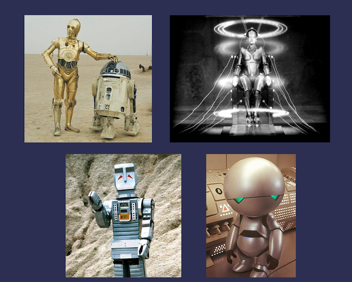

---
layout: blog-post
title: Gemini Models with Google Vertex AI Integration for Haystack 
description: Multi-Modal components and function calling with the new Gemini integrations for Haystack
featured_image: thumbnail.jpg
images: ["blog/gemini-models-with-google-vertex-for-haystack/thumbnail.jpg"]
featured_image_caption: An image of a robot looking at pictures of other robots (generated with DALL-E)
toc: True
date: 2023-12-18
last_updated:  2023-12-18
authors:
  - Tuana Celik
  - Tilde Thurium
  - Silvano Cerza
tags: ["RAG", "Haystack 2.0", "LLM"]
cookbook: vertexai-gemini-examples.ipynb
---	


In this article, we will introduce you to the new Google Vertex AI Integration for Haystack 2.0-Beta. While this integration introduces several new components to the Haystack eco-system (feel free to explore the full integration repo!), we’d like to start by showcasing two components in particular: the [`VertexAIGeminiGenerator`](https://docs.haystack.deepset.ai/v2.0/docs/vertexaigeminigenerator) and the [`VertexAIGeminiChatGenerator`](https://docs.haystack.deepset.ai/v2.0/docs/vertexaigeminichatgenerator), using the `gemini-pro` and `gemini-1.5-flash` models.

> 💚 _You can run the example code showcased in this article in the accompanying_ _[Colab Notebook](https://colab.research.google.com/github/deepset-ai/haystack-cookbook/blob/main/notebooks/vertexai-gemini-examples.ipynb)_

> **PSA:** This integration, its documentation pages and resources are going through some final refinements. So more resources will follow!

The great news is, to authenticate for access to the Gemini models, you will only need to do a Google authentication in the Colab (instructions in the Colab)

## VertexAIGeminiGenerator for Question Answering on Images

The new `VertexAIGeminiGenerator` component allows you to query Gemini models such as `gemini-pro` and `gemini-1.5-flash`. In this example, let’s use the latter, allowing us to also make use of images in our queries.

To get started, you will need to install Haystack and the `google-vertex-haystack` the integration:

```bash
!pip install haystack-ai google-vertex-haystack

```

Just like any other [generator component in Haystack 2.0-Beta](https://docs.haystack.deepset.ai/v2.0/docs/generators), to run the `GeminiGenerator` on its own, we simply have to call the `run()` method. However, unlike our other components, the run method here expects `parts` as input. A `Part` in the Google Vertex AI API can be anything from a message, to images, or even function calls. Here are the docstrings from the source code for the most up-to-date reference we could find [here.](https://github.com/googleapis/python-aiplatform/blob/5f6ad8df5a08e78a121a72a21e21d95abb072e58/vertexai/generative_models/_generative_models.py#L1427-L1446) Let’s run this component with a simple query 👇

```python
from haystack_integrations.components.generators.google_vertex import VertexAIGeminiGenerator

gemini = VertexAIGeminiGenerator(model="gemini-1.5-flash", project_id='YOUR-GCP-PROJECT-ID')
gemini.run(parts = ["What is the most interesting thing you know?"])

```

### Querying with Images

Next, let’s make use of the flexibility of `parts` and pass in some images alongside a question too. In the example below, we are providing 4 images containing robots, and asking `gemini-1.5-flash` what it can tell us about them.



```python
import requests
from haystack.dataclasses.byte_stream import ByteStream

URLS = [
    "https://raw.githubusercontent.com/silvanocerza/robots/main/robot1.jpg",
    "https://raw.githubusercontent.com/silvanocerza/robots/main/robot2.jpg",
    "https://raw.githubusercontent.com/silvanocerza/robots/main/robot3.jpg",
    "https://raw.githubusercontent.com/silvanocerza/robots/main/robot4.jpg"
]
images = [
    ByteStream(data=requests.get(url).content, mime_type="image/jpeg")
    for url in URLS
]

result = gemini.run(parts = ["What can you tell me about this robots?", *images])
for answer in result["replies"]:
    print(answer)

```

> 💡 **Fun fact:** We’ve notices that Gemini consistently misidentifies the 3rd robot! Often the response is: “The third image is of Gort from the 1951 film The Day the Earth Stood Still. Gort is a robot who is sent to Earth to warn humanity about the dangers of nuclear war. He is a powerful and intelligent robot, but he is also compassionate and understanding.”. However, this robot is [Marvin the Paranoid Android](https://en.wikipedia.org/wiki/Marvin_the_Paranoid_Android) from the _[The Hitchhiker's Guide to the Galaxy](https://en.wikipedia.org/wiki/The_Hitchhiker%27s_Guide_to_the_Galaxy)_ series. It would have been pretty silly if Gort looked like that! 😅

## VertexAIGeminiChatGenerator for Function Calling

With `gemini-pro`, we can also start introducing function calling! So let's see how we can do that. An important feature to note here is that function calling in this context refers to using Gemini to identify _how_ a function should be called. To see what we mean by this, let's see if we can build a system that can run a `get_current_weather` function, based on a question asked in natural language.

For this section, we will be using the new `VertexAIGeminiChatGenerator` component, which can optionally be initialized by providing a list of `tools`. This will become handy in a moment because we will be able to define functions and provide them to the generator as a list of tools.

For demonstration purposes, we're simply creating a `get_current_weather` function that returns an object which will _always_ tell us it's 'Sunny, and 21.8 degrees'.. If it's Celsius, that's a good day! ☀️

```python
def get_current_weather(location: str, unit: str = "celsius"):
  return {"weather": "sunny", "temperature": 21.8, "unit": unit}

```

Next, we have to create a `FunctionDeclaration` which will be used to _explain_ the function to Gemini.

```python
from vertexai.preview.generative_models import Tool, FunctionDeclaration

get_current_weather_func = FunctionDeclaration(
    name="get_current_weather",
    description="Get the current weather in a given location",
    parameters={
        "type": "object",
        "properties": {
            "location": {"type": "string", "description": "The city and state, e.g. San Francisco, CA"},
            "unit": {
                "type": "string",
                "enum": [
                    "celsius",
                    "fahrenheit",
                ],
            },
        },
        "required": ["location"],
    },
)
tool = Tool([get_current_weather_func])

```

We can use this tool with the `VertexAIGeminiChatGenerator` and ask it to tell us how the function should be called to answer the question “What is the temperature in celsius in Berlin?”:

```python
from haystack_integrations.components.generators.google_vertex import VertexAIGeminiChatGenerator
from haystack.dataclasses import ChatMessage

gemini_chat = VertexAIGeminiChatGenerator(model="gemini-pro", project_id='YOUR-GCP-PROJECT-ID', tools=[tool])

messages = [ChatMessage.from_user("What is the temperature in celsius in Berlin?")]
res = gemini_chat.run(messages=messages)
res["replies"]

```

With the response we get from this interaction, we can call the function `get_current_weather` and proceed with our chat:

```python
weather = get_current_weather(**json.loads(res["replies"][0].text))
messages += res["replies"] + [ChatMessage.from_function(weather, name="get_current_weather")]

res = gemini_chat.run(messages = messages)
res["replies"][0].text

```

## Building a Full Retrieval-Augmented Generative Pipeline

Alongside the individual use of the new Gemini components above, you can of course also use them in full [Haystack pipelines](https://docs.haystack.deepset.ai/v2.0/docs/pipelines). Here is an example of a RAG pipeline that does question-answering on webpages using the [`LinkContentFetcher`](https://docs.haystack.deepset.ai/v2.0/docs/linkcontentfetcher) and the `VertexAIGeminiGenerator` using the `gemini-1.5-flash` model 👇

> As we are working on the full release of Haystack 2.0, components that are currently available in the Beta release are mostly focused on text. So, truly multi-modal applications as full Haystack pipelines is not yet possible. We are creating components that can easily handle other medias like images, audio, and video and will be back with examples soon!

```python
from haystack_integrations.components.generators.google_vertex import VertexAIGeminiGenerator
from haystack.components.fetchers.link_content import LinkContentFetcher
from haystack.components.converters import HTMLToDocument
from haystack.components.preprocessors import DocumentSplitter
from haystack.components.rankers import TransformersSimilarityRanker
from haystack.components.builders.prompt_builder import PromptBuilder
from haystack import Pipeline

fetcher = LinkContentFetcher()
converter = HTMLToDocument()
document_splitter = DocumentSplitter(split_by="word", split_length=50)
similarity_ranker = TransformersSimilarityRanker(top_k=3)
gemini = VertexAIGeminiGenerator(model="gemini-1.5-flash", project_id=project_id)

prompt_template = """
According to these documents:


  {{ doc.content }}


Answer the given question: {{question}}
Answer:
"""
prompt_builder = PromptBuilder(template=prompt_template)

pipeline = Pipeline()
pipeline.add_component("fetcher", fetcher)
pipeline.add_component("converter", converter)
pipeline.add_component("splitter", document_splitter)
pipeline.add_component("ranker", similarity_ranker)
pipeline.add_component("prompt_builder", prompt_builder)
pipeline.add_component("gemini", gemini)

pipeline.connect("fetcher.streams", "converter.sources")
pipeline.connect("converter.documents", "splitter.documents")
pipeline.connect("splitter.documents", "ranker.documents")
pipeline.connect("ranker.documents", "prompt_builder.documents")
pipeline.connect("prompt_builder.prompt", "gemini") 

```

Once we have the pipeline, we can run it with a query about Haystack 2.0-Beta:

```python
question = "What do graphs have to do with Haystack?"
result = pipeline.run({"prompt_builder": {"question": question},
                   "ranker": {"query": question},
                   "fetcher": {"urls": ["https://haystack.deepset.ai/blog/introducing-haystack-2-beta-and-advent"]}})

for answer in result["gemini"]["replies"]:
  print(answer)

```

Now you've seen some of what Gemini can do, as well as how to integrate it with Haystack 2.0-Beta 🫶 If you want to learn more:

-   Check out the Haystack 2.0 [docs](https://docs.haystack.deepset.ai/v2.0/docs) or [tutorials](https://haystack.deepset.ai/tutorials)
-   Try out the [Gemini quickstart colab from Google](https://colab.research.google.com/github/google/generative-ai-docs/blob/main/site/en/tutorials/python_quickstart.ipynb#scrollTo=IqFXdgDFRvlU)
-   Participate in the [Advent of Haystack](https://haystack.deepset.ai/advent-of-haystack)
