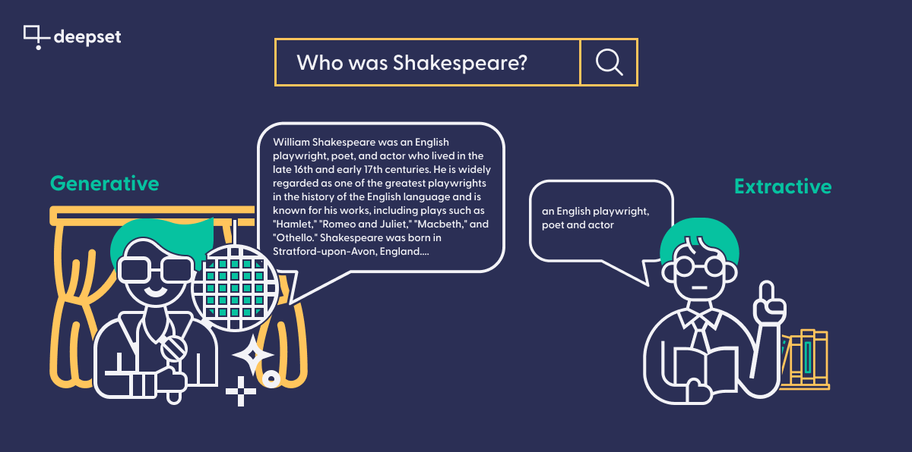

Generative language models like ChatGPT have taken the world by storm. Aside from their value in areas like programming and translation, generative models’ main selling point is their ability to come up with fluent, well-formed natural language responses. Like humans, these models seem to generate their answers out of thin air, and without looking up the answers in a factual database.

This sets them apart from their humbler siblings: _extractive_ language models. Both extractive and generative models are based on the breakthrough Transformer architecture that ushered in a new generation of natural-language understanding (NLU) for machines.

However, extractive models differ from generative models in that they explicitly need a context to extract information from at querying time, and they return that information as direct quotations from the source, whereas generative models are trained for generating language and capable of writing new text from scratch. Compared to the fluency of their generative counterparts, extractive models like RoBERTa and ELECTRA can therefore seem much less capable.

But it is becoming increasingly clear that generative models suffer from their own set of problems, like their size, the fact that many of them are proprietary (which isn’t ideal for everyone), and most significantly, their tendency to make things up. What’s more, extractive models have a much better track record in real-world applications — for example, in private or public semantic search engines, or in information extraction systems.

So if you’re considering the use of a [modern language model](https://haystack.deepset.ai/blog/what-is-a-language-model) in your own project, this article is for you. We’ll talk about the strengths and limitations of extractive and generative language models, and show you which use cases benefit most from which kind of model.

## The popularity of generative language models

In November 2022, [OpenAI](https://openai.com/) made its latest large language model — ChatGPT — available to the general public. No coding skills were needed to use it — suddenly everyone was able to “chat” with a highly performant language model and experience for the first time how far these models have come in recent years. This has led to a wave of GPT-related content that variously explains, hypes, and warns against this technology.

However, the foundation of these models are not new. GPT models are built up on [Transformer architecture first introduced by Google](https://arxiv.org/abs/1706.03762) in 2017 — years before ChatGPT arrived on the scene. The new Transformer architecture quickly gained widespread attention and became the foundation for numerous subsequent advancements in NLP.

Generative models can have any number of parameters, but to yield the impressive results we’ve seen from ChatGPT, it seems that number needs to be almost inconceivably huge — the models in the [GPT-3 series have 175 billion parameters](https://developer.nvidia.com/blog/openai-presents-gpt-3-a-175-billion-parameters-language-model/), while GPT-4 is said to have more than a trillion. In terms of training data, too, more is more for generative models: not only are they trained on vast amounts of data, but they also seem to store a representation of the facts in that data (rather than just using it to build their linguistic intuition), which leads to an impression of omniscience.

Closed-source language models like those by OpenAI are only accessible through an API and not always available for general download. But there are also impressive open source generative models shared widely on platforms like the [Hugging Face model hub](https://huggingface.co/models). Open source generative models like [Vicuna](https://lmsys.org/blog/2023-03-30-vicuna/) and [OpenAssistant](https://open-assistant.io/chat) are catching up quickly though, generating [results that could soon dictate the state of the art](https://www.semianalysis.com/p/google-we-have-no-moat-and-neither).

## How do extractive models differ from generative ones?

In terms of architecture, broadly speaking, extractive models like those [based on BERT](https://haystack.deepset.ai/blog/the-definitive-guide-to-bertmodels) belong to the same family of language models as their generative counterparts, since both use the Transformers. However, the main distinction lies in the usage of these models. Unlike generative models, extractive models require both a query and a specific piece of text as the foundation for their response. It then encodes the query as a high-dimensional, semantically informed vector exactly like a generative model does. But rather than generating an answer from scratch based on the given context as generative models do, the extractive model marks the section in the text document that, according to the model’s prediction, provides the best answer to the query.

So what’s the use of such a model, when you need to provide it with the document that contains the answer? Well, for one, it can be very useful when you need to extract the same kind of information from multiple documents: a classic [information extraction](https://www.deepset.ai/blog/automating-information-extraction-with-question-answering) scenario. But even more significantly, applied NLP has come up with an ingenious pipeline paradigm to allow extractive models to operate on a large collection of documents, too. In a [Retriever-Reader pipeline](https://haystack.deepset.ai/tutorials/01_basic_qa_pipeline#creating-the-retriever-reader-pipeline), a faster model pre-selects the best document “candidates,” which are then given a closer read by the extractive model to find the best answer possible.

Their purely extractive property means the model can only provide answers that quote verbatim from a text. Abstraction, paraphrasing, and the formation of well-formed answers are not in the repertoire of this model family.

Because of their extractive nature, these models have no use for storing factual information, and therefore do not necessarily benefit from having more parameters. Compared to their generative cousins, extractive models are therefore usually much smaller in size and require less training data.

Their relative smallness also makes it easier to share these models. In fact, the most popular models are all available on the model hub, where everyone can download them either for direct use or for [fine-tuning on a more specific dataset](https://haystack.deepset.ai/tutorials/02_finetune_a_model_on_your_data).

## The problem with generative models — and how to combat it

A recurring problem with generative models is that they sometimes make up information and treat it as ground truth. This behavior is commonly referred to as “hallucinations” and the main reason for this is the model’s ability to produce language rather than extracting the answer from a given text.

Hallucinations can occur when the model has insufficient information to answer a question accurately, when it receives the same prompt multiple times, or when it is prompted to come up with an argument that runs counter to commonly accepted facts. The last case shows how blurry the notion of hallucinations is. After all, it is perfectly common to make up facts: in fiction, for example, in hypothetical examples used for illustrative purposes, or in writing assignments for school.

A problem arises, however, when a user expects factual knowledge, and instead receives a hallucination without realizing it. Considering that generative models have been proposed for various tasks such as teaching, programming, and writing, [the significant presence of hallucinated content in ChatGPT’s output](https://www.datanami.com/2023/01/17/hallucinations-plagiarism-and-chatgpt/) makes it necessary to rethink their applicability in the real world.

While several methods have been proposed to detect hallucinations amongst a generative model’s output, we at [deepset](https://www.deepset.ai/) often use the approach of improving the reliability of these models through retrieval augmentation.

### Retrieval augmentation: feed the ground truth to your generative model

In [retrieval-augmented question answering](https://haystack.deepset.ai/blog/build-a-search-engine-with-gpt-3) (and other applications), we don’t rely solely on the facts contained within the parameters of the model itself. Instead, we make use of the customizable nature of modern NLP systems, and connect the generative model to a database of curated documents — much like we saw earlier in the extractive QA setup.

When the model is prompted for an answer, it then uses that database as its factual basis, while still relying on its amazing ability to understand and produce natural language. As an interim step, we use a Retriever to retrieve the most relevant documents in our database and embed it into our query to the model. A system with human-like conversational capabilities and a fact-checked knowledge base: retrieval augmentation gets you the best of both worlds.

[Connecting your generative model to a database](https://haystack.deepset.ai/tutorials/22_pipeline_with_promptnode) doesn’t only combat hallucinations; it also helps with accuracy more generally. The information stored in the language model’s parameters becomes outdated quickly, but you can make sure to update the documents in your database on a regular basis.

However, there are also downsides to this method when combined with a proprietary third-party model.

Some companies are wary of sending the potentially sensitive data in their documents to an external service. For these organizations, it may be preferable to host the generative model locally rather than use a third-party provider.

## Generative or extractive, which one is better?

Now that we’ve gained a good sense of what characterizes generative and extractive language models, it’s time to look at the best use cases for each type of model. The decision depends on the character of your application itself, as well as your technical requirements and financial limitations.

### When to use generative models

Generative models are necessary when you need your application’s output to sound like a natural response that could have been produced by a human. That’s why these models are popular for **chatbots**, or as **writing aides** in areas like copywriting and software documentation.

Another type of application that calls for generative models is any application that includes paraphrasing. As illustrated above, extractive models can only copy content from a knowledge base, while generative ones produce completely new utterances from scratch. This is indispensable in **translation**, for instance (in fact, the very first Transformer was built for translation purposes), and extremely useful in [other abstractive use cases](https://docs.haystack.deepset.ai/docs/prompt_node#prompttemplates) like **summarization**.

Regarding the financial and technical requirements, keep in mind that, as of now, the most high-performing generative models aren’t open-source. OpenAI, for example, charges a fee for the use of its models through its API. You need to consider how this will impact your budget, especially in case of unexpected spikes in requests to your app.

Some developers might also be uncomfortable with the notion that they’re not in charge of the model’s controls, or of the data used to train or fine-tune it. Retrieval augmentation can help with this final point — as long as you’re ok with sending your internal documents to an external service.

### When to use extractive models

Extractive models are commonly used in question answering. The most typical application of this technique is thus in use cases where the user wants to receive answers verbatim from a large collection of documents. It can, for example, be used to **extract answers** from technical documents in a short amount of time. As a rule of thumb, the more sensitive the application, the higher the need for **textual faithfulness**, and the lower the tolerance for paraphrases.

But question answering can mean much more than just that. In fact, it is a technique often used to **extract information** from texts, which can then be used further downstream in an application. Let’s say you have, for instance, a collection of business reports and want to identify the main entities involved in certain operations. You can use an extractive model to [extract those answers from the text](https://www.deepset.ai/blog/haystack-node-for-information-extraction), make sure they contain only named entities such as persons, organizations, or places, and use those entities to **populate a knowledge graph**.

In short, extractive models are the way to go when you’re interested in the information itself, rather than fluent answers; when you want to use them in downstream tasks; and when your application requires textual faithfulness. Researchers have also found that extractive models [operate better on out-of-domain data](https://arxiv.org/abs/2203.07522) than generative ones.

In terms of technical requirements, the big difference compared to generative models is that you usually host them on your own infrastructure — giving you both full control and full responsibility over them. While these models are available on the model hub for free, it’s useful to have access to one or more GPUs for fine-tuning, and to be able to allocate resources to [data-centric tasks](https://www.deepset.ai/blog/data-centric-ai) like [annotation](https://www.deepset.ai/blog/labeling-data-with-haystack-annotation-tool) and qualitative evaluation.

Finally, keep in mind that not all Transformer models for NLP fit into the extractive and generative categories! In fact, there’s a whole barrage of language models that don’t return any answers at all, but that instead match or classify documents on the basis of their semantic content. These models, which are faster and less resource-consuming than the models discussed in this article, can be used in applications like [semantic search](https://www.deepset.ai/blog/how-to-build-a-semantic-search-engine-in-python) — whether public-facing or business-internal — as well as [semantic FAQ search](https://www.deepset.ai/blog/semantic-faq-search-with-haystack).

## Generative and extractive: Haystack has it all

Whether you’re looking to build applications based on generative or extractive language models: [Haystack](https://haystack.deepset.ai/), our open-source framework for applied NLP, makes handling models of either family a breeze. With our composable pipelines and hands-on tutorials, you can build your own prototype in no time. To get started, why not have a look at our components for [extractive](https://docs.haystack.deepset.ai/docs/reader#models) and [generative question answering](https://docs.haystack.deepset.ai/docs/prompt_node)?

Are you interested in exchanging tips and opinions on generative vs. extractive QA, large language models, or other topics in NLP with like-minded people? Come [join our Discord community](https://discord.com/invite/VBpFzsgRVF) and [visit us on GitHub](https://github.com/deepset-ai/haystack) :)