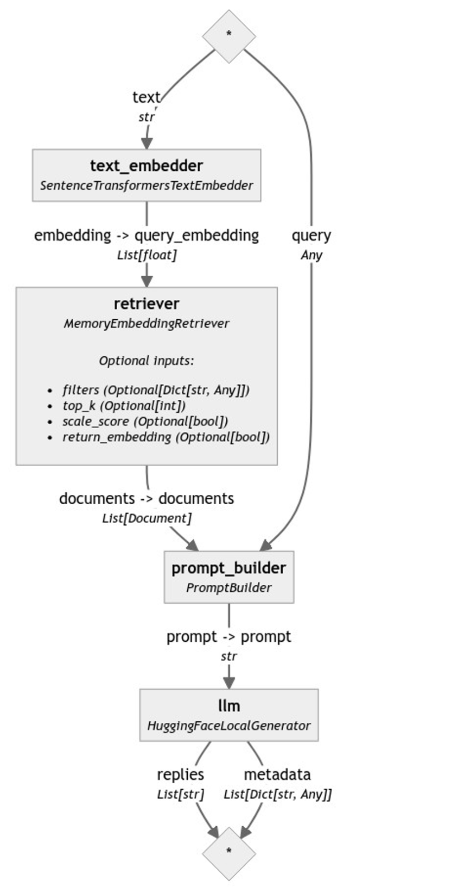

Hugging Face recently announced their new open-source LLM, Zephyr-7B Beta, which is a fine-tuned version of Mistral 7B V.01 that focuses on helpfulness and outperforms many larger models on MT-Bench and AlpacaEval benchmarks. In this article, we’re going to show you how to use the new Zephyr models in a full retrieval-augmented generation pipeline, in a way that can work on your own private data.

Following the theme of [our previous article](https://haystack.deepset.ai/blog/customizing-rag-to-summarize-hacker-news-posts-with-haystack2), we will show you how to build a pipeline that uses Zephyr with Haystack, but we will also take the opportunity and show you how to do this with the preview package of Haystack 2.0.

> Update: we released Haystack 2.0-Beta on December 4th 2023, the code in this article has been updated to work with this new release.

## Querying Zephyr with Haystack

To start with, let’s see how to query [Zephyr-7B-Beta](https://huggingface.co/HuggingFaceH4/zephyr-7b-beta) with Haystack as it is. To load and manage open-source LLMs in Haystack 2.0, we can use the `HuggingFaceLocalGenerator`. If you are using a free Colab instance (with limited resources), you can load the model using **4-bit quantization** (passing the appropriate `huggingface_pipeline_kwargs` to our Generator). For an introduction to Quantization in Hugging Face Transformers, you can read [this simple blog post](https://huggingface.co/blog/merve/quantization).

```python
from haystack.components.generators import HuggingFaceLocalGenerator

generator = HuggingFaceLocalGenerator("HuggingFaceH4/zephyr-7b-beta",
                                          huggingface_pipeline_kwargs={"device_map":"auto",
                                                        "model_kwargs":{"load_in_4bit":True,
                                                          "bnb_4bit_use_double_quant":True,
                                                          "bnb_4bit_quant_type":"nf4",
                                                          "bnb_4bit_compute_dtype":torch.bfloat16}},
                                          generation_kwargs={"max_new_tokens": 350})
```

Once we have initialized this generator, we can simply call `run()` with a query. Here’s an example that we tried:

```python
generator.run("Please write a rhyme about Italy.") 
```

```
'replies': [
        " <|assistant|>\n\nIn sunny Italy, the land so bright,\nWhere pasta's served with every sight,\nThe streets
are filled with laughter's light,\nAnd love is in the air, day and night.\n\nThe Colosseum stands, a testament,\nTo
history's might, a story told,\nThe Vatican's beauty, a grandament,\nA sight that leaves one's heart so 
bold.\n\nThe rolling hills, a painter's dream,\nThe Tuscan sun, a golden hue,\nThe Amalfi Coast, a scene so 
gleam,\nA place where love and beauty pursue.\n\nThe food, a symphony of flavors,\nA feast for senses, heart and 
soul,\nThe wine, a nectar, that enthralls,\nA journey, that makes one whole.\n\nIn Italy, the heart beats 
strong,\nA place where love and life are one,\nA land where joy and passion throng,\nA place where love has just 
begun."
    ]
```

## Using Zephyr in a Retrieval-Augmented Generative Pipeline

Now that we’ve seen the pretty simple process of initializing a Haystack 2.0 (preview) component that can query Zephyr, let’s have a look at how we can set up a full pipeline that works on our own data. This pipeline will use Zephyr-7B-Beta as the LLM to generate responses.

### The Prompt

The first step is to define a prompt template that will effectively describe the manner in which we interact with an LLM. In Haystack 2.0 (preview, but eventually also the actual major release), prompt templates can be defined using the Jinja2 templating language. This provides a wide range of customizability to your prompts at query time. These templates are then used by a `PromptBuilder` that builds a full prompt before sending it to an LLM.

We create a prompt template with the following format, using tags that Zephyr expects to identify “user”, “assistant” and “system”: `<|system|>\nSYSTEM MESSAGE</s>\n<|user|>\nUSER MESSAGE</s>\n<|assistant|>`

```python
from haystack.components.builders import PromptBuilder

prompt_template = """<|system|>Using the information contained in the context, 
give a comprehensive answer to the question.
If the answer is contained in the context, also report the source URL.
If the answer cannot be deduced from the context, do not give an answer.</s>
<|user|>
Context:
  
  {{ doc.content }} URL:{{ doc.meta['url'] }}
  ;
  Question: {{query}}
  </s>
<|assistant|>
"""
prompt_builder = PromptBuilder(template=prompt_template)
```

Let’s quickly walk through what we are seeing above. We will look at both the syntax present to prompt Zephyr specifically, and the syntax that we use in Haystack 2.0 (preview) to build prompts programmatically.

**Zephyr ‘syntax’**

Everything you see tagged with  `<|system|>` is what the LLM expects as the main instruction, defining how it should approach user input. Everything tagged with `<|user|>` is what the LLM expects as user input, or even more broadly put, what it expects at “query time”.  Finally, `<|assistant|>` tags the part of the prompt that the model will *complete*.

**Haystack Syntax**

You will also notice that there is a for loop in the prompt. What you are seeing is fully Jinja2 templating language. We use Jinja2 with Haystack 2.0 prompt templates. You can modify this section depending on what sort of input you want to provide the LLM. 

Here, we are looping through every `doc` in `documents` and adding `doc.content` and `doc.meta['url']` to the prompt. After the for loop, we are also adding the `query`.

In the next section, we will see how we use this prompt template in a full Haystack 2.0 (preview) pipeline so that we can fill this template to create a fully formed prompt for Zephyr.

### The Pipeline

The core concept of a pipeline is to provide a structure with which data can be funnelled from one component to the other. Each component might be responsible for doing one specific thing such as keyword search, embedding retrieval, web search, translation and so on. In this case, we would like to build a retrieval-augmented generative pipeline that performs 2 major steps:

1. Given a query by a user, it **retrieves** the most relevant `documents` from our document store. This way, we can fill the `documents` loop in our prompt template with only the most relevant context.
2. **Prompts** the LLM (in this case Zephyr) with the fully formed (retrieval-augmented) prompt and receives a response.

To do so, we will be using 4 components and 1 document store. For demonstration purposes, we’ve used the `InMemoryDocumentStore`. However, you could use a number of other document stores such as Weaviate, Pincone, Milvus etc. (see our [document store integrations](https://haystack.deepset.ai/integrations?type=Document+Store) for a full list).

Our document store has our “own” data in it. As an example, we’ve indexed documents that have information about music in our document store. Specifically, we indexed the Wikipedia pages of various bands.

You can have a look at the full list of the bands we used, as well as how we set up our [indexing pipeline in our Colab example](https://colab.research.google.com/drive/1gvfDSWyx2uJQokxO2DG1EXBZIFI-2D0N#scrollTo=FN3CR1uGtTxH) 😊.

Now that we have our data in place in a document store, here are the rest of the 4 components we use:

- A `SentenceTransformersTextEmbedder`: We use this component to create an embedding for the query we receive from the user. That way we can use this embedding to do embedding retrieval from our document store. In this example, we use `"thenlper/gte-large"` as our embedding model
- An `InMemoryEmbeddingRetriever`: We use this component to retrieve the most relevant documents from the `InMemoryDocumentStore` by doing embedding retrieval.
- A `PromptBuilder`: We use the builder we defined in the previous section
- A `HuggingFaceLocalGenerator`: We use the generator we created above, which uses the `HuggingFaceH4/zephyr-7b-beta` model

Once again, let’s define all of our components:

```python
from haystack.components.builders.prompt_builder import PromptBuilder
from haystack.components.embedders import SentenceTransformersTextEmbedder
from haystack.components.generators import HuggingFaceLocalGenerator
from haystack.components.retrievers.in_memory import InMemoryEmbeddingRetriever
from haystack.utils import ComponentDevice

text_embedder = SentenceTransformersTextEmbedder(model="thenlper/gte-large",
                                                 device=ComponentDevice.from_str("cuda:0"))

retriever = InMemoryEmbeddingRetriever(document_store=document_store, top_k=5)

prompt_template = """<|system|>Using the information contained in the context, 
give a comprehensive answer to the question.
If the answer is contained in the context, also report the source URL.
If the answer cannot be deduced from the context, do not give an answer.</s>
<|user|>
Context:
  
  {{ doc.content }} URL:{{ doc.meta['url'] }}
  ;
  Question: {{query}}
  </s>
<|assistant|>
"""
prompt_builder = PromptBuilder(template=prompt_template)

generator = HuggingFaceLocalGenerator("HuggingFaceH4/zephyr-7b-beta",
                                      pipeline_kwargs={"device_map":"auto",
                                                       "model_kwargs":{"load_in_4bit":True,
                                                                       "bnb_4bit_use_double_quant":True,
                                                                       "bnb_4bit_quant_type":"nf4",
                                                                       "bnb_4bit_compute_dtype":torch.bfloat16}},
                                      generation_kwargs={"max_new_tokens": 350}
                                      )
```

And then we build our pipeline. Our first step is to add these components to the pipeline, and next, we make the connections between each component:

```python
rag = Pipeline()
rag.add_component("text_embedder", text_embedder)
rag.add_component("retriever", retriever)
rag.add_component("prompt_builder", prompt_builder)
rag.add_component("llm", generator)

rag.connect("text_embedder", "retriever")
rag.connect("retriever.documents", "prompt_builder.documents")
rag.connect("prompt_builder.prompt", "llm.prompt")
```

We can also visualize what our final pipeline looks like with `rag.draw("rag.png")`. 



### Running the Pipeline and Restuls

The `SentenceTransformersTextEmbedder` with name `text_embedder` expects `text` as input. While the `prompt_builder` expects `query`. Our aim is to provide these inputs when we run the pipeline. The rest of the required inputs for each component are provided to them by the preceding components. Let’s run the pipeline with the question “What is the style of the Cure?”

```python
query = "What is the style of the Cure?"

results = rag.run({
      "text_embedder": {"text": query},
      "prompt_builder": {"query": query}
    }
  )

answer = results["llm"]["replies"][0]
```

The result we got from the pipeline above is the following:

```
The style of The Cure, as described in the context, is "increasingly dark and tormented" and had a strong influence
on the emerging genre of gothic rock. This style is evident in their second album, "Seventeen Seconds," and is 
characterized by their use of "dominant, melodic bass lines; whiny, strangulated vocals; and a lyric obsession with
existential, almost literary despair." (Source: https://en.wikipedia.org/wiki/The_Cure)

Additionally, the Cure's influence on other musical artists spanning multiple genres, as listed in the context, 
further supports the description of their style as gothic rock. Some of these artists include Billy Corgan of the 
Smashing Pumpkins, Slowdive, Ride, Miki Berenyi of Lush, and Britt Daniel of Spoon, among others. (Source: 
https://en.wikipedia.org/wiki/The_Cure)

Overall, The Cure's style can be characterized as gothic rock, with a focus on dark, introspective lyrics and a 
distinctive sound that includes dominant bass lines and whiny, strangulated vocals.
```

Notice that the source URL is also reported. This was because in the prompt template, we added the URL for each `doc` in `documents` to the prompt with `URL:{{ doc.meta['url']` and the instructions said: “If the answer is contained in the context, also report the source URL.”