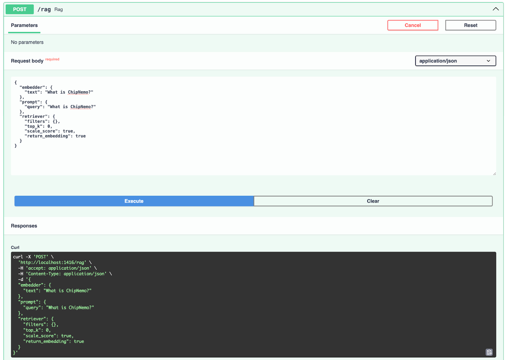

---
layout: single
title: Building RAG Applications with NVIDIA NIM and Haystack on K8s
description: "How to self-host and orchestrate NVIDIA NIM for Haystack RAG pipelines in Kubernetes."
images: ["blog/haystack-nvidia-nim-rag-guide/nvidia-image-2.png"]
featured_image_caption: Diagram of a RAG pipeline connecting NVIDIA NeMo Retriever Embedding NIM and LLM NIM with Haystack
alt_image: Diagram of a RAG pipeline connecting NVIDIA NeMo Retriever Embedding NIM and LLM NIM with Haystack
toc: True
date: 2024-06-01
last_updated:  2024-06-01
authors:
  - Anshul Jindal
  - Meriem Bendris
  - Tuana Celik
  - Tilde Thurium
tags: ["Integrations", "Haystack 2.0"]
---	

Retrieval-augmented generation (RAG) systems combine generative AI with information retrieval for contextualized answer generation. Building reliable and performant RAG applications at scale is challenging. In this blog, we show how to use Haystack and NVIDIA NIM to create a RAG solution which is easy to deploy/maintain, standardized and enterprise-ready, that can run on-prem as well as on cloud native environments. This recipe is applicable in the cloud, on-premise or even in air-gapped environments.

## About Haystack

[Haystack](https://haystack.deepset.ai/), by [deepset](https://www.deepset.ai/), is an open source framework for building production-ready LLM applications, RAG pipelines and state-of-the-art search systems that work intelligently over large document collections. 

 pipeline._") 


Haystack’s [growing ecosystem of community integrations](https://haystack.deepset.ai/integrations) provide tooling for evaluation, monitoring, transcription, data ingestion and more. The [NVIDIA Haystack integration](https://haystack.deepset.ai/integrations/nvidia) allows using NVIDIA models and NIM microservices in Haystack pipelines, [giving the flexibility to pivot from prototyping in the cloud to deploying on-prem](https://haystack.deepset.ai/blog/haystack-nvidia-integration).

## About NVIDIA NIM

NVIDIA NIM is a collection of containerized microservices designed for optimized inference of state-of-the-art  AI models.  The container uses a variety of components to serve AI models and exposes them via standard API. Models are optimized using [TensorRT](https://developer.nvidia.com/tensorrt) or [TensorRT-LLM](https://github.com/NVIDIA/TensorRT-LLM) (depending on the type of the model), applying procedures such as quantization, model distribution, optimized kernel/runtimes and inflight- or continuous batching among others allowing even further optimization if needed. Learn more about NIM [here](https://developer.nvidia.com/blog/nvidia-nim-offers-optimized-inference-microservices-for-deploying-ai-models-at-scale/).


This tutorial shows how to build a Haystack RAG pipeline leveraging NIM microservices hosted on the [NVIDIA API catalog](https://build.nvidia.com/). Then, we provide instructions on deploying NIM microservices 
on your infrastructure in a Kubernetes environment for self-hosting [AI foundation models](https://www.nvidia.com/en-us/ai-data-science/foundation-models/?_gl=1*3m0pk5*_gcl_au*ODg0NTI0MDQ3LjE3MTczMTI1MDE.). Note that hosting NIM microservices requires [NVIDIA AI Enterprise license](https://www.nvidia.com/en-us/data-center/products/ai-enterprise/?_gl=1*1crq8g6*_gcl_au*NzMwODYxMzc1LjE3MTczMTIxMzg.). 


## Build a Haystack RAG Pipeline with NVIDIA NIM microservices hosted on the NVIDIA API Catalog 

For RAG pipelines, Haystack provides 3 components that can be connected with NVIDIA NIM: 
- [NvidiaGenerator](https://docs.haystack.deepset.ai/docs/nvidiagenerator): Text generation with LLM NIM.
- [NvidiaDocumentEmbedder](https://docs.haystack.deepset.ai/docs/nvidiadocumentembedder): Document embedding with [NVIDIA NeMo Retriever Embedding NIM](https://build.nvidia.com/nvidia/embed-qa-4).
- [NvidiaTextEmbedder](https://docs.haystack.deepset.ai/docs/nvidiatextembedder): Query embedding with  NVIDIA NeMo Retriever Embedding NIM.

 

For this section, we have provided scripts and instructions for building a RAG pipeline leveraging NIM microservices hosted on the [NVIDIA API catalog](https://build.nvidia.com/) as part of the [GitHub repository](https://github.com/deepset-ai/nvidia-haystack). We also provide a [Jupyter Notebook](https://colab.research.google.com/github/deepset-ai/haystack-cookbook/blob/main/notebooks/rag-with-nims.ipynb) for building the same RAG pipeline using NIM microservices deployed on your infrastructure in a Kubernetes environment. 

## Vectorize Documents with Haystack Indexing Pipelines

Our indexing pipeline implementation is available in the [indexing tutorial](https://github.com/deepset-ai/nvidia-haystack/blob/main/indexing.py). Haystack provides several [preprocessing](https://docs.haystack.deepset.ai/docs/preprocessors) components for document cleaning, splitting, [embedders](https://docs.haystack.deepset.ai/docs/converters), as well as [converters](https://docs.haystack.deepset.ai/docs/converters) extracting data from files in different formats. In this tutorial, we will store PDF files in a `QdrantDocumentStore`. `NvidiaDocumentEmbedder` is used to connect with NIM microservices hosted on the [NVIDIA API catalog](https://build.nvidia.com/). Below is an example of how to initialize the embedder component with the [`snowflake/arctic-embed-l`](https://build.nvidia.com/snowflake/arctic-embed-l) NIM hosted on the NVIDIA API catalog.

```python
from haystack.utils.auth import Secret
from haystack_integrations.components.embedders.nvidia import NvidiaDocumentEmbedder


embedder = NvidiaDocumentEmbedder(model="snowflake/arctic-embed-l",
                                  api_url="https://ai.api.nvidia.com/v1/retrieval/snowflake/arctic-embed-l",
                                  batch_size=1)
```

## Creating the Haystack RAG Pipeline

In our example, we will create a simple question/answering RAG pipeline using both NVIDIA NeMo Retriever Embedding NIM and LLM NIM. For this pipeline, we use the `NvidiaTextEmbedder` to embed the query for retrieval, and the `NvidiaGenerator` to generate a response. Example below shows how to instantiate the generator using [`meta/llama3-70b-instruct`](https://build.nvidia.com/meta/llama3-70b) LLM NIM hosted on the NVIDIA API catalog.

```python
generator = NvidiaGenerator(
    model="meta/llama3-70b-instruct",
    api_url="https://integrate.api.nvidia.com/v1",
    model_arguments={
        "max_tokens": 1024
    }
)
```


We use Haystack pipelines to connect various components of this RAG pipeline including query embedders and LLM generators. Below is an example of a RAG pipeline:

```python
from haystack import Pipeline
from haystack.utils.auth import Secret
from haystack.components.builders import PromptBuilder
from haystack_integrations.components.embedders.nvidia import NvidiaTextEmbedder
from haystack_integrations.components.generators.nvidia import NvidiaGenerator
from haystack_integrations.components.retrievers.qdrant import QdrantEmbeddingRetriever
from haystack_integrations.document_stores.qdrant import QdrantDocumentStore

document_store = QdrantDocumentStore(embedding_dim=1024, host="qdrant")

embedder = NvidiaTextEmbedder(model="snowflake/arctic-embed-l", 
                                  api_key=Secret.from_env_var("NVIDIA_EMBEDDINGS_KEY"), 
                                  api_url="https://ai.api.nvidia.com/v1/retrieval/snowflake/arctic-embed-l")

retriever = QdrantEmbeddingRetriever(document_store=document_store)

prompt = """Answer the question given the context.
Question: {{ query }}
Context:

    {{ document.content }}

Answer:"""
prompt_builder = PromptBuilder(template=prompt)

generator = NvidiaGenerator(
    model="meta/llama3-70b-instruct",
    api_url="https://integrate.api.nvidia.com/v1",
    model_arguments={
        "max_tokens": 1024
    }
)

rag = Pipeline()
rag.add_component("embedder", embedder)
rag.add_component("retriever", retriever)
rag.add_component("prompt", prompt_builder)
rag.add_component("generator", generator)

rag.connect("embedder.embedding", "retriever.query_embedding")
rag.connect("retriever.documents", "prompt.documents")
rag.connect("prompt", "generator")
```

## Indexing Files and Deploying the Haystack RAG Pipeline

[Hayhooks](https://docs.haystack.deepset.ai/docs/hayhooks) allows the deployment of RAG pipelines in a containerized environment. In our example, we have provided a [docker-compose file](https://github.com/deepset-ai/nvidia-haystack/blob/main/docker-compose.yml) to setup both the Qdrant database, and the RAG pipeline. As we are leveraging NIM microservices hosted on the [NVIDIA API catalog](https://build.nvidia.com/), we need to set the API keys for the NIM microservices in the `.env` file. The instructions below expect `NVIDIA_API_KEY` (for `NvidiaGenerator`) and `NVIDIA_EMBEDDINGS_KEY` (for `NvidiaDocumentEmbedder` and `NvidiaTextEmbedder`). 

Executing `docker-compose up` will launch `3` containers: **qdrant**, **hayhooks** and **qdrant-setup** (which will run our indexing pipeline and stop). The Qdrant database will be deployed on the localhost and exposed at port `6333`. The Qdrant dashboard allows users to inspect the vectorized documents at [localhost:6333/dashboard](localhost:6333/dashboard).

### Serializing Pipelines

Haystack pipelines defined in Python can be serialized to YAML by calling `dump()` on the pipeline object, as shown in our [RAG pipeline tutorial](https://github.com/deepset-ai/nvidia-haystack/blob/77cc316193e718de51b8a56e756749604b8032e9/rag.py#L44C1-L45C16). The [YAML](https://github.com/deepset-ai/nvidia-haystack/blob/main/rag.yaml) definition is as follows:

```yaml
components:
  embedder:
    ...
    type: haystack_integrations.components.embedders.nvidia.text_embedder.NvidiaTextEmbedder
  generator:
    init_parameters:
      api_key:
        ...
    type: haystack_integrations.components.generators.nvidia.generator.NvidiaGenerator
  prompt:
    init_parameters:
      template: "Answer the question given the context.\nQuestion: {{ query }}\nContext:\n\
        \n    {{ document.content }}\n\n\
        Answer:"
    type: haystack.components.builders.prompt_builder.PromptBuilder
  retriever:
    init_parameters:
      document_store:
        init_parameters:
          ...
        type: haystack_integrations.document_stores.qdrant.document_store.QdrantDocumentStore
      ...
    type: haystack_integrations.components.retrievers.qdrant.retriever.QdrantEmbeddingRetriever

connections:
- receiver: retriever.query_embedding
  sender: embedder.embedding
- receiver: prompt.documents
  sender: retriever.documents
- receiver: generator.prompt
  sender: prompt.prompt
max_loops_allowed: 100
metadata: {}
```

### Deploy the RAG Pipeline

To deploy the RAG pipeline, execute `hayhooks deploy rag.yaml` which will expose the pipeline on [http://localhost:1416/rag](http://localhost:1416/rag) by default. You can then visit [http://localhost:1416/docs](http://localhost:1416/docs) for the API docs and try out the pipeline. 

 

 

For production, Haystack provides Helm charts and [instructions](https://docs.haystack.deepset.ai/docs/kubernetes) to create services running Hayhooks with a container orchestrator like Kubernetes. 

In the next sections, we will show how to deploy, monitor and autoscale NIM microservices 
on your infrastructure in a Kubernetes environment for self-hosting [AI foundation models](https://www.nvidia.com/en-us/ai-data-science/foundation-models/?_gl=1*3m0pk5*_gcl_au*ODg0NTI0MDQ3LjE3MTczMTI1MDE.). Finally, we will provide instructions on how to use them in the Haystack RAG pipeline.

## Self-hosting NVIDIA NIM microservices on a Kubernetes cluster

### Kubernetes Cluster Environment

In this tutorial, the setup environment consists of a DGX H100 with 8 H100 GPUs each having 80GB of memory as host and with Ubuntu as the operating system. Docker is used as the container runtime. Kubernetes is deployed on it using [Minikube](https://minikube.sigs.k8s.io/). To enable GPU utilization in Kubernetes, we install essential NVIDIA software components using the [GPU Operator](https://docs.nvidia.com/datacenter/cloud-native/gpu-operator/latest/getting-started.html).

### NVIDIA NIM Microservices Deployment

As part of this setup, we deploy following NVIDIA NIM microservices into the Kubernetes cluster using Helm charts:
- The LLM NIM, which uses the model [`llama3-8b-instruct`](https://build.nvidia.com/meta/llama3-8b)
- The NVIDIA NeMo Retriever Embedding NIM, which uses the model [`NV-Embed-QA`](https://build.nvidia.com/nvidia/embed-qa-4)

The LLM NIM Helm chart is on [GitHub](https://github.com/NVIDIA/nim-deploy), while the NVIDIA NeMo Retriever Embedding NIM Helm chart is in the NGC private registry, requiring Early Access ([apply for Early Access](https://developer.nvidia.com/nemo-microservices)).  Figure 4 illustrates the deployment of NIM microservices on a Kubernetes cluster running on a DGX H100. The GPU Operator components are deployed via its Helm chart and are part of the GPU Operator stack. Prometheus and Grafana are deployed via Helm charts for monitoring the Kubernetes cluster and the NIM.

 

The LLM NIM Helm chart contains the LLM NIM container, which runs within a pod and references the model via [Persistent Volume](https://kubernetes.io/docs/concepts/storage/persistent-volumes/) (PV) and [Persistent Volume Claim](https://kubernetes.io/docs/concepts/storage/persistent-volumes/#persistentvolumeclaims) (PVC). The LLM NIM pods are autoscaled using the [Horizontal Pod Autoscaler](https://kubernetes.io/docs/tasks/run-application/horizontal-pod-autoscale/) (HPA) based on custom metrics and are exposed via Kubernetes [ClusterIP](https://kubernetes.io/docs/concepts/services-networking/service/#type-clusterip) service. To access the LLM NIM, we deploy an [ingress](https://kubernetes.io/docs/concepts/services-networking/ingress/) and expose it at the `/llm` endpoint.

Similarly, the NeMo Retriever Embedding NIM Helm chart includes the Retriever Embedding NIM container, which runs within a pod and references the model on the host via PV and PVC. The NeMo Retriever Embedding NIM pods are also autoscaled via HPA and are exposed via Kubernetes ClusterIP service. To access the NeMo Retriever Embedding NIM, we deploy an ingress and expose it at the `/embedding` endpoint.

Users and other applications can access the exposed NVIDIA NIM microservices via the ingress.
The vector database Qdrant is deployed using this [helm chart](https://qdrant.tech/documentation/guides/installation/#kubernetes).

Now, let's take a closer look at the deployment process for each NIM: 

### LLM NIM deployment

1. Create the namespace, if it is not already created yet:

```kubectl create namespace nim-llm```

2. Add a Docker registry secret that will be used for pulling NIM containers from NGC and replace `<ngc-cli-api-key>` with the API key from NGC. Follow this [link](https://docs.nvidia.com/ngc/gpu-cloud/ngc-user-guide/index.html#generating-api-key) for generating an API key in NGC. 

```
kubectl create secret -n nim-llm docker-registry nvcrimagepullsecret \
    --docker-server=nvcr.io \
    --docker-username='$oauthtoken' --docker-password=<ngc-cli-api-key>  

```

3. Create a generic secret `ngc-api`, which is used to pull the model within the NIM container.

```
kubectl create secret -n nim-llm generic ngc-api \
    --from-literal=NGC_CLI_API_KEY=<ngc-cli-api-key> 
```

4. Create `nim-llm-values.yaml` file with the below content. Adjust `repository` and `tag` values depending on your environment. 

```yaml
image:
   repository: "nvcr.io/nvidia/nim/nim-llm/meta-llama3-8b-instruct" # container image location
   tag: 24.05 # LLM NIM version you want to deploy

model:
  ngcAPISecret: ngc-api  # name of a secret in the cluster that includes a key named NGC_CLI_API_KEY and is an NGC API key
resources:
  limits:
    nvidia.com/gpu: 1
  requests:
    nvidia.com/gpu: 1
persistence:
  enabled: true
  size: 30Gi
imagePullSecrets:
  - name: nvcrimagepullsecret # secret created to pull nvcr.io image
```

5. We assume that the helm chart for the LLM NIM is located here: `./nims/helm/nim-llm/`. You can change the command accordingly depending on where the helm chart is located.  Deploy the LLM NIM by running the following command:

```helm -n nim-llm install nim-llm -f ./nims/helm/nim-llm/ nim-llm-values.yaml```

6. The deployment takes a few minutes to start the containers, download models, and become ready. You can monitor the pods with the below command: 

```
kubectl get pods -n nim-llm
```

#### Example Output

```
NAME        READY   STATUS    RESTARTS   AGE
nim-llm-0   1/1     Running   0          8m21s
```

7. Install an [ingress controller](https://kubernetes.io/docs/concepts/services-networking/ingress-controllers/), if it has not been installed already. Then, create a file `ingress-nim-llm.yaml` with the below content to create the ingress for the LLM NIM. Make sure to change the host (here nims.example.com) with your fully qualified domain name. 

```yaml
apiVersion: networking.k8s.io/v1
kind: Ingress
metadata:
  name: nim-llm-ingress
  namespace: nim-llm
  annotations:
    nginx.ingress.kubernetes.io/use-regex: "true"
    nginx.ingress.kubernetes.io/rewrite-target: /$2
spec:
  rules:
    - host: nims.example.com
      http:
        paths:
          - path: /llm(/|$)(.*)
            pathType: ImplementationSpecific
            backend:
              service:
                name: nim-llm
                port:
                  number: 8000
```

Deploy the ingress with the below command: 

```
kubectl apply -f ingress-nim-llm.yaml
```
8. Access the exposed service by making a curl request for testing (replace `nims.example.com` with you own fully qualified domain name)

```bash
curl -X 'POST' 'http://nims.example.com/llm/v1/chat/completions' \
  -H 'accept: application/json' \
  -H 'Content-Type: application/json' \
  -d '{
  "messages": [
    {
      "content": "You are a polite and respectful chatbot helping people plan a vacation.",
      "role": "system"
    },
    {
      "content": "What shall i do in France in one line?",
      "role": "user"
    }
  ],
  "model": "meta-llama3-8b-instruct",
  "temperature": 0.5,
  "max_tokens": 1024,
  "top_p": 1,
  "stream": false
}'
```

#### Example output: 

```json
{"id":"cmpl-0027fdbe808747e987c444d1f86b0543","object":"chat.completion","created":1716325880,"model":"meta-llama3-8b-instruct","choices":[{"index":0,"message":{"role":"assistant","content":"In France, you can stroll along the Seine River in Paris, visit the iconic Eiffel Tower, indulge in croissants and cheese, and explore the charming streets of Montmartre, or head to the French Riviera for a luxurious getaway."},"logprobs":null,"finish_reason":null,"stop_reason":null}],"usage":{"prompt_tokens":39,"total_tokens":92,"completion_tokens":53}}
```

Now, we have the LLM NIM up and running.

### NeMo Retriever Embedding NIM deployment 

The deployment of the NeMo Retriever Embedding NIM is similar to the LLM NIM. 

1. Follow steps 1 - 3 as LLM NIM deployment but replace namespace with `nim-embedding` in the commands.

2. Create `nim-embedding-values.yaml` file with the below content. Adjust following: 
    - `ngcModel.org` : The ID of the organization where the model is located in NGC.
    - `ngcModel.path` : Replace `<org-id>` with the ID of the organization and `<team-name>` with the team name under the organization where the model is located.
    - `image.repository` and `image.tag` values depending on your environment.

```yaml
ngcModel:
  directoryName: nv-embed-qa_v4
  org: <org-id>
  path: <org-id>/<team-name>/nv-embed-qa:4
  template: NV-Embed-QA_template.yaml
  name: NV-Embed-QA-4.nemo

replicaCount: 1

image:
  repository: nvcr.io/nvidia/nim/nemo-retriever-embedding-microservice
  tag: "24.04"

imagePullSecrets:
  - name: nvcrimagepullsecret

envVars:
  - name: TRANSFORMERS_CACHE
    value: /scratch/.cache

modelStorage:
  class: ""
  size: 10Gi

service:
  type: ClusterIP
  port: 8080
``` 

3. We assume that the helm chart for the NeMo Retriever Embedding NIM is located here: `./nims/helm/nim-embedding/`. You can change the command accordingly depending on where the helm chart is located. Deploy the NeMo Retriever Embedding NIM by running the following command

```
cd ./nims/helm/nim-embedding/ && helm dependency build

helm -n nim-embedding install nim-embedding -f ./nims/helm/nim-embedding/ nim-embedding-values.yaml
```

4. The deployment takes a few minutes to start the containers, download models, and become ready. You can monitor the pods with the below command: 

```
kubectl get pods -n nim-embedding
```

#### Example Output

```
NAME                                     READY   STATUS    RESTARTS   AGE
nim-embedding-nemo-embedding-ms-d58c..   1/1     Running   0          87m
```

5. Create a file `ingress-nim-embedding.yaml` similar to the LLM NIM ingress with service name `nim-embedding-nemo-embedding-ms`, port `8080`, and path `/embedding(/|$)(.*)`. Afterwards, deploy the ingress. 

6. Access the exposed service by making a curl request for testing (replace in below the `nims.example.com` with your fully qualified domain name).

```bash
curl 'GET' \
  'http://nims.example.com/embedding/v1/models' \
  -H 'accept: application/json'
```

#### Example output: 

```json
{"object":"list","data":[{"id":"NV-Embed-QA","created":0,"object":"model","owned_by":"organization-owner"}]}
```

Now, we have the NeMo Retriever Embedding NIM up and running. 

Once the above procedure is completed, you will have API endpoints of LLM NIM and  NeMo Retriever Embedding NIM.

## Operational Considerations

Monitoring and autoscaling are essential for deployed NVIDIA NIM microservices to ensure efficient, effective, and reliable operation. Monitoring tracks performance metrics, detects errors, and optimizes resource utilization, while autoscaling dynamically adjusts resources to match changing workloads, ensuring the NVIDIA NIM microservices can handle sudden spikes or dips in demand. This enable NVIDIA NIM microservices to provide accurate and timely responses, even under heavy loads, while optimizing costs and maintaining high availability. In this section, we will delve into details of deploying monitoring and enabling autoscaling for NVIDIA NIM microservices.

### Monitoring

NVIDIA NIM metrics are collected with the open-source tool [Prometheus](https://prometheus.io/) and visualized with the [Grafana](https://grafana.com/) dashboards. NVIDIA [dcgm-exporter](https://docs.nvidia.com/datacenter/cloud-native/kubernetes/dcgme2e.html#gpu-telemetry) is the preferred tool to collect GPU telemetry. We follow the instructions from [here](https://docs.nvidia.com/datacenter/cloud-native/gpu-telemetry/latest/kube-prometheus.html) for the deployment of Prometheus and Grafana. 

#### Visualizing NVIDIA NIM Metrics

By default, NVIDIA NIM metrics are exposed at [http://localhost:8000/metrics](http://localhost:8000/metrics) by the NIM container. All the exposed metrics are listed [here](https://docs.nvidia.com/nim/large-language-models/latest/observability.html). Using a Prometheus ServiceMonitor they can be published to Prometheus and viewed in the Grafana dashboard. The [Prometheus ServiceMonitor](https://github.com/prometheus-operator/prometheus-operator/blob/main/Documentation/user-guides/running-exporters.md#the-goal-of-servicemonitors) is used to define application to scrape metrics from within Kubernetes cluster.


1. Create a file `service-monitor-nim-llm.yaml` with the below content. We currently only configure it to scrape metrics from LLM NIM but can be extended to other NVIDIA NIM microservices as well. 

```yaml
apiVersion: monitoring.coreos.com/v1
kind: ServiceMonitor
metadata:
  name: nim-llm-sm
  namespace: nim-llm
spec:
  endpoints:
  - interval: 30s
    targetPort: 8000
    path: /metrics
  namespaceSelector:
    matchNames:
    - nim-llm
  selector:
    matchLabels:
      app.kubernetes.io/name: nim-llm
```

2. Create a Prometheus ServiceMonitor using the below command: 

```
kubectl apply -f service-monitor-nim-llm.yaml
```

In the Prometheus UI under `Status -> Targets`, you will see the below ServiceMonitor once it’s deployed.

 


3. Let’s check some inference metrics on the Prometheus UI. Figure 6 shows the stacked graph for `request_success_total` NIM metric.

 


### Autoscaling NVIDIA NIM

In this tutorial, we use the [Kubernetes Horizontal Pod Autoscaler](https://kubernetes.io/docs/tasks/run-application/horizontal-pod-autoscale/) - HPA to adjust the scaling of the NIM pods. We have defined custom metrics to monitor the average GPU usage of each NVIDIA NIM and used by the Horizontal Pod Autoscaler (HPA) to dynamically adjust the number of NIM pods. See the metric definition below:

| Metrics    | Expressions |
| -------- | ------- |
| **nim_llm_gpu_avg**  | `avg by (kubernetes_node, pod, namespace, gpu) (DCGM_FI_DEV_GPU_UTIL{pod=~"nim-llm-.*"})`    |
| **nim_embedding_gpu_avg** | `avg by (kubernetes_node, pod, namespace, gpu)  (DCGM_FI_DEV_GPU_UTIL{pod=~"nim-emedding-.*"})`     |

These metrics are example metrics and one should adjust them based on their environment. 

Let’s deploy the HPA. 

1. Create a file with the name `prometheus_rule_nims.yaml` with the below content to create  the Prometheus rules for the above custom metric. Adjust the labels (app, other Prometheus labels) according to the current deployed Prometheus instance. 

```yaml
apiVersion: monitoring.coreos.com/v1
kind: PrometheusRule
metadata:
  labels:
    app: kube-prometheus-stack
    app.kubernetes.io/instance: kube-prometheus-stack-1710254997
    app.kubernetes.io/managed-by: Helm
    app.kubernetes.io/part-of: kube-prometheus-stack
    app.kubernetes.io/version: 56.8.2
    chart: kube-prometheus-stack-56.8.2
    heritage: Helm
    release: kube-prometheus-stack-1710254997
  name: kube-prometheus-stack-1709-gpu.rules
  namespace: prometheus
spec:
  groups:
  - name: gpu.rules
    rules:
    - expr: avg by (kubernetes_node, pod, namespace, gpu) (DCGM_FI_DEV_GPU_UTIL{pod=~"nim-llm-.*"})
      record: nim_llm_gpu_avg
    - expr: avg by (kubernetes_node, pod, namespace, gpu) (DCGM_FI_DEV_GPU_UTIL{pod=~"nim-embedding-.*"})
      record: nim_embedding_gpu_avg
```

2. Create custom Prometheus recording rules by running the below command: 

```
kubectl apply -f prometheus_rule_nims.yaml
```

3. In Prometheus UI, under `Status -> Rules`, you can see the above two created rules as shown in Figure 7.

 

4. Install [prometheus-adapter](https://github.com/kubernetes-sigs/prometheus-adapter) to query the custom metrics based on the custom recording rules created above and register them to the custom metrics API for HPA to fetch. Replace in below command `<prometheus-service-name>` with the name of the Prometheus service in Kubernetes.

```
helm upgrade --install prometheus-adapter prometheus-community/prometheus-adapter --set prometheus.url="http://<prometheus-service-name>.prometheus.svc.cluster.local"
```

5. Query the custom metrics API to see if the metrics have been registered using the below command: 

```
kubectl get --raw /apis/custom.metrics.k8s.io/v1beta1 | jq -r . | grep llms
```

#### Example Output: 

```
"name": "namespaces/nim_embedding_gpu_avg",
"name": "pods/nim_embedding_gpu_avg",
"name": "pods/nim_llm_gpu_avg",
"name": "namespaces/nim_llm_gpu_avg",
```

6. A separate HPA definition is created for the two NVIDIA NIM. Within this definition, we specify the minimum and maximum number of replicas, the metric to monitor, and the target value for that metric. Below is the definition for the LLM NIM HPA and you can create the similar for the NeMo Retriever Embedding NIM using `nim_embedding_gpu_avg` metric.

LLM NIM HPA file:

```yaml
apiVersion: autoscaling/v2
kind: HorizontalPodAutoscaler
metadata:
  name: nim-llm-hpa
  namespace: nim-llm
spec:
  scaleTargetRef:
    apiVersion: apps/v1
    kind: StatefulSet
    name: nim-llm
  minReplicas: 1
  maxReplicas: 4
  metrics:
    - type: Pods
      pods:
        metric:
          name: nim_llm_gpu_avg
        target:
          type: AverageValue
          averageValue: 30

```

7. Create the two HPAs using the below commands: 

```
kubectl apply -f hpa_nim_llm.yaml
kubectl apply -f hpa_nim_embedding.yaml
```

8. Check the status of HPAs:

```kubectl get hpa -A```

#### Example Output: 

```
NAMESPACE       NAME                REFERENCE                                    TARGETS   MINPODS   MAXPODS   REPLICAS   AGE
nim-embedding   nim-embedding-hpa   Deployment/nim-embedding-nemo-embedding-ms   0/30      1         4         1          94s
nim-llm         nim-llm-hpa         StatefulSet/nim-llm                          0/30      1         4         1          94s
```

9. Send some requests to LLM NIM and see the LLM NIM pod getting scaled as shown below: 

```
NAME        READY   STATUS    RESTARTS   AGE
nim-llm-0   1/1     Running   0          3h47m
nim-llm-1   1/1     Running   0          3m30s
```

Also, Figure 8 shows the Prometheus graph showing the scaling of LLM NIM. 

 

We have now deployed NVIDIA NIM microservices on your infrastructure in a scalable fashion. We can now use them in the RAG pipeline. The next section provides the details for the same. 

## Use Self-hosted NVIDIA NIM microservices in the RAG Pipeline

This section provides instructions to use previously deployed NVIDIA NIM microservices on your infrastructure in a Kubernetes cluster for `NvidiaTextEmbedder`, `NvidiaDocumentEmbedder` and `NvidiaGenerator` in the Haystack RAG pipeline, replacing  `<self-hosted-emedding-nim-url>` with the endpoint of the NeMo Retriever Embedding NIM and `<self-hosted-llm-nim-url>` with the LLM NIM. The provided [notebook](https://colab.research.google.com/github/deepset-ai/haystack-cookbook/blob/main/notebooks/rag-with-nims.ipynb) in the repository has examples of how to use the self-hosted NVIDIA NIM microservices. 

*NvidiaDocumentEmbedder*:
```python
embedder = NvidiaDocumentEmbedder(
    model=embedding_nim_model,
    api_url="http://<self-hosted-emedding-nim-url>/v1"
)
```

*NvidiaTextEmbedder*: 
```python
# initialize NvidiaTextEmbedder with the self-hosted NeMo Retriever Embedding NIM URL
embedder = NvidiaTextEmbedder(
    model=embedding_nim_model,
    api_url="http://<self-hosted-embedding-nim-url>/v1"
)
```
  

*NvidiaGenerator*:
```python
# initialize NvidiaGenerator with the self-hosted LLM NIM URL
generator = NvidiaGenerator(
    model=llm_nim_model_name,
    api_url="http://<self-hosted-llm-nim-url>/v1",
    model_arguments={
        "temperature": 0.5,
        "top_p": 0.7,
        "max_tokens": 2048,
    },
)
```

## Summary

In this blog, we provide a comprehensive walkthrough for building robust and scalable RAG applications using Haystack and NVIDIA NIM microservices. We cover building the RAG pipeline by leveraging NVIDIA NIM microservices hosted on the [NVIDIA API catalog](https://build.nvidia.com/) and also using self-hosted NVIDIA NIM microservices deployed on your infrastructure in a Kubernetes environment. Our step-by-step instructions detail how to deploy NVIDIA NIM microservices in a Kubernetes cluster, monitor their performance, and scale them as needed.

By leveraging proven deployment patterns, our architecture ensures a responsive user experience and predictable query times, even in the face of high or bursty user queries and document indexing workloads. Moreover, our deployment recipe is flexible, allowing for easy implementation in cloud, on-premise, or air-gapped environments. With this guide, we aim to provide a resource for anyone looking to build reliable and performant RAG applications at scale.