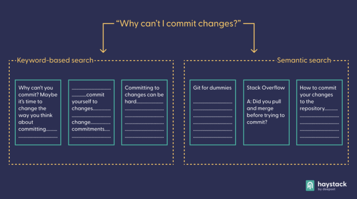
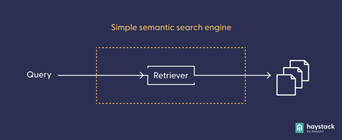
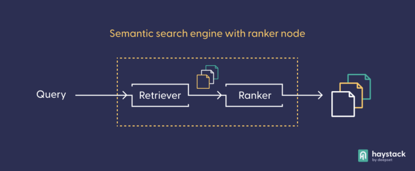
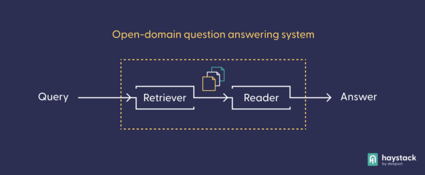

Semantic search is the task of retrieving documents from a collection of documents (also known as a ‘corpus’) in response to a query asked in natural language. Powered by the latest Transformer language models, semantic search allows you to access the best matches from your document collection within seconds, and on the basis of meaning rather than keyword matches. As well as being helpful in its own right, semantic search also forms the basis for many complex tasks, like question answering or text summarization.

Over the last decade or so, Python has become the principal language for machine learning (ML) and natural language processing (NLP). In this article, we will show you how to set up a semantic search engine in Python, placing it on top of your document collection of choice, with our open source  [Haystack framework](https://haystack.deepset.ai/). Thanks to Haystack’s modular setup and the availability of high-quality pre-trained language models, you’ll be able to set up your own  [semantic search](https://www.deepset.ai/blog/understanding-semantic-search)  system in less than twenty minutes.

## A refresher on semantic search

Like all  [Transformer-based language models](https://www.deepset.ai/blog/what-is-a-language-model), the models used in semantic search encode text (both the documents and the query) as high-dimensional vectors or embeddings. We can then use similarity measures like cosine similarity to understand how close in meaning two vectors (and their associated texts) are. Texts that are similar in meaning are closer to each other, while unrelated texts are more distant. While illegible to humans, the  [vector-based representation](https://www.deepset.ai/blog/what-is-text-vectorization-in-nlp)  works very well for computers to represent meaning.

The  [superiority of semantic search](https://www.deepset.ai/blog/what-semantic-search-can-do-for-you)  over a keyword-based approach becomes clear if we look at an example. Think of the difference between the queries “why can’t I commit changes” — a perennial problem for the novice Git user — and “why can’t I commit to changes” — a problem for the indecisive. The preposition “to” entirely changes the meaning of the query, which is impossible to detect with simple keyword matching. A semantic language model (like the one  [used by Google](https://blog.google/products/search/search-language-understanding-bert/)) will embed the two queries in disparate locations of the vector space.



Semantic search is great for disentangling subtleties like this. Here are some scenarios where semantic search will be particularly helpful:

-   **When your application is searching a large or ambiguous corpus**. Many heterogeneous corpuses present problems for simple keyword matching. Imagine trying to compare reward programs between airlines.  [Every](https://www.southwest.com/rapidrewards/overview)  [company](https://www.china-airlines.com/de/en/member/membership-benefits/Index)  [has](https://www.flydubai.com/en/skywards/benefits)  [a](https://www.ryanair.com/mt/en/plan-trip/travel-extras/travel-credit)  [different](https://www.icelandair.com/frequent-flyer/)  [term](https://latampass.latam.com/en_us/)  for its customer currencies and rebate programs. Many of those terms borrow from common concepts like miles, points, or rewards. A semantic search engine can easily capture the similarity of these terms, where exact text matching would not.
-   **When your users aren’t finding what they’re looking for through keywords.** In keyword matching systems, good results are dependent on an exact match between corpus and query. When users are unable to find quality search results, they often painfully iterate search terms, hunting for the right combination to unlock the corpus. This is a poor user experience, and can be replaced with a more comfortable and natural semantic search model.
-   **When you want to offer your users a more intuitive search interface.** Semantic search is simply more comfortable and enjoyable for sifting through documents. Human minds work in human terms, and most people prefer it when they don’t have to adapt their language to a computer.

Now, let’s look at how Haystack and Python make it possible to build semantic search systems in just a few lines of code.

## Haystack: Applied NLP in Python

Haystack is our framework for applied NLP that uses a modular, mix-and-match approach to building NLP systems. These days, the highest-performing language models are huge.  [Training such a language model](https://www.deepset.ai/blog/when-and-how-to-train-a-language-model)  yourself on your local PC is impractical, uneconomical and, frankly, often impossible. However, thanks to centralized platforms like the  [Hugging Face model hub](https://huggingface.co/models), pre-trained models can be shared and reused by everyone.

With pre-trained models being readily available, the Haystack framework offers the architecture that makes them work in practice: the Python library comes with several  [preconfigured pipelines](https://docs.haystack.deepset.ai/docs/ready_made_pipelines), where all you need to do is plug in the language model that works for you. This makes it easy to build prototype systems quickly, using different models. At the same time, Haystack offers all the flexibility that we’ve come to expect from Python libraries, making it extremely easy to configure and customize your own pipeline.

Our pipelines are essentially nodes connected by edges. A node can hold a specific language model, which transforms its input before passing it on to the next node. Once you’ve decided on the pipeline setup that works best for your use case, you can easily iterate through different language models, to find the combination that gives you the best results. Note that whenever you change the model combination, you’ll need to initialize your pipeline from scratch.

## Building a Semantic Search Engine: Prerequisites

To build a semantic search prototype, think about three aspects in advance: what documents you want to search, the design of your pipeline, and which language models to use (often, you’ll have a number of models that you want to compare to each other).

For the context of this guide, imagine that you’ve got some gardening work to do, and you’ve acquired a  [corpus of e-manuals](https://sites.google.com/view/emanualqa/home)  that should help you find the best tools for different tasks. Unfortunately, there are too many documents to look through manually. If you’re not very familiar with the gardening jargon, a keyword-based search would likely be only moderately successful.

You can experiment with different pipeline designs for your semantic search system. First, try using the basic, ready-made  [DocumentSearch pipeline](https://docs.haystack.deepset.ai/docs/ready_made_pipelines#documentsearchpipeline), which consists only of one node: the  [retriever](https://docs.haystack.deepset.ai/reference/retriever-api), which extracts the best matches from your documents collection.



> _The retriever selects the best documents in response to a query. Before you can use a Transformer-based retrieval model in practice, you’ll need to index your documents; that is, pre-process them and let the retrieval model turn them into vector representations, which it can compare later. In more complex pipeline architectures, the retriever often works as a “sieve” that presents a small pre-selection of documents to the next node, taking the burden of processing high amounts of texts off more computationally costly models._

## Build Your Semantic Search System With The Haystack Python Framework

We’ll be working with the  [FAISS](https://github.com/facebookresearch/faiss)  [document store](https://haystack.deepset.ai/components/document-store)  as our database, which is optimized for working with vector representations. Make sure to install Haystack (we use version 1.11) with FAISS support enabled:

```python
pip install git+https://github.com/deepset-ai/haystack.git  
pip install 'farm-haystack[faiss]'
```
You can then start by reading in and converting the files, having stored them as .txt documents locally under  _datapath_. If you want to use the same ._txt_  files that we use in this project, you can download them from  [this Google Drive folder](https://drive.google.com/drive/folders/1-gX1DlmVodP6OVRJC3WBRZoGgxPuJvvt?usp=sharing)  Haystack’s  _convert_files_to_docs_  function recognizes the files’ format automatically and converts them into objects of the  [Document](https://docs.haystack.deepset.ai/docs/documents_answers_labels#document)  class, which can then be read into the document store.
```python
from haystack.utils import convert_files_to_docs  
  
all_docs = convert_files_to_docs(dir_path=datapath, split_paragraphs = "True")
```
Now, import the  _FAISSDocumentStore_  class, initialize the document store, and add the documents.
```python
from haystack.document_stores.faiss import FAISSDocumentStore

document_store = FAISSDocumentStore(faiss_index_factory_str="Flat", similarity="cosine")  
document_store.write_documents(all_docs)
```
Next, import the retriever class and initialize it with the retrieval model that you want to use for this task. Set the  _top_k_  parameter — the number of documents returned by the retriever — to 3.

```python
from haystack.nodes import EmbeddingRetriever  

model = 'sentence-transformers/multi-qa-mpnet-base-dot-v1'  
retriever = EmbeddingRetriever(document_store=document_store, use_gpu=True, embedding_model=model, top_k=3)
```

Now you’ll need to update the documents in the document store by running them through the retriever model. This is also known as indexing. Since the Transformer model needs to process all the documents in your database, this step will probably take several minutes.
```python
document_store.update_embeddings(retriever)
```
After you’ve indexed your documents, it’s finally time to set up the pipeline by importing the class and initializing it with the retriever.
```python
from haystack.pipelines import DocumentSearchPipeline
  
semantic_search_pipeline = DocumentSearchPipeline(retriever=retriever)
```
## Your Python Semantic Search Engine in Action

Now that your documents have been stored and indexed in the document store, and your pipeline is set up and connected to it, it’s time to ask your questions. Keep in mind that since you’re using a document search pipeline, the results will be documents rather than answers. You could start with the following:
```python
question = "What's a good machine for cutting grass?"  
prediction = semantic_search_pipeline.run(query=question)
```
The prediction variable stores a dictionary. Have a quick look at its contents:
```python
print(prediction.keys())  
>>> dict_keys(['documents', 'root_node', 'params', 'query', 'node_id'])
```
The  _documents_  key is the most interesting of all of these: it contains the documents that match your query, according to the model. Look at the first 100 characters of each result:
```python
for i, pred in enumerate(prediction['documents']):  
   print(i, pred.content[:100] + '\n')  
>>> 0 Fast, clean and dependable mowing. Land Pride Flail Mowers are the perfect choice for schools and ot  
>>> 1 All-Flex Mowers. Our name says it all! Maintaining a large area of grass in a picturesque setting is  
>>> 2 - Steep Slopes 0° to 31° - High production mowing of roadways and parks - Steering wheel steered for
```
These are looking great! Clearly the language model can understand that “cutting grass” is very similar to the action of “mowing.” If you remember that the underlying model is a general language model that has not been fine-tuned to the specific topic of gardening (or to the texts at hand), the potency of these models becomes evident. Now try a different query:
```python
question = "What are the best tools for digging a ditch?"  
prediction = semantic_search_pipeline.run(query=question)
```
And print the three results again:
```
>>> 0 Double Pocket Chart Stand with Storage Assembly Instructions Contents: A. Bottom Side Pole (4) B. Mi  
>>> 1 Ideal for ditching, road grading and all-around farm use. RBT40 SERIES 65 - 100 HP -- 84" 96" 108" Ca  
>>> 2 Small farms and food plots ... just right for the Land Pride disc. Land Pride Disc Harrows break up th
```
These results definitely seem on topic — but the order could be improved. After all, the second result sounds like the ideal match. You could replace your retrieval model with the  [sentence-transformers/multi-qa-mpnet-base-dot-v1](https://huggingface.co/sentence-transformers/multi-qa-mpnet-base-dot-v1)  model, which is much better suited to this  [asymmetric semantic search](https://www.sbert.net/examples/applications/semantic-search/README.html#symmetric-vs-asymmetric-semantic-search)  task. However, for the purpose of this tutorial, we’ll show you a different approach to improving your semantic search engine.

## Expand Your Python Semantic Search Engine

As an alternative to using a more complex model, you can expand your pipeline by setting up a custom design that contains a  [ranker node](https://haystack.deepset.ai/pipeline_nodes/ranker)  in addition to the retriever. The ranker uses its own Transformer-based language model to re-rank the documents it receives from the retriever.



First, you need to import two additional classes — the general pipeline and the ranker node — and instantiate them.
```python
from haystack import Pipeline  
from haystack.nodes import SentenceTransformersRanker  
  
pipeline = Pipeline()  
ranker_model = "cross-encoder/ms-marco-MiniLM-L-12-v2"  
ranker = SentenceTransformersRanker(model_name_or_path=ranker_model, top_k=3)
```
Next, add the two modules — retriever and ranker — to your pipeline object. Whenever you add a node to a pipeline, you need to give it a name by which you can refer to it. You also need to tell the pipeline how the nodes are connected to each other by specifying the origin of the input for each node. By default, the first input is always designated Query.
```python
pipeline.add_node(component=retriever, name='Retriever', inputs=['Query'])  
pipeline.add_node(component=ranker, name='Ranker', inputs=['Retriever'])
```
And print the first part of the top three documents again:
```python
>>> 0 Ideal for ditching, road grading and all-around farm use. RBT40 SERIES 65 - 100 HP -- 84" 96" 108" Ca  
>>> 1 Small farms and food plots ... just right for the Land Pride disc. Land Pride Disc Harrows break up th  
>>> 2 Double Pocket Chart Stand with Storage Assembly Instructions Contents: A. Bottom Side Pole (4) B. Mi
```
Adding a ranker to your semantic search engine can definitely improve your results, especially if you’re unhappy with the retriever’s results. From here on, there are no limits to your creativity. For instance, the retriever-ranker setup works well in connection with a  [summarizer node](https://docs.haystack.deepset.ai/docs/summarizer), in a popular  [custom pipeline setup](https://docs.haystack.deepset.ai/docs/pipelines#example-creating-a-retriever-ranker-summarizer-pipeline). And, of course, we would be remiss if we didn’t mention the crucial role of semantic search in most applications of open-domain  [question answering](https://www.deepset.ai/blog/haystack-question-answering-at-scale)  (QA).



Because question answering models are so computationally expensive, it is necessary to install a coarse “sieve” that can extract the best answer candidates to a query from a large corpus. Semantic search models like the retrieval model you used earlier have that property, and are therefore part of every open-domain question answering system. In a question-answering pipeline, the reader node contains the actual QA model, which “reads” through only the documents that the retriever has pre-selected from the larger corpus.

## Come Join the Haystack Community

Haystack is the framework of choice for the Python programmer looking to implement a semantic search system. Moreover, anyone who wants to use the latest NLP models in their product — be it an app, a website, or something else — can do so easily through Haystack’s modular and application-oriented nature.

If you want to tweak your semantic search system and use, say, a different database as your document store, have a look at our  [documentation](https://docs.haystack.deepset.ai/).

Do you have more questions or simply want to see what other people are up to in the applied NLP space? We run a vibrant  [NLP community on Discord](https://haystack.deepset.ai/community), which is open to everyone. Meet other open source enthusiasts and talk directly to our team members.

Want to add more nodes to your pipeline, fine-tune your own models or create new datasets? Why not check out the  [Haystack repository on GitHub](https://github.com/deepset-ai/haystack)  — and give us a star while you’re there?
