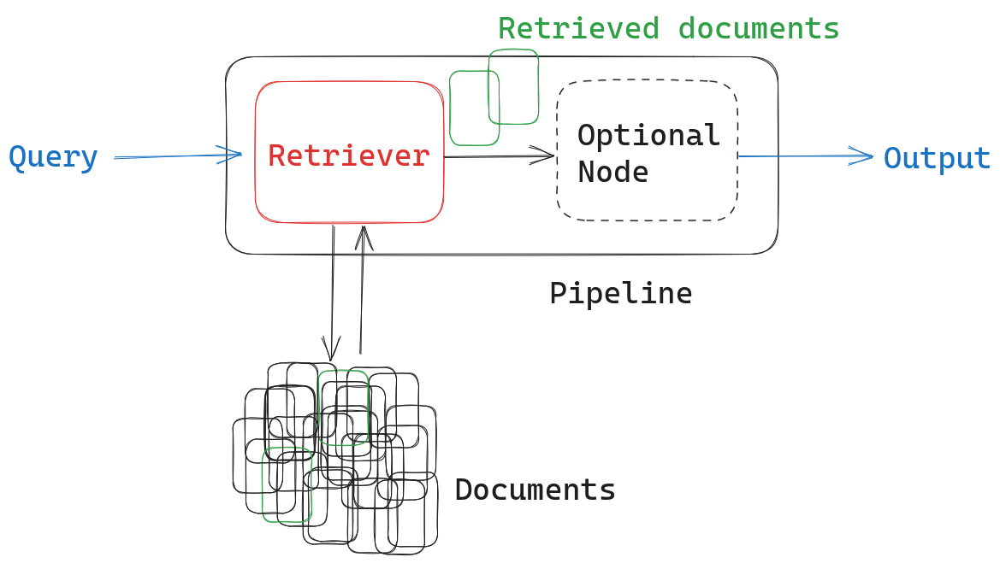
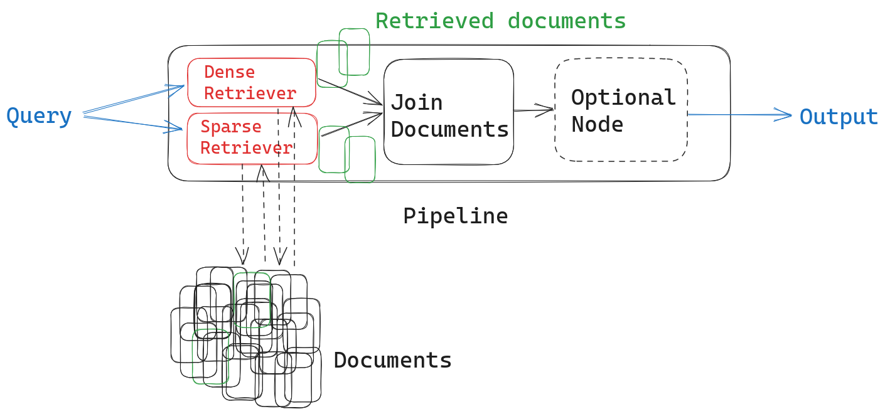
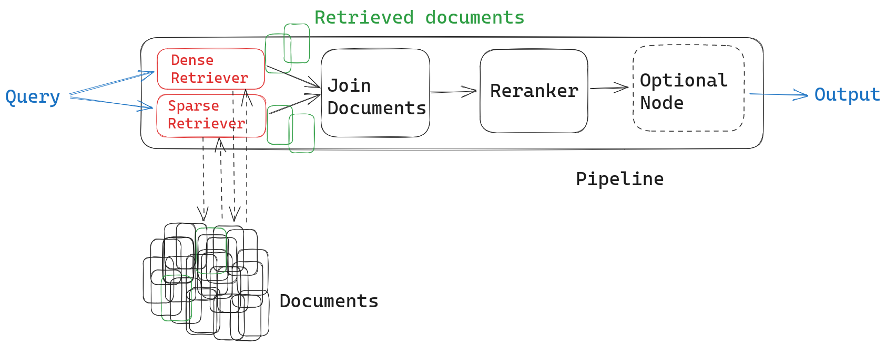

---
layout: blog-post
title: Hybrid Document Retrieval
description: Why use one retriever when you can have two?
featured_image: thumbnail.jpg
images: ["blog/hybrid-retrieval/thumbnail.jpg"]
alt_image: Three seedless water melons, the one in the middle is cut open.
toc: True
date: 2023-08-22
last_updated:  2023-08-22
authors:
  - Isabelle Nguyen
tags: ["Open Source", "Retrieval", "Text Embeddings"]
---	
Document retrieval is the art of extracting relevant documents from a corpus in response to an input. Like many language-related tasks today, it can benefit greatly from the dense, semantic embeddings produced by encoder models. These models have learned to embed documents in an abstract vector space that captures their content, allowing users to phrase their queries freely in natural language, rather than trying to match the exact keywords contained in a document.

  

Still, there are many scenarios where a more basic, keyword-based approach can outperform the semantic one. For example, keyword-based methods like BM25 have been shown to perform better in an out-of-domain setting.

  

That’s because dense encoder models need to be trained on data, and if that data is too different from the use case at hand, they’re likely to underperform. In practice, therefore, the keyword approach can yield better results for highly technical or “niche” use cases than an encoder model that hasn’t been fine-tuned.

  

Since both approaches have their advantages and disadvantages, it is a good idea to combine them. All you need is two retrievers and a way to merge their output. We also recommend using a ranker on top of them. As you’ll see, [Haystack](https://github.com/deepset-ai/haystack) makes it easy to put all these components together in a modular and reusable pipeline.

## Recap: what is document retrieval and why do we care?

In large-scale NLP systems, we often work with huge collections of documents. Now, what happens when we pass a query to such a system? It’s not really feasible to run a computationally demanding language model – like those used in generative AI or extractive question answering – on the entire corpus. Doing so would be a waste of resources and time. The solution? Retrievers.

  

Retrievers leverage different [document search techniques](https://www.deepset.ai/blog/art-of-finding-document-search) to extract the right documents from a database. In document search, each document is represented as a single vector. Thus, the retrieval module only needs to process one embedding per document. This is a highly efficient way to pre-select the right documents for subsequent processing steps.

  

Retrievers are super useful in their own right, as they drive most search applications. But they’re most often discussed in the context of composite systems or pipelines. As a pre-selection mechanism, retrievers extract related documents in response to a query. They then pass those documents on to downstream tasks like extractive QA, generative AI (in what’s known as [a RAG scenario](https://www.deepset.ai/blog/llms-retrieval-augmentation)) or summarization.

## What types of retrievers are there?

Retrievers can be roughly divided into two categories: on the one side, there’s the sparse, keyword-based approach à la Tf-Idf, on the other side, the dense, embedding-based approach that uses Transformers.

### Characteristics of the sparse approach

Sparse retrievers produce vectors whose length equals the size of the vocabulary. Because every document in the corpus only contains a fraction of all the words in the corpus, these vectors are typically sparse: long, with many zeroes, and only few non-zero values. The [sparse retrieval algorithm most commonly used today is BM25](https://docs.haystack.deepset.ai/docs/retriever#bm25-recommended), an improved version of the classic Tf-Idf.

  

Sparse embedding techniques are by definition lexical: they can only represent and match those words that are part of the vocabulary. They don’t require any training, making them language- and domain-agnostic.

### Characteristics of the dense approach

The biggest difference to the sparse approach is that a dense retriever requires data and training. During training, the language model learns how to best embed documents as vectors from the data itself.

  

Dense retrievers produce shorter vectors than their sparse counterparts. These condensed vectors consist mostly of scalar values, which [represent semantic features](https://www.deepset.ai/blog/the-beginners-guide-to-text-embeddings) instead of lexical occurrences. The features, which the model acquires during training, are harder to interpret than the sparse ones.

  

Because dense retriever models have learned to represent their training data, they’re likely to perform poorly on any use case that is out of that data’s domain. For example, an embedding model trained on Wikipedia articles may fail to handle tweets properly: the language used is too different. Similarly, a model trained on financial data will not be able to do a good job with medical reports.

  

While it is always possible to fine-tune an existing model, this requires data, resources, and the know-how.

### Combining dense and sparse retrievers

To address the weaknesses of both retrievers (or, more positively, to take advantage of both), we can simply use two retrievers in our pipeline and merge their output. Such a hybrid retrieval pipeline is easy to set up in a modular framework like Haystack.

## A hybrid retrieval pipeline in Haystack

Haystack uses modular pipelines and nodes to ensure straightforward customization. A basic retriever pipeline consists of an input (the query), a retriever node, optional additional nodes, and an output.

But we can easily customize the pipeline to contain two retriever nodes instead of only one. We just need to remember to combine the documents retrieved by both methods in a meaningful way. To do this, we’ll first use a [JoinDocuments node](https://docs.haystack.deepset.ai/docs/join_documents):

Both retrievers return ranked lists of results with relevance scores attached to each document (note that, since they employ different scoring techniques, the scores are not really meaningful in a hybrid retrieval setting). You can use different methods for joining these results lists. Which one you use – and whether you add another module on top of the JoinDocuments node – depends on your use case.

-   Concatenation: all documents (sans duplicates) are simply appended to the final list of results. This method is sufficient if you plan to use all the results and don’t care about their order. This could be the case, for example, in an extractive question answering pipeline. Concatenation can also be used in combination with a powerful ranking model – more on that later.
    
-   Reciprocal rank fusion (RRF): this formula reranks the documents returned by both retrievers, giving priority to those which appear in both results lists. Its purpose is to push the most relevant documents to the top of the list. It is useful if the order of your results is important, or if you only want to pass on a subset of your results to the next node.

-   Merging: documents are ranked according to the scores returned by the retrievers. This method is useful if you want to prioritize the results from one retriever over another – and if the relevance scores from retrievers are comparable. For example, if you want to join documents from two different dense retrievers because they return documents from different document stores. This option is not useful for hybrid retrieval.    

  

Depending on your application, you now have the option to add an intermediate ranking step after merging the documents. This is the most sophisticated method for ordering documents returned by two different retrievers. For example, if your pipeline uses a generative LLM or a summarizer as the next node, you can re-rank your documents to ensure that the most relevant ones are at the top for better results.

Adding a [SentenceTransformersRanker node](https://docs.haystack.deepset.ai/docs/ranker) produces the most relevant results, while also adding some latency. It uses a powerful cross-encoder trained to determine the relevance of a document to a given query – similar to the dense retriever’s embedding model, but with a slightly different architecture.

  

Unlike the embedding model used for retrieval, the ranker can only feasibly process a small number of documents, making it particularly suitable as a scoring mechanism after the retriever. Not only does it put the results of both retrievers in a more meaningful order, but it also standardizes the relevance scores of the documents, making it possible to use these scores for further downstream tasks.

## Superior search with Haystack

For a hands-on experience with hybrid retrieval, check out this [tutorial from Nicola](https://haystack.deepset.ai/tutorials/26_hybrid_retrieval), one of our community members. Follow along in Colab or in your IDE to see how you can build a hybrid retrieval pipeline in just a few lines of code!

[Haystack](https://github.com/deepset-ai/haystack/tree/main) is the framework of choice for developers looking to build powerful, yet easily customizable natural language search systems that leverage state-of-the-art language models from any source.

  

[Join our friendly Discord community](https://discord.com/invite/xYvH6drSmA) for help with questions regarding Haystack and open source NLP in general, as well as interesting discussions around the latest LLMs. Let’s build something amazing! 🚀