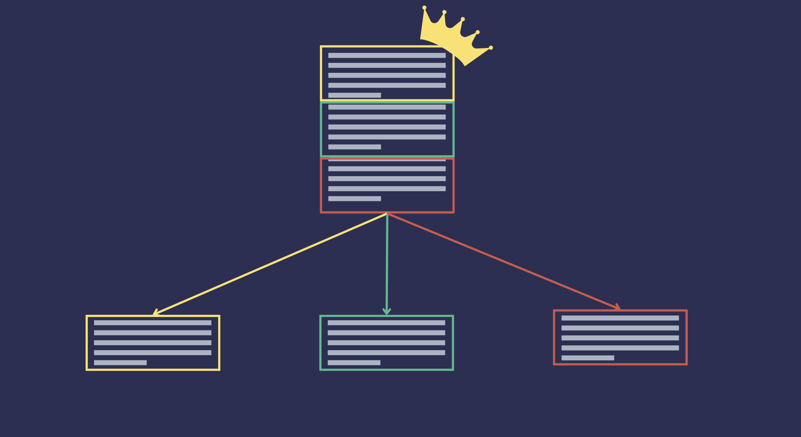

---
layout: blog-post
title: Improving Retrieval with Auto-Merging
description: Learn about the Hierarchical Document Splitter and Auto-Merging to improve retrieved context
featured_image: thumbnail.png
images: ["blog/improve-retrieval-with-auto-merging/thumbnail.png"]
toc: True
date: 2024-09-12
last_updated:  2024-09-12
cookbook: auto_merging_retriever.ipynb
authors:
  - David Batista
tags: ["Retrieval", "RAG"]
---	
For most RAG applications, where we first have to retrieve the most relevant context, we end up having to split up documents first, and index those smaller splits of documents. Reasons for this range from needing to retrieve only *relevant* sections of larger bits of documents to the simple fact that (although they’re improving massively) LLMs simply don’t have infinite context lengths.

Auto-Merging is a retrieval technique that leverages a hierarchical document structure. When a document is too long, it is split into smaller documents or chunks, where we can think of the smaller documents as the children of the original document and the original document as the parent. This results in a hierarchical tree structure where each smaller document is a child of a previous larger document. The leaves of the tree are the documents which don't have any children, and the root is the original document.



Auto-merging retrieval is a technique we can use if the parent document is likely to contain more of the relevant context about the information the user is after, in comparison to a subset of it’s child documents. When a query is made, the the retriever will normally return the top_k number of document chunks that are relevant to the query. However, if the number of retrieved document chunks that belong to the same parent document is above a certain threshold, the retriever would return the parent document instead of the individual chunks.

## Haystack Components

Haystack implements the Auto-Merging Retrieval with two components:

- [`HierarchicalDocumentSplitter`](https://docs.haystack.deepset.ai/reference/hierarchical-document-splitter): splits a Document into multiple Document objects of different block sizes, building a hierarchical tree structure where each smaller block is a child of a previous larger block. The `init` method expects three parameters:
    - `block_sizes`: Set of block sizes to split the document into. The blocks are split in descending order. So, `block_sizes` of {20, 5} would mean that each ‘parent’ split would be of length max 20, and and each of its children would be of length max 5.
    - `split_overlap`: The number of overlapping units for each split.
    - `split_by`: The unit for splitting your documents.
- [`AutoMergingRetriever`](https://docs.haystack.deepset.ai/reference/auto-merge-retriever): a retriever that leverages the hierarchical tree structure of documents, where the leaf nodes are indexed in a document store. During retrieval, if the number of matched leaf documents below the same parent is higher than a defined threshold, the retriever will return the parent document instead of the individual leaf documents. The `init` method expects three parameters:
    - `document_store`: DocumentStore from which to retrieve the parent documents
    - `threshold`: Threshold to decide whether the parent instead of the individual documents is returned

## Introductory Example

Let's see a simple example of how the `AutoMergingRetriever` works. In this example we will use a single document. We use the `HierarchicalDocumentSplitter` to split the document into chunks, represented by smaller documents, and capturing the hierarchical structure of the document.

```python
    from haystack import Document
    from haystack.components.preprocessors import HierarchicalDocumentSplitter

    docs = [Document(content="The monarch of the wild blue yonder rises from the eastern side of the horizon.")]
    splitter = HierarchicalDocumentSplitter(block_sizes={10, 3}, split_overlap=0, split_by="word")
    docs = splitter.run(docs)

```

We start by creating a document, and then we split it into smaller documents using the `HierarchicalDocumentSplitter`. We need to specify the block sizes that we want to split the document into. In this case, we are splitting the document into 10 and 3-word blocks - this means that the splitter will only have 2 levels, the first with a maximum of 10 words and the second a maximum of 3 words. There are no overlaps among the documents, and we also specify that we want to split the document by words. This results in 9 documents being created from the original document. The documents are split as follows:

```
`The monarch of the wild blue yonder rises from the eastern side of the horizon.` -- (root)
|
|
|
|--- `The monarch of the wild blue yonder rises from the`
|               |
|               |
|               |--- `The monarch of` -- (leaf)
|               |
|               |--- `the wild blue` -- (leaf)
|               |
|               |--- `yonder rises from` -- (leaf)
|               |
|               |--- `the` -- (leaf)
|
|
|--- `eastern side of the horizon.` -- (leaf)
|               |
|               |
|               |--- `eastern side of` -- (leaf)
|               |
|               |--- `the horizon.` -- (leaf)

```

Note that the original document is always the root of the tree. We then have two levels of children, the first with a maximum block size of 10 words, and the second with a maximum block size of 3 words.

We now need to split this documents into two distinct document stores. During initialization the `AutoMergingRetriever` requires the document store where the parent documents are indexed. At run time it receives leaf documents that matched a user query, it returns the parent document if the number of matched leaf documents below the same parent is higher than a defined threshold, otherwise it returns the original retrieved leaf documents. 

Let's see it in practice. We index the parent documents, by selecting the ones with a `__level` of 1.

```python
    from haystack.document_stores.in_memory import InMemoryDocumentStore

    parent_docs_store = InMemoryDocumentStore()
    parent_docs = [doc for doc in docs["documents"] if doc.meta["__level"]==1]
    parent_docs_store.write_documents(parent_docs)

```

Let's now initialize the `AutoMergingRetriever` with parent document store and a parent threshold of 0.5, meaning that if at least 50% of the leaf documents below the same parent match the query, the retriever will return the parent instead of the leaf documents which matched the user query. If we query the document store with a single leaf document, the retriever will return the same leaf document.

```python
    from haystack_experimental.components.retrievers import AutoMergingRetriever

    retriever = AutoMergingRetriever(document_store=parent_docs_store, threshold=0.5)
    retriever.run(matched_leaf_documents=[docs['documents'][4]])
```

If we now we query the document store with two leaf documents, the retriever will return the parent document instead of the individual leaf documents, as the threshold of 0.5 is met.

```python
    matched_leaf_documents = [docs['documents'][4], docs['documents'][5]]
    retriever.run(matched_leaf_documents=matched_leaf_documents)
```

This was a simple introductory example to show how `AutoMergingRetriever` works and retrieves parent documents instead of individual leaf documents. Next we will see a full example over news articles dataset.

## Advanced Example

We will use the BBC news dataset to show how the `AutoMergingRetriever` works with a dataset containing multiple news articles. This dataset consists of 2.225 documents from the [BBC](http://news.bbc.co.uk/) corresponding to stories in five topical areas collected between 2004-2005, and was part of work by D. Greene and P. Cunningham. ["Practical Solutions to the Problem of Diagonal Dominance in Kernel Document Clustering", Proc. ICML 2006](http://mlg.ucd.ie/files/publications/greene06icml.pdf).

### Reading the dataset

The original dataset is available at http://mlg.ucd.ie/datasets/bbc.html, but we are going to use a version that was already preprocessed and stored in a single CSV file available at the following URL: 

- https://raw.githubusercontent.com/amankharwal/Website-data/master/bbc-news-data.csv

```python
from typing import List
import csv
from haystack import Document

def read_documents(file: str) -> List[Document]:
    with open(file, "r") as file:
        reader = csv.reader(file, delimiter="\\t")
        next(reader, None)  # skip the headers
        documents = []
        for row in reader:
            category = row[0].strip()
            title = row[2].strip()
            text = row[3].strip()
            documents.append(Document(content=text, meta={"category": category, "title": title}))

    return documents
```

```
docs = read_documents("bbc-news-data.csv")
len(docs)
>> 2225
```

### Indexing the documents

After reading the converting the news articles  into Haystack Document objects, let’s now let’s index them. We will use as document store the`InMemoryDocumentStore` for the sake of simplicity. We first apply the `HierarchicalDocumentSplitter` to the list of Documents, creating a hierarchical structure

We will create two document stores, one for the parent documents, and one for the leaf documents. We will later say that there will be an intermediate retriever to match user query with the indexed leaf documents, this intermediate retriever will then be connected to an `AutoMergingRetriever` which decides for when to return the parent instead of the matched leaf documents.

The function below receives the news articles as Documents and filters them by the meta field `__level` to differentiate between children and parent Documents, indexing them in their respective document stores, which are then both returned by the function.

```python
from typing import Tuple

from haystack.document_stores.in_memory import InMemoryDocumentStore
from haystack.document_stores.types import DuplicatePolicy

from haystack_experimental.components.splitters import HierarchicalDocumentSplitter

def indexing(documents: List[Document]) -> Tuple[InMemoryDocumentStore, InMemoryDocumentStore]:
    splitter = HierarchicalDocumentSplitter(block_sizes={10, 5}, split_overlap=0, split_by="sentence")
    docs = splitter.run(documents)

    # store the leaf documents in one document store
    leaf_documents = [doc for doc in docs["documents"] if doc.meta["__level"] == 1]
    leaf_doc_store = InMemoryDocumentStore()
    leaf_doc_store.write_documents(leaf_documents, policy=DuplicatePolicy.SKIP)

    # store the parent documents in another document store
    parent_documents = [doc for doc in docs["documents"] if doc.meta["__level"] == 0]
    parent_doc_store = InMemoryDocumentStore()
    parent_doc_store.write_documents(parent_documents, policy=DuplicatePolicy.SKIP)

    return leaf_doc_store, parent_doc_store
```

### Querying the documents

Now that we have our document stores let’s construct a querying pipeline, consisting of a `BM25Retriever` associated with the document store containing the leaf documents, and an `AutoMergingRetriever` associated with the parent documents and with a threshold of 0.6, meaning that if at least 60% of the matched leaf documents belong to the same parent, their parent is returned instead of each individual Document.

```python
from haystack import Pipeline
from haystack.components.retrievers import InMemoryBM25Retriever
from haystack.components.retrievers import AutoMergingRetriever

def querying_pipeline(leaf_doc_store: InMemoryDocumentStore, parent_doc_store: InMemoryDocumentStore, threshold: float = 0.6):
    pipeline = Pipeline()
    bm25_retriever = InMemoryBM25Retriever(document_store=leaf_doc_store)
    auto_merge_retriever = AutoMergingRetriever(parent_doc_store, threshold=threshold)
    pipeline.add_component(instance=bm25_retriever, name="BM25Retriever")
    pipeline.add_component(instance=auto_merge_retriever, name="AutoMergingRetriever")
    pipeline.connect("BM25Retriever.documents", "AutoMergingRetriever.matched_leaf_documents")
    return pipeline

```

### Putting it all together

```python
docs = read_documents("bbc-news-data.csv")
leaf_doc_store, parent_doc_store = indexing(docs)
pipeline = querying_pipeline(leaf_doc_store, parent_doc_store, threshold=0.6)

```

So, now can run each function individually and have a querying pipeline that uses the `AutoMergingRetriever`. We can then use the pipeline to query the document store for articles related to cybersecurity, and let's also make use of the pipeline parameter `include_outputs_from` to also get the outputs from the `BM25Retriever` component.

```python
result = pipeline.run(data={'query': 'phishing attacks spoof websites spam e-mails spyware'},  include_outputs_from={'BM25Retriever'})
```

The `result` will have two keys, one for each retriever component: `AutoMergingRetriever`, `BM25Retriever`. 

Let's see how many documents were retrieved by each component.

```python

In [17]: len(result['AutoMergingRetriever']['documents'])
Out[17]: 7

In [18]: len(result['BM25Retriever']['documents'])
Out[18]: 10
```

As we can see, the `AutoMergingRetriever` retrieved 7 documents, while the `BM25Retriever` retrieved 10 documents. This is because the `AutoMergingRetriever` returned parent documents instead of individual leaf documents. Let's compare the titles of the documents retrieved by the `BM25Retriever` and the `AutoMergingRetriever`.

```python
doc_titles = sorted([d.meta['title'] for d in result['BM25Retriever']['documents']])
In [14]: doc_titles
Out[14]:
['Bad e-mail habits sustains spam',
 'Bad e-mail habits sustains spam',
 'Cyber crime booms in 2004',
 'Cyber criminals step up the pace',
 'Cyber criminals step up the pace',
 'Junk e-mails on relentless rise',
 'More women turn to net security',
 'Security scares spark browser fix',
 'Spam e-mails tempt net shoppers',
 'Spam e-mails tempt net shoppers']

```

```python
In [15]: doc_titles = sorted([d.meta['title'] for d in result['AutoMergingRetriever']['documents']])
In [16]: doc_titles
Out[16]:
['Bad e-mail habits sustains spam',
 'Cyber crime booms in 2004',
 'Cyber criminals step up the pace',
 'Junk e-mails on relentless rise',
 'More women turn to net security',
 'Security scares spark browser fix',
 'Spam e-mails tempt net shoppers']

```

Instead of returning individual leaf documents, the `AutoMergingRetriever` returned parent document for the articles: 

- “Bad e-mail habits sustains spam”,
- “Cyber criminals step up the pace”,
- “Spam e-mails tempt net shoppers”;

since at least 60% of the leaf documents of each of those documents matched the query.

## Conclusion

In this tutorial we saw how the `AutoMergingRetriever` works. One important aspect of the `AutoMergingRetriever` implementation in Haystack is that it requires the documents to be split using the `HierarchicalDocumentSplitter`. Another aspect to notice as we saw, is that the `AutoMergingRetriever` should be used in conjunction with other base `Retrievers` allowing for a more flexible retrieval system.