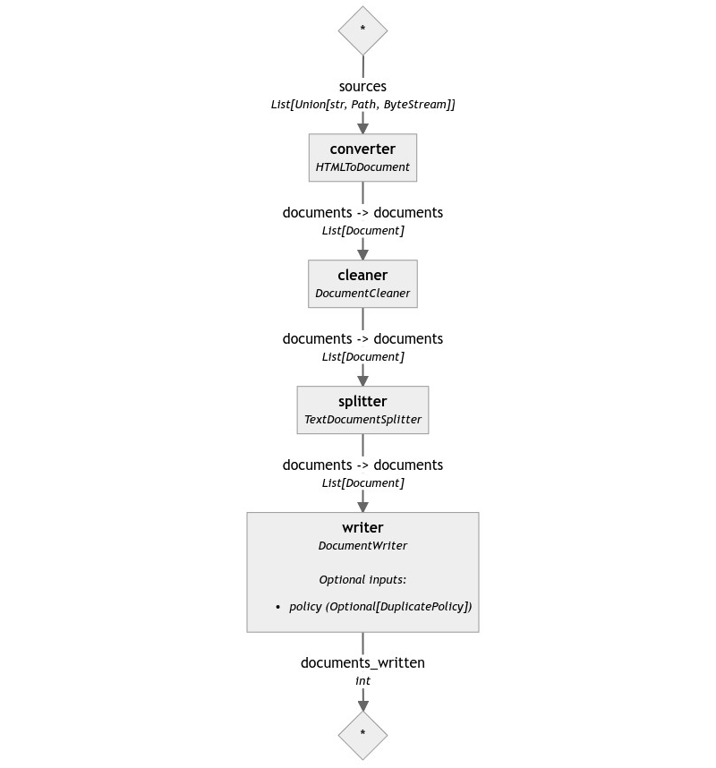

---
layout: blog-post
title: "Indexing data for RAG applications"
description: "RAG applications need clean and searchable data to help the LLM. Indexing pipelines are Haystack's answer to this often-forgotten issue."
featured_image: thumbnail.png
images: ["blog/indexing-data-for-rag-applications/thumbnail.png"]
alt_image: Postcard from the Republic of Rose Island, displaying the platform in black and white.
toc: True
date: 2023-11-05
last_updated:  2023-11-05
authors:
  - Sara Zanzottera
tags: ["Haystack 2.0"]
canonical_url: https://www.zansara.dev/posts/2023-11-05-haystack-series-minimal-indexing/
---	

In the previous post of the Haystack 2.0 series, we saw how to build RAG pipelines using a generator, a prompt builder, and a retriever with its document store. However, the content of our document store wasn't extensive, and populating one with clean, properly formatted data is not an easy task. How can we approach this problem?

In this post, I will show you how to use Haystack 2.0 to create large amounts of documents from a few web pages and write them a document store that you can then use for retrieval.

> 💡 *Do you want to see the code in action? Check out the [Colab notebook](https://colab.research.google.com/drive/155CtcumiK5w3wX6FWyM1dG3OqnhwnCqy?usp=sharing) or the [gist](https://gist.github.com/ZanSara/ba7efd241c61ccfd12ed48195e23bb34).*

> <i>⚠️ **Warning:**</i> *This code was tested on `haystack-ai==0.117.0`. Haystack 2.0 is still unstable, so later versions might introduce breaking changes without notice until Haystack 2.0 is officially released. The concepts and components, however, stay the same.*


# The task

In Haystack's terminology, the process of extracting information from a group of files and storing the data in a document store is called "indexing". The process includes, at the very minimum, reading the content of a file, generating a Document object containing all its text, and then storing it in a document store.

However, indexing pipelines often do more than this. They can process more than one file type, like .txt, .pdf, .docx, .html, audio, video, and images. Having many file types to convert, they route each file to the proper converter based on its type. Files tend to contain way more text than a normal LLM can chew, so they need to split those huge Documents into smaller chunks. Also, the converters are not perfect at reading text from the files, so they need to clean the data from artifacts such as page numbers, headers, footers, and so on. On top of all of this, if you plan to use a retriever that is based on embedding similarity, your indexing pipeline will also need to embed all documents before writing them into the store.

Sounds like a lot of work!

In this post, we will focus on the preprocessing part of the pipeline: cleaning, splitting, and writing documents. I will talk about the other functionalities of indexing pipelines, such as document embedding and multiple file types routing, in later posts.

# Converting files

As we've just seen, the most important task of this pipeline is to convert files into Documents. Haystack provides several converters for this task: at the time of writing, it supports:

- Raw text files (`TextFileToDocument`)
- HTML files, so web pages in general (`HTMLToDocument`)
- PDF files, by extracting text natively (`PyPDFToDocument`)
- Image files, PDFs with images, and Office files with images, by OCR (`AzureOCRDocumentConverter`)
- Audio files, doing transcription with Whisper either locally (`LocalWhisperTranscriber`) or remotely using OpenAI's hosted models (`RemoteWhisperTranscriber`)
- A ton of [other formats](https://tika.apache.org/2.9.1/formats.html), such as Microsoft's Office formats, thanks to [Apache Tika](https://tika.apache.org/) (`TikaDocumentConverter`)

For this example, let's assume we have a collection of web pages downloaded from the Internet. These pages are our only source of information and contain all we want our RAG application to know about.

In this case, our converter of choice is `HTMLToDocument`. `HTMLToDocument` is a Haystack component that understands HTML and can filter all the markup away, leaving only meaningful text. Remember that this is a file converter, not a URL fetcher: it can only process local files, such as a website crawl. Haystack provides some components to fetch web pages, but we will see them later.

Here is how you can use this converter:

```python
from haystack.preview.components.file_converters.html import HTMLToDocument

path = "Republic_of_Rose_Island.html"

converter = HTMLToDocument()
converter.run(sources=[path])

# returns {"documents": [Document(content="The Republic of Rose Isla...")]}
```

`HTMLToDocument` is a straightforward component that offers close to no parameters to customize its behavior. Of its API, one notable feature is its input type: this converter can take paths to local files in the form of strings or `Path` objects, but it also accepts `ByteStream` objects.

`ByteStream` is a handy Haystack abstraction that makes handling binary streams easier. If a component accepts `ByteStream` as input, you don't necessarily have to save your web pages to file before passing them to this converter. This allows components that retrieve large files from the Internet to pipe their output directly into this component without saving the data to disk first, which can save a lot of time.

# Cleaning the text

With `HTMLToDocument`, we can convert whole web pages into large Document objects. The converter typically does a decent job of filtering out the markup. Still, it's not always perfect. To compensate for these occasional issues, Haystack offers a component called `DocumentCleaner` that can remove noise from the text of the documents.

Just like any other component, `DocumentCleaner` is straightforward to use:

```python
from haystack.preview.components.preprocessors.document_cleaner import DocumentCleaner

cleaner = DocumentCleaner()
cleaner.run(documents=documents)
# returns {"documents": [Document(content=...), Document(content=...), ...]}
```

The effectiveness of `DocumentCleaner` depends a lot on the type of converter you use. Some flags, such as `remove_empty_lines` and `remove_extra_whitespace`, are minor fixes that can come in handy but usually have little impact on the quality of the results when used in a RAG pipeline. They can, however, make a vast difference for Extractive QA pipelines.

Other parameters, like `remove_substrings` or `remove_regex`, work very well but need manual inspection and iteration from a human to get right. For example, for Wikipedia pages, we could use these parameters to remove all instances of the word `"Wikipedia"`, which are undoubtedly many and irrelevant.

Finally, `remove_repeated_substrings` is a convenient method that removes headers and footers from long text, for example, books and articles. However, it works only for PDFs and, to a limited degree, for text files because it relies on the presence of form feed characters (`\f`), which are rarely present in web pages.

# Splitting the text

Now that the text is cleaned up, we can move onto a more exciting step: text splitting.

So far, each Document stored the content of an entire file. If a file was a whole book with hundreds of pages, a single Document would contain hundreds of thousands of words, which is clearly too much for an LLM to make sense of. Such a large Document is also challenging for Retrievers to understand because it contains so much text that it looks relevant to every possible question. To populate our document store with data that can be used effectively by a RAG pipeline, we need to chunk this data into much smaller Documents.

That's where `TextDocumentSplitter` comes into play.

> 💡 *With LLMs in a race to offer the [largest context window](https://magic.dev/blog/ltm-1) and research showing that such a chase is [counterproductive](https://arxiv.org/abs/2307.03172), there is no general consensus about how splitting Documents for RAG impacts the LLM's performance. What you need to keep in mind is that splitting implies a tradeoff. Huge documents will always be slightly relevant for every question, but they will bring a lot of context, which may or may not confuse the model. On the other hand, tiny Documents are much more likely to be retrieved only for questions they're highly relevant for, but they might provide too little context for the LLM to really understand their meaning. Tweaking the size of your Documents for the specific LLM you're using and the topic of your documents is one way to optimize your RAG pipeline, so be ready to experiment with different Document sizes before committing to one.*

How is it used?

```python
from haystack.preview.components.preprocessors.text_document_splitter import TextDocumentSplitter

text_splitter = TextDocumentSplitter(split_by="sentence", split_length=5)
text_splitter.run(documents=documents)

# returns {"documents": [Document(content=...), Document(content=...), ...]}
```

`TextDocumentSplitter` lets you configure the approximate size of the chunks you want to generate with three parameters: `split_by`, `split_length`, and `split_overlap`.

`split_by` defines the unit to use when splitting some text. For now, the options are `word`, `sentence`, and `passage` (paragraph), but we will soon add other options.

`split_length` is the number of the units defined above each document should include. For example, if the unit is `sentence`, `split_length=10` means that all your Documents will contain 10 sentences worth of text (except usually for the last document, which may have less). If the unit was `word`, it would instead contain 10 words.

`split_overlap` is the amount of units that should be included from the previous Document. For example, if the unit is `sentence` and the length is `10`, setting `split_overlap=2` means that the last two sentences of the first document will also be present at the start of the second, which will include only 8 new sentences for a total of 10. Such repetition carries over to the end of the text to split.

# Writing to the store

Once all of this is done, we can finally move on to the last step of our journey: writing the Documents into our document store. We first create the document store:

```python
from haystack.preview.document_stores import InMemoryDocumentStore

document_store = InMemoryDocumentStore()
```

and then use `DocumentWriter` to actually write the documents in:


```python
from haystack.preview.components.writers import DocumentWriter

writer = DocumentWriter(document_store=document_store)
writer.run(documents=documents_with_embeddings)
# returns {"documents_written": 120}
```

If you've read my previous post about RAG pipelines, you may wonder: why use `DocumentWriter` when we could call the `.write_documents()` method of our document store?

In fact, the two methods are fully equivalent: `DocumentWriter` does nothing more than calling the `.write_documents()` method of the document store. The difference is that `DocumentWriter` is the way to go if you are using a Pipeline, which is what we're going to do next.

# Putting it all together

We finally have all the components we need to go from a list of web pages to a document store populated with clean and short Document objects. Let's build a Pipeline to sum up this process:

```python
from haystack.preview import Pipeline

document_store = InMemoryDocumentStore()

pipeline = Pipeline()
pipeline.add_component("converter", HTMLToDocument())
pipeline.add_component("cleaner", DocumentCleaner())
pipeline.add_component("splitter", TextDocumentSplitter(split_by="sentence", split_length=5))
pipeline.add_component("writer", DocumentWriter(document_store=document_store))
pipeline.connect("converter", "cleaner")
pipeline.connect("cleaner", "splitter")
pipeline.connect("splitter", "writer")

pipeline.draw("simple-indexing-pipeline.png")

pipeline.run({"converter": {"sources": file_names}})
```



That's it! We now have a fully functional indexing pipeline that can take a list of web pages and convert them into Documents that our RAG pipeline can use. As long as the RAG pipeline reads from the same store we are writing the Documents to, we can add as many Documents as we need to keep the chatbot's answers up to date without having to touch the RAG pipeline.

To try it out, we only need to take the RAG pipeline we built in my previous post and connect it to the same document store we just populated:

```python
from haystack.preview.components.generators.openai.gpt import GPTGenerator
from haystack.preview.components.builders.prompt_builder import PromptBuilder
from haystack.preview.components.retrievers.in_memory_bm25_retriever import InMemoryBM25Retriever

template = """
Given the following information, answer the question: {{ question }}


    {{ document.content }}

"""
pipe = Pipeline()

pipe.add_component("retriever", InMemoryBM25Retriever(document_store=document_store))
pipe.add_component("prompt_builder", PromptBuilder(template=template))
pipe.add_component("llm", GPTGenerator(api_key=api_key))
pipe.connect("retriever", "prompt_builder.documents")
pipe.connect("prompt_builder", "llm")

question = "Is there any documentary about the story of Rose Island? Can you tell me something about that?"
pipe.run({
    "retriever": {"query": question},
    "prompt_builder": {"question": question}
})

# returns {
#     'llm': {
#         'replies': [
#             'Yes, there is a documentary about the story of Rose Island. It is 
#             called "Rose Island" and was released on Netflix on 8 December 2020. 
#             The documentary follows the true story of Giorgio Rosa, an Italian 
#             engineer who built his own island in the Adriatic sea in the late 
#             1960s. The island housed a restaurant, bar, souvenir shop, and even 
#             a post office. Rosa\'s goal was to have his self-made structure 
#             recognized as an independent state, leading to a battle with the 
#             Italian authorities. The film depicts the construction of the island 
#             and Rosa\'s refusal to dismantle it despite government demands. The 
#             story of Rose Island was relatively unknown until the release of the 
#             documentary. The film showcases the technology Rosa invented to build 
#             the island and explores themes of freedom and resilience.'
#         ],
#         'metadata': [...]
#     }
# }
```

And suddenly, our chatbot knows everything about Rose Island without us having to feed the data to the document store by hand.

# Wrapping up

Indexing pipelines can be powerful tools, even in their simplest form, like the one we just built. However, it doesn't end here: Haystack offers many more facilities to extend what's possible with indexing pipelines, like doing web searches, downloading files from the web, processing many other file types, and so on.

We will see how soon, so stay tuned!
