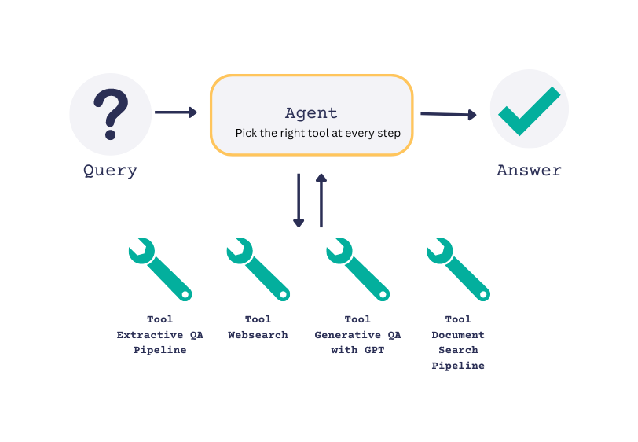
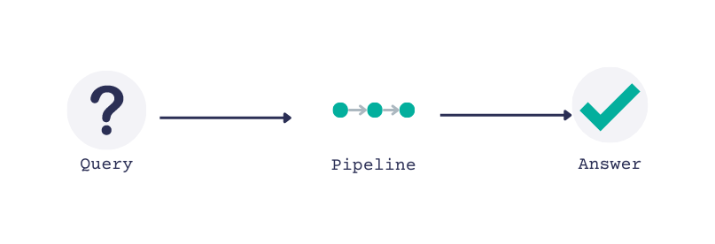
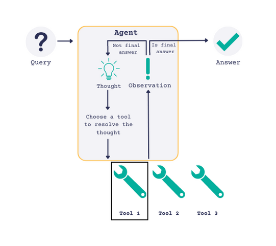

Wouldn’t it be cool if you could enter a query and an LLM makes decisions on-the-fly about what resources it needs to resolve the query? For example, that it needs to search the web and retrieve relevant resources. Or that it needs to search through your company files first. That’s now possible with Agents!

With the release of [Haystack 1.15](https://github.com/deepset-ai/haystack), we’re officially introducing the `Agent` to the Haystack ecosystem. The implementation of Agents is inspired by two papers: the [MRKL Systems paper](https://arxiv.org/abs/2205.00445) (pronounced ‘miracle’ 😉) and [the ReAct paper](https://arxiv.org/abs/2210.03629). If you like reading papers, I highly recommend these two. Here, I’ll explain how we’re introducing this functionality to Haystack.

Let’s first talk about what an Agent is, and then see how you can start using Agents in Haystack. First, we need to briefly talk about what a ‘prompt’ is.

## What is a Prompt?

Long story short, a prompt is an instruction. In the world of Natural Language Processing, these instructions can often be things like ‘Answer the given query’, or ‘Summarize the following piece of text’. In recent months, new large language models (LLMs) were made available, such as the ever improving GPT models by OpenAI (`text-davinci-003`, `gpt-3.5-turbo`, and GPT-4). These have shown great capability in consuming and acting on increasingly complex prompts.

Haystack users may already have encountered the [`PromptNode`](https://docs.haystack.deepset.ai/docs/prompt_node), which works alongside an LLM that consumes instructions. You have the option to define your own prompt in a `PromptTemplate`, or use one of our defaults.

For example, [here is a prompt](https://huggingface.co/spaces/deepset/should-i-follow/blob/482bee0f12c76147028acae160814a948cf6d945/utils/haystack.py#L14) that I defined in a `PromptTemplate` for the [‘Should I follow?’ demo on Hugging Face](https://huggingface.co/spaces/deepset/should-i-follow). Take a look if you’re interested in how to use custom prompts in Haystack!

In this case, I wanted to have a system that can tell me what type of things a Twitter user has been posting about. The prompt starts like this:

> You will be given a twitter stream belonging to a specific profile. Answer with a summary of what they've lately been tweeting about and in what languages. You may go into some detail about what topics they tend to like tweeting about. Please also mention their overall tone, for example: positive, negative, political, sarcastic or something else.

Why does this matter to understand Agents? Let’s have a look 👇

## What is an Agent?

Agents are a way to leverage this ability of LLMs to understand and act on prompts. In essence, an Agent is an LLM that has been given a very clever initial prompt. The prompt tells the LLM to break down the process of answering a complex query into a sequence of steps that are resolved one at a time.

Agents become _really_ cool when we combine them with ‘experts’, introduced in the MRKL paper. Simple example: an Agent might not have the inherent capability to reliably perform mathematical calculations by itself. However, we can introduce an expert - in this case a calculator, an expert at mathematical calculations. Now, when we need to perform a calculation, the Agent can call in the expert rather than trying to predict the result itself.

For example, an Agent that is asked “Who was the US president ten years ago today?”. A simplified view of the Agent’s thought process as it breaks down this question might look like this:

-   “I have to answer the question: What is today’s date?”
-   “Now I know todays date is 29th March 2023, I need to answer: what is 29 March 2023 minus 10 years?”
-   “Now I need to answer the question: Who was the US president on 29 of March 2013?”

At each step, the Agent may decide to make use of an expert to come to a resolution. Notice how it is able to figure out that it first has to ask a question, then perform a calculation with the answer, then finally ask another question. Whether it is able to do any of those things depends on which experts it has access to. In Haystack, these experts are called `Tools`.

## What are Tools?

In the world of the Agent, a Tool is an expert that the Agent can query at any time. For example, an Agent might be given a Tool that can search the web (let’s call it ‘Websearch’). If the Agent sees that there’s a need to search the web and it has the Websearch in its set of tools, it will use it.

With the release of Haystack 1.15, we are making it possible to give Haystack components (the Nodes, Pipelines and more) to an Agent as Tools. For example, a Tool might simply be an `ExtractiveQAPipeline`. This is a pipeline that has access to a DocumentStore which contains your own data and, given a query, uses an extractive question answering model to find an answer in your own data. With this Tool, your Agent can use the pipeline to query your own data whenever it sees fit.

Our first release of Agents will let you use several ready-made Haystack pipelines and Nodes as Tools: the `ExtractiveQAPipeline`, `DocumentSearchPipeline`, the `PromptNode`, the new `WebQAPipeline` and more. For a full list of available Tools, check out our [Agent documentation](https://docs.haystack.deepset.ai/docs/agent#tools). We will soon be expanding the list of Tools available out of the box, and you will be able to create your own custom Tools as well.

How does an Agent select a Tool? Each Tool comes with a `description`. This is arguably one of the most important attributes of a Tool, as it is used by the Agent to make the Tool selection. For example, the description of a Tool that does extractive question answering on docuemtns about USA presidents could be: 'Useful for when you need to answer questions about the presidents of the USA'.



Let's imagine that we do actually have our own data store containing information about US presidents. We create an `ExtractiveQAPipeline` for this data and supply it to our Agent as a Tool called ‘ExtractiveQATool’. When we ask the Agent a question, here’s what the output might look like:

> Question: What year was the 1st president of the USA born? 
>
> Thought: Let's think step-by-step, I first need to find out who the first president of the USA was. 
>
> Tool: ExtractiveQATool 
>
> Tool Input: **Who was the first president of the USA?** 
>
> Observation: **George Washington** 
>
> Thought: Now that I know who the first president of the USA was, I can use the same tool to find out when he was born. 
>
> Tool: ExtractiveQATool 
>
> Tool Input: **When was George Washington born?** 
>
> Observation: **February 22, 1732** 
>
> Thought: That's the answer to the question. 
>
> Final Answer: 1732

Pay attention to the highlighted sections of the output. Notice how the Agent goes step-by-step to come up with an action plan. Depending on what the next step is, it is able to select a Tool (in this case our ‘ExtractiveQATool’) to perform the desired action.

The options for these Tools are effectively limitless. It is up to you the user, to define your own Tools and decide which ones to give your Agent access to.

## What is the Difference between an Agent and a Pipeline?

Now let’s see how this differs from the Haystack Pipeline. A Pipeline is a powerful structure in Haystack. A simple pipeline might consist of:

-   A `Retriever`: finds the most relevant documents for a query.
-   A `Reader` looks at some piece of text and extracts an answer to a question from it.

When we run a pipeline with a query, data will flow from one node to the next (in our example: first retrieving documents and them extracting an answer from them), until it gets to the end of the pre-defined pipeline flow and outputs a result. That’s it. That’s where our time with you comes to an end, curtains close, we’re all happy. As you can see, a pipeline is inherently a one-pass system. And this is precisely where an Agent is different (very different) to a pipeline.



Where a Pipeline has a clear start and end, input and result, an Agent does not (although you may define the maximum number of iterations you will allow it). The core difference between these two structures is that while a Pipeline is designed to be a single-iteration system, an Agent is a many-iterations system. The number of iterations is defined by the Agent, which decides after each iteration whether it has come to a final answer or not. (Of course, with a system in place to prevent infinite loops!)



The Agent owes this talent to three things:

-   powerful LLMs that are able to consume increasingly complex instructions;
-   a well-defined prompt that defines the lifecycle of an Agent and causes it to continue until it has reached a solution; and
-   a set of Tools that are each good at doing something _really well._

## Customizing an Agent

You may have already noticed and started to use the `PromptNode` in Haystack. This node is an interface with LLMs such as `text-davinci-003` by OpenAI; the Flan T5 models by Google and so on.

At its core, the Agent is a `PromptNode` that has been given a specific prompt. By default, the Agent you will find in Haystack will be using the `PromptTemplate` called [“zero-shot-react”.](https://docs.haystack.deepset.ai/docs/agent#prompttemplate) However, you are free to create your own `PromptTemplate` and use that as the basis of your Agent.

The same goes for `Tools`. In Haystack, you can now turn virtually any Haystack component into a Tool that can be used by an Agent. This means you have the freedom to design and create Tools with your own Pipelines and Nodes, including the PromptNode. This makes Tools incredibly flexible and will allow you to add all sorts of capabilities to your agents.

## An Example of Creating and Adding Tools

For a walkthrough of creating an Agent and adding Tools to it, visit our first tutorial on how to [‘Answer Multihop Questions with Agents’.](https://haystack.deepset.ai/tutorials/23_answering_multihop_questions_with_agents) But here’s the simple idea behind it:

First, create a tool. Let’s assume the following pipeline:

```python
my_pipeline = ExtractiveQAPipeline(retriever=some_retriever, reader=some_reader)

```

This could become a tool as follows:

```python
from haystack.agents import Tool
my_qa_tool = Tool(name="ExtractiveQATool", pipeline_or_node=my_pipeline, 
                  description="Useful for when you need to answer questions related to Yoda", 
                  output_variable="answers")
```

Note that `description` property you supply to your Tool is really important. The descriptions will be used by your Agent to make its decision about which Tool to use for the task at hand.

Then, you would simply add this Tool to the set of Tools an Agent has access to. Or as I like to imagine it, you, as the all-seeing divinity in charge of the measly Agent, grant it the ability to (as per the description) use the “ExtractiveQATool” to “answer questions related to Yoda” 😊


```python
from haystack.agents import Agent
from haystack.nodes import PromptNode

prompt_node = PromptNode(model_name_or_path="text-davinci-003", api_key='OPENAI_API_KEY', stop_words=["Observation:"])

agent = Agent(prompt_node=prompt_node)

agent.add_tool(my_qa_tool)
```

We’re very excited to see how you use Agents and Tools in Haystack, and we can’t wait to start adding more capabilities and usability improvements. Join us on [Discord](https://discord.com/invite/xYvH6drSmA) or follow the activity in the [Haystack repo](https://github.com/deepset-ai/haystack) to see what's next for Haystack and the Agent