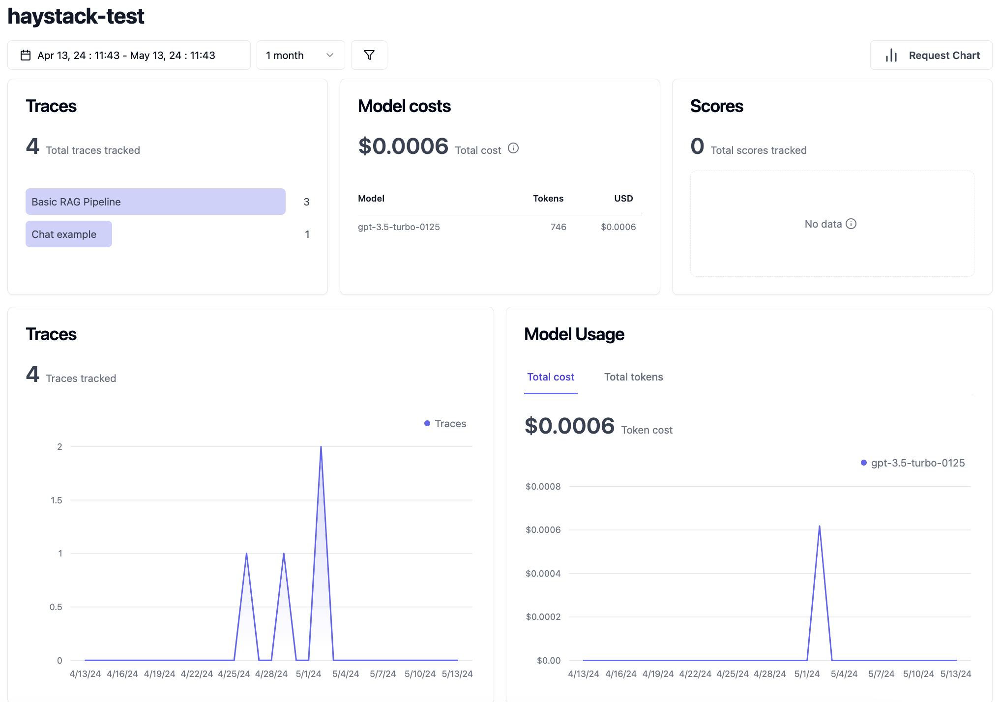
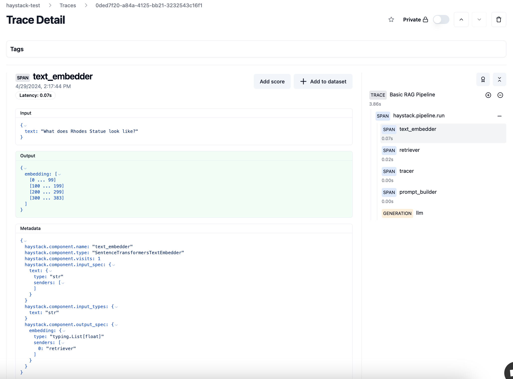
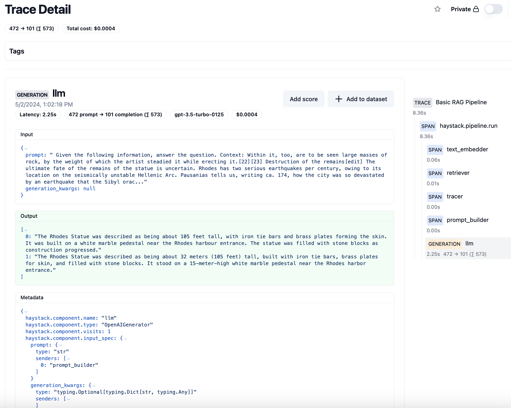
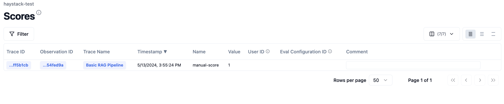

Getting your LLM application into production is a huge milestone, but that's only the beginning. It's critical to monitor how your pipeline is performing in the real world so you can keep improving performance and cost, and proactively address any issues that might arise. 

With the new [Haystack Langfuse integration](https://haystack.deepset.ai/integrations/langfuse), it's now easier than ever to have visibility into your pipelines. In this post, we'll explain more about Langfuse, and demonstrate how to trace an end to end request to a Haystack pipeline.

### What is Langfuse? 

Langfuse is an open source LLM engineering platform. It offers a ton of features to help you understand how your LLM application is performing under the hood.

### Langfuse features and benefits
- Track model usage and cost
- Collect user feedback
- Identify low-quality outputs
- Build fine-tuning and testing datasets
- Open source 💙
- Self-hosted version available
- Frequent releases with new features and improvements
- as of the time of this writing, free to try out 🤑

## Getting started

In order to use this integration, you'll need to [sign up for a Langfuse account](https://langfuse.com/). See [the Langfuse docs for the most up-to-date information](https://langfuse.com/docs) about features and pricing.

### Prerequisites

First, [sign up for an account on the Langfuse website](https://langfuse.com/). 

On the Langfuse dashboard, make a note of your `LANGFUSE_SECRET_KEY` and `LANGFUSE_PUBLIC_KEY`.  Set them as environment variables. While you're at it, set the `HAYSTACK_CONTENT_TRACING_ENABLED` environment variable to `true` in order to enable Haystack tracing in your pipeline.

The following code examples also require an `OPENAI_API_KEY` environment variable to be set. Haystack is model-agnostic and you can use [any model provider we support](https://docs.haystack.deepset.ai/docs/generators), by changing the generator in the code samples below.

### Installation 

To install the integration run the following command in your terminal:
```bash
pip install langfuse-haystack
```
To use Langfuse in a pipeline you'll need a few additional dependencies:

```bash
pip install sentence-transformers datasets
```

## Use Langfuse in a RAG pipeline

First, import all the modules you'll need.
```python
from datasets import load_dataset
from haystack import Document, Pipeline
from haystack.components.builders import PromptBuilder
from haystack.components.embedders import SentenceTransformersDocumentEmbedder, SentenceTransformersTextEmbedder
from haystack.components.generators import OpenAIGenerator
from haystack.components.retrievers import InMemoryEmbeddingRetriever
from haystack.document_stores.in_memory import InMemoryDocumentStore
from haystack_integrations.components.connectors.langfuse import LangfuseConnector
```

Next, write a function that takes a `DocumentStore` and returns a Haystack RAG pipeline. Add the [`LangfuseConnector`](https://docs.haystack.deepset.ai/docs/langfuseconnector) to your pipeline, but don't connect it to any other component in the pipeline.
```python
def get_pipeline(document_store: InMemoryDocumentStore):
    retriever = InMemoryEmbeddingRetriever(document_store=document_store, top_k=2)

    template = """
    Given the following information, answer the question.
    Context:
    
        {{ document.content }}
    
    Question: {{question}}
    Answer:
    """

    prompt_builder = PromptBuilder(template=template)

    basic_rag_pipeline = Pipeline()
    # Add components to your pipeline
    basic_rag_pipeline.add_component("tracer", LangfuseConnector("Basic RAG Pipeline"))
    basic_rag_pipeline.add_component(
        "text_embedder", SentenceTransformersTextEmbedder(model="sentence-transformers/all-MiniLM-L6-v2")
    )
    basic_rag_pipeline.add_component("retriever", retriever)
    basic_rag_pipeline.add_component("prompt_builder", prompt_builder)
    basic_rag_pipeline.add_component("llm", OpenAIGenerator(model="gpt-3.5-turbo", generation_kwargs={"n": 2}))

    # Now, connect the components to each other
    # NOTE: the tracer component doesn't need to be connected to anything in order to work
    basic_rag_pipeline.connect("text_embedder.embedding", "retriever.query_embedding")
    basic_rag_pipeline.connect("retriever", "prompt_builder.documents")
    basic_rag_pipeline.connect("prompt_builder", "llm")

    return basic_rag_pipeline
```

Now, instantiate the pipeline using an `InMemoryDocumentStore` to keep things simple. Generate some embeddings based on the [7 wonders of the world dataset](https://huggingface.co/datasets/bilgeyucel/seven-wonders), and populate them into our document store. If you were running this code in production, you'd probably want to use an indexing pipeline to load the data into the store, but for demo purposes this approach reduces complexity.

```python
document_store = InMemoryDocumentStore()
dataset = load_dataset("bilgeyucel/seven-wonders", split="train")
embedder = SentenceTransformersDocumentEmbedder("sentence-transformers/all-MiniLM-L6-v2")
embedder.warm_up()
docs_with_embeddings = embedder.run([Document(**ds) for ds in dataset]).get("documents") or []  # type: ignore
document_store.write_documents(docs_with_embeddings)
```
Run the pipeline and ask it a question.
```python
pipeline = get_pipeline(document_store)
question = "What does Rhodes Statue look like?"
response = pipeline.run({"text_embedder": {"text": question}, "prompt_builder": {"question": question}})
```
Setting the `HAYSTACK_CONTENT_TRACING_ENABLED` environment variable automatically traces every request that the pipeline runs. If all goes well you should receive something like the following output:
```python
# {'tracer': {'name': 'Basic RAG Pipeline', 'trace_url': 'https://cloud.langfuse.com/trace/3d52b8cc-87b6-4977-8927-5e9f3ff5b1cb'}, 'llm': {'replies': ['The Rhodes Statue was described as being about 105 feet tall, with iron tie bars and brass plates forming the skin. It was built on a white marble pedestal near the Rhodes harbour entrance. The statue was filled with stone blocks as construction progressed.', 'The Rhodes Statue was described as being about 32 meters (105 feet) tall, built with iron tie bars, brass plates for skin, and filled with stone blocks. It stood on a 15-meter-high white marble pedestal near the Rhodes harbor entrance.'], 'meta': [{'model': 'gpt-3.5-turbo-0125', 'index': 0, 'finish_reason': 'stop', 'usage': {'completion_tokens': 100, 'prompt_tokens': 453, 'total_tokens': 553}}, {'model': 'gpt-3.5-turbo-0125', 'index': 1, 'finish_reason': 'stop', 'usage': {'completion_tokens': 100, 'prompt_tokens': 453, 'total_tokens': 553}}]}}
```
Dumping tracing output in the terminal, is pretty cool, but the integration also sends the info to Langfuse. The Langfuse dashboard has a much more comprehensive and beautiful UI so you can make sense of your pipeline. Let's hop over there and take a look.

## Use Langfuse in a RAG pipeline with chat
Agent and chat use cases are rising in popularity. If you wanted to use the integration to trace a pipeline that includes a chat generator component, here's an example of how to do so.
```python
from haystack import Pipeline
from haystack.components.builders import DynamicChatPromptBuilder
from haystack.components.generators.chat import OpenAIChatGenerator
from haystack.dataclasses import ChatMessage
from haystack_integrations.components.connectors.langfuse import LangfuseConnector

pipe = Pipeline()
pipe.add_component("tracer", LangfuseConnector("Chat example"))
pipe.add_component("prompt_builder", DynamicChatPromptBuilder())
pipe.add_component("llm", OpenAIChatGenerator(model="gpt-3.5-turbo"))

pipe.connect("prompt_builder.prompt", "llm.messages")
messages = [
    ChatMessage.from_system("Always respond in German even if some input data is in other languages."),
    ChatMessage.from_user("Tell me about {{location}}"),
]

response = pipe.run(
    data={"prompt_builder": {"template_variables": {"location": "Berlin"}, "prompt_source": messages}}
)
print(response["llm"]["replies"][0])
print(response["tracer"]["trace_url"])
# ChatMessage(content='Berlin ist die Hauptstadt von Deutschland und zugleich eines der bekanntesten kulturellen Zentren Europas. Die Stadt hat eine faszinierende Geschichte, die bis in die Zeiten des Zweiten Weltkriegs und des Kalten Krieges zurückreicht. Heute ist Berlin für seine vielfältige Kunst- und Musikszene, seine historischen Stätten wie das Brandenburger Tor und die Berliner Mauer sowie seine lebendige Street-Food-Kultur bekannt. Berlin ist auch für seine grünen Parks und Seen beliebt, die den Bewohnern und Besuchern Raum für Erholung bieten.', role=<ChatRole.ASSISTANT: 'assistant'>, name=None, meta={'model': 'gpt-3.5-turbo-0125', 'index': 0, 'finish_reason': 'stop', 'usage': {'completion_tokens': 137, 'prompt_tokens': 29, 'total_tokens': 166}})
# https://cloud.langfuse.com/trace/YOUR_UNIQUE_IDENTIFYING_STRING
```

## Explore the Langfuse dashboard
Once you’ve run these code samples, [head over to the Langfuse dashboard](https://langfuse.com/docs/demo) to see and interact with traces. As of the time of this writing, the demo is free to try.



### Trace Detail 

Trace details show  cost and latency for a specific end-to-end request. This data is helpful for estinating usage and cost of a RAG application in production. For example, here is the trace detail for the text embedder step of the pipeline we just ran. For [a comprehensive explanation of LLM tracing, see the Langfuse docs](https://langfuse.com/docs/tracing).



The right sidebar shows latency for every step of the pipeline, which helps to pinpoint performance bottlenecks.

Trace details that are tagged "generation" also show the monetary cost of the request. 



Traces can also be segmented by user or by session, so you can more granularly understand the user's journey. 

### Evaluation
Evaluation helps us understand the quality of the results the LLM application is returning to the end user. There are currently 4 ways to add scores into Langfuse:
- Manual evaluation
- User feedback
- Model-based evaluation
- Custom via SDKs/API

For the sake of time, this post will only cover manual evaluation, but [see the Langfuse docs for comprehensive info on all the evaluation methods](https://langfuse.com/docs/scores/overview). 

Clicking on a trace, you can manually add a score to note the quality of that specific request.

For this trace, the `input` shows us our prompt, interpolated with the actual context that was passed to the LLM. Cool!

```
Input:

    Given the following information, answer the question.
    Context:
    
        Within it, too, are to be seen large masses of rock, by the weight of which the artist steadied it while erecting it.[22][23]
Destruction of the remains[edit]
The ultimate fate of the remains of the statue is uncertain. Rhodes has two serious earthquakes per century, owing to its location on the seismically unstable Hellenic Arc. Pausanias tells us, writing ca. 174, how the city was so devastated by an earthquake that the Sibyl oracle foretelling its destruction was considered fulfilled.[24] This means the statue could not have survived for long if it was ever repaired. By the 4th century Rhodes was Christianized, meaning any further maintenance or rebuilding, if there ever was any before, on an ancient pagan statue is unlikely. The metal would have likely been used for coins and maybe also tools by the time of the Arab wars, especially during earlier conflicts such as the Sassanian wars.[9]
The onset of Islamic naval incursions against the Byzantine empire gave rise to a dramatic account of what became of the Colossus. 
    
        Construction[edit]
Timeline and map of the Seven Wonders of the Ancient World, including the Colossus of Rhodes
Construction began in 292 BC. Ancient accounts, which differ to some degree, describe the structure as being built with iron tie bars to which brass plates were fixed to form the skin. The interior of the structure, which stood on a 15-metre-high (49-foot) white marble pedestal near the Rhodes harbour entrance, was then filled with stone blocks as construction progressed.[14] Other sources place the Colossus on a breakwater in the harbour. According to most contemporary descriptions, the statue itself was about 70 cubits, or 32 metres (105 feet) tall.[15] Much of the iron and bronze was reforged from the various weapons Demetrius's army left behind, and the abandoned second siege tower may have been used for scaffolding around the lower levels during construction.

    
    Question: What does Rhodes Statue look like?
    Answer:
    
```
```
Output:
The Rhodes Statue was described as being about 105 feet tall, with iron tie bars and brass plates forming the skin. It was built on a white marble pedestal near the Rhodes harbour entrance. The statue was filled with stone blocks as construction progressed."
1: "The Rhodes Statue was described as being about 32 meters (105 feet) tall, built with iron tie bars, brass plates for skin, and filled with stone blocks. It stood on a 15-meter-high white marble pedestal near the Rhodes harbor entrance."
]
```
This seems like a decent quality response, based on the inputs and outputs. Click on the "Add score" button and give it a score of 1. The score is even editable, in case you make a mistake.

Now clicking on the "Scores" section, the score we added is visible. Over time, this data helps build a comprehensive picture of the quality of our LLM application.



## Wrapping it up 

If you've been following along, today you've learned:
- How Langfuse can help give you better visibility into your Haystack pipelines, giving you confidence to ship into production
- How to integrate Langfuse into Haystack RAG and chat pipelines
- The basics of LLM tracing and evaluation with the Langfuse dashboard

For a small team, Langfuse ships new features with incredible velocity. We can't wait to see what they build next. To stay in the loop for future updates, be sure to follow [Langfuse](https://x.com/langfuse) and [Haystack](https://twitter.com/haystack_ai) on Twitter. Thanks for reading! 