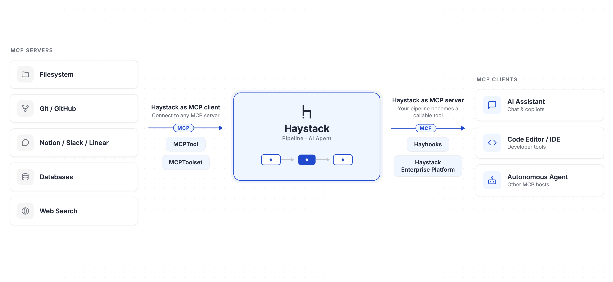

The Model Context Protocol (MCP) is the connective tissue of the modern AI stack. If you are building AI agents or production RAG systems, understanding how MCP works with Haystack is one of the most direct ways to make your applications composable, reusable, and reachable from the tools your users already live in.

This blog post explains what MCP is, why it matters, and the different ways you can use MCP with Haystack, whether you want to *consume* external tools inside a Haystack agent or *expose* your Haystack pipelines and agents as MCP tools for MCP clients like Claude, ChatGPT, and Cursor.

## What is MCP (Model Context Protocol)?

The [Model Context Protocol (MCP)](https://modelcontextprotocol.io/) is an open standard that defines how AI applications connect to external tools, data sources, and services. The common analogy is that MCP is the "USB-C of AI": instead of writing a bespoke integration for every model and every assistant, you implement the protocol once and any MCP-compatible client can use it.

An MCP setup has two sides:

- **MCP servers** expose capabilities (tools, prompts, resources) over a standardized interface.
- **MCP clients** (an LLM application, an agent, or an AI assistant like Claude Code, ChatGPT, or Cursor) discover those capabilities and call them at runtime.

A "tool" in MCP terms is just a callable with a name, a description, and a JSON Schema describing its inputs. That small, standardized contract is what makes the whole ecosystem interoperable.

> ⚠️ **Security note:** MCP servers may introduce security risks. Exercise caution when connecting to MCP servers to ensure they do not expose sensitive data or perform malicious or unsafe actions.

## Why MCP and Haystack are a strong combination

[Haystack](https://docs.haystack.deepset.ai/docs/intro) is an open-source AI framework for building production-ready agents, RAG applications, and multimodal search systems out of reusable components and pipelines. MCP and Haystack complement each other in both directions:

- **Haystack as an MCP client.** Your agent gains instant access to a growing ecosystem of MCP servers (filesystem, Git/GitHub, databases, web search, internal services) without you having to hand-roll each integration.
- **Haystack as an MCP server.** The retrieval logic, agentic workflows, and domain knowledge you have already encoded in a pipeline become callable from any MCP client. You build the capability once and it shows up wherever your users work.



The payoff for AI engineers is **composability and reach**. A single agentic flow can pull data from a Haystack RAG pipeline, hand off to a live web-context MCP tool, and route through another pipeline for structured output, connecting your own logic with external tools instead of re-implementing everything inside one monolithic agent.

The rest of this guide covers *three* concrete approaches:

1. Use MCP servers as tools inside a Haystack Agent ([`MCPTool`](https://docs.haystack.deepset.ai/docs/mcptool), [`MCPToolset`](https://docs.haystack.deepset.ai/docs/mcptoolset), and [`SearchableToolset`](https://docs.haystack.deepset.ai/docs/searchabletoolset))
2. Deploy any Haystack pipeline or agent as an MCP server with **Hayhooks**.
3. Expose Haystack pipelines/agents as managed MCP tools on the **Haystack Enterprise Platform**.

These approaches are not mutually exclusive. You can connect a Haystack agent to MCP servers, then expose that same agent as an MCP tool via Hayhooks or the Haystack Enterprise Platform.

## Approach 1: Haystack as an MCP client  

Using MCP servers as tools is the most common entry point. You have a Haystack [`Agent`](https://docs.haystack.deepset.ai/docs/agent) and you want it to be able to call tools that live behind an MCP server. In practice, you can combine `MCPTool` and `MCPToolset` from the `mcp-haystack` integration with Haystack's `SearchableToolset` for larger catalogs.

```shell
pip install mcp-haystack
```

### `MCPTool`: bind a single MCP tool

`MCPTool` connects to an MCP server and exposes **one specific tool** to your agent. This gives you precise control over exactly which capability the LLM can reach. It supports Streamable HTTP and stdio transports.

Here is a single MCP tool wired directly into a Haystack `Agent` (using the official `mcp-server-time` server):

```python
# pip install ollama-haystack
from haystack.components.agents import Agent
from haystack.components.generators.chat import OllamaChatGenerator
from haystack.dataclasses import ChatMessage
from haystack_integrations.tools.mcp import MCPTool, StdioServerInfo

time_tool = MCPTool(
    name="get_current_time",
    server_info=StdioServerInfo(
        command="uvx",
        args=["mcp-server-time", "--local-timezone=Europe/Berlin"],
    ),
)

agent = Agent(
    chat_generator=OllamaChatGenerator(model="gemma4:e4b"),
    tools=[time_tool],
)

response = agent.run(
    messages=[ChatMessage.from_user("What is the time in New York? Be brief.")],
)
print(response["last_message"].text)
```
Result:
```bash
8:42 AM Thursday (New York)
```

> The Agent component is model-agnostic, so you can swap in any Haystack chat generator your stack supports.

To connect to a remote server instead, swap the transport:

```python
from haystack_integrations.tools.mcp import MCPTool, StreamableHttpServerInfo

server_info = StreamableHttpServerInfo(url="http://localhost:8000/mcp")
tool = MCPTool(name="my_tool", server_info=server_info)
```

### `MCPToolset`: load a whole server's tools at once

`MCPToolset` connects to an MCP server and automatically discovers and loads its tools into a single, manageable unit. It is a subclass of Haystack's `Toolset`, so it plugs directly into a Chat Generator, a `ToolInvoker`, or an `Agent`.

The key feature for controlling agent behavior is the `tool_names` filter, which lets you decide exactly which tools from the server your agent is allowed to use. Here is a practical example with the [official filesystem MCP server](https://github.com/modelcontextprotocol/servers/tree/main/src/filesystem):

```python
# pip install mistral-haystack
from haystack.components.agents import Agent
from haystack.components.generators.chat import MistralChatGenerator
from haystack.dataclasses import ChatMessage
from haystack_integrations.tools.mcp import MCPToolset, StdioServerInfo

toolset = MCPToolset(
    server_info=StdioServerInfo(
        command="npx",
        args=["-y", "@modelcontextprotocol/server-filesystem", "/Users/you/projects"],
    ),
    tool_names=["list_directory", "read_file"],  # restrict to safe read-only actions
)

agent = Agent(
    chat_generator=MistralChatGenerator(model="mistral-medium-3-5"),
    tools=toolset,
    exit_conditions=["text"],
)

response = agent.run(
    messages=[ChatMessage.from_user("List markdown files in /Users/you/projects/docs and summarize them.")]
)
print(response["last_message"].text)
```
Response:
```bash
Here are the Markdown files in the repo root and a brief summary of each:...
```

> **Tip:** If you omit `tool_names`, the toolset loads every tool the server offers. Be careful here, exposing 20–30+ tools at once can overwhelm the LLM's tool-selection logic and degrade accuracy. Curating the tool list is one of the simplest reliability wins you can make.
 
### `SearchableToolset`: scale to large tool catalogs

As soon as you connect multiple MCP servers, you hit a hard problem: too many tools. Every tool definition (name, description, input schema) is injected into the LLM's context on every turn. A catalog of dozens or hundreds of tools bloats the context window, raises cost and latency, and makes the model worse at picking the right tool.

`SearchableToolset` is Haystack's answer to this **context management** challenge. Instead of exposing every tool up front, it exposes a single bootstrap tool, `search_tools`, that the agent uses to discover relevant tools on demand via BM25 keyword search. Once the agent searches, the matching tools become immediately available for it to call in subsequent iterations.

Crucially, the catalog can contain `MCPTool` and `MCPToolset` instances, so you can place many MCP servers behind one searchable, context-efficient interface:

```python
import os

from haystack.components.agents import Agent
from haystack.dataclasses import ChatMessage
from haystack.tools import SearchableToolset
from haystack.components.generators.chat import OpenAIChatGenerator
from haystack_integrations.tools.mcp import MCPToolset, StdioServerInfo, StreamableHttpServerInfo
# Pull tools from several MCP servers into one catalog
fetch_tools = MCPToolset(
    server_info=StdioServerInfo(command="uvx", args=["mcp-server-fetch"]),
)
github_tools = MCPToolset(
    server_info=StreamableHttpServerInfo(
        url="https://api.githubcopilot.com/mcp/",
        headers={"Authorization": f"Bearer {os.environ['GITHUB_PAT']}"},
    ),
)

catalog = [fetch_tools, github_tools] # can be dozens of tools
toolset = SearchableToolset(catalog=catalog, top_k=3, search_threshold=8)

agent = Agent(
    chat_generator=OpenAIChatGenerator(model="gpt-5.4-mini"),
    tools=toolset,
)

result = agent.run(
    messages=[
        ChatMessage.from_user(
            "Check the open PRs on haystack integrations repo "
            "(deepset-ai/haystack-integrations) and create a social media post "
            "about the most interesting ones."
        )
    ]
)

print(result["last_message"].text)
```
Result:
```bash
Here’s a draft social post highlighting the most interesting open PRs in `deepset-ai/haystack-integrations`....
```

In this setup, the [Fetch MCP Server](https://github.com/modelcontextprotocol/servers/tree/main/src/fetch) runs over stdio, while the [GitHub MCP Server](https://github.com/github/github-mcp-server) uses the official remote MCP endpoint over Streamable HTTP. If your MCP host supports OAuth, you can authenticate with that remote server without passing a PAT header manually.

> ⚠️ **Fetch MCP caution:** The Fetch MCP Server can access local/internal IP addresses and may introduce security risk. Use it carefully to avoid exposing sensitive data.

This pattern keeps the agent's prompt lean while still giving it access to a large universe of capabilities, exactly the kind of context engineering that separates a demo from a production agent. Learn more about context management in [Blog Post: Context Engineering for Agentic Systems](https://haystack.deepset.ai/blog/context-engineering)

## Approach 2: Haystack as an MCP server using Hayhooks

The first approach makes Haystack an MCP *client*. Now let's flip it around. [Hayhooks](https://deepset-ai.github.io/hayhooks) is deepset's tool for serving Haystack pipelines and agents over HTTP, and it can also act as an **MCP server**. This means any Haystack application, a defined pipeline or a full agent, can be exposed as an MCP tool and connected to MCP clients like Claude, ChatGPT, Cursor, or any other agent.

### Getting started

```shell
pip install hayhooks[mcp]
hayhooks mcp run
```

This starts the MCP server on `localhost:1417` by default (configurable via `HAYHOOKS_MCP_HOST` and `HAYHOOKS_MCP_PORT`). It speaks Streamable HTTP at `/mcp`.

### How a pipeline becomes a tool

When you deploy a pipeline with a `PipelineWrapper`, Hayhooks automatically turns it into an MCP tool. The magic is in the `run_api` method and its docstring:

- The wrapper `name` becomes the MCP tool `name`.
- The first line of the `run_api` docstring becomes the tool `description`.
- The `run_api` method arguments and their type hints become the tool's `inputSchema`.

```python
from pathlib import Path
from haystack import Pipeline
from hayhooks import BasePipelineWrapper


class PipelineWrapper(BasePipelineWrapper):
    def setup(self) -> None:
        pipeline_yaml = (Path(__file__).parent / "my_haystack_pipeline.yml").read_text()
        self.pipeline = Pipeline.loads(pipeline_yaml)

    def run_api(self, urls: list[str], question: str) -> str:
        """
        Ask a question about one or more websites using a Haystack pipeline.

        Args:
            urls: List of website URLs to analyze
            question: Question to ask about the content
        """
        result = self.pipeline.run(
            {"fetcher": {"urls": urls}, "prompt": {"query": question}}
        )
        return result["llm"]["replies"][0]
```

Because the input schema is derived from your method signature, Hayhooks validates inputs automatically. 

### Connecting your IDE or assistant

To use your deployed pipeline from MCP clients, add the server in MCP settings like this:

```json
{
  "mcpServers": {
    "hayhooks": {
      "url": "http://localhost:1417/mcp"
    }
  }
}
```

Once configured, you can deploy, manage, and run your Haystack pipelines directly from chat. Hayhooks also exposes **core tools** (`deploy_pipeline`, `undeploy_pipeline`, `get_pipeline_status`, `get_all_pipeline_statuses`) so an assistant can manage your deployments through natural language.

This approach is ideal when you self-host and want full control over the infrastructure, while still getting standardized MCP access for free. Learn about the details of how to use Hayhooks as an MCP Server [here](https://deepset-ai.github.io/hayhooks/features/mcp-support).

## Approach 3: Haystack as an MCP server using Haystack Enterprise Platform

Self-hosting an MCP server works, but production MCP tools need governance: authentication, access control, scaling, and observability. The [Haystack Enterprise Platform](https://docs.cloud.deepset.ai/docs/getting-started) provides all of this as a managed service, so you can turn any deployed pipeline into an MCP tool without standing up extra infrastructure.

The workflow is straightforward:

1. Build and deploy your pipeline in the platform.
2. Create a single **workspace MCP server**.
3. Enable individual pipelines as tools (toggling **Use as MCP tool** in each pipeline's settings), optionally with a custom tool name and description.
4. Copy the generated client configuration and connect your assistant.

MCP client configuration looks like this (the platform generates it for you):

```json
{
  "mcpServers": {
    "haystack-enterprise": {
      "url": "https://api.cloud.deepset.ai/api/v2/workspaces/<your-workspace-id>/mcp",
      "headers": {
        "Authorization": "Bearer your-api-key"
      }
    }
  }
}
```

You can read the full walkthrough in the [Haystack Enterprise Platform docs](https://docs.cloud.deepset.ai/docs/use-pipeline-as-mcp-tool).

### Haystack Docs MCP Server

A concrete example of this pattern running in production: **we just launched a docs MCP server**. Under the hood it is a Haystack pipeline that performs document search over the Haystack documentation, deployed on the Haystack Enterprise Platform and exposed as an MCP server. It is the exact same pipeline that powers the search functionality on the [Haystack documentation site](https://docs.haystack.deepset.ai/docs/intro).

This is what the whole idea looks like end to end: one retrieval pipeline serves the docs search UI *and* becomes a callable MCP tool. Connect it to your IDE or assistant and you can ask questions about Haystack, grounded in the official docs, without leaving your editor.


## Choosing the right approach

<div class="styled-table demo">

| Goal | Use this |
|-|-|
| Give a Haystack agent one external capability | `MCPTool` |
| Give a Haystack agent a curated group of tools from a server | `MCPToolset` with `tool_names` |
| Manage a large catalog of tools without bloating context | `SearchableToolset` |
| Self-host your pipeline/agent as an MCP server | Hayhooks (`hayhooks mcp run`) |
| Run managed, governed, observable MCP tools in production | [Haystack Enterprise Platform](https://www.deepset.ai/products-and-services/haystack-enterprise-platform) |
</div>

## MCP use cases

- **Build robust AI agents**: Connect Haystack agents to MCP servers with context efficiency in mind. This helps you build more capable agents that can interact with external systems like vector databases, CLI tools, and version control.
- **Internal knowledge in everyday tools**: Expose a Haystack RAG pipeline as an MCP tool so teammates can query your internal knowledge base from inside Claude, ChatGPT, or Cursor, grounded in your own data, with no new interface to adopt.
- **Developer copilots**: Connect the docs MCP server to your IDE so your coding assistant answers framework questions from authoritative documentation while you build.
- **Productizing pipelines**: Expose a Haystack pipeline as a managed, authenticated tool that partners or customers can call, turning internal retrieval logic into an external offering.

## Conclusion

MCP gives AI engineers a practical layer: consume external capabilities inside your Haystack agents, and expose your own pipelines and agents as reusable tools for any MCP-compatible client. 

Use `MCPTool`, `MCPToolset`, and `SearchableToolset` when you want precise, scalable tool access inside an agent. Use **Hayhooks** or the **Haystack Enterprise Platform** when you want to publish Haystack applications for broader teams and production usage.

Ready to try Haystack with MCP? Start with the [MCP get started guide](https://docs.haystack.deepset.ai/docs/mcptool), wire one tool into your agent, and iterate from there. If you want more deployment control and governance, explore [MCP tools on Haystack Enterprise Platform](https://docs.cloud.deepset.ai/docs/use-pipeline-as-mcp-tool).
