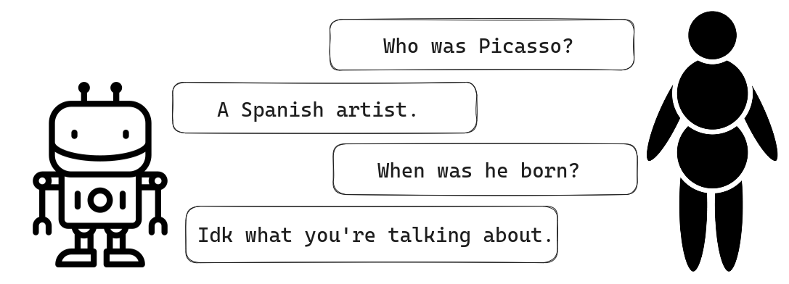
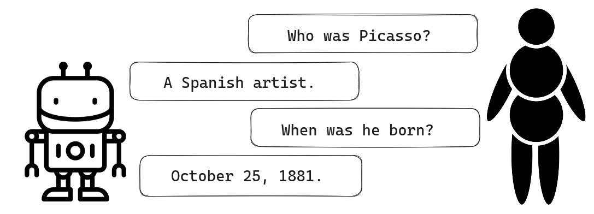
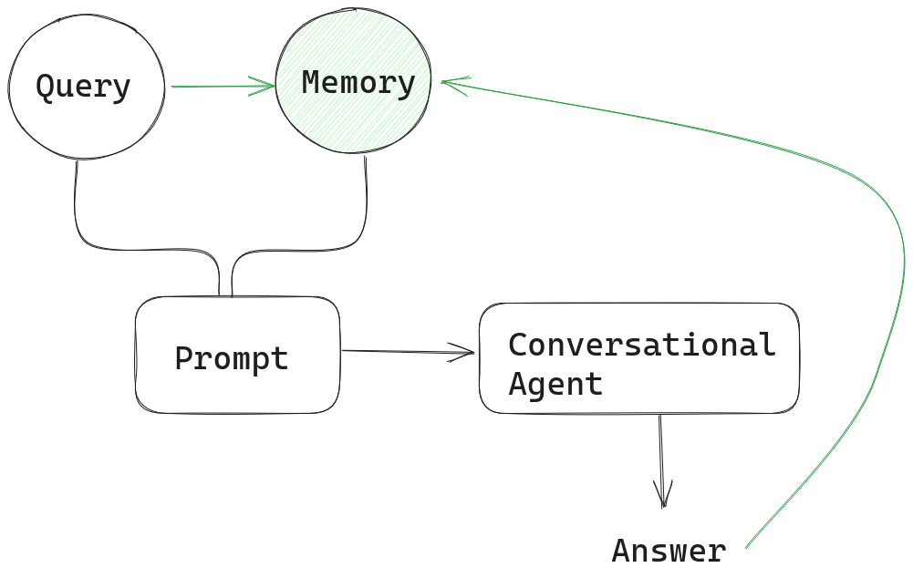
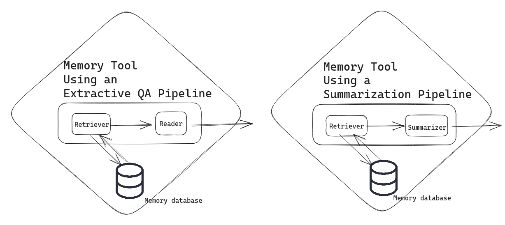

Memory is what turns a powerful LLM into an empathetic interlocutor who can remember what you’ve said before. But how does it work?

  

Today we want to lift the hood on how memory is implemented in Haystack. We’ll explain the differences between memory injection and memory as a tool and show you how to get around the context window’s length limitation by summarizing.

  

If you want to understand how memory works computationally or start building your own conversational AI interface with Haystack, this article is for you.

# Why memory matters

For an exchange of words to feel like a conversation, both parties require some kind of memory: they need to remember what’s been said before, and they need to be able to refer back to salient entities and concepts by using, for example, pronouns.

  

Consider the following [dialogue from the movie “Booksmart:”](https://en.wikiquote.org/wiki/Booksmart)

  

**Amy:** Name one person whose life was so much better because they broke a couple of rules.

**Molly:** Picasso.

**Amy:** He broke art rules. Name a person who broke a real rule.

**Molly:** Rosa Parks.

**Amy:** Name another one.

**Molly:** Susan B. Anthony.

**Amy:** God dammit.

  

This conversation only works because Amy and Molly know what was said previously. It’s clear from the context that the pronoun “he” refers back to Picasso, and when Amy says, “Name another one,” she doesn’t have to spell out that she means “another person who broke the rules.”

# Large language models and memory

By default, LLMs don’t have an inbuilt notion of memory. As far as an out-of-the-box LLM is concerned, every prompt it receives is the beginning of an entirely new interaction.




  
  

For a conversation to feel natural, an advanced chatbot needs to have some context beyond the current question-answer pair. This property is known as either memory or history.



  

To make conversational agents aware of previous exchanges, different implementations of memory exist.

## Memory injection for Agents

A [Conversational Agent in Haystack](https://docs.haystack.deepset.ai/docs/agent#conversational-agent) is a basic chatbot that can generate answers to user queries through an LLM. Memory is passed on to the prompt along with every new query.

  

As the diagram shows, the memory stores each answer by the Agent along with the user’s query. In this implementation, memory is simply a list. Every new exchange between human and AI is appended to the list so it can be injected back into the next prompt.

  

To illustrate this, let’s look at a dialogue with multiple exchanges. I used OpenAI’s gpt-3.5-turbo for these examples, the same model that powers ChatGPT. (For the full tutorial on how to set up a conversational agent with Haystack, have a look at [our tutorial](https://haystack.deepset.ai/tutorials/24_building_chat_app).)

  

First, we import the PromptNode and initialize it with the model's name, the [API key from OpenAI](https://platform.openai.com/account/api-keys), and the maximum length for the node’s output:

  
```python
from haystack.nodes import PromptNode  
  
model_name = 'gpt-3.5-turbo'  
prompt_node = PromptNode(model_name, api_key=MY_API_KEY, max_length=256)
```
We can now set up our conversational agent (aka chatbot) by passing the prompt node to it. By default, this initializes a memory, which is injected back into the user’s prompt with each new call.

  
```python
from haystack.agents.conversational import ConversationalAgent  
  
conversational_agent = ConversationalAgent(prompt_node=prompt_node)
```
  

Let’s now ask the model a few questions to accumulate some memory:

  
```python
conversational_agent.run("Who was Pablo Picasso?")  
  
>>> Pablo Picasso was a renowned Spanish artist who is considered one of the most influential artists of the 20th century. He is known for co-founding the Cubist movement and  for his contributions to Surrealism. His work encompasses various styles and mediums, including painting, sculpture, ceramics, and collage.
```
  

We can easily verify that the memory injection works by referring to the painter with a pronoun in our next query:

  
```python
conversational_agent.run("Where did he live?")  
  
>>> Picasso was born in Malaga, Spain, but he spent most of his adult life in France, particularly in Paris. He also had periods of residency in Barcelona and various other locations throughout Europe.
```
  

Interesting! But now to the burning question:

  
```python
conversational_agent.run("How can I learn to paint like him?")  
  
>>> To learn to paint like Picasso, you can start by studying his works and understanding his artistic style. Analyze his use of color, form, and composition. Experiment with different techniques and mediums that he used, such as Cubism or collage. Practice regularly and don't be afraid to take risks with your art.
```
  

We can now take a closer look at the agent’s memory by calling:

  
```python
print(conversational_agent.memory.load())  
  
>>> Human: Who was Pablo Picasso?  
AI: Pablo Picasso was a renowned Spanish artist who is considered one of the most influential artists of the 20th century. He is known for co-founding the Cubist movement and  for his contributions to Surrealism. His work encompasses various styles and mediums, including painting, sculpture, ceramics, and collage.  
Human: Where did he live?  
AI: Picasso was born in Malaga, Spain, but he spent most of his adult life in France, particularly in Paris. He also had periods of residency in Barcelona and various other locations throughout Europe.  
Human: How can I learn to paint like him?  
AI: To learn to paint like Picasso, you can start by studying his works and understanding his artistic style. Analyze his use of color, form, and composition. Experiment with different techniques and mediums that he used, such as Cubism or collage. Practice regularly and don't be afraid to take risks with your art.
```
  

Evidently, all our exchanges with the model have been stored in memory. It also becomes clear why, using this solution, you can quickly run into problems. As the conversation between human and AI goes on and the list of previous exchanges in the memory grows, the LLM’s context window may become too small. When the prompt starts to overflow the context window, the quality of the model’s output suffers.

  

Cost is another factor: companies like OpenAI charge users on the basis of tokens, so you’ll want to keep your prompts short. As a solution, you can summarize your memory periodically.

## Summarizing memory

By using a separate model to summarize your Agent’s memory at regular intervals, you keep your memory manageable. In Haystack, you can initialize a [conversation summary memory](https://docs.haystack.deepset.ai/docs/agent#conversational-agent-memory) that generates summaries of the last few exchanges between human and AI. In our example, we’ll simply use the same model for summarizing as for the conversational agent – so we initialize the memory with our prompt node again:

  
```python
from haystack.agents.memory import ConversationSummaryMemory  
  
summary_memory = ConversationSummaryMemory(prompt_node)  
```  

Note that this memory class uses a specific prompt template, which instructs the model to condense the conversation. We’ll see later how we can adjust those instructions ourselves. Let’s initialize the conversational agent again, this time with our summary memory:
```python
from haystack.agents.conversational import ConversationalAgent  
  
conversational_agent = ConversationalAgent(prompt_node=prompt_node, memory=summary_memory)
```
  

After running this agent with the same questions as before, we take a look at the memory again:

  
```python
print(conversational_agent.memory.load())  
  
>>> Pablo Picasso was a highly influential Spanish artist known for his contributions to various art movements. He lived in Spain and France.  
Human: How can I learn to paint like him?  
AI: To learn to paint like Picasso, you can start by studying his works and understanding his artistic style. Analyze his use of color, form, and composition. Experiment with different techniques and mediums that he used, such as Cubism or collage. Practice regularly and don't be afraid to take risks with your art.
```
  

We can see that by using the summary, we’ve managed to condense our memory considerably. Interestingly, the model has decided to keep the last exchange almost in its entirety.

  

By default, the node creates a summary after three exchanges, but you can change that by adjusting the summary_frequency parameter. You can even set that parameter to 1 to create a summary after every exchange. In the next example, we do exactly that, and we also tell the model to keep the memories extra short (ten words at most). To that end, we import the prompt template class and specify our requirements in a custom template, which we then pass on to the summary memory.

  
```python
from haystack.agents.memory import ConversationSummaryMemory  
from haystack.nodes import PromptTemplate  
  
my_template = PromptTemplate("Create a short summary (max 10 words) of the following chat transcript by shortening and summarizing the content without losing important information:\n{chat_transcript}\nCondensed Transcript:",)  
summary_memory = ConversationSummaryMemory(prompt_node, prompt_template=my_template, summary_frequency=1)
```
  

How does our memory look after three exchanges with the new prompt template?

  
```python
print(conversational_agent.memory.load())  
  
>>> Picasso: Influential Spanish painter known for Cubism and innovation.Picasso lived in Spain, France, and the United States.Study Picasso's style, experiment with materials, take art classes.
```
  

We’ve been able to considerably shorten our memory, while preserving all the important information!

  

>The example uses a proprietary model from OpenAI. Nevertheless, you can also use our conversation summary memory class with open-source models from the Hugging Face model hub. A good choice is [this BART-large model](https://huggingface.co/philschmid/bart-large-cnn-samsum), which was designed specifically for summarizing conversations. Note, however, that older models can’t follow instructions like LLMs do. To make it work, you can use the following code:

```python
summary_node = PromptNode('philschmid/bart-large-cnn-samsum', max_length=256, model_kwargs={"task_name": "text2text-generation"})  
template = PromptTemplate("{chat_transcript}")  
summary_memory = ConversationSummaryMemory(summary_node, prompt_template=template)
```
  

Note that while the above solutions manage to keep the memory much shorter than the accumulative version we used initially, they still result in a growing memory, because the summaries are appended. This [open issue aims to solve this problem](https://github.com/deepset-ai/haystack/issues/5091) by summarizing the entire memory, thus allowing you to keep it at a stable length throughout the entire conversation.

## Memory for Conversational Agents with Tools

The Conversational Agent lets you set up a basic chatbot functionality. But it's nowhere near using [all the capabilities an Agent offers](https://haystack.deepset.ai/blog/introducing-haystack-agents/). Agents are so powerful because they can use an LLM’s reasoning skills for dynamic solution planning: given a set of tools, agents can [use those tools](https://docs.haystack.deepset.ai/docs/agent#tools) at their own discretion to arrive at the optimal final answer.

  

Agents keep track of their thinking process – the solution strategy which leads them to their final answer – in a “transcript.” If you don’t want to pass both a memory record and a transcript to the conversational agent, you can simply implement memory as another tool.

    


In this setup, the Agent, upon receiving a prompt, first consults the memory tool to see whether it can provide any context for answering the user’s query. The Agent’s output is then stored in memory along with the query after every iteration, as in our examples before.

  

Memory as a tool opens up a range of possibilities. You’re free to configure it in the way that works best for you. Perhaps you want to keep track of an enormous amount of human-AI interactions in a memory database. You could then serve your memory through a sophisticated tool like an extractive QA pipeline or a summarization pipeline.

  



In the extractive QA pipeline solution, your conversational agent sends a query to your memory database, and the pipeline seeks to return the most relevant snippets from the memory that help contextualize the user’s query. In the summarization pipeline solution, the memory tool returns a summary of relevant documents instead. Implementing memory as these tools again helps you avoid bumping into the LLM’s token limit.

# Don’t forget to follow us

As a company, deepset is invested in bringing LLMs to every application. We also like sharing the latest insights on all things NLP with our community. If that sounds good to you, [follow us on Twitter](https://twitter.com/deepset_ai/).

  

Our OSS framework Haystack comes with all the tools needed to build state-of-the-art systems with LLMs. Head over to the [Haystack GitHub repo](https://github.com/deepset-ai/haystack) to learn more.

  

To see what other people are building with Haystack, or if you need help with your own projects, [join our server on Discord](https://discord.com/invite/VBpFzsgRVF). It’s a friendly community managed by our Devrel advocates, where you can meet others with an interest in NLP.
