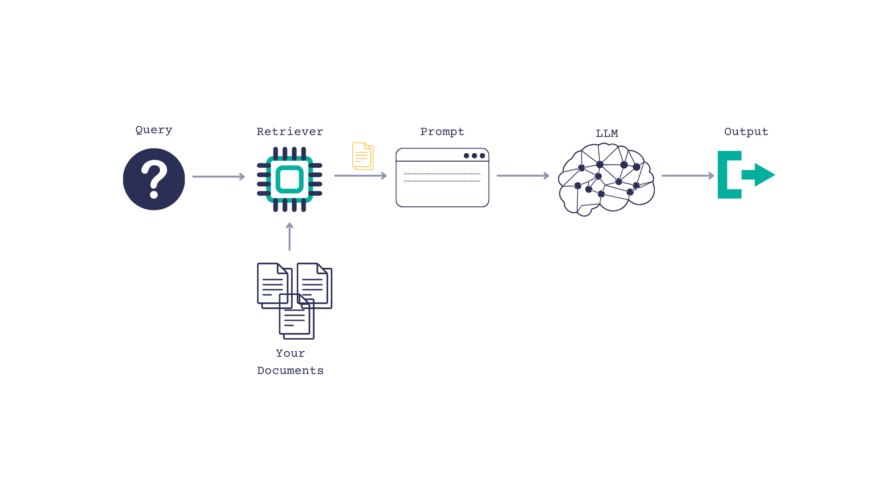
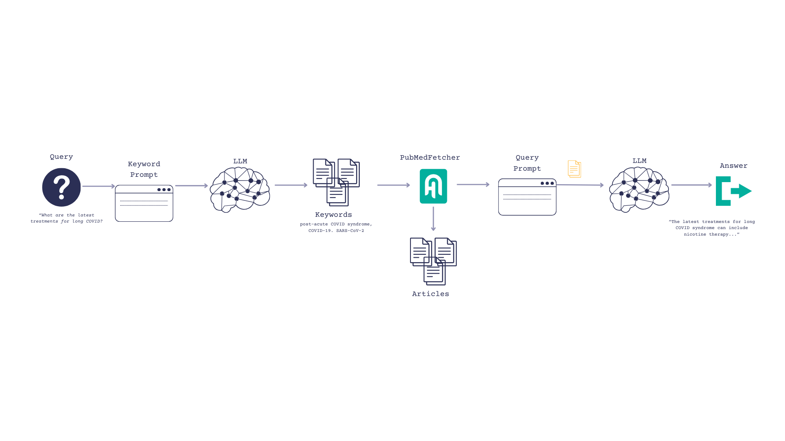

Unfortunately, countless people around the world have inadequate access to healthcare. I’m lucky to have health insurance and good medical providers taking care of me. However, I still want to educate myself before walking into a doctor’s office.

Technology can empower people to take charge of their health. Large language models can power chatbots where people can ask medical questions. 

In this post, I’ll show you how I built a medical chatbot with Haystack 2.0-Beta, and the Mixtral 8x7B model by pulling research papers from PubMed.

You can follow along [with this Colab](https://colab.research.google.com/drive/1Pl8gyfWthqoj7PTCQrteAvtOsswHvkzV). You’ll need a HuggingFace API key. [Sign up for a free account here](https://huggingface.co/join).

## Challenges

Building a medical chatbot presents some challenges.
- *Lack of data*. HIPAA and other privacy regulations make it harder to find public QA datasets to fine-tune a model.
- The human impact of providing wrong answers. 😬
- *Staying up to date*. It takes a long time to train a LLM. By the time they are released, their knowledge is already a bit stale. Medical research breakthroughs are happening all the time. I am particularly interested in long COVID, which has both impacted humanity on a massive scale, and is the subject of ongoing research.

Therefore, I decided to use a RAG pipeline to combine PubMed data with a LLM.

## The PubMed RAG Pipeline

Retrieval augmented generation, or RAG, is a way of giving a LLM context so it can better answer questions. 

You pass the LLM some documents, along with a query, and prompt the LLM to use the documents when answering the question.



[PubMed](https://pubmed.ncbi.nlm.nih.gov/) has up to date, trustworthy medical information so it seemed like a solid document source. Plus, there's a [PyMed wrapper for the PubMed API](https://github.com/gijswobben/pymed) that made querying easy peasy. We'll wrap this in a [Haystack custom component](https://docs.haystack.deepset.ai/v2.0/docs/custom-components) to format the results as `Document`s so that Haystack can use them, and add some light error handling.

```python
from pymed import PubMed
from typing import List
from haystack import component
from haystack import Document

pubmed = PubMed(tool="Haystack2.0Prototype", email="tilde.thurium@deepset.ai")

def documentize(article):
  return Document(content=article.abstract, meta={'title': article.title, 'keywords': article.keywords})

@component
class PubMedFetcher():

  @component.output_types(articles=List[Document])
  def run(self, queries: list[str]):
    cleaned_queries = queries[0].strip().split('\n')

    articles = []
    try:
      for query in cleaned_queries:
        response = pubmed.query(query, max_results = 1)
        documents = [documentize(article) for article in response]
        articles.extend(documents)
    except Exception as e:
        print(e)
        print(f"Couldn't fetch articles for queries: {queries}" )
    results = {'articles': articles}
    return results
```

For the model, I went with Mixtral's 8x7b. Mixtral is a unique kind of model that uses 8 *"experts"* and an internal *"routing"* mechanism that routes a token to a specific expert. This also means that during inferencing, not all parameters are used, which allows the model to response remarkably fast.  [This HuggingFace blog post explains MoE](https://huggingface.co/blog/moe) in more detail. 


## Generating Keywords for PubMed with Mixtral/LLMs

First, I tried an approach where I passed a plain query to PubMed. e.g. *"What are the most current treatments for long COVID?"* Unfortunately, that didn't work too well. The articles returned weren't very relevant. Which makes sense, because PubMed isn't optimized for natural language search. It is optimized for keywords, though. And you know what's great at generating keywords? LLMs!

So now our flow is as follows:
- Our user inputs a question, such as, "What are the most current treatments for long COVID?"
- We prompt the LLM to turn the question into keywords
- Search PubMed and return top_k articles based on those keywords
- Pass those articles to the LLM and ask them to reference it when formulating an answer.



First, initialize the LLMs and warm them up.
```python
from haystack.components.generators import HuggingFaceTGIGenerator
from haystack.utils import Secret

keyword_llm = HuggingFaceTGIGenerator("mistralai/Mixtral-8x7B-Instruct-v0.1", token=Secret.from_token(huggingface_token))
keyword_llm.warm_up()

llm = HuggingFaceTGIGenerator("mistralai/Mixtral-8x7B-Instruct-v0.1", token=Secret.from_token(huggingface_token))
llm.warm_up()
```

Next, we create our prompts and our pipeline and hook everything up.
```python
from haystack import Pipeline
from haystack.components.builders.prompt_builder import PromptBuilder

keyword_prompt_template = """
Your task is to convert the follwing question into 3 keywords that can be used to find relevant medical research papers on PubMed.
Here is an examples:
question: "What are the latest treatments for major depressive disorder?"
keywords:
Antidepressive Agents
Depressive Disorder, Major
Treatment-Resistant depression
---
question: {{ question }}
keywords:
"""

prompt_template = """
Answer the question truthfully based on the given documents.
If the documents don't contain an answer, use your existing knowledge base.

q: {{ question }}
Articles:

  {{article.content}}
  keywords: {{article.meta['keywords']}}
  title: {{article.meta['title']}}


"""
keyword_prompt_builder = PromptBuilder(template=keyword_prompt_template)
prompt_builder = PromptBuilder(template=prompt_template)
fetcher = PubMedFetcher()

pipe = Pipeline()

pipe.add_component("keyword_prompt_builder", keyword_prompt_builder)
pipe.add_component("keyword_llm", keyword_llm)
pipe.add_component("pubmed_fetcher", fetcher)
pipe.add_component("prompt_builder", prompt_builder)
pipe.add_component("llm", llm)

pipe.connect("keyword_prompt_builder.prompt", "keyword_llm.prompt")
pipe.connect("keyword_llm.replies", "pubmed_fetcher.queries")

pipe.connect("pubmed_fetcher.articles", "prompt_builder.articles")
pipe.connect("prompt_builder.prompt", "llm.prompt")

```

Try it for yourself and see!

```python
question="What are the most current treatments for long COVID?"
pipe.run(data={"keyword_prompt_builder":{"question":question},
               "prompt_builder":{"question": question},
               "llm":{"generation_kwargs": {"max_new_tokens": 500}}})
```

```shell
What are the most current treatments for long COVID?
  The COVID-19 pandemic has led to a significant increase in the number of patients with post-acute COVID-19 syndrome (PACS), also known as long COVID. PACS is a complex, multisystem disorder that can affect various organs and systems, including the respiratory, cardiovascular, neurological, and gastrointestinal systems. The pathophysiology of PACS is not yet fully understood, but it is believed to be related to immune dysregulation, persistent inflammation, and microvascular injury.
The management of PACS is challenging due to its heterogeneous presentation and the lack of evidence-based treatments. Current treatment approaches are mainly supportive and aim to alleviate symptoms and improve quality of life. These include:
- Pulmonary rehabilitation for respiratory symptoms
- Cardiac rehabilitation for cardiovascular symptoms
- Cognitive-behavioral therapy for neurological symptoms
- Dietary modifications and medications for gastrointestinal symptoms
- Vaccination to prevent reinfection and further complications
- Symptomatic treatment with medications such as nonsteroidal anti-inflammatory drugs (NSAIDs), corticosteroids, and antihistamines
- Experimental treatments such as antiviral therapy, immunomodulatory therapy, and cell-based therapy
```

## Potential issues and workarounds

PubMed API wasn’t built for high scalability, so this approach wouldn’t be great for a high traffic production system. In that case, you could consider pulling articles into a [Haystack `DocumentStore`](https://docs.haystack.deepset.ai/v2.0/docs/document-store) that is backed by persistent storage

Alternately, you could experiment with models that has been trained on a medical dataset, such as [Gradient](https://gradient.ai/healthcare)'s.

## Wrapping it up

Today you learned how to use Mixtral 8x7B and Haystack RAG pipelines to build a medical chatbot. Thanks for reading! If you want to learn more about Haystack 2.0 or RAG Pipelines, these posts might be of interest:
- [Getting started with Mixtral 8x7b and Haystack](https://colab.research.google.com/github/deepset-ai/haystack-cookbook/blob/main/notebooks/mixtral-8x7b-for-web-qa.ipynb)
- [Customizing RAG Pipelines to Summarize Latest Hacker News Posts](https://haystack.deepset.ai/blog/customizing-rag-to-summarize-hacker-news-posts-with-haystack2)


