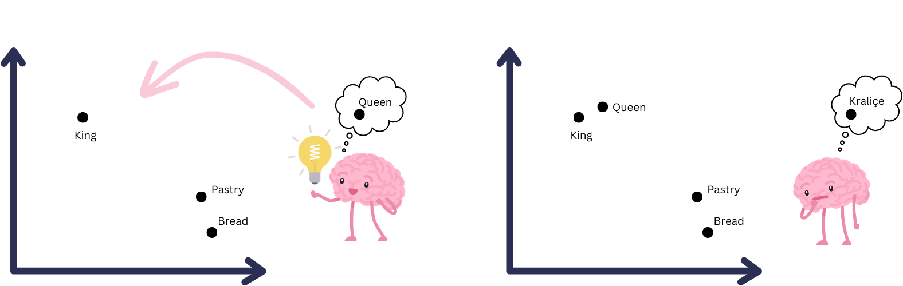
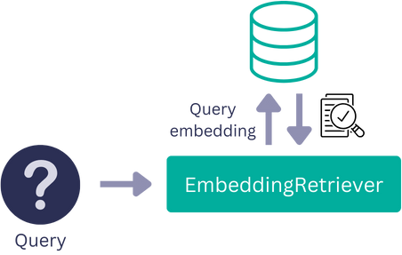

In today's interconnected world, language should never be a barrier to accessing information. This is especially crucial in the context of travel, where travelers often rely on reviews to make informed decisions about their accommodations (I know I do). But what if you're an English-speaking traveler trying to make sense of reviews written in multiple languages and simply want to know, "Is this place too noisy to sleep?”

In this blog post, we'll delve into the details of multilingual retrieval and multilingual generation, and demonstrate how to build a **Retrieval Augmented Generation (RAG)** pipeline to generate answers from multilingual hotel reviews using [Cohere](https://cohere.com/) models and [Haystack](https://github.com/deepset-ai/haystack).

> *This article is accompanied by a [Colab notebook.](https://github.com/bilgeyucel/multilingual-qa/blob/main/Multilingual_QA_with_Cohere_Haystack.ipynb)*

## Multilingual Embeddings

Typically, embedding models are trained to create word embeddings based on their semantic similarity. This means that the embeddings for "King" and "Queen" should be closer in the vector space compared to "King" and "Bread." However, most of these embedding models are designed for a single language and cannot capture semantic similarities between words in different languages.



Multilingual embedding models, on the other hand, are trained to capture semantic similarities between words across languages. They can create similar embeddings for "King", "König" (king in German), and "Kral" (king in Turkish). This remarkable capability of multilingual models makes it possible to retrieve documents regardless of the language in which the documents or the query are written.


Cohere's multilingual embedding models are cutting-edge technology designed to handle text from multiple languages. These embeddings empower the model to understand the semantics of texts in languages like Spanish, French, German, and more while providing a consistent representation for efficient cross-lingual analysis.

Let’s see these models in action using the `embed-multilingual-v2.0` model to create embeddings for hotel reviews.

## Storing Multilingual Embeddings

To create a question answering system for hotel reviews, the first thing we need is a document store. We’ll use an `InMemoryDocumentStore` to save the hotel reviews along with their embeddings. 

```python
from haystack.document_stores import InMemoryDocumentStore

document_store = InMemoryDocumentStore(embedding_dim=768, similarity= "dot_product")
```

### Creating an Indexing Pipeline

Next, we'll set up an indexing pipeline with a `PreProcessor` and `EmbeddingRetriever`. The PreProcessor will break down long reviews into smaller, meaningful chunks, while the EmbeddingRetriever will generate multilingual embeddings for each document.

We'll use the `embed-multilingual-v2.0` model from Cohere in the `EmbeddingRetriever`. You will need a Cohere API key for this model, which you can obtain [here](https://dashboard.cohere.com/api-keys).

```python
from haystack.nodes import EmbeddingRetriever, PreProcessor
from haystack.pipelines import Pipeline

preprocessor = PreProcessor(
    clean_empty_lines=True,
    clean_whitespace=False,
    clean_header_footer=True,
    split_by="word",
    split_length=200,
    split_respect_sentence_boundary=True,
)
retriever = EmbeddingRetriever(
    embedding_model="embed-multilingual-v2.0", 
    document_store=document_store,
    api_key=COHERE_API_KEY
)

indexing_pipeline = Pipeline()
indexing_pipeline.add_node(component=preprocessor, name="preprocessor", inputs=["File"])
indexing_pipeline.add_node(component=retriever, name="retriever", inputs=["preprocessor"])
indexing_pipeline.add_node(component=document_store, name="document_store", inputs=['retriever'])
```

### Indexing Reviews with Embeddings

Our indexing pipeline is ready to run. We will use hotel reviews in multiple languages as documents, including Portuguese, Polish, German, Spanish, French, Dutch, and English. All of these reviews belong to the same accommodation. Let's index these reviews by running the pipeline.

```python
documents = [Document("O ar condicionado de um dos quartos deu problema, mas levaram um ventilador para ser utilizado. Também por ser em uma área bem movimentada, o barulho da rua pode ser ouvido. Porém, eles deixam protetores auriculares para o uso. Também senti falta de um espelho de corpo inteiro no apartamento. Só havia o do banheiro que mostra apenas a parte superior do corpo."),
             Document("Durchgängig Lärm, weil direkt an der Partymeile; schmutziges Geschirr; unvollständige Küchenausstattung; Abzugshaube über Herd ging für zwei Stunden automatisch an und lies sich nicht abstellen; Reaktionen auf Anfragen entweder gar nicht oder unfreundlich"),
             Document("Das Personal ist sehr zuvorkommend! Über WhatsApp war man im guten Kontakt und konnte alles erfragen. Auch das Angebot des Shuttleservices war super und würde ich empfehlen - sehr unkompliziert! Unser Flug hatte Verspätung und der Shuttle hat auf uns gewartet. Die Lage zur Innenstadt ist sehr gut,jedoch ist die Fensterfront direkt zur Club-Straße deshalb war es nachts bis drei/vier Uhr immer recht laut. Die Kaffeemaschine oder auch die Couch hätten sauberer sein können. Ansonsten war das Appartement aber völlig ok."),
             Document("Super appartement. Juste au dessus de plusieurs bars qui ferment très tard. A savoir à l'avance. (Bouchons d'oreilles fournis !)"),
             Document("Zapach moczu przy wejściu do budynku, może warto zainstalować tam mocne światło na czujnik ruchu, dla gości to korzystne a dla kogoś kto chciałby zrobić tam coś innego niekorzystne :-). Świetne lokalizacje w centrum niestety są na to narażane."),
             Document("El apartamento estaba genial y muy céntrico, todo a mano. Al lado de la librería Lello y De la Torre de los clérigos. Está situado en una zona de marcha, así que si vais en fin de semana , habrá ruido, aunque a nosotros no nos molestaba para dormir"),
             Document("The keypad with a code is convenient and the location is convenient. Basically everything else, very noisy, wi-fi didn't work, check-in person didn't explain anything about facilities, shower head was broken, there's no cleaning and everything else one may need is charged."),
             Document("It is very central and appartement has a nice appearance (even though a lot IKEA stuff), *W A R N I N G** the appartement presents itself as a elegant and as a place to relax, very wrong place to relax - you cannot sleep in this appartement, even the beds are vibrating from the bass of the clubs in the same building - you get ear plugs from the hotel -> now I understand why -> I missed a trip as it was so loud and I could not hear the alarm next day due to the ear plugs.- there is a green light indicating 'emergency exit' just above the bed, which shines very bright at night - during the arrival process, you felt the urge of the agent to leave as soon as possible. - try to go to 'RVA clerigos appartements' -> same price, super quiet, beautiful, city center and very nice staff (not an agency)- you are basically sleeping next to the fridge, which makes a lot of noise, when the compressor is running -> had to switch it off - but then had no cool food and drinks. - the bed was somehow broken down - the wooden part behind the bed was almost falling appart and some hooks were broken before- when the neighbour room is cooking you hear the fan very loud. I initially thought that I somehow activated the kitchen fan"),
             Document("Un peu salé surtout le sol. Manque de service et de souplesse"),
             Document("De comfort zo centraal voor die prijs."),
             Document("Die Lage war sehr Zentral und man konnte alles sehenswertes zu Fuß erreichen. Wer am Wochenende nachts schlafen möchte, sollte diese Unterkunft auf keinen Fall nehmen. Party direkt vor der Tür so das man denkt, man schläft mitten drin. Sehr Sehr laut also und das bis früh 5 Uhr. Ab 7 kommt dann die Straßenreinigung die keineswegs leiser ist."),
             Document("Ótima escolha! Apartamento confortável e limpo! O RoofTop é otimo para beber um vinho! O apartamento é localizado entre duas ruas de movimento noturno. Porem as janelas, blindam 90% do barulho. Não nos incomodou"),
             Document("Nous avons passé un séjour formidable. Merci aux personnes , le bonjours à Ricardo notre taxi man, très sympathique. Je pense refaire un séjour parmi vous, après le confinement, tout était parfait, surtout leur gentillesse, aucune chaude négative. Je n'ai rien à redire de négative, Ils étaient a notre écoute, un gentil message tout les matins, pour nous demander si nous avions besoins de renseignement et savoir si tout allait bien pendant notre séjour."),
             Document("Boa localização. Bom pequeno almoço. A tv não se encontrava funcional."),
             Document("Céntrico. Muy cómodo para moverse y ver Oporto. Edificio con terraza propia en la última planta. Todo reformado y nuevo. Te traen un estupendo desayuno todas las mañanas al apartamento. Solo que se puede escuchar algo de ruido de la calle a primeras horas de la noche. Es un zona de ocio nocturno. Pero respetan los horarios.")
]

indexing_pipeline.run(documents=documents)
```

## Retrieval Augmented Generation (RAG)

Now that we have multilingual embeddings indexed in our document store, let’s create the part of the demo where users interact the most: Retrieval-Augmented Generation (RAG) Pipeline.

A RAG pipeline consists of two parts: document retrieval and answer generation.

### Multilingual Document Retrieval

In the document retrieval step of a RAG pipeline, the retriever creates an embedding for the query in the multilingual vector space and retrieves the most similar *top_k* documents to the query from the document store. In our case, the retrieved documents will be hotel reviews.

We’ll use the same `EmbeddingRetriever` instance that we used in the indexing pipeline.



### Multilingual Answer Generation

In the generation step of the RAG pipeline, we’ll use an LLM (a generative model) to generate an answer based on the retrieved documents. 

Let’s create a prompt template to use for hotel reviews. In this template, we’ll have two prompt variables: `{join(documents)}` and `{query}`. These variables will later be filled with the user question and the retrieved hotel reviews outputted from the retriever.

```python
from haystack.nodes import AnswerParser, PromptTemplate

prompt="""
You will be provided with reviews in various languages for an accommodation. 
Create a concise and informative answer for a given question based solely on the given reviews.
\nReviews: {join(documents)}
\nQuestion: {query};
\nAnswer:
"""
template = PromptTemplate(
    prompt=prompt,
    output_parser=AnswerParser())
```

After defining the `PromptTemplate`, we need to define the `PromptNode`. For this generative case, we’ll use Cohere’s `command` model and initialize the `PromptNode` with an API key, model name, and the `PromptTemplate` we defined previously. Then, we’ll connect the `EmbeddingRetriever` to the `PromptNode` to finalize our RAG pipeline.

```python
prompt_node = PromptNode(model_name_or_path="command", api_key=COHERE_API_KEY, default_prompt_template=template)

rag_pipeline = Pipeline()
rag_pipeline.add_node(component=retriever, name="Retriever", inputs=["Query"])
rag_pipeline.add_node(component=prompt_node, name="PromptNode", inputs=["Retriever"])  
```

Now we can run the pipeline with various questions and learn if this accommodation is good to stay at! 🏡

```python
results = rag_pipeline.run("Is this place too noisy to sleep?", params={"Retriever": {"top_k": 3}})
print(results["answers"][0].answer)

>> "Based on the information provided in the reviews, it seems that the accommodation can be very noisy, especially at night. Multiple reviewers mentioned..."
```

To learn more about how you can use Cohere models in Haystack pipelines, check out our [integration page for Cohere](https://haystack.deepset.ai/integrations/cohere)🩵
