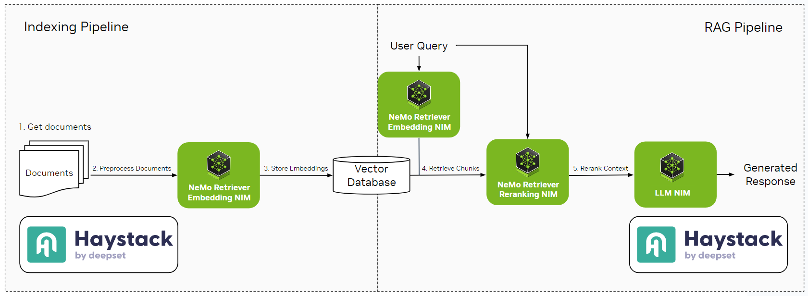

---
layout: single
title: Optimize RAG Applications with Document Reranking Using Haystack With NVIDIA NeMo Retriever
toc: True
date: 2025-01-14
last_updated: 2025-01-14
authors:
  - Rita Fernandes Neves
  - Bilge Yucel
tags: ["Retrieval", "RAG", "Evaluation"]
---	

In retrieval-augmented generation (RAG) applications, the quality of the retrieved documents plays a critical role in delivering accurate and meaningful responses. But what happens when embedding similarity is not enough to get an accurate ordering of the reference documents? This is where **reranking** comes into play.

## What’s Reranking?

**Reranking** refers to assigning a relevance score to each document based on how well it matches the query. Reranking reorders the retrieved documents to ensure the most contextually relevant results are at the top. This is important because while the retrieval stage focuses on recall, considering relevance broadly, reranking “fine-tunes” the results for increased precision.

### Examples of Reranking

Consider a query like, "*What are the best practices for securing a REST API*?" The retrieval model might return a ranked list with these documents:

1. REST API: a practical guide
2. Best REST API frameworks
3. Detailed steps on how to secure REST APIs
4. Public vs. private APIs: challenges and limitations
5. REST API architecture principles

While all of these seem relevant to the topic of REST APIs, the document with specific security steps (document 3) should ideally be ranked first. Using purely embedding similarity, the document score may rely too much on common words - for instance, document 1 includes “REST API” and a similar word to “practice”, while document 2 also includes the word “best” from the query. The use of a reranker should lead to a better document scoring that overcomes these faults, leading to a better retrieval pipeline.

## Why Reranking is Crucial in RAG Systems

Adding a reranking component to a RAG pipeline enhances both **recall** (retrieving relevant documents) and **precision** (selecting the most relevant ones). The ranker, typically using a fine-tuned **LLM**, reorders retrieved document chunks to ensure the most relevant ones appear at the top, making the retrieval process not only faster but also more accurate.

By prioritizing the right documents, ranking increases the likelihood of providing the LLM with the best context, which improves the quality of generated responses. For example, in an application where the user seeks specific technical information, the **reranking model ensures that highly relevant content appears first**, preventing less helpful results from diluting the response quality. This is particularly important when the LLM providing the response has a limited context window or when we aim to optimize its inference process for speed and cost-efficiency.

Ranking is especially valuable in **hybrid retrieval** setups, where chunks come from different datastores or from various retrieval methods (e.g., sparse, dense, or keyword-based). Each method may rank relevance differently, but ranking brings consistency regardless of the retrieval method. In hybrid setups, it ensures that the final set of documents provided to the LLM reflects the true semantic relevance to the query, rather than being dominated by a single retrieval method’s biases.

### Evaluation Metrics for Retrieval and Reranking

Depending on the purpose, many metrics, such as [semantic answer similarity](https://docs.haystack.deepset.ai/docs/sasevaluator) or [faithfulness](https://docs.haystack.deepset.ai/docs/faithfulnessevaluator), can be used to evaluate a RAG pipeline. When using a reranker in the pipeline, it’s essential to assess not only retrieval performance but also how well the reranker optimizes the order of returned results.

- Retrieval performance:

To measure the retrieval's success, we can use recall. **Recall** reflects how successful the retrieval operation was, checking how many ground truth documents were retrieved. Single-hit recall indicates how often at least one relevant document is retrieved within the results, and multi-hit recall measures how often all relevant documents appear in the top results.

- Reranking performance:

To measure how well the reranking model is ordering document chunks, we can use **Mean Reciprocal Rank (MRR)** and **Normalized Discounted Cumulative Gain (NDCG)**. MRR reflects how well the relevant documents are positioned, while NDCG evaluates the quality of the entire ranking. Combined, they can give insights in both cases where a little or a lot of context is needed.
<div class="styled-table demo">

|  | Recall@5 (Single Hit) | Recall@5 (Multi Hit) | Precision@5 | MRR@5 | NDCG@5 |
| --- | --- | --- | --- | --- | --- |
| Retriever (top_k=100) | 0.784 | 0.605 | 0.609 | 0.628 | 0.548 |
| Ranker (top_k=5) | 0.862 | 0.703 | 0.673 | 0.689 | 0.628 |
| Ranker Improvement | 7.80% | 9.80% | 6.43% | 6.08% | 7.95%  |

</div>

*Table 1 - Evaluation scores of retrieval and reranking over the small subset of the [HotpotQA dataset](https://huggingface.co/datasets/hotpotqa/hotpot_qa). For evaluation, following NVIDIA NeMo Retriever microservices were used: `nvidia/nv-embedqa-e5-v5`, for retrieval and `nvidia/nv-rerankqa-mistral-4b-v3`, for ranking.* 


The table reveals the impact of adding a reranker to enhance retrieval output:

- **Recall Improvements**: The reranker improves Recall@5 for both single-hit and multi-hit, with multi-hit recall seeing the highest boost (+9.80%). This improvement is crucial when multiple relevant documents are needed for comprehensive context, as the reranker successfully surfaces more relevant documents within the top results.
- **Reranking Quality**: Metrics like MRR@5 and NDCG@5 indicate a significant improvement in reranking performance. The rise in MRR (+6.08%) suggests that relevant documents appear earlier, while the NDCG increase (+7.95%) indicates better overall ranking quality, making it easier to retrieve relevant information from the top of the results.

In summary, this analysis shows that the reranking model significantly enhances both retrieval and ranking metrics, underscoring its value in surfacing relevant content effectively within the RAG pipeline.

> For detailed code used in this evaluation, check out [Cookbook: Evaluate Reranking-Enhanced Retrieval Pipelines](https://colab.research.google.com/drive/1KMBC4lx4yl2kjJGXwnlEJpd9TtVpmkRX?usp=sharing)
> 

## Introducing NVIDIA NIM

NeMo Retriever microservices are built with [NVIDIA NIM](https://www.nvidia.com/en-us/ai/), part of the NVIDIA AI Enterprise software platform. NVIDIA NIM is a collection of containerized microservices designed for optimized inference of state-of-the-art AI models. The container uses a variety of components to serve AI models and exposes them via standard APIs. Models are optimized using NVIDIA [TensorRT](https://developer.nvidia.com/tensorrt) or using NVIDIA [TensorRT-LLM](https://github.com/NVIDIA/TensorRT-LLM) (depending on the type of the model), automatically applying procedures such as quantization, model distribution, optimized kernel/runtimes, and inflight- or continuous batching, among others, allowing even further optimization if needed. Learn more about [NIM](https://developer.nvidia.com/blog/nvidia-nim-offers-optimized-inference-microservices-for-deploying-ai-models-at-scale/).

Haystack provides 4 components that connect with NVIDIA NIM:

- [NvidiaGenerator](https://docs.haystack.deepset.ai/docs/nvidiagenerator): Text generation with LLM NIM.
- [NvidiaDocumentEmbedder](https://docs.haystack.deepset.ai/docs/nvidiadocumentembedder): Document embedding with [NVIDIA NeMo Retriever embedding NIM microservice](https://build.nvidia.com/nvidia/embed-qa-4).
- [NvidiaTextEmbedder](https://docs.haystack.deepset.ai/docs/nvidiatextembedder): Query embedding with NVIDIA NeMo Retriever embedding NIM microservice.
- **(NEW)** [NvidiaRanker](https://docs.haystack.deepset.ai/docs/nvidiaranker): Document chunk reranker using NVIDIA NeMo Retriever reranking NIM microservice.



### Getting Started with NVIDIA NIM

To integrate NVIDIA NIM, you can either access pre-trained models using the NVIDIA API catalog or deploy NVIDIA NIM directly on your own infrastructure for enhanced control and scalability. In this example, we’ll focus on using NVIDIA-hosted models.

1. **Get API Keys**: Sign up on the [NVIDIA API catalog](https://build.nvidia.com/) to obtain API keys with free credits for access to pre-trained models.
2. **Use NVIDIA-hosted Models**: Integrate NVIDIA NIM models hosted on the NVIDIA API catalog for seamless access.

> Learn how to deploy NIM on your own infrastructure in [Building RAG Applications with NVIDIA NIM and Haystack on K8s](https://haystack.deepset.ai/blog/haystack-nvidia-nim-rag-guide).
> 

## Build a Haystack RAG Pipeline with Reranking using NVIDIA Nemo Retriever

> See the complete code in [Cookbook: Reranking for Optimized RAG With NVIDIA NeMo Retriever](https://colab.research.google.com/drive/1ukXiI4rASl2QXDy6GNNL1vnPb_aekMF9)

### Enhanced Retrieval

For retrieval, initialize the NeMo Retriever microservices, `NvidiaRanker` with `nvidia/nv-rerankqa-mistral-4b-v3` model and the `NvidiaTextEmbedder`. We’ll set the `top_k` value for retriever to 30 and for reranker to 5. Thus, we’ll retrieve 30 docs but only pass the 5 most relevant documents as context to the LLM. 

```python
from haystack_integrations.components.embedders.nvidia import NvidiaTextEmbedder
from haystack_integrations.components.generators.nvidia import NvidiaGenerator
from haystack_integrations.components.rankers.nvidia import NvidiaRanker
from haystack.components.retrievers import InMemoryEmbeddingRetriever

embedder = NvidiaTextEmbedder(model="nvidia/nv-embedqa-e5-v5",
                              api_url="https://integrate.api.nvidia.com/v1")

retriever = InMemoryEmbeddingRetriever(document_store=document_store, top_k=30)
reranker = NvidiaRanker(
    model="nvidia/nv-rerankqa-mistral-4b-v3",
    top_k=5
)
```

### Generation

Define a basic prompt and initialize  `NvidiaGenerator` with `meta/llama3-70b-instruct` model as the generator: 

```python
from haystack.components.builders import PromptBuilder
from haystack_integrations.components.generators.nvidia import NvidiaGenerator

prompt = """Answer the question given the context.
Question: {{ query }}
Context:

    {{ document.content }}

Answer:
"""
prompt_builder = PromptBuilder(template=prompt)

generator = NvidiaGenerator(
    model="meta/llama3-70b-instruct",
    model_arguments={
        "max_tokens": 1024
    }
)
```

### Build the Enhanced RAG Pipeline

Bring all components together and make the relevant connections.

```python
from haystack import Pipeline

enhanced_rag = Pipeline()
enhanced_rag.add_component("embedder", embedder)
enhanced_rag.add_component("retriever", retriever)
enhanced_rag.add_component("ranker", ranker)
enhanced_rag.add_component("prompt_builder", prompt_builder)
enhanced_rag.add_component("generator", generator)

enhanced_rag.connect("embedder.embedding", "retriever.query_embedding")
enhanced_rag.connect("retriever", "ranker")
enhanced_rag.connect("ranker.documents", "prompt_builder.documents")
enhanced_rag.connect("prompt_builder", "generator")
```

### Run the pipeline

To test our pipeline, we’ll use questions from the [HotpotQA dataset](https://huggingface.co/datasets/hotpotqa/hotpot_qa):

```python
question = "The director of the romantic comedy 'Big Stone Gap' is based in what New York city?"

enhanced_rag.run({
    "embedder": {"text": question},
    "ranker": {"query": question}, 
    "prompt_builder": {"query": question}
})
```

```bash
{'embedder': {'meta': {'usage': {'prompt_tokens': 23, 'total_tokens': 23}}},
 'generator': {'replies': ["The director of the romantic comedy 'Big Stone Gap', Adriana Trigiani, is based in Greenwich Village, New York City."],
  'meta': [{'role': 'assistant',
    'usage': {'prompt_tokens': 380,
     'total_tokens': 408,
     'completion_tokens': 28},
    'finish_reason': 'stop'}]}}
```

For the question, the enhanced pipeline’s response is “*The director of the romantic comedy 'Big Stone Gap', Adriana Trigiani, is based in Greenwich Village, New York City.*”. Let’s now create a basic RAG pipeline without ranking and compare the results.

## Basic RAG Pipeline without Reranking

```python
prompt = """Answer the question given the context.
Question: {{ query }}
Context:

    {{ document.content }}

Answer:
"""

rag = Pipeline()
rag.add_component("embedder", NvidiaTextEmbedder(model="nvidia/nv-embedqa-e5-v5",
                              api_url="https://integrate.api.nvidia.com/v1"))
rag.add_component("retriever", InMemoryEmbeddingRetriever(document_store=document_store, top_k=5))
rag.add_component("prompt_builder", PromptBuilder(template=prompt))
rag.add_component("generator", NvidiaGenerator(
    model="meta/llama3-70b-instruct",
    model_arguments={
        "max_tokens": 1024
    }
))

rag.connect("embedder.embedding", "retriever.query_embedding")
rag.connect("retriever", "prompt_builder.documents")
rag.connect("prompt_builder", "generator")
```

```python
question = "The director of the romantic comedy 'Big Stone Gap' is based in what New York city?" # answer is "Greenwich Village, New York City"

rag.run({
    "embedder": {"text": question},
    "prompt_builder": {"query": question}
})
```

```bash
{'embedder': {'meta': {'usage': {'prompt_tokens': 23, 'total_tokens': 23}}},
 'generator': {'replies': ['The answer is Brooklyn.'],
  'meta': [{'role': 'assistant',
    'usage': {'prompt_tokens': 473,
     'total_tokens': 479,
     'completion_tokens': 6},
    'finish_reason': 'stop'}]}}
```

The basic pipeline’s response is "*The answer is Brooklyn.*" which is mentioned in the context but isn’t the correct answer. This shows that the retriever isn’t enough to retrieve the most relevant documents, supporting the improvements in the recall with ranker.

## Conclusion

In this blog post, we explored the significant impact of adding a reranking model to a RAG pipeline. When using only retrieval, the documents returned may broadly match the query based on embedding similarity, but without guaranteed ordering for contextual relevance. This can lead to responses that lack specificity, as shown in the basic RAG pipeline example where the answer “Brooklyn” was returned instead of the correct “Greenwich Village, New York City” due to suboptimal document ranking.

By integrating the NeMo Retriever `nvidia/nv-rerankqa-mistral-4b-v3` model using the `NvidiaRanker`, the enhanced RAG pipeline prioritized the most contextually appropriate documents, improving the overall precision of the response. With the reranking, metrics like Recall@5 (Multi Hit) and MRR@5 showed marked improvements, indicating that relevant documents not only appeared within the top results more frequently but were also positioned earlier in the list, enhancing the LLM's access to high-quality context for accurate generation.

In summary, by adding NeMo Retriever reranking capabilities built with [NVIDIA NIM](https://build.nvidia.com/), RAG pipelines achieve better document ordering, more relevant context, and increased response accuracy—demonstrating the essential role of rankers in building robust, real-world RAG applications.