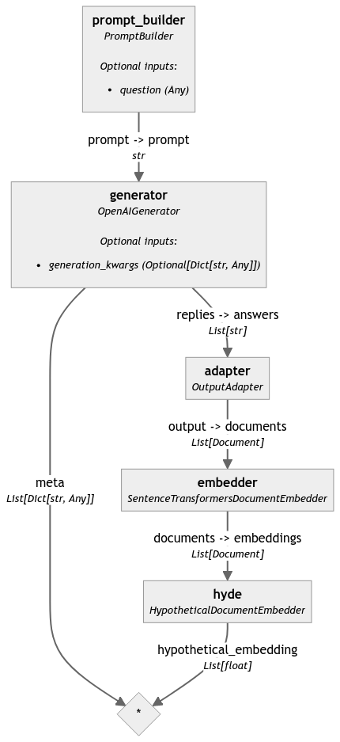

[Hypothetical Document Embeddings (HyDE)](https://docs.haystack.deepset.ai/v2.0/docs/hypothetical-document-embeddings-hyde) is a technique that allows us to generate “fake” hypothetical documents given a query and originates from the paper “[Precise Zero-Shot Dense Retrieval without Relevance Labels](https://aclanthology.org/2023.acl-long.99/)”. Based on the findings in the paper, this is done 5 times, and then we encode each hypothetical document into an embedding vector and average them. 

In this article, we will see how we can use this approach to improve retrieval, and how we can easily incorporate it into Haystack by creating a [custom component](https://docs.haystack.deepset.ai/v2.0/docs/custom-components) that implements HyDE. 

> To learn more about how HyDE works, and where it's useful, check out our guide on [Hypothetical Document Embeddings (HyDE)](https://docs.haystack.deepset.ai/v2.0/docs/hypothetical-document-embeddings-hyde) 

## Build a Pipeline to Create Hypothetical Document Embeddings

First, let's build a simple pipeline to generate these hypothetical documents. To do so, we will use the following Haystack components:

-   [`PromptBuilder`](https://docs.haystack.deepset.ai/v2.0/docs/promptbuilder) and [`OpenAIGenerator`](https://docs.haystack.deepset.ai/v2.0/docs/openaigenerator) to query an instruction-following language model and generate hypothetical documents.
-   [`SentenceTransformersDocumentEmbedder`](https://docs.haystack.deepset.ai/v2.0/docs/sentencetransformersdocumentembedder) encodes the hypothetical documents into vector embeddings.
-  [`OutputAdapter`](https://docs.haystack.deepset.ai/v2.0/docs/outputadapter) to adapt the output of the `Generator` to be compatible with the input of the `SentenceTransformersDocumentEmbedder`, which expects `List[Document]`

> To use the `OpenAIGenerator`, you need to set your `OPENAI_API_KEY`
> ```python
> export OPENAI_API_KEY="secret_string"
>```

We first build a way to query an instruction-following language model to generate hypothetical documents.

```python
from haystack.components.generators.openai import OpenAIGenerator
from haystack.components.builders import PromptBuilder

generator = OpenAIGenerator(model="gpt-3.5-turbo",
							generation_kwargs={"n": 5, "temperature": 0.75, "max_tokens": 400},
)

template="""Given a question, generate a paragraph of text that answers the question.
			Question: {{question}}
			Paragraph:"""
prompt_builder = PromptBuilder(template=template)
```

This will output a list of hypothetical documents. We then use the `SentenceTransformersDocumentEmbedder` to encode these hypothetical documents into embeddings.

But, the `SentenceTransformersDocumentEmbedder` expects `List[Document]` objects as input, so we need to adapt the output of the `OpenAIGenerator` to be compatible with the input of the `SentenceTransformersDocumentEmbedder`. For this, we use an `OutputAdapter` with a `custom filter`:

```python
from haystack import Document
from haystack.components.converters import OutputAdapter
from haystack.components.embedders import SentenceTransformersDocumentEmbedder
from typing import List

adapter = OutputAdapter(
    template="{{answers | build_doc}}",
    output_type=List[Document],
    custom_filters={"build_doc": lambda data: [Document(content=d) for d in data]}
)

embedder = SentenceTransformersDocumentEmbedder(model="sentence-transformers/all-MiniLM-L6-v2")
embedder.warm_up()

```
We can now create a custom component, `HypotheticalDocumentEmbedder`, that expects `documents` and can return a list of `hypotethetical_embeddings` which is the average of the embeddings from the "hypothetical" (fake) documents. 
```python
from numpy import array, mean
from haystack import component

@component
class HypotheticalDocumentEmbedder:

@component.output_types(hypothetical_embedding=List[float])
def  run(self, documents: List[Document]):
	stacked_embeddings = array([doc.embedding for doc in documents])
	avg_embeddings = mean(stacked_embeddings, axis=0)
	hyde_vector = avg_embeddings.reshape((1, len(avg_embeddings)))
	return {"hypothetical_embedding": hyde_vector[0].tolist()}
```
Now we can add all of these into a pipeline and generate hypothetical document embeddings.
```python
from haystack import Pipeline

hyde = HypotheticalDocumentEmbedder()

pipeline = Pipeline()
pipeline.add_component(name="prompt_builder", instance=prompt_builder)
pipeline.add_component(name="generator", instance=generator)
pipeline.add_component(name="adapter", instance=adapter)
pipeline.add_component(name="embedder", instance=embedder)
pipeline.add_component(name="hyde", instance=hyde)

pipeline.connect("prompt_builder", "generator")
pipeline.connect("generator.replies", "adapter.answers")
pipeline.connect("adapter.output", "embedder.documents")
pipeline.connect("embedder.documents", "hyde.documents")

query = "What should I do if I have a fever?"
result = pipeline.run(data={"prompt_builder": {"question": query}})

```

Below a graphical representation of the pipeline we created



 ## Build a Complete HyDE Component

Optionally, we could also create a  `HypotheticalDocumentEmbedder`  that encapsulates the entire logic that we saw above. This way, we would be able to use this one components for improved retrieval.

This component can do a few things:
-   Allow the user to pick the LLM which generates the hypothetical documents
-   Allow users to define how many documents should be created with  `nr_completions`
-   Allow users to define the embedding model they want to use to generate the HyDE embeddings.

```python
from haystack import Pipeline, component, Document, default_to_dict, default_from_dict
from haystack.components.converters import OutputAdapter
from haystack.components.embedders.sentence_transformers_document_embedder import SentenceTransformersDocumentEmbedder
from haystack.components.generators.openai import OpenAIGenerator
from haystack.components.builders import PromptBuilder

from typing import Dict, Any, List
from numpy import array, mean

from haystack.utils import Secret

@component
class HypotheticalDocumentEmbedder:

    def __init__(
        self,
        instruct_llm: str = "gpt-3.5-turbo",
        instruct_llm_api_key: Secret = Secret.from_env_var("OPENAI_API_KEY"),
        nr_completions: int = 5,
        embedder_model: str = "sentence-transformers/all-MiniLM-L6-v2",
    ):
        self.instruct_llm = instruct_llm
        self.instruct_llm_api_key = instruct_llm_api_key
        self.nr_completions = nr_completions
        self.embedder_model = embedder_model
        self.generator = OpenAIGenerator(
            api_key=self.instruct_llm_api_key,
            model=self.instruct_llm,
            generation_kwargs={"n": self.nr_completions, "temperature": 0.75, "max_tokens": 400},
        )
        self.prompt_builder = PromptBuilder(
            template="""Given a question, generate a paragraph of text that answers the question.
            Question: {{question}}
            Paragraph:
            """
        )

        self.adapter = OutputAdapter(
            template="{{answers | build_doc}}",
            output_type=List[Document],
            custom_filters={"build_doc": lambda data: [Document(content=d) for d in data]},
        )

        self.embedder = SentenceTransformersDocumentEmbedder(model=embedder_model, progress_bar=False)
        self.embedder.warm_up()

        self.pipeline = Pipeline()
        self.pipeline.add_component(name="prompt_builder", instance=self.prompt_builder)
        self.pipeline.add_component(name="generator", instance=self.generator)
        self.pipeline.add_component(name="adapter", instance=self.adapter)
        self.pipeline.add_component(name="embedder", instance=self.embedder)
        self.pipeline.connect("prompt_builder", "generator")
        self.pipeline.connect("generator.replies", "adapter.answers")
        self.pipeline.connect("adapter.output", "embedder.documents")

    def to_dict(self) -> Dict[str, Any]:
        data = default_to_dict(
            self,
            instruct_llm=self.instruct_llm,
            instruct_llm_api_key=self.instruct_llm_api_key,
            nr_completions=self.nr_completions,
            embedder_model=self.embedder_model,
        )
        data["pipeline"] = self.pipeline.to_dict()
        return data

    @classmethod
    def from_dict(cls, data: Dict[str, Any]) -> "HypotheticalDocumentEmbedder":
        hyde_obj = default_from_dict(cls, data)
        hyde_obj.pipeline = Pipeline.from_dict(data["pipeline"])
        return hyde_obj

    @component.output_types(hypothetical_embedding=List[float])
    def run(self, query: str):
        result = self.pipeline.run(data={"prompt_builder": {"question": query}})
        # return a single query vector embedding representing the average of the hypothetical document embeddings
        stacked_embeddings = array([doc.embedding for doc in result["embedder"]["documents"]])
        avg_embeddings = mean(stacked_embeddings, axis=0)
        hyde_vector = avg_embeddings.reshape((1, len(avg_embeddings)))
        return {"hypothetical_embedding": hyde_vector[0].tolist()}


```

### Using the `HypotheticalDocumentEmbedder` for Retrieval

As a final step, let's see how we can use our new component in a retrieval pipeline. To start, we can create a document store that has some data in it. 

```python
from datasets import load_dataset, Dataset
from haystack import Pipeline, Document
from haystack.components.embedders import SentenceTransformersDocumentEmbedder
from haystack.components.preprocessors import DocumentCleaner, DocumentSplitter
from haystack.components.writers import DocumentWriter
from haystack.document_stores.in_memory import InMemoryDocumentStore

embedder_model = "sentence-transformers/all-MiniLM-L6-v2"

def  index_docs(data: Dataset):
	document_store = InMemoryDocumentStore()
	pipeline = Pipeline()
	
	pipeline.add_component("cleaner", DocumentCleaner())
	pipeline.add_component("splitter", DocumentSplitter(split_by="sentence", split_length=10))
	pipeline.add_component("embedder", SentenceTransformersDocumentEmbedder(model=embedder_model))
	pipeline.add_component("writer", DocumentWriter(document_store=document_store, policy="skip"))

	pipeline.connect("cleaner", "splitter")
	pipeline.connect("splitter", "embedder")
	pipeline.connect("embedder", "writer")
	pipeline.run({"cleaner": {"documents": [Document.from_dict(doc) for doc in data["train"]]}})

	return document_store
	
data = load_dataset("Tuana/game-of-thrones")
doc_store = index_docs(data)
```

Now that we've populated an `InMemoryDocumentStore` with some data, let's see how we can use the `HypotheticalDocumentEmbedder` as a way to retrieve documents 👇

```python
from haystack.components.retrievers.in_memory import InMemoryEmbeddingRetriever

def  retriever_with_hyde(doc_store):
	hyde = HypotheticalDocumentEmbedder(instruct_llm="gpt-3.5-turbo", nr_completions=5)
	retriever = InMemoryEmbeddingRetriever(document_store=doc_store)
	
	retrieval_pipeline = Pipeline()
	retrieval_pipeline.add_component(instance=hyde, name="query_embedder")
	retrieval_pipeline.add_component(instance=retriever, name="retriever")

	retrieval_pipeline.connect("query_embedder.hypothetical_embedding", "retriever.query_embedding")
	return retrieval_pipeline

retrieval_pipeline = retriever_with_hyde(doc_store)
query = "Who is Araya Stark?"
retrieval_pipeline.run(data={"query_embedder": {"query": query}, "retriever": {"top_k": 5}})
```

## Wrapping it up

If you’ve gotten this far, you know how to use the HyDE technique and how easy it is to incorporate it into Haystack. To learn more about Haystack,  [join us on Discord](https://discord.gg/QMP5jgMH)  or  [sign up for our monthly newsletter](https://landing.deepset.ai/haystack-community-updates?utm_campaign=developer-relations&utm_source=hyde-notebook).