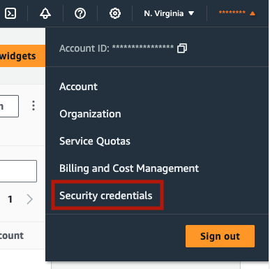

[Amazon Bedrock](https://aws.amazon.com/bedrock/) is a fully managed service that provides high-performing foundation models from leading AI startups and Amazon through a single API. You can choose from various foundation models to find the one best suited for your use case. 

In this article, I'll guide you through the process of **creating a generative question answering application** tailored for PDF files using the newly added [Amazon Bedrock integration](https://haystack.deepset.ai/integrations/amazon-bedrock) with [Haystack](https://github.com/deepset-ai/haystack) and [OpenSearch](https://haystack.deepset.ai/integrations/opensearch-document-store) to store our documents efficiently. The demo will illustrate the step-by-step development of a QA application designed specifically for the Bedrock documentation, demonstrating the power of Bedrock in the process 🚀

## Benefits of Amazon Bedrock

- It provides access to a **diverse range of foundation models** sourced from leading AI startups, including AI21 Labs, Anthropic, Cohere, Meta, and Stability AI, along with Amazon Titan models.
- You can **experiment with different large language models (LLMs)** seamlessly using Amazon Bedrock. No need for multiple API keys; just modify the model name and test your application with various prompts and configurations to identify the optimal model for your specific use case.
- **Amazon Bedrock doesn’t use your prompts and continuations** in training AWS models or share them with third parties. Your training data is not employed in training the core Amazon Titan models or distributed externally. Additionally, other usage data, such as timestamps and account IDs, is not employed in model training. [Source](https://docs.aws.amazon.com/bedrock/latest/userguide/data-protection.html)
- You **don’t need to manage infrastructure** for hosting your models when deploying your application after the prototyping phase. Amazon Bedrock takes care of the hosting infrastructure, providing a seamless deployment experience.

## Set Up Amazon Bedrock

To use Amazon Bedrock, start by [signing up for an AWS account](https://portal.aws.amazon.com/billing/signup). Once you have successfully logged in, go to [Amazon Bedrock Console](https://us-east-1.console.aws.amazon.com/bedrock/home) and get started. Keep in mind that, by default, users do not have model access. You should request access from [Model Access Page](https://us-east-1.console.aws.amazon.com/bedrock/home#/modelaccess). For this application, we're going to use "Titan Text G1 - Express" model by Amazon. Unfortunately, there is no free tier for Amazon Bedrock, therefore, you might need to provide payment information at this step.

Learn more about the process in this [set up Amazon Bedrock](https://docs.aws.amazon.com/bedrock/latest/userguide/setting-up.html) guide.


## API Keys

To use Amazon Bedrock, you need `aws_access_key_id`, `aws_secret_access_key`, and indicate the `aws_region_name`. Once logged into your account, create the access keys in "Security Credentials" section. For detailed guidance, refer to the documentation on [Managing access keys for IAM users](https://docs.aws.amazon.com/IAM/latest/UserGuide/id_credentials_access-keys.html).



")


 

## Development Environment

### Install dependencies

Let’s install [Amazon Bedrock](https://haystack.deepset.ai/integrations/amazon-bedrock) and [OpenSearch](https://haystack.deepset.ai/integrations/opensearch-document-store) integration of Haystack and [pypdf](https://pypi.org/project/pypdf/) package to process PDF files.

```bash
pip install opensearch-haystack amazon-bedrock-haystack pypdf
```

### Download Files

For this application, we’ll use the user guide of Amazon Bedrock. Amazon Bedrock provides the [PDF form of its guide](https://docs.aws.amazon.com/pdfs/bedrock/latest/userguide/bedrock-ug.pdf). You can download the PDF from its source or by running the code below 👇🏼  

```python
import boto3
from botocore import UNSIGNED
from botocore.config import Config
s3 = boto3.client('s3', config=Config(signature_version=UNSIGNED))

# Download the PDF file from our s3 bucket to `/content/bedrock-documentation.pdf` directory
s3.download_file('core-engineering', 'public/blog-posts/bedrock-documentation.pdf', '/content/bedrock-documentation.pdf') #
```

### Initialize an OpenSearch Instance

[OpenSearch](https://opensearch.org/) is a fully open-source search and analytics engine that seamlessly integrates with the [Amazon OpenSearch Service](https://docs.aws.amazon.com/opensearch-service/latest/developerguide/what-is.html), allowing you to deploy, manage, and scale your OpenSearch cluster effortlessly. To get started, install OpenSearch and launch an instance by following the detailed instructions provided in the [OpenSearch documentation](https://opensearch.org/docs/latest/install-and-configure/install-opensearch/index/). 

Here’s how to launch OpenSearch with Docker (recommended):

```bash
docker pull opensearchproject/opensearch:2.11.0
docker run -p 9200:9200 -p 9600:9600 -e "discovery.type=single-node" -e "OPENSEARCH_JAVA_OPTS=-Xms1024m -Xmx1024m" opensearchproject/opensearch:2.11.0
```

## Building the Indexing Pipeline

Our indexing pipeline will convert the PDF file into a Haystack Document using [PyPDFToDocument](https://docs.haystack.deepset.ai/v2.0/docs/pypdftodocument) and preprocess it by cleaning and splitting it into chunks before storing them in [OpenSearchDocumentStore](https://docs.haystack.deepset.ai/v2.0/docs/opensearch-document-store). 

Let’s run the pipeline below and index our file to our document store: 

```python
from pathlib import Path

from haystack import Pipeline
from haystack.components.converters import PyPDFToDocument
from haystack.components.preprocessors import DocumentCleaner, DocumentSplitter
from haystack.components.writers import DocumentWriter
from haystack.document_stores.types import DuplicatePolicy
from haystack_integrations.document_stores.opensearch import OpenSearchDocumentStore

## Initialize the OpenSearchDocumentStore
document_store = OpenSearchDocumentStore(hosts="http://localhost:9200", use_ssl=True, verify_certs=False, http_auth=("admin", "admin"))

## Create pipeline components
converter = PyPDFToDocument()
cleaner = DocumentCleaner()
splitter = DocumentSplitter(split_by="sentence", split_length=10, split_overlap=2)
writer = DocumentWriter(document_store=document_store, policy=DuplicatePolicy.SKIP)

## Add components to the pipeline
indexing_pipeline = Pipeline()
indexing_pipeline.add_component("converter", converter)
indexing_pipeline.add_component("cleaner", cleaner)
indexing_pipeline.add_component("splitter", splitter)
indexing_pipeline.add_component("writer", writer)

## Connect the components to each other
indexing_pipeline.connect("converter", "cleaner")
indexing_pipeline.connect("cleaner", "splitter")
indexing_pipeline.connect("splitter", "writer")
```

Run the pipeline with the files you want to index. 

```python
indexing_pipeline.run({"converter": {"sources": [Path("/content/bedrock-documentation.pdf")]}})
```

> Pipelines for indexing files into document stores are convenient when you need to add additional files to your document store. Feel free to rerun the pipeline with new documents whenever necessary.

## Building the Query Pipeline

Let’s create another pipeline to query our application. In this pipeline, we’ll use [OpenSearchBM25Retriever](https://docs.haystack.deepset.ai/v2.0/docs/opensearchbm25retriever) to retrieve relevant information from the OpenSearchDocumentStore and an Amazon Titan model `amazon.titan-text-express-v1` to generate answers with [AmazonBedrockGenerator](https://docs.haystack.deepset.ai/v2.0/docs/amazonbedrockgenerator). You can find other model options in [supported foundation models](https://docs.aws.amazon.com/bedrock/latest/userguide/model-ids-arns.html). Next, we'll create a prompt for our task using the Retrieval-Augmented Generation (RAG) approach with [PromptBuilder](https://docs.haystack.deepset.ai/v2.0/docs/promptbuilder). This prompt will help generate answers by considering the provided context. Finally, we'll connect these three components to complete the pipeline.

```python
from haystack.components.builders import PromptBuilder
from haystack.pipeline import Pipeline
from amazon_bedrock_haystack.generators.amazon_bedrock import AmazonBedrockGenerator
from haystack_integrations.components.retrievers.opensearch import OpenSearchBM25Retriever

## Create pipeline components
retriever = OpenSearchBM25Retriever(document_store=document_store, top_k=15)

## Initialize the AmazonBedrockGenerator with an Amazon Bedrock model
generator = AmazonBedrockGenerator(model='amazon.titan-text-express-v1',
                                   aws_access_key_id="aws_access_key_id",
                                   aws_secret_access_key="aws_secret_access_key",
                                   aws_region_name="aws_region_name",
                                   max_length=500)
template = """

    {{ document.content }}


Please answer the question based on the given information from Amazon Bedrock documentation.

{{question}}
"""
prompt_builder = PromptBuilder(template=template)

## Add components to the pipeline
rag_pipeline = Pipeline()
rag_pipeline.add_component("retriever", retriever)
rag_pipeline.add_component("prompt_builder", prompt_builder)
rag_pipeline.add_component("llm", generator)

## Connect components to each other
rag_pipeline.connect("retriever", "prompt_builder.documents")
rag_pipeline.connect("prompt_builder", "llm")
```

Now, ask your question and learn about the Amazon Bedrock service using Amazon Bedrock models!

```python
question = "What is Amazon Bedrock??"
response = rag_pipeline.run({"retriever": {"query": question}, "prompt_builder": {"question": question}})

print(response["llm"]["replies"][0])
```

Example result:

```bash
Amazon Bedrock is a fully managed service that makes high-performing foundation models (FMs) from leading AI startups and Amazon available for your use through a unified API. You can choose from a wide range of foundation models to find the model that is best suited for your use case. Amazon Bedrock also offers a broad set of capabilities to build generative AI applications with security, privacy, and responsible AI. Using Amazon Bedrock, you can easily experiment with and evaluate top foundation models for your use cases, privately customize them with your data using techniques such as fine-tuning and Retrieval Augmented Generation (RAG), and build agents that execute tasks using your enterprise systems and data sources.
With Amazon Bedrock's serverless experience, you can get started quickly, privately customize foundation models with your own data, and easily and securely integrate and deploy them into your applications using AWS tools without having to manage any infrastructure.
```

> Keep in mind that generative models are not deterministic and the response you get might differ.

### Other questions you can try

- How can I set up Amazon Bedrock?
- How should I form my prompts for Amazon Titan models?

## Next Steps

As the next step, feel free to enhance your document store by indexing additional files or replacing existing ones with your own data.

For this demonstration, we applied the BM25 method to generate text vectors. If you’d like to improve the application further, select an [Embedder](https://docs.haystack.deepset.ai/v2.0/docs/embedders) and generate dense embeddings for each file using a chosen embedding model before incorporating them into the document store.

Thank you for your interest! Stay informed about the latest developments in Haystack by [subscribing to our newsletter](https://landing.deepset.ai/haystack-community-updates?utm_campaign=developer-relations&utm_source=using-jina-embeddings-haystack) or [joining our Discord community](https://discord.com/invite/haystack).
