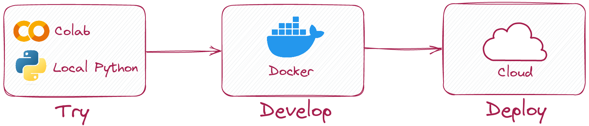

We're thrilled to introduce the `QdrantDocumentStore`, the latest addition to the Haystack DocumentStore family by Qdrant. It's an open source package that provides powerful capabilities such as efficient search, high-dimensional vector retrieval, and flexible launch options. 

Let's learn about DocumentStores and how to use `QdrantDocumentStore` with your pipelines!

## Haystack DocumentStores

Haystack is an end-to-end NLP framework that provides a modular approach to building state-of-the-art generative AI, QA, and semantic knowledge base search systems. A core component of most modern NLP systems is a database that can efficiently store and retrieve vast amounts of text data. Vector databases are a great way of doing this. These databases can store vector representations of text while also implementing efficient ways to retrieve them at speed. To this end, Haystack provides a set of native [DocumentStores](https://docs.haystack.deepset.ai/docs/document_store) that allow you to connect to and query your data that might be in Elasticsearch, Pinecone, Weaviate, or others. This way, you can store and maintain your data within one of these databases while simultaneously using them within your Haystack pipelines and applications.


## New DocumentStore by Qdrant

The latest addition to the Haystack DocumentStore family is the **`QdrantDocumentStore`**. This new DocumentStore is a first of a kind by being an external package maintained by the Qdrant team. [Qdrant](https://qdrant.tech/) is a vector similarity search engine that provides a production-ready service with a convenient API for storing, searching, and managing vectors with an additional payload. Qdrant is optimized for high-dimensional vector search and supports various similarity metrics, making it a powerful tool for various NLP applications.


### Advantages of QdrantDocumentStore

Some of the advantages of using Qdrant with Haystack include:

- Efficient search and retrieval of high-dimensional vectors
- mmap support for HNSW graph storage
- Filtering capabilities integrated directly into the vector search phase
- Constraints based on metadata attributes
- Reducing the memory footprint up to 4 times by using [Scalar Quantization](https://qdrant.tech/articles/scalar-quantization/)
- Storing even a [million vectors with a small amount of RAM](https://qdrant.tech/articles/memory-consumption/)
- Open source! 😍

Qdrant provides several options to launch an instance. A local in-memory/disk-persisted mode is a good choice for test scenarios and quick experiments in Colab or Jupyter Notebook, where you plan to store only a few vectors. When you need to scale, you can easily switch to on-premise server deployment using Docker containers. If you don’t want to manage the infrastructure at all, there is also a fully managed [Qdrant Cloud](https://cloud.qdrant.io/) offering with a free forever 1GB cluster. All is possible when using Haystack! 💙



Haystack is a comprehensive framework that enables developers to construct complete NLP pipelines, and Qdrant is a powerful vector similarity search engine. To ensure seamless collaboration between the two tools and create robust NLP applications, `QdrantDocumentStore` is a separate package maintained by Qdrant, specifically designed to integrate with Haystack. By having its own release cycle, `QdrantDocumentStore` can be updated independently from Haystack, resulting in a more streamlined and efficient workflow.

## How to Use QdrantDocumentStore

If you want to use the `QdrantDocumentStore` with Haystack, you can find the source code in the [qdrant-haystack](https://github.com/qdrant/qdrant-haystack) repository on GitHub. With this integration, you can take advantage of the robust search capabilities of Qdrant with the natural language processing features of Haystack, creating a powerful tool for semantic search and retrieval. 

To use the `QdrantDocumentStore` with Haystack, you can install `qdrant-haystack`:

```bash
pip install qdrant-haystack
```

Then, initialize `QdrantDocumentStore`:

```python
from qdrant_haystack.document_stores import QdrantDocumentStore

document_store = QdrantDocumentStore(
    ":memory:",
    index="Document",
    embedding_dim=512,
    recreate_index=True,
    hnsw_config={"m": 16, "ef_construct": 64}  # Optional
)
```

If you’d like to enable the Scalar Quantization for your embeddings, you can just pass the proper configuration in the same way as you would do with raw QdrantClient:

```python
from qdrant_haystack.document_stores import QdrantDocumentStore
from qdrant_client.http import models

document_store = QdrantDocumentStore(
    "http://localhost:6333", 
    index="Document",
    embedding_dim=512,
    recreate_index=True,
    quantization_config=models.ScalarQuantization(
        scalar=models.ScalarQuantizationConfig(
            type=models.ScalarType.INT8,
            quantile=0.99,
            always_ram=True,
            ),
     ),
)
```

> `QdrantDocumentStore` supports [all the configuration properties](https://qdrant.tech/documentation/collections/#create-collection) available in the Qdrant Python client.

Once you have initialized the document store, you can write your documents using the `write_documents` method. This will allow you to seamlessly integrate your vector database with Haystack and use its functionalities.

```python
document_store.write_documents(docs)
```

That's it! For more examples and documentation on using Qdrant with Haystack, refer to the [qdrant-haystack](https://github.com/qdrant/qdrant-haystack) GitHub repository, and if you have any questions, join Haystack community on [Discord](https://discord.com/invite/VBpFzsgRVF).
