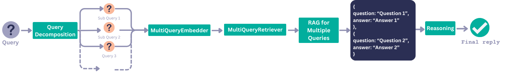

> This is part one of the **Advanced Use Cases** series:
>
> 1️⃣ [Extract Metadata from Queries to Improve Retrieval](/blog/extracting-metadata-filter)
>
> 2️⃣ [Query Expansion](/blog/query-expansion)
>
> 3️⃣ **Query Decomposition**
>
> 4️⃣ Automatic Metadata Enrichment 🔜

Sometimes a single question is multiple questions in disguise. For example: “Did Microsoft or Google make more money last year?”. To get to the correct answer for this seemingly simple question, we actually have to break it down: “How much money did Google make last year?” and “How much money did Microsoft make last year?”. Only if we know the answer to these 2 questions can we reason about the final answer.

This is where query decomposition comes in. This is a technique for AI applications that are meant to answer questions (like retrieval augmented generation or chat) that follows a simple approach:

1. Decompose the original question into smaller questions that can be answered independently to each other. Let’s call these ‘sub questions’ here on out. 
2. Reason about the final answer to the original question, based on the answer to the sub questions.

While for many query/dataset combinations, this may not be required, for some, it very well may be. At the end of the day, often 1 query results in 1 retrieval step. If within that one single retrieval step we are unable to have the retriever return *both* the money Microsoft made last year *and* Google, then the system will struggle to produce an accurate final response.

This method ensures that we are:

1. retrieving the relevant context for each sub question.
2. reasoning about the final answer given each answer based on the contexts retrieved for each sub question.

In this article, I’ll be going through some key steps that allow you to achieve this. You can find the full working example and code in the linked recipe from our [cookbook](https://haystack.deepset.ai/cookbook). Here, I’ll only show the most relevant parts of the code.

> 🚀 I’m sneaking something extra into this article. I saw the opportunity to try out the structured output functionality (currently in beta) by OpenAI to create this example. For this step, I extended the OpenAIGenerator in Haystack to be able to work with Pydantic schemas. More on this in the next step.

Let’s try build a full pipeline that makes use of query decomposition and reasoning. We’ll use a dataset about Game of Thrones (a classic for Haystack) which you can find preprocessed and chunked on `Tuana/game-of-thrones` on Hugging Face Datasets.

## Defining our Questions Structure

Our first step is to create a structure within which we can contain the subquestions, and each of their answers. This will be used by our OpenAIGenerator to produce a structured output. 

```python
from pydantic import BaseModel

class Question(BaseModel):
    question: str
    answer: Optional[str] = None

class Questions(BaseModel):
    questions: list[Question]
```

The structure is simple, we have `Questions` made up of a list of `Question`. Each `Question` has the `question` string as well as an optional `answer` to that question.

### Defining the Prompt for Query Decomposition

Next up, we need to get an LLM to decompose a question and produce multiple questions. Here, we will start making use of our `Questions` schema.

```python
from haystack import Pipeline
from haystack.components.builders import PromptBuilder

splitter_prompt = """
You are a helpful assistant that prepares queries that will be sent to a search component.
Sometimes, these queries are very complex.
Your job is to simplify complex queries into multiple queries that can be answered
in isolation to eachother.

If the query is simple, then keep it as it is.
Examples
1. Query: Did Microsoft or Google make more money last year?
   Decomposed Questions: [Question(question='How much profit did Microsoft make last year?', answer=None), Question(question='How much profit did Google make last year?', answer=None)]
2. Query: What is the capital of France?
   Decomposed Questions: [Question(question='What is the capital of France?', answer=None)]
3. Query: {{question}}
   Decomposed Questions:
"""

builder = PromptBuilder(splitter_prompt)
llm = OpenAIGenerator(model="gpt-4o-mini", generation_kwargs={"response_format": Questions})
```

## Answering Each Sub Question

First, let’s build a pipeline that uses the `splitter_prompt` to decompose our question:

```python
query_decomposition_pipeline = Pipeline()

query_decomposition_pipeline.add_component("prompt", PromptBuilder(splitter_prompt))
query_decomposition_pipeline.add_component("llm", OpenAIGenerator(model="gpt-4o-mini", generation_kwargs={"response_format": Questions}))

query_decomposition_pipeline.connect("prompt", "llm")

question = "Who has more siblings, Jamie or Sansa?"
result = query_decomposition_pipeline.run({"prompt":{"question": question}})
print(result["llm"]["structured_reply"])
```

This produces the following `Questions`

```
questions=[Question(question='How many siblings does Jamie have?', answer=None), 
           Question(question='How many siblings does Sansa have?', answer=None)]
```

Now, we have to fill in these empty `answer` fields. For this step, we need to have a separate prompt, and we also use 2 custom components:

- The `CohereMultiTextEmbedder` which can take multiple questions rather than a single one like the `CohereTextEmbedder`.
- The `MultiQueryInMemoryEmbeddingRetriever` which can again, take multiple questions and their embeddings, returning `question_context_pairs`. Each pair contains the `question` and `documents` that are relevant to that question.

Next, we need to construct a prompt that can instruct a model to answer each subquestion:

```python
multi_query_template = """
You are a helpful assistant that can answer complex queries.
Here is the original question you were asked: {{question}}

And you have split the task into the following questions:

  {{pair.question}}


Here are the question and context pairs for each question.
For each question, generate the question answer pair as a structured output

  Question: {{pair.question}}
  Context: {{pair.documents}}

Answers:
"""

multi_query_prompt = PromptBuilder(multi_query_template)
```

 Let’s build a pipeline that can answer each individual sub question. We will call this the `query_decomposition_pipeline` :

```python
query_decomposition_pipeline = Pipeline()

query_decomposition_pipeline.add_component("prompt", PromptBuilder(splitter_prompt))
query_decomposition_pipeline.add_component("llm", OpenAIGenerator(model="gpt-4o-mini", generation_kwargs={"response_format": Questions}))
query_decomposition_pipeline.add_component("embedder", CohereMultiTextEmbedder(model="embed-multilingual-v3.0"))
query_decomposition_pipeline.add_component("multi_query_retriever", MultiQueryInMemoryEmbeddingRetriever(InMemoryEmbeddingRetriever(document_store=document_store)))
query_decomposition_pipeline.add_component("multi_query_prompt", PromptBuilder(multi_query_template))
query_decomposition_pipeline.add_component("query_resolver_llm", OpenAIGenerator(model="gpt-4o-mini", generation_kwargs={"response_format": Questions}))

query_decomposition_pipeline.connect("prompt", "llm")
query_decomposition_pipeline.connect("llm.structured_reply", "embedder.questions")
query_decomposition_pipeline.connect("embedder.embeddings", "multi_query_retriever.query_embeddings")
query_decomposition_pipeline.connect("llm.structured_reply", "multi_query_retriever.queries")
query_decomposition_pipeline.connect("llm.structured_reply", "embedder.questions")
query_decomposition_pipeline.connect("multi_query_retriever.question_context_pairs", "multi_query_prompt.question_context_pairs")
query_decomposition_pipeline.connect("multi_query_prompt", "query_resolver_llm")
```

Running this pipeline with the original question “Who has more siblings, Jamie or Sansa?”, results in the following structured output:

```python
question = "Who has more siblings, Jamie or Sansa?"
result = query_decomposition_pipeline.run({"prompt":{"question": question},
															             "multi_query_prompt": {"question": question}})

print(result["query_resolver_llm"]["structured_reply"])
```

```
questions=[Question(question='How many siblings does Jamie have?', answer='2 (Cersei Lannister, Tyrion Lannister)'), 
           Question(question='How many siblings does Sansa have?', answer='5 (Robb Stark, Arya Stark, Bran Stark, Rickon Stark, Jon Snow)')]
```

## Reasoning About the Final Answer



The final step we have to take is to reason about the ultimate answer to the original question. Again, we create a prompt that will instruct an LLM to do this. Given we have the `questions` output that contains each sub `question` and `answer`, we will make these inputs to this final prompt. 

```python
reasoning_template = """
You are a helpful assistant that can answer complex queries.
Here is the original question you were asked: {{question}}

You have split this question up into simpler questoins that can be answered in
isolation.
Here are the questions and answers that you've generated

  {{pair}}


Reason about the final answer to the original query based on these questions and
aswers
Final Answer:
"""

resoning_prompt = PromptBuilder(reasoning_template)
```

To be able to augment this prompt with the question answer pairs, we will have to extend our previous pipeline and connect the `structured_reply` from the last LLM, to the `question_answer_pair` input of this prompt.

```python
query_decomposition_pipeline.add_component("reasoning_prompt", PromptBuilder(reasoning_template))
query_decomposition_pipeline.add_component("reasoning_llm", OpenAIGenerator(model="gpt-4o-mini"))

query_decomposition_pipeline.connect("query_resolver_llm.structured_reply", "reasoning_prompt.question_answer_pair")
query_decomposition_pipeline.connect("reasoning_prompt", "reasoning_llm")
```

Now, let’s run this final pipeline and see what results we get:

```python
question = "Who has more siblings, Jamie or Sansa?"
result = query_decomposition_pipeline.run({"prompt":{"question": question},
															             "multi_query_prompt": {"question": question},
															             "reasoning_prompt": {"question": question}},
															             include_outputs_from=["query_resolver_llm"])

print("The original query was split and resolved:\n")
for pair in result["query_resolver_llm"]["structured_reply"].questions:
  print(pair)
print("\nSo the original query is answered as follows:\n")
print(result["reasoning_llm"]["replies"][0])
```

🥁 Drum roll please:

```
The original query was split and resolved:

question='How many siblings does Jaime have?' answer='Jaime has one sister (Cersei) and one younger brother (Tyrion), making a total of 2 siblings.'
question='How many siblings does Sansa have?' answer='Sansa has five siblings: one older brother (Robb), one younger sister (Arya), and two younger brothers (Bran and Rickon), as well as one older illegitimate half-brother (Jon Snow).'

So the original query is answered as follows:

To determine who has more siblings between Jaime and Sansa, we need to compare the number of siblings each has based on the provided answers.

From the answers:
- Jaime has 2 siblings (Cersei and Tyrion).
- Sansa has 5 siblings (Robb, Arya, Bran, Rickon, and Jon Snow).

Since Sansa has 5 siblings and Jaime has 2 siblings, we can conclude that Sansa has more siblings than Jaime.

Final Answer: Sansa has more siblings than Jaime.
```

## Wrapping up

LLMs are great at reasoning, and most of the time, we simply have to make sure we are giving the right context in our instructions. Query decomposition is a great way we can make sure we do that for questions that are multiple questions in disguise.

In this article, you learned how to implement this technique with a twist 🙂 Let us know what you think about using structured outputs for these sorts of use cases. And check out the [Haystack experimental repo](https://github.com/deepset-ai/haystack-experimental?tab=readme-ov-file#experiments-catalog) to see what new features we’re working on.