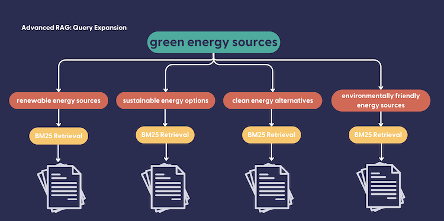
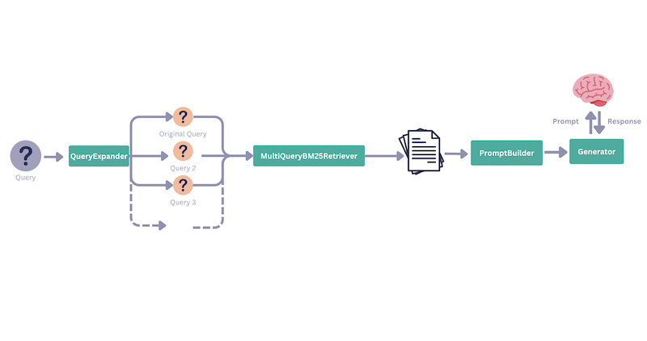

> This is part one of the **Advanced Use Cases** series:
>
> 1️⃣ [Extract Metadata from Queries to Improve Retrieval](/blog/extracting-metadata-filter)
>
> 2️⃣ **Query Expansion**
>
> 3️⃣ [Query Decomposition](/blog/query-decomposition)
>
> 4️⃣ Automatic Metadata Enrichment 🔜

The quality of RAG (retrieval augmented generation) highly depends on the quality of the first step in the process: retrieval. The generation step can only be as good as the context its working on, which it will receive as a result of a retrieval step.

However, retrieval is also in turn dependent on the query that it receives. There are multiple types of retrieval: keyword based, semantic search (embedding) based, hybrid, or even in some cases simply based on the results of a query to an API (for example, the results of websearch and so on). But at the end of the day, in the majority of cases, there’s a human behind a keyboard typing a query, and humans are not guaranteed to produce good quality queries for the results they intend to get.

In this article, we’ll walk you through a very simple yet effective technique that allows us to make sure we are retrieving more of, and more relevant bits of context to a given query: query expansion.

> TL;DR: Query expansion increases the number of results, so it increases recall (vs precision). In general, BM25 favors precision while embedding retrieval favors recall (See this [explanation by Nils Reimers](https://github.com/UKPLab/sentence-transformers/issues/22#issuecomment-529387645)). So, it makes sense to use BM25+query expansion to increase recall in cases where you want to rely on keyword search.
> 

## Query Expansion

Query expansion is a technique where we take the user query, and generate a certain number of similar queries. For example:

**User Query:** “open source NLP frameworks”

**After Query Expansion:** [”natural language processing tools”, “free nlp libraries”, “open-source language processing platforms”, “NLP software with open-source code”, “open source NLP frameworks”]

This helps improve retrieval results, and in turn the quality of RAG results in cases where:

- The user query is vague or badly formed.
- In cases of keyword based retrieval, it also allows you to cover your bases with queries of similar meaning or synonyms.

Take ‘global warming’ as an example, query expansion would allow us to make sure we’re also doing keyword search for ‘climate change’ or similar queries.



Let’s start by building a simple `QueryExpander`. This component is using an OpenAI model (`gpt-3.5-turbo` in this case) to generate a certain `number` of additional queries:

```python
@component
class QueryExpander:

    def __init__(self, prompt: Optional[str] = None, model: str = "gpt-3.5-turbo"):

        self.query_expansion_prompt = prompt
        self.model = model
        if prompt == None:
          self.query_expansion_prompt = """
          You are part of an information system that processes users queries.
          You expand a given query into {{ number }} queries that are similar in meaning.
          
          Structure:
          Follow the structure shown below in examples to generate expanded queries.
          Examples:
          1. Example Query 1: "climate change effects"
          Example Expanded Queries: ["impact of climate change", "consequences of global warming", "effects of environmental changes"]
          
          2. Example Query 2: ""machine learning algorithms""
          Example Expanded Queries: ["neural networks", "clustering", "supervised learning", "deep learning"]
          
          Your Task:
          Query: "{{query}}"
          Example Expanded Queries:
          """
        builder = PromptBuilder(self.query_expansion_prompt)
        llm = OpenAIGenerator(model = self.model)
        self.pipeline = Pipeline()
        self.pipeline.add_component(name="builder", instance=builder)
        self.pipeline.add_component(name="llm", instance=llm)
        self.pipeline.connect("builder", "llm")

    @component.output_types(queries=List[str])
    def run(self, query: str, number: int = 5):
        result = self.pipeline.run({'builder': {'query': query, 'number': number}})
        expanded_query = json.loads(result['llm']['replies'][0]) + [query]
        return {"queries": list(expanded_query)}
```

To replicate the example user query and expanded queries as you see above, you would run the component as follows:

```python
expander = QueryExpander()
expander.run(query="open source nlp frameworks", number=4)
```

This would result in the component returning `queries` that include the original query + 4 expanded queries:

```bash
{'queries': ['natural language processing tools',
  'free nlp libraries',
  'open-source language processing platforms',
  'NLP software with open-source code',
  'open source nlp frameworks']}
```

## Retrieval With Query Expansion

Let’s take a look at what happens if we use query expansion as a step in our retrieval pipeline. Let’s look at this through a very simple and small demo. To this end, I used some dummy data. Here’s the list of `documents` I used:

```
documents = [
    Document(content="The effects of climate are many including loss of biodiversity"),
    Document(content="The impact of climate change is evident in the melting of the polar ice caps."),
    Document(content="Consequences of global warming include the rise in sea levels."),
    Document(content="One of the effects of environmental changes is the change in weather patterns."),
    Document(content="There is a global call to reduce the amount of air travel people take."),
    Document(content="Air travel is one of the core contributors to climate change."),
    Document(content="Expect warm climates in Turkey during the summer period."),
]
```

When asking to retrieve the top 3 documents to the query "climate change” using the `InMemoryBM25Retriever` (so, we’re doing keyword search) here’s what we get as our top 3 candidates:

```
'Air travel is one of the core contributors to climate change.'
'The impact of climate change is evident in the melting of the polar ice caps.'
'The effects of climate are many including loss of biodiversity'
```

There are 2 things to notice here:

1. We’re only asking for 3 documents, and we’re getting 3 relevant documents to the query “climate change”. In this sense, this retrieval is completely valid and has done a good job.
2. But, because we’re using the query “climate change” in combination with a keyword retriever, we are actually missing out on some documents that may be even more relevant to the query. For example, the document with “global warming” is completely left out. 

You can start to see how this could impact the results you get in cases where users are typing vague queries or keywords into the search box. 

Now, let’s add query expansion to the mix. We will be using a custom retriever this time called the `MultiQueryInMemoryBM25Retriever` which can accept a list of `queries` instead of a single `query` (see the cookbook for the full code). Here’s the retrieval pipeline that we create:

```python
query_expander = QueryExpander()
retriever = MultiQueryInMemoryBM25Retriever(InMemoryBM25Retriever(document_store=doc_store))

expanded_retrieval_pipeline = Pipeline()
expanded_retrieval_pipeline.add_component("expander", query_expander)
expanded_retrieval_pipeline.add_component("keyword_retriever", retriever)

expanded_retrieval_pipeline.connect("expander.queries", "keyword_retriever.queries")
```

Now, we can run this pipeline, again with the same query “climate change”

```python
expanded_retrieval_pipeline.run({"expander": {"query": "climate change"}}, 
																include_outputs_from=["expander"])
```

And we get the following results. The query expander has created the following `queries`:

```
'expander': {'queries': ['global warming consequences',
   'environmental impact of climate change',
   'effects of climate variability',
   'implications of climate crisis',
   'consequences of greenhouse gas emissions',
   'climate change']}}
```

> Note that you may get different results because your `QueryExpander` may generate different `queries`
> 

And we’ve received the following documents from the retrieval pipeline: 

```
'Consequences of global warming include the rise in sea levels.'
'The impact of climate change is evident in the melting of the polar ice caps.',
'There is a global call to reduce the amount of air travel people take.'
'The effects of climate are many including loss of biodiversity'
'One of the effects of environmental changes is the change in weather patterns.'
'Air travel is one of the core contributors to climate change.'
```

Notice how we’re able to add context about ‘global warming’ and ‘effects of environmental change’.

## Using Query Expansion for RAG

In the example cookbook, we’ve also added a section on using query expansion for RAG on Wikipedia pages. We index the following wikipedia pages into an `InMemoryDocumentStore` : 

```
"Electric_vehicle", "Dam", "Electric_battery", "Tree", "Solar_panel", "Nuclear_power",
"Wind_power", "Hydroelectricity", "Coal", "Natural_gas", 
"Greenhouse_gas", "Renewable_energy", "Fossil_fuel"
```

And then, we construct a RAG pipeline. For our resulting prompt to the LLM, we also indicate what the original query from the user was.



```python
template = """
You are part of an information system that summarises related documents.
You answer a query using the textual content from the documents retrieved for the
following query.
You build the summary answer based only on quoting information from the documents.
You should reference the documents you used to support your answer.
###
Original Query: "{{query}}"
Retrieved Documents: {{documents}}
Summary Answer:
"""
query_expander = QueryExpander()
retriever = MultiQueryInMemoryBM25Retriever(InMemoryBM25Retriever(document_store=doc_store))
prompt_builder = PromptBuilder(template = template)
llm = OpenAIGenerator()

query_expanded_rag_pipeline = Pipeline()
query_expanded_rag_pipeline.add_component("expander", query_expander)
query_expanded_rag_pipeline.add_component("keyword_retriever", retriever)
query_expanded_rag_pipeline.add_component("prompt", prompt_builder)
query_expanded_rag_pipeline.add_component("llm", llm)

query_expanded_rag_pipeline.connect("expander.queries", "keyword_retriever.queries")
query_expanded_rag_pipeline.connect("keyword_retriever.documents", "prompt.documents")
query_expanded_rag_pipeline.connect("prompt", "llm")
```

Running this pipeline with the simple query “green energy sources” with the query expander, we’re able to get a response constructed from Wikipedia pages including “Electric Vehicle”,  “Wind Power”,  “Renewable Energy”, “Fossil Fuel” and “Nuclear Power”. Without the `MultiQueryInMemoryBM25Retriever`, we rely on the top k results from a single pass of BM25 retrieval on the query “green energy sources” resulting in a response constructed from the pages “Renewable energy”, “Wind Power” and “Fossil Fuel”

## Wrapping Up

Query Expansion is a great technique that will allow you to get a wider range of relevant resources while still using keyword search. While semantic search is a great option, it does require the use of an embedding model, and the existence of embeddings for the data source we will perform search on. This makes keyword based search quite an attractive option for faster, cheaper retrieval.

This does however mean that we heavily rely on the quality of the provided query. Query expansion allows you to navigate this issue by generating similar queries to the user query.

In my opinion, one of the main advantages of this technique is that it allows you to avoid embedding documentation at each update, while still managing to increase the relevance of retrieved documents at query time. Keyword retrieval doesn’t require any extra embedding step, so the only inferencing happening at retrieval time in this scenario is when we ask an LLM to generate a certain number of similar queries.
