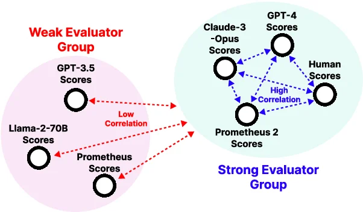

When building real-world applications based on Language Models (such as RAG), evaluation plays an important role. Recently, evaluating generated answers using powerful proprietary Language Models (such as GPT-4) has become popular and correlates well with human judgment, but it comes with its own limitations and challenges.

Prometheus 2 is a newly released family of open-source models specifically trained to evaluate the output of other Language Models. In this article (and in the related notebook), we will see how to use Prometheus and we will experiment with it to evaluate the generated responses of a RAG Pipeline using Haystack.

## Language Models as Evaluators

With the rise of Language Models (LMs) demonstrating strong general capabilities across diverse tasks, evaluating answers generated by these models using other generative LMs has become a common and effective approach. Compared to statistical-based evaluation, this technique is convenient as it usually does not require ground truth labels.

**Proprietary models** such as GPT-4 or Claude 3 Opus are frequently chosen for evaluation and have shown a good correlation with human judgment. However, relying on closed models has several limitations:

-   data privacy: your data exits your machine and is transmitted to the model provider
-   transparency: the training data of these models is unknown
-   controllability: as these models are accessed via APIs, their behavior can change over time
-   price: despite a constant drop in prices, these large models remain expensive. Additionally, the evaluation process typically involves several cycles of testing and refinement, which can significantly increase the overall expense.

On the other hand, using **open models** for evaluation is an active research area, but their practical use is often limited. They typically do not correlate well with human judgments and lack flexibility (for more details, see the [Prometheus 2 paper](https://arxiv.org/abs/2405.01535)).

## 🔥 Prometheus 2: a strong open-source model for evaluation



[Prometheus 2](https://arxiv.org/abs/2405.01535) is a new family of open-source models designed to bridge the gap between proprietary models and open LMs for evaluation.

The authors unified two different evaluation paradigms: direct assessment (evaluating the quality of an answer generated by a single model based on a specific criterion) and pairwise ranking (choosing the best answer between two, usually produced by different models).

In particular, for each variant, they started from a MistralAI base model, they trained 2 different models (one for each of the mentioned tasks) on open-source datasets and then merged their weights to create a robust evaluator Language Model.

The results are impressive:

-   two variants: [7B](https://huggingface.co/prometheus-eval/prometheus-7b-v2.0) and [8x7B](https://huggingface.co/prometheus-eval/prometheus-8x7b-v2.0), fine-tuned from Mistral-7B and Mixtral8x7B, respectively
-   high correlation with human evaluations and proprietary models
-   the models are highly flexible: capable of performing direct assessments and pairwise rankings, and allowing custom evaluation criteria definition

## Prompting Prometheus 2

### The prompt template

Prometheus 2 models are generative language models trained to perform evaluation. To achieve the best results with these models, we need to follow a precise yet customizable prompt structure. You can find the prompt templates in the paper and [on GitHub](https://github.com/prometheus-eval/prometheus-eval/blob/3042bfc6a263a98cc31a7aa4e704e3784e0c1b8b/libs/prometheus-eval/prometheus_eval/prompts.py).

Since we want to experiment with Prometheus 2 to evaluate a single RAG system, we are primarily interested in the [Direct Assessment prompt template](https://github.com/prometheus-eval/prometheus-eval/blob/3042bfc6a263a98cc31a7aa4e704e3784e0c1b8b/libs/prometheus-eval/prometheus_eval/prompts.py), which allows evaluating the quality of an answer based on specific criteria. The following template includes a reference answer; the provided link also contains a version without it.

Let’s take a look at it.

```markdown
You are a fair judge assistant tasked with providing clear, objective feedback 
based on specific criteria, ensuring each assessment reflects the absolute 
standards set for performance.

###Task Description:
An instruction (might include an Input inside it), a response to evaluate, a 
reference answer that gets a score of 5, and a score rubric representing a 
evaluation criteria are given.
1. Write a detailed feedback that assess the quality of the response strictly 
based on the given score rubric, not evaluating in general.
2. After writing a feedback, write a score that is an integer between 1 and 5. 
You should refer to the score rubric.
3. The output format should look as follows: \\"Feedback: (write a feedback for 
criteria) [RESULT] (an integer number between 1 and 5)\\"
4. Please do not generate any other opening, closing, and explanations.

###The instruction to evaluate:
{instruction}

###Response to evaluate:
{response}

###Reference Answer (Score 5):
{reference_answer}

###Score Rubrics:
{score_rubric}

###Feedback:

```

In this prompt template, the only parts to be customized are those enclosed in curly brackets.

We should provide:

-   the instruction to use for evaluation, which may include an input (e.g., a user question, if evaluating a RAG pipeline)
-   the LLM response to evaluate
-   the reference answer: a perfect answer, scoring 5 according to the score rubric
-   a score rubric with scores from 1 to 5, accurately describing when the response qualifies for each score.

When provided with such a prompt, the model will generate two outputs: detailed `feedback` and a score from 1 to 5.

### An example

Let’s say we want to evaluate the correctness of a generated answer. In this case we will have a ground truth answer, but it is not mandatory.

Question: “Who won the 2022 World Cup?”
Generated Answer: “Argentina won the 2022 FIFA World Cup. France won the 2018 FIFA World Cup.”
Reference Answer: “Argentina won the 2022 FIFA World Cup.”

In this case, our prompt might look like the following:

```python
[...]

###The instruction to evaluate:
Your task is to evaluate the generated answer against the reference answer for 
the question: Who won the 2022 World Cup?

###Response to evaluate:
Argentina won the 2022 FIFA World Cup. France won the 2018 FIFA World Cup.

###Reference Answer (Score 5):
Argentina won the 2022 FIFA World Cup.

###Score Rubrics:
Score 1: The answer is not relevant to the question and does not align with the reference answer.
Score 2: The answer is relevant to the question but deviates significantly from the reference answer.
Score 3: The answer is relevant to the question and generally aligns with the reference answer but has errors or omissions.
Score 4: The answer is relevant to the question and closely matches the reference answer but is less concise or clear.
Score 5: The answer is highly relevant, fully accurate, and matches the reference answer in both content and clarity.

###Feedback:

```

Calling the model with this prompt should return a result similar to this:

> Both the generated response and the reference answer identify Argentina as the winner of the 2022 FIFA World Cup. This shows that the generated answer is accurate and relevant to the user's query about who won the 2022 World Cup. However, the inclusion of an unrelated fact about France winning the 2018 World Cup does not enhance the relevance or accuracy of the response, making it somewhat less concise than the reference answer. While the information about France is not incorrect, it does not pertain to the original query about the 2022 World Cup. Thus, despite being generally correct, the additional detail in the generated response deviates from the concise nature of the reference answer, and it could be perceived as slightly less effective. Therefore, according to the score rubric, which places emphasis on relevance, conciseness, and accuracy, the generated response is not as well aligned with the reference answer as it could be. So the score is 4. [RESULT] 4

## Experimenting with Prometheus 2 in Haystack

Haystack is an orchestration framework for building and evaluating applications based on LLMs. It comes with [its own set of evaluators and integrates with different evaluation libraries](https://docs.haystack.deepset.ai/docs/evaluation). It is easy to extend Haystack functionalities, by creating custom components, so we can try to incorporate Prometheus 2.

This is the plan:

-   build and run an Indexing pipeline
-   build and run a RAG pipeline to evaluate
-   implement a PrometheusLLMEvaluator component
-   create different PrometheusLLMEvaluators
-   build and run an evaluation pipeline with different PrometheusLLMEvaluators

In this blog post, we summarize these steps, but you can find the full implementation in the accompanying notebook.

### Indexing pipeline

Before running a RAG pipeline, we need to index some data.

We will be using [a labeled PubMed dataset](https://huggingface.co/datasets/vblagoje/PubMedQA_instruction/viewer/default/train?row=0) with questions, contexts and answers. This allows us to use the contexts as Documents and provides the necessary labeled data for some of the evaluation metrics we will define.

For simplicity, we will use the `InMemoryDocumentStore`. Our indexing pipeline will include a `DocumentEmbedder` (embedding model: `sentence-transformers/all-MiniLM-L6-v2`) and a `DocumentWriter`.

See the accompanying notebook for the full code on building a running an indexing pipeline.

### RAG pipeline

Now that we have our data ready, we can create a simple RAG pipeline.

Our RAG pipeline will include:

-   `InMemoryEmbeddingRetriever` to retrieve the relevant documents for the query (based on the same embedding model as before)
-   `PromptBuilder` to dynamically create prompts
-   `HuggingFaceLocalGenerator` with `google/gemma-1.1-2b-it` to generate answers to queries. It is a small model, and later we will evaluate the quality of the generated responses based on custom criteria.
-   `AnswerBuilder`

Let's run our RAG pipeline with a set of questions and save the data we need for evaluation: questions, ground truth answers, and generated answers.

### Implement a PrometheusLLMEvaluator component

To perform evaluation, we create [a custom Haystack Evaluator component](https://colab.research.google.com/github/deepset-ai/haystack-cookbook/blob/main/notebooks/prometheus2_evaluation.ipynb#scrollTo=XVWnGSIJekey), based on Prometheus 2.

This component allows you to develop a diverse range of evaluators.

You can find the implementation in the accompanying notebook. Let’s take a high-level overview of this component:

-   init parameters
    -   `template`: A Jinja2 prompt template that adheres to the Prometheus 2 prompt structure, with placeholders for input data that we want to pass at runtime (e.g., `question`, `generated_answer`, `ground_truth_answer`)
    -   `inputs`: A list of tuples in the format (`input_name`, `input_type`). These are the inputs that the evaluator expects and uses for evaluation. They should match those defined in the template.
    -   `generator`: (hacky) Allows passing different types of Haystack generators to use the Prometheus 2 model. Examples: `HuggingFaceLocalGenerator`, `LlamaCPPGenerator`, etc.
-   `run` method: for each example to evaluate, the inputs are validated, integrated into the prompt and passed to the model. The model output is parsed to extract score and feedback. This method returns a dictionary containing an aggregate `score`, `individual_scores` and `feedbacks`.

### Create different Evaluators

Let’s see how we can use the `PrometheusLLMEvaluator`.

We start by creating a Correctness Evaluator, similar to the above example.

First, we initialize a generator to load the Prometheus 2 model; in particular, we are using the small variant (7B).

```python
from haystack.components.generators import HuggingFaceLocalGenerator

generator = HuggingFaceLocalGenerator(
    model="prometheus-eval/prometheus-7b-v2.0",
    task="text2text-generation",
		...
)
generator.warm_up()

```

In this example, we are using the [`HuggingFaceLocalGenerator`](https://docs.haystack.deepset.ai/docs/huggingfacelocalgenerator), which can run on the free GPU provided by Colab, but there are several other options, depending on your environment: [`LlamaCPPGenerator`](https://docs.haystack.deepset.ai/docs/llamacppgenerator) for resource-constrained environments (even without a GPU); TGI (via [HuggingFaceAPIGenerator](https://docs.haystack.deepset.ai/docs/huggingfaceapigenerator)) and [vLLM](https://haystack.deepset.ai/integrations/vllm) for production environments with available GPU resources.

Next, let’s prepare the prompt template for the Correctness evaluator. Note that we are inserting placeholders for `query`, `generated_answer` and `reference_answer`. These fields will be populated dynamically based on RAG results and ground truth answers.

```python
correctness_prompt_template = """
...
###The instruction to evaluate:
Your task is to evaluate the generated answer against the reference answer for the question: {{query}}

###Response to evaluate:
generated answer: {{generated_answer}}

###Reference Answer (Score 5): {{reference_answer}}

###Score Rubrics:
Score 1: The answer is not relevant to the question and does not align with the reference answer.
Score 2: The answer is relevant to the question but deviates significantly from the reference answer.
Score 3: The answer is relevant to the question and generally aligns with the reference answer but has errors or omissions.
Score 4: The answer is relevant to the question and closely matches the reference answer but is less concise or clear.
Score 5: The answer is highly relevant, fully accurate, and matches the reference answer in both content and clarity.

###Feedback:"""

```

Finally, let’s initialize our evaluator, specifying which inputs it should expect at runtime (they should match the placeholders of the above prompt template).

```python
correctness_evaluator = PrometheusLLMEvaluator(
    template=correctness_prompt_template,
    generator=generator,
    inputs=[
        ("query", List[str]),
        ("generated_answer", List[str]),
        ("reference_answer", List[str]),
    ],
)

```

Similarly, we can create other evaluators:

-   Response Relevance: Evaluates the generated answer in terms of its relevance to the user's question.
-   Logical Robustness: Evaluates the logical organization and progression of the response.

These evaluators do not require ground truth labels. For details about prompt templates and required inputs, refer to the accompanying notebook.

### Evaluation pipeline

We can now put our evaluators in a pipeline, and run it to see how our small model performs.

```python
from haystack import Pipeline

eval_pipeline = Pipeline()
eval_pipeline.add_component("correctness_evaluator", correctness_evaluator)
eval_pipeline.add_component("response_relevance_evaluator", response_relevance_evaluator)
eval_pipeline.add_component("logical_robustness_evaluator", logical_robustness_evaluator)

eval_results = eval_pipeline.run(
    {
        "correctness_evaluator": {
            "query": questions,
            "generated_answer": rag_answers,
            "reference_answer": ground_truth_answers,
        },
        "response_relevance_evaluator": {
            "query": questions,
            "generated_answer": rag_answers,
        },
        "logical_robustness_evaluator": {
            "query": questions,
            "generated_answer": rag_answers,
        },
    }
)

```

Once we've run our evaluation pipeline, we can also create a full evaluation report. Haystack provides an `EvaluationRunResult` which we can use to display a `score_report`.

```python
from haystack.evaluation.eval_run_result import EvaluationRunResult

inputs = {
    "question": questions,
    "answer": ground_truth_answers,
    "predicted_answer": rag_answers,
}

evaluation_result = EvaluationRunResult(run_name="pubmed_rag_pipeline", inputs=inputs, results=eval_results)
evaluation_result.score_report()

```

In our experiment (involving a small sample of 10 examples), we get the following results:

| Evaluation    | Score |
| -------- | ------- |
| correctness_evaluator  | 3.9    |
| response_relevance_evaluator |  4.3  |
| logical_robustness_evaluator    |3.5    |


Gemma-1.1-2b-it seems to generate relevant answers, but the responses differ from ground truth answers and the logical organization is not optimal.

To inspect these results in more detail, we can convert the `evaluation_result` to a Pandas dataframe and also look at the individual feedbacks of each evaluator for each example.

## Wrapping it up

In this post, you have learned about Prometheus 2: a new family of SOTA open-source models for evaluation.

After introducing the models and their specific usage, we have put them in action in Haystack and created different Evaluators to assess the quality of the responses produced by a RAG pipeline, along several axes.

The results of our experiments are interesting and promising. However, before using these models for real-world applications, you should assess them for your specific use case. Moreover, in this rapidly changing world, perhaps the day is not far off when general-purpose open models can be used effectively for evaluation.