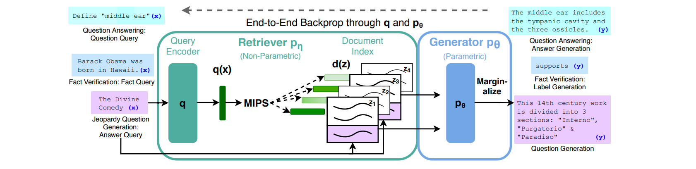
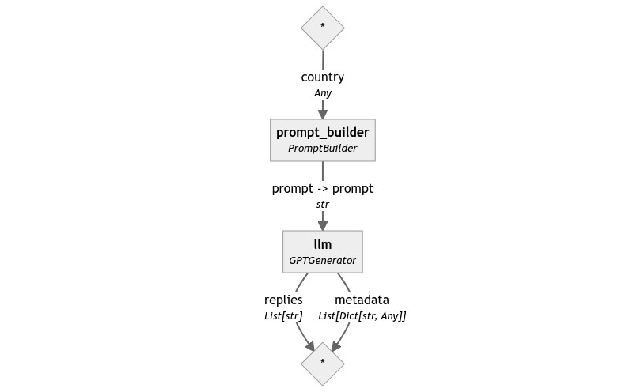
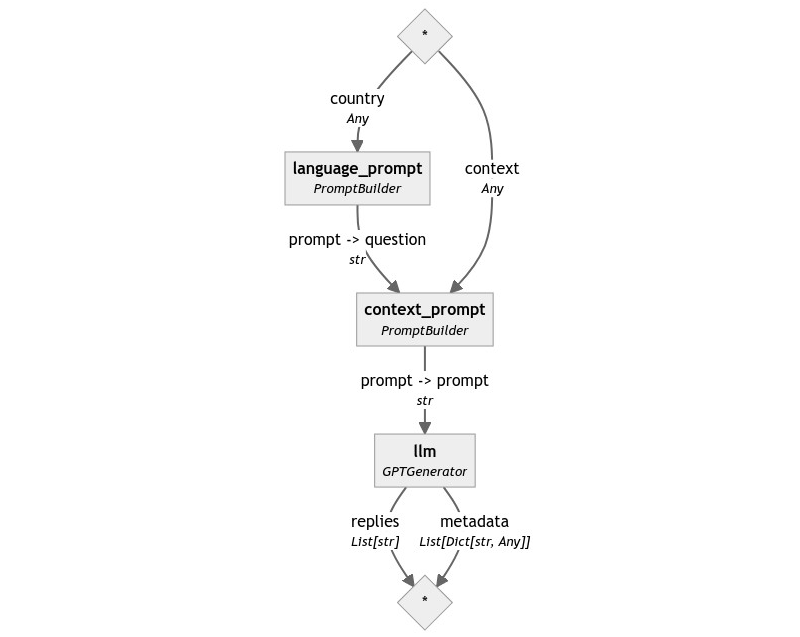
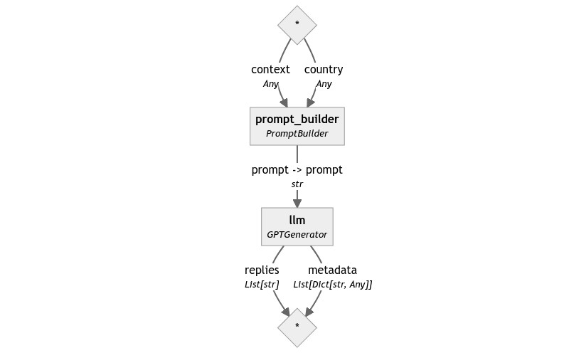
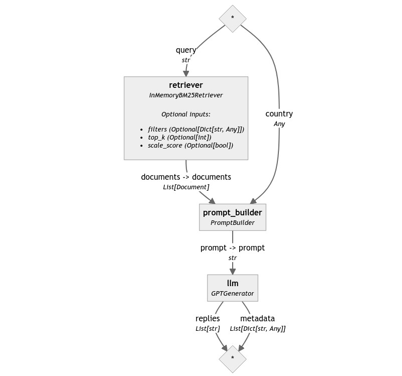
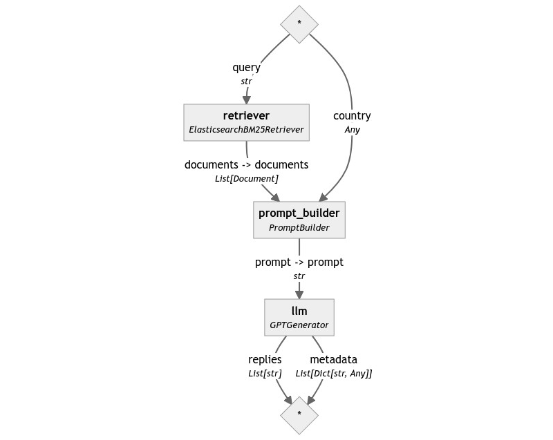

---
layout: blog-post
title: "RAG Pipelines From Scratch"
description: "Let's build a simple RAG Pipeline with Haystack 2.0 by just connecting three components: a Retriever, a PromptBuilder and a Generator."
featured_image: thumbnail.png
featured_image_caption: "The Republic of Rose Island"
images: ["blog/rag-pipelines-from-scratch/thumbnail.png"]
alt_image: The Republic of Rose Island
toc: True
date: 2023-11-21
last_updated:  2023-11-21
authors:
  - Sara Zanzottera
tags: ["Haystack 2.0", "RAG"]
canonical_url: https://www.zansara.dev/posts/2023-10-27-haystack-series-rag/
---	

Retrieval Augmented Generation (RAG) is quickly becoming an essential technique to make LLMs more reliable and effective at answering any question, regardless of how specific. To stay relevant in today's NLP landscape, Haystack must enable it.

Let's see how to build such applications with Haystack 2.0, from a direct call to an LLM to a fully-fledged, production-ready RAG pipeline that scales. At the end of this post, we will have an application that can answer questions about world countries based on data stored in a private database. At that point, the knowledge of the LLM will be only limited by the content of our data store, and all of this can be accomplished without fine-tuning language models.

> 💡 *I recently gave a talk about RAG applications in Haystack 2.0, so if you prefer videos to blog posts, you can find the recording [here](https://zansara.dev/talks/2023-10-12-office-hours-rag-pipelines/). Keep in mind that the code might be slightly outdated.*

## What is RAG?

The idea of Retrieval Augmented Generation was first defined in a [paper](https://arxiv.org/abs/2005.11401) by Meta in 2020. It was designed to solve a few of the inherent limitations of seq2seq models (language models that, given a sentence, can finish writing it for you), such as:

- Their internal knowledge, as vast as it may be, will always be limited and at least slightly out of date.
- They work best on generic topics rather than niche and specific areas unless they're fine-tuned on purpose, which is a costly and slow process.
- All models, even those with subject-matter expertise, tend to "hallucinate": they confidently produce false statements backed by apparently solid reasoning.
- They cannot reliably cite their sources or tell where their knowledge comes from, which makes fact-checking their replies nontrivial.

RAG solves these issues of "grounding" the LLM to reality by providing some relevant, up-to-date, and trusted information to the model together with the question. In this way, the LLM doesn't need to draw information from its internal knowledge, but it can base its replies on the snippets provided by the user.



As you can see in the image above (taken directly from the original paper), a system such as RAG is made of two parts: one that finds text snippets that are relevant to the question asked by the user and a generative model, usually an LLM, that rephrases the snippets into a coherent answer for the question.

Let's build one of these with Haystack 2.0!

> 💡 *Do you want to see this code in action? Check out the Colab notebook [here](https://colab.research.google.com/drive/1FkDNS3hTO4oPXHFbXQcldls0kf-KTq-r?usp=sharing).* 


> ⚠️ **Warning:** *This code was tested on `haystack-ai==2.0.0b5`. Haystack 2.0 is still unstable, so later versions might introduce breaking changes without notice until Haystack 2.0 is officially released. The concepts and components however stay the same.*

## Generators: Haystack's LLM components

As every NLP framework that deserves its name, Haystack supports LLMs in different ways. The easiest way to query an LLM in Haystack 2.0 is through a Generator component: depending on which LLM and how you intend to query it (chat, text completion, etc...), you should pick the appropriate class.

We're going to use `gpt-3.5-turbo` (the model behind ChatGPT) for these examples, so the component we need is [`OpenAIGenerator`](https://docs.haystack.deepset.ai/v2.0/docs/openaigenerator). Here is all the code required to use it to query OpenAI's `gpt-3.5-turbo` :

```python
from haystack.components.generators import OpenAIGenerator

generator = OpenAIGenerator(api_key=api_key)
generator.run(prompt="What's the official language of France?")
# returns {"replies": ['The official language of France is French.']}
```
You can select your favorite OpenAI model by specifying a `model` at initialization, for example, `gpt-4`. It also supports setting an `api_base_url` for private deployments, a `streaming_callback` if you want to see the output generated live in the terminal, and optional `kwargs` to let you pass whatever other parameter the model understands, such as the number of answers (`n`), the temperature (`temperature`), etc.

Note that in this case, we're passing the API key to the component's constructor. This is unnecessary: `OpenAIGenerator` can read the value from the `OPENAI_API_KEY` environment variable and also from the `api_key` module variable of [`openai`'s SDK](https://github.com/openai/openai-python#usage).

Right now, Haystack supports HuggingFace models through the [`HuggingFaceLocalGenerator`](https://docs.haystack.deepset.ai/v2.0/docs/huggingfacelocalgenerator) and [`HuggingFaceTGIGenerator`](https://docs.haystack.deepset.ai/v2.0/docs/huggingfacetgigenerator) components, and many more LLMs are coming soon.


## PromptBuilder: structured prompts from templates

Let's imagine that our LLM-powered application also comes with some pre-defined questions that the user can select instead of typing in full. For example, instead of asking them to type `What's the official language of France?`, we let them select `Tell me the official languages` from a list, and they simply need to type "France" (or "Wakanda" for a change - our chatbot needs some challenges too).

In this scenario, we have two pieces of the prompt: a variable (the country name, like "France") and a prompt template, which in this case is `"What's the official language of {{ country }}?"`

Haystack offers a component that can render variables into prompt templates: it's called [`PromptBuilder`](https://docs.haystack.deepset.ai/v2.0/docs/promptbuilder). As the generators we've seen before, also `PromptBuilder` is nearly trivial to initialize and use.

```python
from haystack.components.builders.prompt_builder import PromptBuilder

prompt_builder = PromptBuilder(template="What's the official language of {{ country }}?")
prompt_builder.run(country="France")
# returns {'prompt': "What's the official language of France?"}
```

Note how we defined a variable, `country`, by wrapping its name in double curly brackets. PromptBuilder lets you define any input variable that way: if the prompt template was `"What's the official language of {{ nation }}?"`, the `run()` method of `PromptBuilder` would have expected a `nation` input.

This syntax comes from [Jinja2](https://jinja.palletsprojects.com/en/3.0.x/intro/), a popular templating library for Python. If you have ever used Flask, Django, or Ansible, you will feel at home with `PromptBuilder`. Instead, if you never heard of any of these libraries, you can check out the [syntax](https://jinja.palletsprojects.com/en/3.0.x/templates/) on Jinja's documentation. Jinja has a powerful templating language and offers way more features than you'll ever need in prompt templates, ranging from simple if statements and for loops to object access through dot notation, nesting of templates, variables manipulation, macros, full-fledged import and encapsulation of templates, and more.

## A Simple Generative Pipeline

With these two components, we can assemble a minimal pipeline to see how they work together. Connecting them is trivial: `PromptBuilder` generates a `prompt` output, and `OpenAIGenerator` expects an input with the same name and type.

```python
from haystack import Pipeline
from haystack.components.generators import OpenAIGenerator
from haystack.components.builders.prompt_builder import PromptBuilder

pipe = Pipeline()
pipe.add_component("prompt_builder", PromptBuilder(template="What's the official language of {{ country }}?"))
pipe.add_component("llm", OpenAIGenerator(api_key=api_key))
pipe.connect("prompt_builder", "llm")

pipe.run({"prompt_builder": {"country": "France"}})
# returns {"llm": {"replies": ['The official language of France is French.'] }}
```

Here is the pipeline graph:



## Make the LLM cheat

Building the Generative part of a RAG application was very simple! So far, we only provided the question to the LLM, but no information to base its answers on. Nowadays, LLMs possess a lot of general knowledge, so questions about famous countries such as France or Germany are easy for them to reply to correctly. However, when using an app about world countries, some users may be interested in knowing more about obscure or defunct microstates that don't exist anymore. In this case, ChatGPT is unlikely to provide the correct answer without any help.

For example, let's ask our pipeline something *really* obscure.

```python
pipe.run({"prompt_builder": {"country": "the Republic of Rose Island"}})
# returns {
#     "llm": {
#         "replies": [
#             'The official language of the Republic of Rose Island was Italian.'
#         ]
#     }
# }
```

The answer is an educated guess but is not accurate: although it was located just outside of Italy's territorial waters, according to [Wikipedia](https://en.wikipedia.org/wiki/Republic_of_Rose_Island) the official language of this short-lived micronation was Esperanto.

How can we get ChatGPT to reply to such a question correctly? One way is to make it "cheat" by providing the answer as part of the question. In fact, `PromptBuilder` is designed to serve precisely this use case.

Here is our new, more advanced prompt:

```text
Given the following information, answer the question.
Context: {{ context }}
Question: {{ question }}
```

Let's build a new pipeline using this prompt!

```python
context_template = """
Given the following information, answer the question.
Context: {{ context }}
Question: {{ question }}
"""
language_template = "What's the official language of {{ country }}?"

pipe = Pipeline()
pipe.add_component("context_prompt", PromptBuilder(template=context_template))
pipe.add_component("language_prompt", PromptBuilder(template=language_template))
pipe.add_component("llm", OpenAIGenerator(api_key=api_key))
pipe.connect("language_prompt", "context_prompt.question")
pipe.connect("context_prompt", "llm")

pipe.run({
    "context_prompt": {"context": "Rose Island had its own government, currency, post office, and commercial establishments, and the official language was Esperanto."}
    "language_prompt": {"country": "the Republic of Rose Island"}
})
# returns {
#     "llm": {
#         "replies": [
#             'The official language of the Republic of Rose Island is Esperanto.'
#         ]
#     }
# }
```
Let's look at the graph of our Pipeline:



The beauty of `PromptBuilder` lies in its flexibility. It allows users to chain instances together to assemble complex prompts from simpler schemas: for example, we used the output of the first `PromptBuilder` as the value of `question` in the second prompt.

However, in this specific scenario, we can build a simpler system by merging the two prompts into one.

```text
Given the following information, answer the question.
Context: {{ context }}
Question: What's the official language of {{ country }}?
```

Using this new prompt, the resulting pipeline becomes again very similar to our first.

```python
template = """
Given the following information, answer the question.
Context: {{ context }}
Question: What's the official language of {{ country }}?
"""
pipe = Pipeline()
pipe.add_component("prompt_builder", PromptBuilder(template=template))
pipe.add_component("llm", OpenAIGenerator(api_key=api_key))
pipe.connect("prompt_builder", "llm")

pipe.run({
    "prompt_builder": {
        "context": "Rose Island had its own government, currency, post office, and commercial establishments, and the official language was Esperanto.",
        "country": "the Republic of Rose Island"
    }
})
# returns {
#     "llm": {
#         "replies": [
#             'The official language of the Republic of Rose Island is Esperanto.'
#         ]
#     }
# }
```




## Retrieving the context

For now, we've been playing with prompts, but the fundamental question remains unanswered: where do we get the correct text snippet for the question the user is asking? We can't expect such information as part of the input: we need our system to be able to fetch this information independently, based uniquely on the query. 

Thankfully, retrieving relevant information from large [corpora](https://en.wikipedia.org/wiki/Text_corpus) (a technical term for extensive collections of data, usually text) is a task that Haystack excels at since its inception: the components that perform this task are called [Retrievers](https://docs.haystack.deepset.ai/v2.0/docs/retrievers).

Retrieval can be performed on different data sources: to begin, let's assume we're searching for data in a local database, which is the use case that most Retrievers are geared towards.

Let's create a small local database to store information about some European countries. Haystack offers a neat object for these small-scale demos: `InMemoryDocumentStore`. This document store is little more than a Python dictionary under the hood but provides the same exact API as much more powerful data stores and vector stores, such as [Elasticsearch](https://github.com/deepset-ai/haystack-core-integrations/tree/main/document_stores/elasticsearch) or [ChromaDB](https://haystack.deepset.ai/integrations/chroma-documentstore). Keep in mind that the object is called "Document Store" and not simply "datastore" because what it stores is Haystack's Document objects: a small dataclass that helps other components make sense of the data that they receive.

So, let's initialize an `InMemoryDocumentStore` and write some `Documents` into it.

```python
from haystack.dataclasses import Document
from haystack.document_stores.in_memory import InMemoryDocumentStore

documents = [
    Document(content="German is the the official language of Germany."), 
    Document(content="The capital of France is Paris, and its official language is French."),
    Document(content="Italy recognizes a few official languages, but the most widespread one is Italian."),
    Document(content="Esperanto has been adopted as official language for some microstates as well, such as the Republic of Rose Island, a short-lived microstate built on a sea platform in the Adriatic Sea.")
]
docstore = InMemoryDocumentStore()
docstore.write_documents(documents=documents)

docstore.filter_documents()
# returns [
#     Document(content="German is the the official language of Germany."), 
#     Document(content="The capital of France is Paris, and its official language is French."),
#     Document(content="Esperanto has been adopted as official language for some microstates as well, such as the Republic of Rose Island, a short-lived microstate built on a sea platform in the Adriatic Sea."),
#     Document(content="Italy recognizes a few official languages, but the most widespread one is Italian."),
# ]
```

Once the document store is set up, we can initialize a retriever. In Haystack 2.0, each document store comes with its own set of highly optimized retrievers: `InMemoryDocumentStore` offers two, one based on BM25 ranking and one based on embedding similarity.

Let's start with the BM25-based retriever, which is slightly easier to set up. Let's first use it in isolation to see how it behaves.

```python
from haystack.components.retrievers.in_memory import InMemoryBM25Retriever

retriever = InMemoryBM25Retriever(document_store=docstore)
retriever.run(query="Rose Island", top_k=1)
# returns [
#     Document(content="Esperanto has been adopted as official language for some microstates as well, such as the Republic of Rose Island, a short-lived microstate built on a sea platform in the Adriatic Sea.")
# ]

retriever.run(query="Rose Island", top_k=3)
# returns [
#     Document(content="Esperanto has been adopted as official language for some microstates as well, such as the Republic of Rose Island, a short-lived microstate built on a sea platform in the Adriatic Sea.")
#     Document(content="Italy recognizes a few official languages, but the most widespread one is Italian."),
#     Document(content="The capital of France is Paris, and its official language is French."),
# ]
```

We see that [`InMemoryBM25Retriever`](https://docs.haystack.deepset.ai/v2.0/reference/retriever-api#inmemorybm25retriever) accepts a few parameters. `query` is the question we want to find relevant documents for. In the case of BM25, the algorithm only searches for exact word matches. The resulting retriever is very fast, but it doesn't fail gracefully: it can't handle spelling mistakes, synonyms, or descriptions of an entity. For example, documents containing the word "cat" would be considered irrelevant against a query such as "felines".

`top_k` controls the number of documents returned. We can see that in the first example, only one document is returned, the correct one. In the second, where `top_k = 3`, the retriever is forced to return three documents even if just one is relevant, so it picks the other two randomly. Although the behavior is not optimal, BM25 guarantees that if there is a document that is relevant to the query, it will be in the first position, so for now, we can use it with `top_k=1`.

Retrievers also accepts a `filters` parameter, which lets you pre-filter the documents before retrieval. This is a powerful technique that comes useful in complex applications, but for now we have no use for it. I will talk more in detail about this topic, called metadata filtering, in a later post.

Let's now make use of this new component in our Pipeline. 

## Our first RAG Pipeline

The retriever does not return a single string but a list of Documents. How do we put the content of these objects into our prompt template?

It's time to use Jinja's powerful syntax to do some unpacking on our behalf.

```text
Given the following information, answer the question.

Context: 

    {{ document.content }}


Question: What's the official language of {{ country }}?
```

Notice how, despite the slightly alien syntax for a Python programmer, what the template does is reasonably evident: it iterates over the documents and, for each of them, renders their `content` field.

With all these pieces set up, we can finally put them all together.

```python
template = """
Given the following information, answer the question.

Context: 

    {{ document.content }}


Question: What's the official language of {{ country }}?
"""
pipe = Pipeline()

pipe.add_component("retriever", InMemoryBM25Retriever(document_store=docstore))
pipe.add_component("prompt_builder", PromptBuilder(template=template))
pipe.add_component("llm", OpenAIGenerator(api_key=api_key))
pipe.connect("retriever", "prompt_builder.documents")
pipe.connect("prompt_builder", "llm")

pipe.run({
   "retriever": {"query": country},
    "prompt_builder": {
        "country": "the Republic of Rose Island"
    }
})
# returns {
#     "llm": {
#         "replies": [
#             'The official language of the Republic of Rose Island is Esperanto.'
#         ]
#     }
# }
```



Congratulations! We've just built our first, true-to-its-name RAG Pipeline. 


## Scaling up: Elasticsearch

So, we now have our running prototype. What does it take to scale this system up for production workloads?

Of course, scaling up a system to production readiness is no simple task that can be addressed in a paragraph. Still, we can start this journey with one component that can readily be improved: the document store. 

`InMemoryDocumentStore` is clearly a toy implementation: Haystack supports much more performant document stores such as [Elasticsearch](https://haystack.deepset.ai/integrations/elasticsearch-document-store), [ChromaDB](https://haystack.deepset.ai/integrations/chroma-documentstore) and [Marqo](https://haystack.deepset.ai/integrations/marqo-document-store). Since we have built our app with a BM25 retriever, let's select Elasticsearch as our production-ready document store of choice.


How do we use Elasticsearch on our pipeline? All it takes is to swap out `InMemoryDocumentStore` and `InMemoryBM25Retriever` with their Elasticsearch counterparts, which offer nearly identical APIs.

First, let's create the document store: we will need a slightly more complex setup to connect to the Elasticearch backend. In this example, we use Elasticsearch version 8.8.0, but every Elasticsearch 8 version should work.

```python
from elasticsearch_haystack.document_store import ElasticsearchDocumentStore

host = os.environ.get("ELASTICSEARCH_HOST", "https://localhost:9200")
user = "elastic"
pwd = os.environ["ELASTICSEARCH_PASSWORD"]  # You need to provide this value

docstore = ElasticsearchDocumentStore(
    hosts=[host], 
    basic_auth=(user, pwd), 
    ca_certs="/content/elasticsearch-8.8.0/config/certs/http_ca.crt"
)
```

Now, let's write again our four documents into the store. In this case, we specify the duplicate policy, so if the documents were already present, they would be overwritten. All Haystack document stores offer three policies to handle duplicates: `FAIL` (the default), `SKIP`, and `OVERWRITE`.

```python
from haystack.document_stores import DuplicatePolicy
documents = [
    Document(content="German is the the official language of Germany."), 
    Document(content="The capital of France is Paris, and its official language is French."),
    Document(content="Italy recognizes a few official languages, but the most widespread one is Italian."),
    Document(content="Esperanto has been adopted as official language for some microstates as well, such as the Republic of Rose Island, a short-lived microstate built on a sea platform in the Adriatic Sea.")
]
docstore.write_documents(documents=documents, policy=DuplicatePolicy.OVERWRITE)
```

Once this is done, we are ready to build the same pipeline as before, but using `ElasticsearchBM25Retriever`.

```python
from elasticsearch_haystack.bm25_retriever import ElasticsearchBM25Retriever

template = """
Given the following information, answer the question.

Context: 

    {{ document.content }}


Question: What's the official language of {{ country }}?
"""

pipe = Pipeline()
pipe.add_component("retriever", ElasticsearchBM25Retriever(document_store=docstore))
pipe.add_component("prompt_builder", PromptBuilder(template=template))
pipe.add_component("llm", OpenAIGenerator(api_key=api_key))
pipe.connect("retriever", "prompt_builder.documents")
pipe.connect("prompt_builder", "llm")

pipe.draw("elasticsearch-rag-pipeline.png")

country = "the Republic of Rose Island"
pipe.run({
    "retriever": {"query": country},
    "prompt_builder": {"country": country}
})
# returns {
#     "llm": {
#         "replies": [
#             'The official language of the Republic of Rose Island is Esperanto.'
#         ]
#     }
# }
```



That's it! We're now running the same pipeline over a production-ready Elasticsearch instance.

## Wrapping up

In this post, we've detailed some fundamental components that make RAG applications possible with Haystack: Generators, the PromptBuilder, and Retrievers. We've seen how they can all be used in isolation and how you can make Pipelines out of them to achieve the same goal. Last, we've experimented with some of the (very early!) features that make Haystack 2.0 production-ready and easy to scale up from a simple demo with minimal changes.

However, this is just the start of our journey into RAG. Stay tuned!
