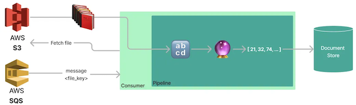

Large language models have been one of the most hyped technologies lately. By combining them with a vector database that acts as a long-term memory or document store, you can improve prompts with additional context. Applications that use this technique, such as **ChatGPT Plugins**  and Google’s project  **Magi**, are rapidly gaining popularity. For many business users, the ability to enhance a prompt with private or recent data is what makes the  **difference between a prototype and a production-ready NLP application**.

But how do we create a service that can turn files into searchable documents? And how can we efficiently scale these applications to index millions of files?

**The goal of this article is to build a system that can run use case-specific indexing pipelines for large-scale production NLP applications.**  It will focus on  **how to create, deploy, and dynamically scale these applications**  using  [Haystack](https://haystack.deepset.ai/)  and  [KEDA](https://keda.sh/). The first part covers creating a Python application with Haystack. The second part details how to deploy and scale the application using  [KEDA](https://keda.sh/)  on  [Kubernetes](https://kubernetes.io/de/).

> This tutorial only covers turning files into text snippets, embeddings or arbitrary preprocessed data. We will not cover the augmented LLM application itself. If you are interested in creating such applications, feel free to use this tutorial:  [https://haystack.deepset.ai/blog/build-a-search-engine-with-gpt-3](https://haystack.deepset.ai/blog/build-a-search-engine-with-gpt-3)

# Natural language processing basics

The idea behind using documents for search is to fill in the gaps in the model’s knowledge, such as the latest news. This is known as Retrieval-Augmented Generation (RAG), which means that in addition to its own knowledge, the model also uses the documents you provide to generate answers. You can find a step-by-step tutorial on how to create a search engine that uses preprocessed documents by this tutorial  [here](https://haystack.deepset.ai/blog/build-a-search-engine-with-gpt-3).


The diagram illustrates the process of passing text files (🔡) through a model (🔮) that generates vectors and stores them in a vector database, such as  [Opensearch](https://opensearch.org/),  [Pinecone](https://www.pinecone.io/), or  [Weaviate](https://weaviate.io/). Later, these documents are fed to the model and the resulting output is provided to the user.

Now, let’s discuss how to efficiently generate these documents and input them into a vector database.


# How to scale indexing applications

For a proof of concept, engineers typically create embeddings on virtual machines with GPUs and add them to vector databases as a one-time job. Once in production, we will need to run these jobs  **periodically**  or  **on demand**  whenever a new file needs to be added to the model’s knowledge base. There are two major factors that we want to optimize:

-   **throughput**  — What is the maximum number of files that we can index within a given time period?
-   **latency**  — How long does it take for a file to become available for retrieval after it has been added?

We will use stateless indexing consumers written in Python and learn how to use  [KEDA](https://keda.sh/)  for autoscaling on  [Kubernetes](https://kubernetes.io/de/). This will enable horizontal scaling for throughput and on-demand startup for latency. Let’s dive into designing the architecture!

# Architecture

The main idea behind the architecture we are going to explore is to queue up indexing requests and spin up consumers that process these tasks in batches. Each consumer receives file-by-file messages and creates documents. We use the following concepts:

-   **Batching**  — to improve throughput and optimize GPU utilization.
-   **Decoupling of queueing and processing**  — to enable stable and scalable long-running processes.
-   **Autoscaling**  — improves throughput by scaling based on the number of pending files.


There are various technologies out there that we can use to implement this. We will use:

-   [**AWS s3**](https://aws.amazon.com/de/s3/)  (a simple storage service) — for storing the raw files that should be used for search
-   [**AWS SQS**](https://aws.amazon.com/de/sqs/)  (a simple queue service) - for decoupling queueing, processing, and batching
-   [**Kubernetes**](https://kubernetes.io/de/)  — for running our containerized application
-   [**Indexing pipeline**](https://docs.haystack.deepset.ai/docs/pipelines#indexing-pipelines)  (Haystack) - “_Consumer_” application that subscribes to a queue and pulls the files from s3
-   [**KEDA**](https://keda.sh/) (Kubernetes Event-driven Autoscaling) — for autoscaling our indexing pipelines

You can find all the code snippets and configuration files used throughout this article in  [this repository](https://github.com/ArzelaAscoIi/haystack-keda-indexing). You can use them to recreate this project from scratch.  **Link to repo:** [**https://github.com/ArzelaAscoIi/haystack-keda-indexing**](https://github.com/ArzelaAscoIi/haystack-keda-indexing)

# Indexing Consumer

This chapter will guide you through the process of creating an application that continuously pulls upload file notifications from an SQS queue for processing. Upon receiving a new message, the application fetches the corresponding file from S3 and converts it into multiple documents with embeddings.

These  _“consumers”_  are the core service of our architecture. We will deploy them to Kubernetes and scale them based on the queue length with KEDA.



> If you are only interested in scaling these applications using KEDA and do not need to know the details of this service, you can use the Docker image  [arzelaascoli/keda-haystack-consumer:latest](https://hub.docker.com/repository/docker/arzelaascoli/keda-haystack-consumer/general)  in the next section and skip writing the Python code.

We will start by creating a code snipped that receives a list of local, already downloaded, files and converts them into documents.

# Indexing Pipeline

Haystack provides a simple way to create pipelines using YAML files. In this example, we will use a  [standard template](https://github.com/deepset-ai/templates/blob/69519af7178095d53cb5e879c8ac696d77c96aed/pipelines/GenerativeQuestionAnswering_gpt.yaml#L6), but we will simplify it slightly to suit our needs.
```
# pipeline yaml from Haystack: https://github.com/deepset-ai/templates/blob/69519af7178095d53cb5e879c8ac696d77c96aed/pipelines/GenerativeQuestionAnswering_gpt.yaml#L6  
  
version: "1.15.1"  
components:  
  ## Uncomment if you have running an OpenSearch instance  
  # - name: DocumentStore  
  #   type: OpenSearchDocumentStore  
  #   params:  
  #     user: <your-opensearch-user>  
  #     password: <your-opensearch-password>  
  - name: Retriever  
    type: EmbeddingRetriever  
    params:  
      # document_store: DocumentStore # uncomment to connect the retriever to an OpenSearch instance  
      embedding_model: sentence-transformers/multi-qa-mpnet-base-dot-v1  
      model_format: sentence_transformers  
      top_k: 3  
  - name: AnswerGen  
    type: OpenAIAnswerGenerator  
    params:  
      model: text-davinci-003  
      api_key: <your-openai-api-key>  
      max_tokens: 200  
      temperature: 0.8  
      frequency_penalty: 0.1  
      presence_penalty: 0.1  
      top_k: 3  
  - name: FileTypeClassifier  
    type: FileTypeClassifier  
  - name: TextConverter  
    type: TextConverter  
  - name: PDFConverter  
    type: PDFToTextConverter  
  - name: Preprocessor  
    type: PreProcessor  
    params:  
      split_by: word  
      split_length: 250  
      split_overlap: 20  
      language: en  
      split_respect_sentence_boundary: True  
  
pipelines:  
  # not required in our case, but can be used to query the document store  
  # with Haystack  
  - name: query  
    nodes:  
      - name: Retriever  
        inputs: [Query]  
      - name: AnswerGen  
        inputs: [Retriever]  
  - name: indexing  
    nodes:  
      - name: FileTypeClassifier  
        inputs: [File]  
      - name: TextConverter  
        inputs: [FileTypeClassifier.output_1]  
      - name: PDFConverter  
        inputs: [FileTypeClassifier.output_2]  
      - name: Preprocessor  
        inputs: [TextConverter, PDFConverter]  
      - name: Retriever  
        inputs: [Preprocessor]  
      ## Uncomment if you have a running a document store.  
      ## For this tutorial, we will generate embeddings and documents,  
      ## but not store them in a document store to keep it generic.  
      ## You can use any of Haystack's document stores here.  
      ## Docs: https://docs.haystack.deepset.ai/docs/document_store  
      # - name: DocumentStore  
      #   inputs: [Retriever]
```

This template is split into an  _indexing_  and a  _query_  pipeline. Let’s go through the steps we run for the indexing pipeline first:

1.  **FileTypeClassifier** — checks the file type for  `.txt`  or  `.pdf`  files
2.  **TextConverter** — extracts the text from  `.txt`  files
3.  **PDFConverter**  — extracts the text from  `.pdf`  files
4.  **Preprocessor**  — splits the texts from files into smaller chunks of size 250 characters
5.  **Retriever** — computes embeddings for chunked texts by running the model  `sentence-transformers/multi-qa-mpnet-base-dot-v1`  from  [Hugging Face](https://huggingface.co/)
6.  **DocumentStore**  (disabled) — This node sends the created documents, including the vectors, to a selected database. For the purposes of this tutorial, we will skip this step. However, for a scalable system, you will need to set up a highly scalable vector database. Some suitable options may include OpenSearch, Weaviate, Qdrant, or others. Haystack supports many different  [document store clients](https://docs.haystack.deepset.ai/docs/document_store).

Since we will just focus on indexing files, we will not load and run the query pipeline. Nevertheless, this pipeline just has two steps:

1.  **Retriever** — Perform a k-nearest neighbors search to find documents that match your prompt.
2.  **AnswerGen**  — OpenAI’s  `text-davinci-003`  model receives a prompt, which includes the retrieved text from step 1, and generates an answer in response.

In the next step, we will load the pipeline so that we can run indexing for local files.
```python
# pipeline.py   
# link to file: https://github.com/ArzelaAscoIi/haystack-keda-indexing/blob/main/pipeline.py  
  
from haystack import Pipeline  
  
def get_pipeline(yaml_path: str) -> Pipeline:  
    return Pipeline.load_from_yaml(yaml_path, pipeline_name="indexing")  
  
## example usage  
# pipeline = get_pipeline("./pipelines/pipeline.yaml")  
# documents = pipeline.run(file_paths=[Path(".your-file.txt")])
```
Now that we can generate documents for local files, we need to write the “glue code” that connects our indexing pipelines with messages from SQS and files from S3. For testing purposes, we also create a code snipped to queue files for indexing.

# Glue Code for Indexing with SQS and S3

Let’s start with creating a class  `S3Client`  that can upload and download files to Amazons s3 service. AWS offers a convenient way to communicate with resources through  [boto3](https://boto3.amazonaws.com/v1/documentation/api/latest/index.html). We will use this library and write simple wrappers for its methods.
```python
# aws_service.py  
# link to file: https://github.com/ArzelaAscoIi/haystack-keda-indexing/blob/main/aws_service.py  
  
class S3Client:  
    def __init__(self, bucket_name: str, local_dir: str) -> None:  
        self.s3 = boto3.client(  
            "s3",  
            endpoint_url=AWS_ENDPOINT,  # allows using localstack  
            region_name=AWS_REGION,  # allows using localstack  
        )  
        self.bucket_name = bucket_name  
        self.local_dir = local_dir  
  
    def upload_file(self, local_path: Path) -> None:  
        """  
        Upload file to s3 with the same name as the file on local filesystem.  
        :param local_path: Path to file on local filesystem  
        """  
        file_name = os.path.basename(local_path)  
        self.s3.upload_file(  
            str(local_path),  
            self.bucket_name,  
            file_name,  
            ExtraArgs={"ACL": "public-read"},  
        )  
  
    def download_files(self, s3_keys: List[str]) -> List[Path]:  
        """  
        Download files from s3 to local directory.  
  
        TODO: Make this async to speed up the upload process  
        TODO: delete files from local directory after processing  
  
        :param s3_keys: List of keys on s3  
        :returns List of paths to downloaded files  
        """  
        paths: List[Path] = []  
        for s3_key in s3_keys:  
            response = self.s3.get_object(Bucket=self.bucket_name, Key=s3_key)  
            file_name = os.path.basename(s3_key)  
            local_path = os.path.join(self.local_dir, file_name)  
            paths.append(Path(local_path))  
            with open(local_path, "wb") as f:  
                f.write(response["Body"].read())  
  
        return paths
```
After implementing the file upload and download functionality, we need to enable consumers to fetch pending S3 keys that are queued up for indexing. To do this, we create a  `SQSClient` class that can publish and receive messages from the Amazon SQS service. Similar to the  `S3Client`,  [boto3](https://boto3.amazonaws.com/v1/documentation/api/latest/index.html)  provides some simple methods for this purpose.
```python
class SQSClient:  
    def __init__(self, queue_name: str) -> None:  
        self.sqs = boto3.client(  
            "sqs",  
            endpoint_url=AWS_ENDPOINT,  # allows using localstack  
            region_name=AWS_REGION,  # allows using localstack  
        )  
        self.queue_name = queue_name  
        self.queue = self.sqs.get_queue_url(QueueName=self.queue_name)  
  
    def publish_key(self, key: str) -> None:  
        """  
        Publish key to SQS queue  
  
        :param key: s3 Key to publish  
        """  
  
        self.sqs.send_message(QueueUrl=self.queue["QueueUrl"], MessageBody=key)  
  
 @contextmanager  
    def fetch_keys(self) -> Generator[List[str], None, None]:  
        """  
        Fetch messages from defined queue  
        :returns List of keys on s3  
        """  
  
        # receive up to 10 messages at once from sqs  
        response = self.sqs.receive_message(  
            QueueUrl=self.queue["QueueUrl"],  
            MaxNumberOfMessages=10,  
            WaitTimeSeconds=0,  
        )  
        # get s3 keys from sqs messages  
        messages = response.get("Messages", [])  
        s3_keys = [message["Body"] for message in messages]  
  
        try:  
            # We are using a context manager to ensure the messages  
            # are deleted from the queue after handling them was  
            # successful.  
            yield s3_keys  
            # This will be run after the message was processed  
            for message in messages:  
                self.sqs.delete_message(  
                    QueueUrl=self.queue["QueueUrl"],  
                    ReceiptHandle=message["ReceiptHandle"],  
                )  
        except Exception as error:  
            raise error
```
We will now connect both of these clients to a service that has two methods:

1.  `get_files`  - This method fetches file messages from SQS, downloads the corresponding file from S3, and returns the local path.
2.  `upload_file`  - This method uploads a file from a local path to S3 and publishes the key on SQS to be picked up by the indexing consumers later.
```python
# aws_service.py  
# link to file: https://github.com/ArzelaAscoIi/haystack-keda-indexing/blob/main/aws_service.py  
  
class AWSService:  
    def __init__( self, queue_name: str, bucket_name: str, local_download_dir: str ) -> None:  
        self.sqs_client = SQSClient(queue_name)  
        self.s3_client = S3Client(bucket_name, local_download_dir)  
  
    def get_files(self) -> List[Path] | None:  
        with self.sqs_client.fetch_keys() as messages:  
            if not messages:  
                return  
            paths = self.s3_client.download_files(messages)  
            return paths  
  
    def upload_file(self, local_path: Path) -> None:  
        self.s3_client.upload_file(local_path)  
        self.sqs_client.publish_key(local_path.name)
```
# Set up a local AWS environment with LocalStack

We use  [LocalStack](https://localstack.cloud/)  to simplify the development process and avoid the need to use real AWS infrastructure. To start LocalStack, run docker-compose up in the terminal using the  `docker-compose.yaml` file.
```
# docker-compose.yaml   
# link to file:https://github.com/ArzelaAscoIi/haystack-keda-indexing/blob/main/docker-compose.yaml  
  
version: "3"  
services:  
  localstack:  
    image: localstack/localstack:1.4.0  
    ports:  
      - "127.0.0.1:4566:4566" # LocalStack Gateway  
      - "127.0.0.1:4510-4559:4510-4559" # external services port range  
    environment:  
      - SERVICES=s3,sqs  
      - AWS_ACCESS_KEY_ID=test  
      - AWS_SECRET_ACCESS_KEY=test  
    volumes:  
   # startup script to create a sqs queue and a s3 bucket  
      # https://github.com/ArzelaAscoIi/haystack-keda-indexing/blob/main/scripts/sqs_bucket_bootstrap.sh  
      - ./scripts:/docker-entrypoint-initaws.d/ # startup script found here
```
After startup, we will run  [a script](https://github.com/ArzelaAscoIi/haystack-keda-indexing/blob/main/scripts/sqs_bucket_bootstrap.sh)  that creates a  `test-queue`  and a  `test-bucket`  that we can use to test our application. In the next steps, we will create AWS clients to read messages from SQS and download files from s3.

# Running the consumer

Now that we can run pipelines, upload and download files, and set up our local AWS environment, we need to write our main service. On a code level, all we need to implement is a simple loop to continuously pull messages and run indexing.

  ```python
# consumer.py  
# link to file:https://github.com/ArzelaAscoIi/haystack-keda-indexing/blob/main/consumer.py  
  
# To learn more about logging in python check out my other article  
# about structolg! https://medium.com/@ArzelaAscoli/writing-professional-python-logs-e1f31635b60b  
logger = structlog.get_logger(__name__)  
  
# Initialize AWS service  
aws_service = AWSService(SQS_QUEUE, S3_BUCKET, LOCAL_DOWNLOAD_DIR)  
  
# load pipeline  
pipeline = get_pipeline("./pipelines/pipeline.yaml")  
  
while True:  
    # fetch files from aws  
    files: List[Path] = aws_service.get_files()  
    if not files:  
        logger.info("No files to process")  
        sleep(5)  
        continue  
  
    # process files if found  
    logger.info("Found files", files=files)  
  
    # run indexing for downloaded files  
    documents = pipeline.run(file_paths=files)  
    logger.info("Processed files", documents=documents)
```
We will now create an image of our application using the Haystack GPU base image, which has most of our dependencies pre-installed.
```
# Dockerfile   
# link to file: https://github.com/ArzelaAscoIi/haystack-keda-indexing/blob/main/Dockerfile  
  
FROM deepset/haystack:base-gpu-v1.15.0  
WORKDIR /home/user  
  
COPY . .  
RUN pip3 install -r requirements.txt  
  
CMD ["python3", "consumer.py"]
```
By adding the startup configuration to docker-compose, we can not only run LocalStack but also our application in Docker by calling docker-compose up.
```
# docker-compose.yaml  
# link to file: https://github.com/ArzelaAscoIi/haystack-keda-indexing/blob/main/docker-compose.yaml  
...  
consumer:  
    build:  
      context: .  
      dockerfile: Dockerfile  
    environment:  
      - AWS_ENDPOINT=http://localstack:4566  
      - AWS_REGION=eu-central-1  
      - AWS_ACCESS_KEY_ID=test  
      - AWS_SECRET_ACCESS_KEY=test
```
We are now ready to test our application by uploading files and checking the logs for resulting documents.

# Testing with Docker Compose

To start our Docker Compose stack, we use the command  `docker-compose up`. Additionally, we provide a code snippet for file uploading.
```python
# upload.py  
# link to file: <https://github.com/ArzelaAscoIi/haystack-keda-indexing/blob/main/upload.py>  
  
aws_service = AWSService(SQS_QUEUE, S3_BUCKET, LOCAL_DOWNLOAD_DIR)  
aws_service.upload_file(Path("./data/test.txt"))
```
If we run python3  `upload.py`  upload.py now, we will see the following output in our Docker console.
```
haystack-keda-indexing-localstack-1  | 2023-04-22T09:55:44.981  INFO --- [   asgi_gw_1] localstack.request.aws     : AWS s3.GetObject => 200  
haystack-keda-indexing-localstack-1  | 2023-04-22T09:55:45.007  INFO --- [   asgi_gw_0] localstack.request.aws     : AWS sqs.DeleteMessage => 200  
haystack-keda-indexing-consumer-1    | 2023-04-22 09:55:45 [info     ] Found files                    files=[PosixPath('/tmp/test.txt')]  
Converting files: 100%|██████████| 1/1 [00:00<00:00, 81.28it/s]  
Preprocessing: 100%|██████████| 1/1 [00:00<00:00, 35.10docs/s]  
Batches: 100%|██████████| 1/1 [00:03<00:00,  3.18s/it]  
haystack-keda-indexing-consumer-1    | 2023-04-22 09:55:48 [info     ] Processed files                documents={'documents': [<Document: {'content': 'this is text', 'content_type': 'text', 'score': None, 'meta': {'_split_id': 0}, 'id_hash_keys': ['content'], 'embedding': '<embedding of shape (768,)>', 'id': '46ec22c7eafaea7c43eef7d996fd04ce'}>], 'file_paths': [PosixPath('/tmp/test.txt')], 'root_node': 'File', 'params': {}, 'node_id': 'Retriever'}  
haystack-keda-indexing-localstack-1  | 2023-04-22T09:55:48.327  INFO --- [   asgi_gw_0] localstack.request.aws     : AWS sqs.GetQueueUrl => 200
```
We have a stateless service that processes indexing requests asynchronously and can operate in Docker Compose. We can now deploy this service to Kubernetes, configure KEDA, and scale it.

# Conclusion and next steps

This article explains how to create a stateless consumer application that turns files into documents. We learned that we can use this application with different models, preprocessors, and file types which are defined in a single configuration file using Haystack. In order to ship this application to a production-ready deployment, we will deploy this service on Kubernetes and define custom autoscaling in  [the next chapter](scaling-nlp-indexing-pipelines-with-keda-and-haystack-part-2).