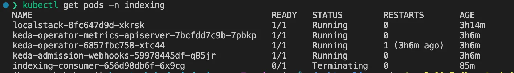
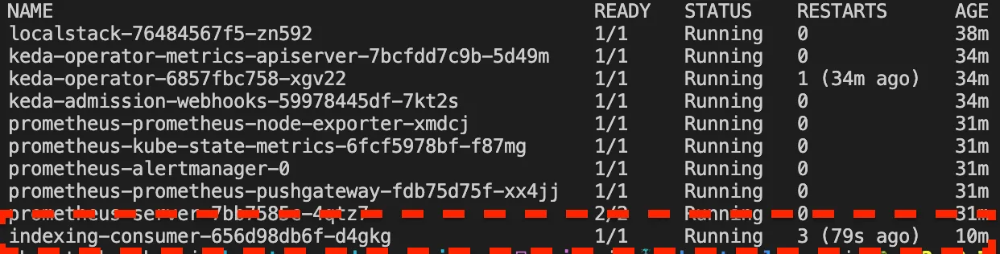

In the first part of this article series, we discussed the power of retrieval-augmented generation. We also explored how to create a Python application that converts files into searchable documents with embeddings via  [Haystack](https://haystack.deepset.ai/)  pipelines. However, merely having a Python program that converts files into text snippets and embeddings on a single machine is not enough for a production-ready deployment.

In this part, we will explore how to  **deploy an indexing consumer to Kubernetes**  and  **how to autoscale it using KEDA**. This will allow us to efficiently add text and embeddings to our vector database that can power a retrieval augmented LLM search engine  [like this](https://haystack.deepset.ai/blog/build-a-search-engine-with-gpt-3).

We will use the  [architecture described in the first part](scaling-nlp-indexing-pipelines-with-keda-and-haystack-part-1), which involves queuing files to be indexed on AWS SQS and consuming them in parallel using Haystack pipelines. Let’s start deploying and scaling!


## Deployment on Kubernetes and scaling with KEDA

In this section, we will learn how to set up KEDA on Kubernetes and configure autoscaling to scale our consumers based on the number of pending files in Kubernetes. We will use the following tools:

-   [k3d](https://k3d.io/v5.4.9/)  for creating a local Kubernetes cluster to deploy our consumers
-   [KEDA](https://keda.sh/)  for scaling the consumers after deployment
-   [localstack](https://localstack.cloud/)  as a local AWS cloud stack, for testing our application

To communicate with our local Kubernetes cluster, we will use  [kubectl](https://kubernetes.io/de/docs/reference/kubectl/).

> ⚠️ For certain types of indexing pipelines, GPUs are required. This is particularly true when embeddings are generated on the same machine (rather than through an external inference service) or when a model is used within the pipeline. In such cases, it is necessary to have GPU pods within the Kubernetes cluster to run the model.

## Installation and setup

We will need to set up a local Kubernetes cluster and deploy a list of services before we can start deploying and scaling our application.

### Create a local Kubernetes cluster

To begin, create a new Kubernetes cluster named  `haystack-keda-cluster`  using k3d.

```bash
k3d cluster create haystack-keda-cluster  
# check the the status via: kubectl cluster-info
```

Next, we will create a namespace called  `indexing`  that we will use to deploy our services.

```bash
kubectl create namespace indexing
```

### Install services — KEDA and LocalStack

To set up LocalStack, add the helm chart and install LocalStack in the  `indexing`  namespace:

```bash
helm repo add localstack https://localstack.github.io/helm-charts  
helm install localstack localstack/localstack --namespace indexing
```

We will repeat the same steps with KEDA.

```bash
helm repo add kedacore https://kedacore.github.io/charts  
helm install keda kedacore/keda --namespace indexing
```

We can validate the setup by running  `indexing kubectl get pods -n indexing`.



## Create an SQS queue and an S3 bucket

Our indexing consumers will connect to queues on LocalStack and download files from S3. Therefore, we need to create the necessary resources before deploying our application.

To create a queue and a bucket, we will use  [the same shell script](https://github.com/ArzelaAscoIi/haystack-keda-indexing/blob/main/scripts/sqs_bucket_bootstrap.sh)  that we used in our development environment with Docker Compose. To run the script from within the container, pipe the script into the  `kubectl exec`  command:

```bash
cat ./scripts/sqs_bucket_bootstrap.sh | kubectl exec -i -n indexing deployment/localstack -- /bin/bash
```

If we fetch the logs via  `kubectl logs -f deployment/localstack -c localstack -n indexing`, we should see that a queue and a bucket were created.

```bash
2023-04-22T15:19:34.166  INFO --- [   asgi_gw_1] localstack.request.aws     : AWS sqs.CreateQueue => 200  
2023-04-22T15:19:34.533  INFO --- [   asgi_gw_0] localstack.request.aws     : AWS s3.CreateBucket => 200
```

## Deploying the indexing consumer

Now that we have LocalStack and KEDA deployed to our Kubernetes cluster, we can start deploying our indexing consumer. The indexing consumers are deployed as Kubernetes deployments by using a deployment file  `deployment-consumer.yaml`.

```yaml
# deployment-consumer.yaml  
# link to file: <https://github.com/ArzelaAscoIi/haystack-keda-indexing/tree/main/kubernetes>  
  
kind: Deployment  
apiVersion: apps/v1  
metadata:  
  name: indexing-consumer  
  labels:  
    k8s-app: indexing-consumer  
spec:  
  # we want to start with 0 replicas and scale up on demand  
  replicas: 0  
  selector:  
    matchLabels:  
      k8s-app: indexing-consumer  
  template:  
    metadata:  
      name: indexing-consumer  
      labels:  
        k8s-app: indexing-consumer  
    spec:  
      containers:  
        - name: indexing-consumer  
          command: ["python3", "consumer.py"]  
          # public consumer image  
          image: arzelaascoli/keda-haystack-consumer:latest  
          env:  
            # localstack configuration  
            - name: AWS_ENDPOINT  
              value: http://localstack:4566  
            - name: AWS_REGION  
              value: eu-central-1  
            - name: AWS_ACCESS_KEY_ID  
              value: test  
            - name: AWS_SECRET_ACCESS_KEY  
              value: test  
          # Resource estimations  
          # TODO: adjust these to our needs and the load we expect  
          resources:  
            requests:  
              memory: 1000Mi  
              cpu: 750m  
            limits:  
              memory: 2500Mi  
              cpu: 2000m
```

We can apply this YAML to our namespace indexing with kubectl:

```bash
kubectl apply -f ./kubernetes/deployment-consumer.yaml --namespace indexing
```

To validate that consumers can successfully start and connect to the queue, we can scale up the replicas to 1, and check the running pods.

```bash
# scale deployment   
kubectl scale deployment indexing-consumer --namespace=indexing --replicas=1  
# get pods   
kubectl get pods -n indexing  
# check logs   
kubectl logs -f deployment/indexing-consumer -c indexing-consumer -n indexing
```



The system will log that no files were found to be processed:

```bash
│ 2023-04-23 15:43:14 [info     ] No files to process                                                                                                       │  
│ 2023-04-23 15:43:19 [info     ] No files to process                                                                                                       │  
│ 2023-04-23 15:43:24 [info     ] No files to process                                                                                                       │  
│ 2023-04-23 15:43:29 [info     ] No files to process
```

Next, we will set up autoscaling based on the length of the SQS queue to enable autoscaling and scaling to zero if no files are pending.

## Configure autoscaling based on queue length

After successfully creating all the required services to index files, we can now configure KEDA to check the queue length and scale the indexing consumers accordingly.

To set up a KEDA trigger on SQS, we need to configure authentication by creating a Kubernetes secrets object.

```yaml
# secrets-localstack.yaml  
# link to file: <https://github.com/ArzelaAscoIi/haystack-keda-indexing/blob/main/kubernetes/keda/secrets-localstack.yaml>  
  
apiVersion: v1  
kind: Secret  
metadata:  
  name: aws-secrets  
  namespace: indexing  
data:  
  AWS_ACCESS_KEY_ID: dGVzdA== # base64 encoded string for "test"  
  AWS_SECRET_ACCESS_KEY: dGVzdA== # base64 encoded string for "test"
```

This secret is then mapped via a TriggerAuthentication object to KEDA, which will use  [credential based authentication.](https://keda.sh/docs/2.10/scalers/aws-sqs/#authentication-parameters)

```yaml
# trigger-authentication.yaml  
# link to file: <https://github.com/ArzelaAscoIi/haystack-keda-indexing/blob/main/kubernetes/keda/trigger-authentication.yaml>  
  
apiVersion: keda.sh/v1alpha1  
kind: TriggerAuthentication  
metadata:  
  name: keda-trigger-auth-aws-credentials  
  namespace: indexing  
spec:  
  secretTargetRef:  
    - parameter: awsAccessKeyID # Required.  
      name: aws-secrets # Required.  
      key: AWS_ACCESS_KEY_ID # Required.  
    - parameter: awsSecretAccessKey # Required.  
      name: aws-secrets # Required.  
      key: AWS_SECRET_ACCESS_KEY # Required.
```

The operator is now allowed to access LocalStacks resources, and we can create a scaled object with a `aws-sqs-queue`  [trigger](https://keda.sh/docs/2.1/scalers/aws-sqs/#trigger-specification).

```yaml
apiVersion: keda.sh/v1alpha1  
kind: ScaledObject  
metadata:  
  name: indexing-consumer-scaled-object  
spec:  
  scaleTargetRef:  
    apiVersion: apps/v1  
    kind: Deployment  
    name: indexing-consumer # Mandatory. Must be in the same namespace as the ScaledObject  
  pollingInterval: 30  
  cooldownPeriod: 300  
  idleReplicaCount: 0  
  minReplicaCount: 0  
  maxReplicaCount: 2  
  fallback: # defines a number of replicas to fallback to if a scaler is in an error state.  
    failureThreshold: 3  
    replicas: 4  
  triggers:  
    - type: aws-sqs-queue  
      authenticationRef:  
        name: keda-trigger-auth-aws-credentials  
      metadata:  
        # KEDA will use the value of the environment variable of the `consumer-file-ingestion` containers  
        queueURL: http://localhost:4566/000000000000/test-queue  
        queueLength: "10" # Should roughly equal the number of messages that can be processed in 1 minute  
        awsRegion: "eu-central-1"  
        awsEndpoint: "http://localstack:4566"  
        scaleOnInFlight: "false" # Exclude in-flight messages from the queue length calculation
```

After applying these three YAMLs via  `kubectl apply --f ./kubernetes/keda --namespace indexing`, we can forward the port to allow uploading files to LocalStack.

```bash
 kubectl port-forward deployment/localstack 4566:4566 -n indexing
```

We can use an  [upload script](https://github.com/ArzelaAscoIi/haystack-keda-indexing/blob/main/upload.py)  to add a file  `test.txt`  by running  `python3 upload.py`.

```python
# upload.py   
# link to file: <https://github.com/ArzelaAscoIi/haystack-keda-indexing/blob/main/upload.py>  
aws_service = AWSService(SQS_QUEUE, S3_BUCKET, LOCAL_DOWNLOAD_DIR)  
aws_service.upload_file(Path("./data/test.txt"))
```

Once the file is successfully uploaded and queued, KEDA will take care of scaling the deployment from 0 to 1 replica. Kubernetes will list an indexing-consumer pod.

```bash
NAME                                               READY   STATUS                
localstack-8fc647d9d-xkrsk                         1/1     Running               
keda-operator-metrics-apiserver-7bcfdd7c9b-7pbkp   1/1     Running              
keda-operator-6857fbc758-xtc44                     1/1     Running               
keda-admission-webhooks-59978445df-q85jr           1/1     Running              
indexing-consumer-656d98db6f-psz6q                 0/1     ContainerCreating 
```

After startup, the files will be fetched and removed from the queue, and indexed.

## Conclusion and next steps

This article explains how to create a scalable application to convert text and PDF files into documents containing text and embeddings. KEDA allows for the on-demand scaling of each application. With this simple architecture, we are able to horizontally scale the creation of embeddings.

**How was KEDA useful?**  — KEDA enabled us to scale consumers based on queue length. An alternative solution involves using horizontal pod autoscaling based on CPU usage, which would be triggered once elements are fetched from the queue. However, this approach does not allow for scaling down to zero. Since these tasks require GPUs, one idle machine that is constantly running can be expensive.

**How do I deploy this without k3d?**  — This tutorial is applicable to any Kubernetes cluster. Simply follow the instructions provided.

**What resources do I need?**  — When running this in production, GPU nodes are necessary for the cluster, which may require additional configuration.

**Is there a simple way to deploy multiple pipelines?**  — In one of the next articles, I will share an article on how to use the Kubernetes Operator Framework ([Kopf](https://kopf.readthedocs.io/en/stable/)), written in Python, to dynamically create these resources.