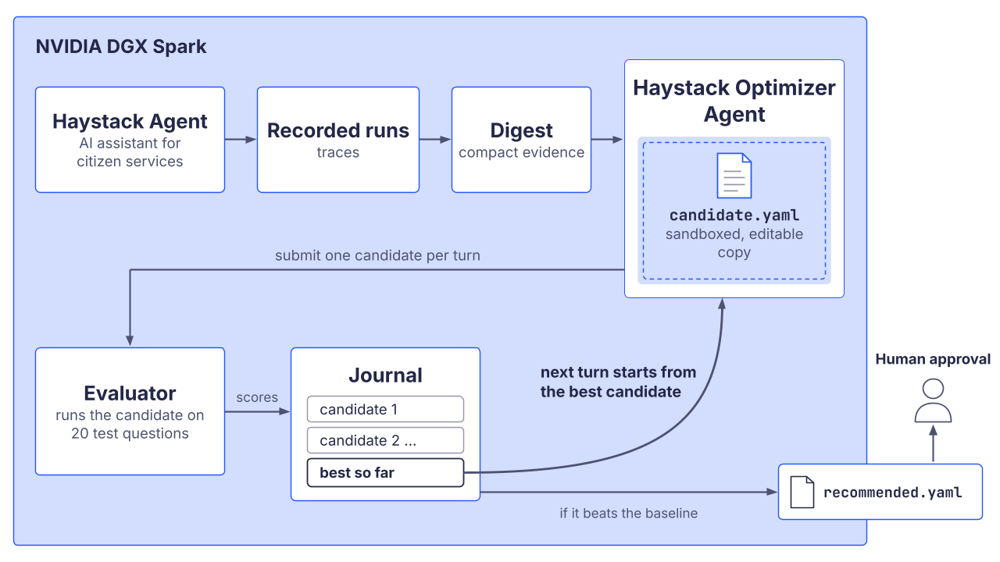
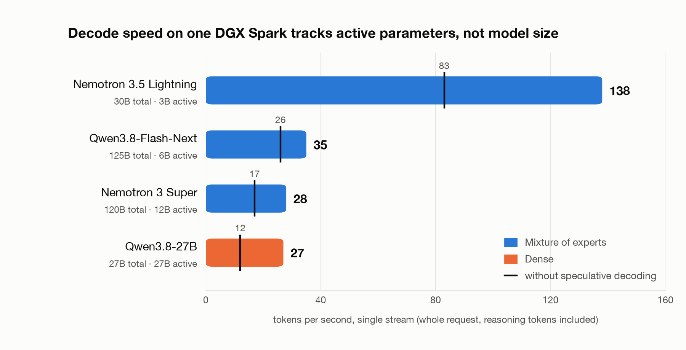

Services at a citizens' office can benefit a lot from AI assistance. Starting from a simple chatbot that answers questions about building permits, parking fines and childcare benefits to more advanced applications where AI assists filing an application, reviewing such applications, and booking appointments: for all these tasks, AI assistance can reduce waiting times and costs, and at the same time improve the quality of the results and the overall experience.
When a city rolls out such AI-assisted services, it is a great achievement. However, maintaining the services over time is just as important as the initial release. A few months after going live, the database has grown by a few thousand documents and retrieval quality dropped, the model behind it has been deprecated, and a well-meant quick fix added a tool that is never used anymore. The AI assistant still answers but the answers get worse, and nobody notices until citizens report it or until the assistant becomes unusable.

Teams running AI in production know this story and the procedure is always the same: somebody opens the traces, reads what the system actually did, forms a hypothesis, changes a parameter, and reruns queries for testing. This approach works but it is slow and takes away time planned for other tasks.

In this post we show a Haystack [`Agent`](https://docs.haystack.deepset.ai/docs/agent) that runs this loop itself. It reads the recorded traces of a pipeline, works out why runs fail or underperform, edits the configuration, measures the result against a set of queries, and suggests a fix. Traces of an AI assistant in the public sector are among the most sensitive data. Analyzing the traces with frontier API models and sharing the data in the process with one of the big model providers is not an option. Therefore, the entire loop runs on local models on a single [NVIDIA DGX Spark](https://www.nvidia.com/en-us/products/workstations/dgx-spark/).

## Production AI needs traces, and traces are sensitive

A [compound AI system](https://www.deepset.ai/blog/compound-ai) consists of more than a model call. In the example of citizen services, a query is processed by query expansion, one or more retrievers, a ranker, tool calls and a generation step that must cite its source documents. When something goes wrong, the cause is rarely visible in the final answer. The full trace reveals that the retriever missed a relevant document, the agent hit a tool call limit or the token budget was exhausted before all citations were included.

While access to all this information is what makes traces so helpful when investigating and fixing errors, it is also what makes them problematic. Traces of AI-assisted citizen services can contain a person's question, their name and address, maybe their social security number, the documents that were retrieved for them and the answer they received. Shipping that to a hosted frontier API in another jurisdiction even with PII edited out is not an option.

However, analyzing traces is exactly the kind of work that needs a strong model unless you want to spend hours going through the data by hand. The agent has to follow a long tool-call history, understand how the components depend on each other, and then edit a YAML configuration that still has to load afterwards.

## 120-billion-parameter models on your desk

With the [NVIDIA DGX Spark](https://www.nvidia.com/en-us/products/workstations/dgx-spark/) there is now an option to do all that on your desk and if needed in an air-gapped setup. It is a small box with 128 GB of unified memory and a GB10 Grace Blackwell chip. And it is not as power hungry as you might think. While the peak rating is 240 W, during multi-hour agent runs we measured 55 W at 73 °C (no thermal throttling).

With 128 GB of memory, you get the ability to run models that would otherwise need a server rack. For example:
- [**Nemotron 3.5 Lightning 30B-A3B**](https://huggingface.co/nvidia/NVIDIA-Nemotron-3.5-Lightning-30B-A3B-NVFP4) in NVFP4, 21 GB of weights. A mixture-of-experts model with 3B active parameters, and by far the fastest of the four. Context window set to 262K tokens.
- [**Nemotron 3 Super 120B-A12B**](https://huggingface.co/nvidia/NVIDIA-Nemotron-3-Super-120B-A12B-NVFP4) in NVFP4, 75 GB of weights. A big model that fits with room to spare for the KV cache with 131K context window.
- [**Qwen3.8-27B**](https://huggingface.co/unsloth/Qwen3.8-27B-NVFP4) in NVFP4, 22 GB of weights. A dense model of nearly the same size on disk as Lightning. 262K context window.
- [**Qwen3.8-Flash-Next 125B-A6B**](https://huggingface.co/unsloth/Qwen3.8-Flash-Next-GGUF) in IQ4_XS, 87 GB of weights. The largest model we ran, leaving 98K context window. 

All four are public checkpoints on Hugging Face. For [Nemotron](https://developer.nvidia.com/topics/ai/nemotron) models, not just the model weights but also training data, reinforcement learning environments, and post-training recipes are published. We serve the three [NVFP4](https://developer.nvidia.com/blog/introducing-nvfp4-for-efficient-and-accurate-low-precision-inference/) models with [vLLM](https://haystack.deepset.ai/integrations/vllm) and Qwen3.8-Flash-Next with [llama.cpp](https://haystack.deepset.ai/integrations/llama_cpp). Both expose a loopback-only endpoint with an OpenAI-compatible API, which is exactly what Haystack's [`OpenAIChatGenerator`](https://docs.haystack.deepset.ai/docs/openaichatgenerator) is built for.

## Traces of a Haystack Agent

Our reference system is a Haystack [`Agent`](https://docs.haystack.deepset.ai/docs/agent) over a set of indexed documents: a synthetic corpus of 609 civil-services pages, notices and local news articles about permits, benefits, housing and mobility in Berlin, paired with multi-hop questions whose evidence documents are known. It inspects document metadata, builds a filter, runs a filtered retrieval and answers with citations. We record the runs of a small evaluation set, twenty questions with known evidence documents, exactly as they would be recorded in production.

For the experiments we make it underperform on purpose, in ways we have seen real systems drift into:

- the retriever's `top_k` is 1 and a filter fetch returns at most 2 documents, while every question needs at least 3;
- the step budget is 6, so the agent is cut off and a fallback hook produces an answer without citations;
- a leftover `search_product_manuals` tool points at an empty store. It never returns anything, but its full argument schema is sent to the model on every step.

Then we hand the recorded traces to the self-improvement loop. It does not see the traces raw because that would exceed the context window limit quickly. Instead, a digest step compresses each recorded run into tool-call and result pairs with hard caps on length. Alongside the digest the agent gets a per-case summary such as `12/20 cases clean | failures insufficient_recall x6`. Further, it gets the mean output size of every stage, rendered as `expander.queries 4.0 -> retriever.documents 30.0 -> ranker.documents 10.0`. This note encodes that query expansion resulted in 4 queries, retrieval resulted in 30 documents, and ranking brought that down to 10 documents. Last but not least, the agent gets the warnings the components logged, for example a query expander reporting that it truncated its output.

The stage sizes come from a custom Haystack tracer that keeps per-model token usage from generator spans, the number of items every component produced on each output, and a short, capped sample of outputs that are plain strings, such as the rewritten queries a query expander sent to the store. Documents and chat messages are counted and dropped, so retrieved content and model replies never enter the record. What the pipeline actually asked the store usually explains a recall failure better than how many queries it sent, which is why those few short strings are kept. So even on an air-gapped machine, the optimizer never sees a full trace. It gets token counts, output sizes and a few shortened query strings, and that is enough.

Similar to how a human would read the evidence and investigate, the agent finds that recall is too low because the retrieval path narrows too early, runs are being cut off, and one tool costs tokens without contributing. It proposes edits and measures them.

On the DGX Spark, with Nemotron 3.5 Lightning both running the assistant and acting as the optimizer, this took 33 minutes for four candidates. The reference agent cited the evidence it needed for 19 percent of the questions. The first candidate raised `top_k` from 1 to 7, which doubled retrieval recall but barely moved the score, because the answers still cited nothing. The second and third added prompt instructions, one of which carried a typo in an embedded filter example that produced more tool errors and was therefore discarded. The fourth kept the working instruction, dropped the broken one, and reached 45 percent cited recall. The recommended configuration differs from the reference by five lines of system prompt and the `top_k` setting. 
In a second experiment on a retrieval pipeline, the optimizer improved recall@10 from 0.54 to 0.77 in 43 minutes. After trying an LLM ranker twice, it finally decided against that approach and instead used query expansion. Each question became five queries against BM25 instead of two. That alone took recall@10 from 0.54 to 0.65.

## Self-improvement loop in detail



The loop starts with a reference pipeline serialized to [YAML](https://docs.haystack.deepset.ai/docs/pipelines#yaml-file-definitions). Its measurements serve as the baseline. Then, for a fixed number of iterations, the agent proposes one candidate configuration, measures it, and records the result. The agent's next turn starts from the best candidate measured so far, so that a regression is never inherited. When the budget is spent, the best candidate that beats the baseline becomes `recommended.yaml`. Approving the recommendation is a human decision.

The agent works through a small set of tools bound to exactly one editable file:

- `read_config` returns the YAML with a content hash as its revision;
- `edit_config` replaces a literal string that must match exactly once, and rejects edits against a stale revision;
- `validate_config` deserializes the candidate and checks it against the evaluator's contract without running it;
- `submit_candidate` requires a validated, current revision and a rationale, refuses no-op changes, and ends the turn;
- `restore_candidate` jumps back to any earlier snapshot;
- `inspect_component` shows the signature, docstring and serialization code of any allowlisted Haystack component, so the agent does not guess parameter names;
- `finish` ends the experiment early with a reason.

Here is what the loop produced on the retrieval pipeline. The reference is the configuration whose traces were recorded and the recommendation is what the loop handed back after five iterations.

**Before: the reference pipeline whose traces were recorded**

```yaml
components:
  expander:
    type: haystack.components.query.query_expander.QueryExpander
    init_parameters:
      n_expansions: 1
      prompt_template: |
        You are part of an information system that processes user queries for retrieval.
        You have to expand a given query into {{ n_expansions }} queries that are
        semantically similar to improve retrieval recall.

        Examples:
        1.  Query: "climate change effects"
            {"queries": ["impact of climate change", "consequences of global warming", "effects of environmental changes"]}
        # … two more examples and six guidelines unchanged …

        Your Task:
        Query: "{{ query }}"

        You *must* respond with a JSON object containing a "queries" array with the expanded queries.
        Example: {"queries": ["query1", "query2", "query3"]}
      chat_generator:
        type: haystack.components.generators.chat.openai.OpenAIChatGenerator
        init_parameters:
          api_base_url: http://127.0.0.1:8000/v1
          model: nemotron-3.5-lightning
          generation_kwargs: {max_tokens: 4096}
  retriever:
    type: haystack.components.retrievers.multi_query_text_retriever.MultiQueryTextRetriever
    init_parameters:
      retriever:
        type: haystack.components.retrievers.in_memory.bm25_retriever.InMemoryBM25Retriever
        init_parameters:
          top_k: 2
connections:
  - sender: expander.queries
    receiver: retriever.queries
```

**After: `recommended.yaml`, five measured candidates later**

```yaml
components:
  expander:
    type: haystack.components.query.query_expander.QueryExpander
    init_parameters:
      n_expansions: 4                                                   # was 1
      prompt_template: |
        You are part of an information system that processes user queries for retrieval.
        You have to expand a given query into {{ n_expansions }} queries that are
        semantically similar to improve retrieval recall.

        Examples:
        1.  Query: "climate change effects"
            {"queries": ["impact of climate change", "consequences of global warming", "effects of environmental changes", "climate variability"]}
        # … the other two examples were extended the same way; guidelines unchanged …

        Your Task:
        Query: "{{ query }}"

        You *must* respond with a JSON object containing a "queries" array with the expanded queries.
        Example: {"queries": ["query1", "query2", "query3", "query4"]}   # was three
      chat_generator:
        type: haystack.components.generators.chat.openai.OpenAIChatGenerator
        init_parameters:
          api_base_url: http://127.0.0.1:8000/v1
          model: nemotron-3.5-lightning
          generation_kwargs: {max_tokens: 4096}
  retriever:
    type: haystack.components.retrievers.multi_query_text_retriever.MultiQueryTextRetriever
    init_parameters:
      retriever:
        type: haystack.components.retrievers.in_memory.bm25_retriever.InMemoryBM25Retriever
        init_parameters:
          top_k: 6                                                      # was 2
connections:
  - sender: expander.queries
    receiver: retriever.queries
```

Recall@10 on 20 evaluation questions: 0.54 before, 0.77 after. The optimizer's rationale for the prompt edit are recorded runs that show the model producing three or four queries of which only one was kept, so it raised the count and extended the examples to match. Two candidates that inserted an LLM ranker between retriever and output scored 0.54 and 0.70 and were not kept.

A candidate must stay above a quality floor, `max(min_quality, baseline_quality - max_quality_loss)`, and only then is it ranked by the primary objective: cost, latency or quality.

Assembling the experiment against the local endpoint looks like this:

```python
# pip install haystack-ai agent-pack-haystack
from haystack.components.generators.chat import OpenAIChatGenerator
from haystack.utils import Secret
from haystack_integrations.agent_pack.optimization import (
    ExperimentJournal,
    HarnessOptimizationExperiment,
    LocalRunStore,
    OptimizationObjectives,
    create_harness_optimizer_agent,
)

# Model served by the DGX Spark via vLLM or llama.cpp with an OpenAI-compatible API.
# The server checks no key, but the optimizer serializes every generator to YAML and a
# token secret cannot be serialized, so the key comes from an environment variable:
# export SPARK_API_KEY=not-needed
optimizer_model = OpenAIChatGenerator(
    api_base_url="http://127.0.0.1:8000/v1",
    model="nemotron-3.5-lightning",
    api_key=Secret.from_env_var("SPARK_API_KEY"),
    timeout=600.0,
    generation_kwargs={"max_tokens": 24576},
)

experiment = HarnessOptimizationExperiment(
    reference=reference_agent,
    run_store=LocalRunStore(directory=workspace / "runs"),
    evaluator=evaluator,
    pricing=pricing,
    objectives=OptimizationObjectives(min_quality=0.6, max_quality_loss=0.05, primary="quality"),
    journal=ExperimentJournal(directory=workspace / "journals"),
    optimizer_agent=create_harness_optimizer_agent(chat_generator=optimizer_model, max_agent_steps=40),
    max_iterations=8,
)
result = experiment.run()
print(result.artifact_directory / "recommended.yaml")
# >> Nothing was deployed. Approving this recommendation is a separate, human decision.
```
The whole run is journaled. Every candidate YAML, every measurement and every validation failure lands in a per-run directory, so the human reviewing `recommended.yaml` has all the information at hand.

## Dense vs. MoE models on a DGX Spark

We compare two model architectures: dense models vs. mixture-of-expert (MoE) models. While dense models use all their parameters during inferencing, MoE models use *"experts"* and an internal *"routing"* mechanism that routes tokens to experts, which allows such models to be faster. [This HuggingFace blog post explains MoE](https://huggingface.co/blog/moe) in more detail. On our DGX Spark, single-stream tokens per second are as follows:

| Model | Architecture | Weights | Single-stream tok/s | Context |
|---|---|---|---|---|
| Nemotron 3.5 Lightning 30B-A3B | MoE, 3B active | 21 GB | 138 (83 without speculative decoding) | 262K |
| Nemotron 3 Super 120B-A12B | MoE, 12B active | 75 GB | 28 (17 without speculative decoding) | 131K |
| Qwen3.8-27B | dense | 22 GB | 27 (12 without speculative decoding) | 262K |
| Qwen3.8-Flash-Next 125B-A6B | MoE, 6B active | 87 GB | 35 (26 without speculative decoding) | 98K |

Throughput here is completion tokens divided by wall-clock time for a whole request, reasoning tokens included, after a warm-up request.



Let's go through three takeaways from that table in more detail.

**Active parameters matter more than size on disk.** Lightning and Qwen3.8-27B are of almost the same size, yet Lightning generates about five times faster. The Spark, like every unified-memory machine, is bound by memory bandwidth: every generated token requires reading the weights that participate in producing it. A dense 27B model reads all 27B parameters per token. A 30B mixture-of-experts with 3B active reads roughly a tenth of that. While bandwidth matters for decoding speed, large unified memory is required to keep a 120B model in memory.

**Speculative decoding brings significant speedups.** Enabling multi-token prediction on Nemotron 3 Super took it from 16.6 to 28.4 tokens per second with no change to the model. On a bandwidth-bound machine, anything that produces more than one token per weight read is worth turning on.

**For agents, tokens per task beat tokens per second.** In one of our multi-hour agent runs, Super was about 5.6 times slower per token than Lightning and yet finished in roughly the same time, because it wasted far fewer tokens on retries and dead ends. A tokens-per-second extrapolation had predicted it would take five times longer. The reverse also happens: the dense 27B decodes slightly faster than Super, yet its run took two and a half times as long. Its long reasoning traces kept running into the 600-second step timeout, and every timeout meant a retry. A 600-second step budget buys around 78,000 tokens at 130 tokens per second and around 18,000 at 30. That exemplifies why tokens per task matters.

## Conclusion

- **Traces are essential for keeping compound AI systems healthy, and they are often too sensitive to leave the building.** Self-improving agents in this context require a strong model, and the 128 GB of unified memory on a DGX Spark make it possible to run those models locally.
- **Self-improving agents are not magic and humans are in control.** The agent edits a sandboxed copy, every submission is scored against real data, the search always climbs from the best candidate, and applying the changes to production requires human approval.
- **On bandwidth-bound hardware, model architecture beats total parameter count and tokens per task matter more than tokens per second.** A 30B mixture-of-experts model outruns a dense 27B by five times, and for agents the model that wastes the fewest tokens often wins.

Our implementation is available open source in Haystack's [agent_pack integration](https://github.com/deepset-ai/haystack-core-integrations/tree/main/integrations/agent_pack) and you can find out more about the hardware on the [NVIDIA DGX Spark page](https://www.nvidia.com/en-us/products/workstations/dgx-spark/). We would like to thank NVIDIA for supporting us with a DGX Spark and thereby making this open source contribution possible. To follow along, star the [Haystack GitHub repository](https://github.com/deepset-ai/haystack).
