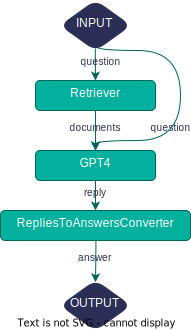

Since Haystack v1.15, we’ve been slowly introducing new components and features to Haystack in the background in preparation for Haystack 2.0 (or v2). After the work we’ve put into the new design of the Haystack API over the last few months, we’re at a point where we would love to start involving the Haystack community in our thought process and slowly gather your input and feedback. In this article, we would like to highlight where we are at for the design of the new Haystack API for v2, what we want to achieve with the new design, and what our current considerations are. 

## ❓ What does the new 2.0 version mean?

**Haystack v2 will be a major update to the design of Haystack nodes and pipelines.** We believe that the pipeline concept is a fundamental requirement and an optimal fit for building applications with LLMs. Therefore, Pipelines and Nodes will continue to be the foundation of Haystack v2. However, the general pipeline structure, Nodes API, and the connection between DocumentStore and Retrievers will change. So, this is going to be a breaking change for Haystack users.

## 🏆 Motivation behind Haystack 2.0

**At deepset, we put a lot of thought and care into maintaining Haystack as a robust, user-friendly, and production-ready LLM framework.** As we have collected feedback from the Haystack community over the years and observed the advancements in the NLP field, such as LLMs and Agents, we see the need to update the pipeline structure with Haystack v2 to better align with our users’ needs and state-of-the-art NLP approaches. 

When ready, Haystack v2 will introduce many improvements, flexibility and, most importantly, it will allow Haystack users to implement customizations and extensions to Haystack much more easily. The new pipeline structure will allow for more flexible, robust, and powerful pipelines. As we change the pipeline structure, we’ll be adapting all components to the new structure, therefore, rewriting many of them. This update gives us the opportunity to enhance the pipeline structure to better make use of LLMs, improve our Agent and Memory implementations, better define the connection between the DocumentStore and Retriever, and so on.

## 📍 Current status of Haystack 2.0

**Haystack v2 is still a work in progress.** We are defining the requirements for a more powerful and robust LLM framework with continuous feedback from the community, and we’re implementing the new Haystack API so that it’s aligned with the advances in NLP. 

Although still in beta, you can find what’s been implemented so far in the [preview](https://github.com/deepset-ai/haystack/tree/main/haystack/preview) package of the Haystack repository. To learn how and when components will be migrated, have a look at the [Migrate Components to Pipeline v2](https://github.com/deepset-ai/haystack/issues/5265) roadmap item, where we keep track of issues and PRs about Haystack v2. For a detailed overview of the current state of v2, check out [Sara’s presentation](https://drive.google.com/drive/folders/1DoS3NDCI_YGNFUy-QRL0XzeRT7vJRrn7) about Haystack v2. 

Additionally, here is the complete list of proposals so far shaping the design of Haystack v2: 

- [Drop BaseComponent and re-implement Pipeline](https://github.com/deepset-ai/haystack/blob/main/proposals/text/4284-drop-basecomponent.md) 🟢
- [DocumentStores and Retrievers in Haystack 2.0](https://github.com/deepset-ai/haystack/blob/main/proposals/text/4370-documentstores-and-retrievers.md) 🟢
- [New EmbeddingRetriever for Haystack 2.0](https://github.com/deepset-ai/haystack/blob/main/proposals/text/3558-embedding_retriever.md) 🟢
- [Embedders design for Haystack 2.0](https://github.com/deepset-ai/haystack/blob/main/proposals/text/5390-embedders.md) 🟢
- [LLM support in Haystack 2.0](https://github.com/deepset-ai/haystack/pull/5540) 🟡

## ⭐ Highlights of Haystack 2.0

- Pipeline **Nodes** will be now called **Components.**
- **The new pipeline structure will provide better support for LLMs.** The flexible connection between components will introduce new mechanisms, such as parallel branching and looping, that extend the capabilities of pipelines. Components will control the input and output of the pipeline. Thus, components with dynamic input parameters, such as those that use prompts with variables, will easily integrate into the pipeline. Overall, these refinements will not only improve the linear workflows but also ensure that pipelines seamlessly align with the nature of LLMs.
    
    Here is what a RAG pipeline might look like in Haystack v2.👇🏼
    
    > *Keep in mind that the components are still work in progress and being discussed in the “[LLM Support in Haystack 2.0](https://github.com/deepset-ai/haystack/pull/5540)” proposal.*
    > 
    
    
    
- **The Components API will change.** Components will define the name and the type of all of their inputs and outputs. The new API will reduce complexity and make it easier to create custom components such as [Haystack integrations](https://haystack.deepset.ai/integrations) for third-party APIs and databases. The connections between components will be validated before query time, and Haystack will generate better error messages with instructions on fixing the errors.
- **Retrievers will be customized for DocumentStore, not for retrieval methods.** Each DocumentStore will have its own Retriever, highly specialized for that specific DocumentStore, handling all its requirements without being bound to a generic interface. Integrating a new DocumentStore will be easier, and the specialized Retriever will be able to adapt more quickly to the new features of the DocumentStore.
- **The Embedder will be a separate component instead of being a part of a Retriever.** Retrievers won’t be responsible for creating embeddings, the new Embedder component will handle the creation of embeddings. The Retriever class will be simplified, and adding support for new embedding providers and approaches will be more straightforward.
- **Pipeline serialization will be more flexible and optimized for humans.** JSON, TOML, HCL will be used as serialization formats. Serialization and deserialization of pipelines sharing the same component instance will be possible.

## ➡️ What’s next?

As we iterate on Haystack 2.0, we’ll share the design proposals in [GitHub Discussion: Shaping Haystack 2.0](https://github.com/deepset-ai/haystack/discussions/5568) and start a conversation about topics where we need your input. As we share more information about Haystack 2.0, please feel free to share your feedback or concerns. You can always contact us using the comments section in the [GitHub Discussion](https://github.com/deepset-ai/haystack/discussions/5568) or the [Haystack Discord server](https://discord.com/invite/haystack) to ask questions.