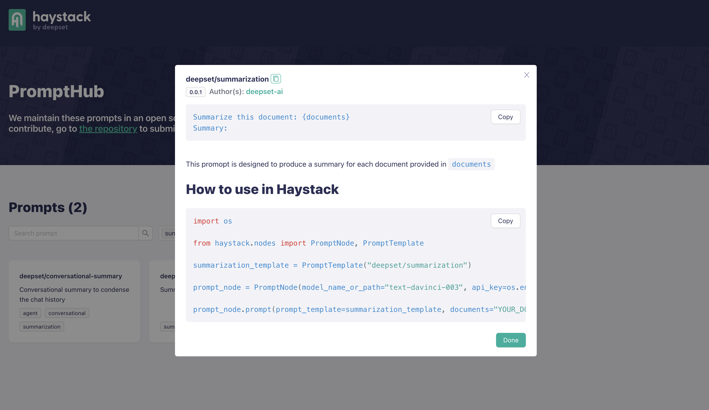

With the release of Haystack 1.18, we’ve also officially rolled out a new prompt sharing and collaboration service: [PromptHub](https://prompthub.deepset.ai). This new product currently (day of release: 29 June 2023) hosts a set of prompts we at deepset have created, with instructions on how to use them with the `PromptTemplate` and `PromptNode`. 

Prompts that are provided in PromptHub are all maintained in their own public repository on GitHub, [`deepset-ai/prompthub`](https://github.com/deepset-ai/prompthub).  Each prompt comes with a YAML file, housing the prompt itself, and a “prompt card” of the same name, which is a markdown file explaining the intended use case of the prompt and how to use it with a Haystack `PromptNode`.

In the following sections, we will walk through how you may use prompts hosted on the PromtHub, as well as your own local prompts.

## Using Prompts on PromptHub via the API

The easiest way to use prompts from the PromptHub is to simply copy over their identifier, and add this into the `prompt` field in a `PromptTemplate`.



Copy the identifier of a prompt from the PromptHub. For example, let’s try `deepset/summarization` and add this as your `prompt` in a `PromptTemplate`

```python
from haystack.nodes import PromptTemplate

my_summarizer_prompt = PromptTemplate(prompt="deepset/summarization")
```

Each prompt on the PromptHub will have instructions on how they are intended to be used, including instructions on what the best `output_parser` for that prompt might be.

For example, the `deepset/question-answering` prompt is best used with an `output_parser` as described on the PromptHub.

```python

from haystack.nodes import PromptTemplate, AnswerParser

question_answering_template = PromptTemplate("deepset/question-answering", output_shapers=AnswerParser())
```

Once you’ve created your `PromptTemplate`, you can use it in a `PromptNode` by setting it as the `default_prompt_template` or even setting it as the `prompt_template` in a single `prompt()` call.

Once you’ve pulled a prompt from the hub, the file will be cached on your machine. So you do not have to worry about making an API call each time.

## Creating and Using Local Prompts

You always have the option to create your own prompt and provided it as the `prompt` to a `PromptTemplate`. For example:

```python
from haystack.nodes import PromptTemplate

my_prompt_template(prompt="Answer the following query: {query}")
```

But now, you can also make use of and maintain your own local collection of prompts as YAML files.

Each prompt on the PromptHub is actually a YAML file containing a short description, the name of the author, a tag describing the main task it covers, as well as the prompt text itself. For example, below is the  content of the `deepset/question-answering` prompt. 

```yaml
description: A simple prompt to answer a question given a set of documents
meta:
  authors:
  - deepset
name: deepset/question-answering
tags:
- question-answering
text: "Given the context please answer the question. Context: {join(documents)};\n\nQuestion: {query}; \nAnswer:\n"
version: 0.1.1
```

Similarly, you can create your own files that hold prompts. For example, here’s a file called `my_yoda_prompt.yaml`

```yaml
description: A simple prompt to answer any question in the style of Yoda
meta:
  authors:
  - deepset
name: tuana/yoda-qa
tags:
- question-answering
text: "Answer the following query in the style of Yoda. Query: {query} \n Answer:"
version: 0.1.1
```

Which can be used in a `PromptTemplate` with the following code:

```python
from haystack.nodes import PromptTemplate

yoda_prompt = PromptTemplate(prompt="path/to/my_yoda_prompt.yaml")
```

Just in case you were curious: When asked ‘What is the meaning of life’ with this prompt, GPT-4’s result was “42, the meaning of life is. But truly, in one's own understanding and experience, find the meaning of life, one must. Hmmmm.”

## Contributing to the PromptHub

If you’ve created a prompt that you would like to share with the Haystack community and the world, all you have to do is create a pull request that includes your YAML file with the prompt, and a Markdown file with your prompt card explaining how to use it 🥳. Once you’ve done this, your prompt will be available to everyone with the name you give it. A good idea is to prefix it with your name, like we’ve done with `deepset/` prompts.
