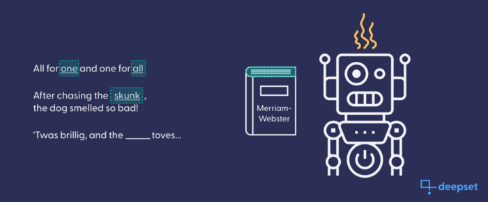
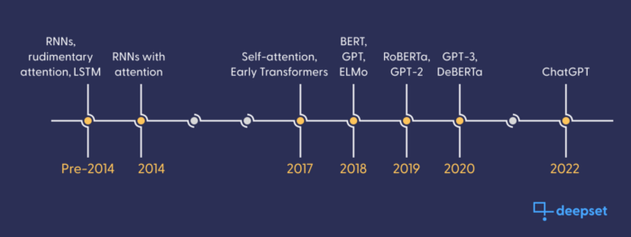

Anyone who has studied natural language processing (NLP) can tell you that the state of the art moves exceptionally fast. Big players like Google, Facebook, or OpenAI employ large teams of experts to come up with new solutions that bring computers ever closer to a seemingly human-like understanding of language. This results in model architectures and other approaches quickly becoming obsolete, and what was considered cutting-edge technology six months ago may almost seem outdated today. Nevertheless, some models make such an impact that they become foundational knowledge even as they are eclipsed by their successors.

One model architecture for which this is true is BERT (short for  **B**idirectional  **E**ncoder  **R**epresentations from  **T**ransformers, an unwieldy name almost certainly picked for its friendly acronym). Although the first BERT model — born late 2018 — is rarely used in its original form today, the adaptability of this model architecture in terms of tasks, languages, ​​and even sizes means that direct BERT offspring are still thriving in all sorts of fields.

In the high-churn world of  [language models](https://www.deepset.ai/blog/what-is-a-language-model), it can be difficult to keep up and find the best option for your project. This post aims to refresh your knowledge of BERT, provide a survey of the various models that have iterated past the BERT baseline, and help you find the right BERT-like model for you.

## Who is BERT?

Google researchers designed BERT as a general language model, adapting the Transformer architecture, which had made an enormous impact on the field of NLP just a year earlier. Aside from  [improving Google’s search results](https://blog.google/products/search/search-language-understanding-bert/)  through its deep understanding of semantics, BERT’s main function is as a basis for specific “downstream” tasks like question answering or sentiment analysis. That’s because its ability to process written language at a near-human level greatly aids the BERT language model in solving other language-based tasks.

The impression BERT made on the NLP landscape in 2018 was incredible. After it was shown in the original paper that models based on BERT’s pre-trained architecture could outperform their competitors on many different tasks, industry observers predicted that this new model paradigm would be a game changer,  [one blog post](https://www.kdnuggets.com/2019/02/deconstructing-bert-distilling-patterns-100-million-parameters.html)  even going so far as calling BERT “one model to rule them all.”

### **What sets BERT apart?**

To understand the tremendous success of BERT, we need to dip into the history of language modeling. Before Transformers, language models were based on recurrent neural nets (RNNs). RNNs had a major edge over previous, “static”  [text embeddings](https://www.deepset.ai/blog/the-beginners-guide-to-text-embeddings)  like Doc2Vec in that they were able to capture the meaning of words in context.

However, RNN-based language models still had serious shortcomings. They are strictly sequential, meaning that they process the input token after token, rather than all at once. Plus, RNNs perform weakly on longer sequences, prompting researchers to implement remedies such as “memory cells” in  [long short-term memory (LSTM)](https://en.wikipedia.org/wiki/Long_short-term_memory)  networks, and processing an input string twice: once from left to right, and once from right to left.  [ELMo](https://allenai.org/allennlp/software/elmo), often considered BERT’s direct predecessor, is an example of such a bidirectional LSTM model.

In contrast, BERT follows the Transformer architecture introduced in the  [seminal paper from 2017](https://arxiv.org/abs/1706.03762). Transformers are built on self-attention, a new core algorithm for detecting patterns, which enables the model to learn how individual tokens in an input sequence are contextually related to each other. Embeddings created by self-attention-driven Transformers are therefore highly dynamic and can easily differentiate language that machines traditionally find difficult, like homonyms or jargon words. In addition, self-attention can process input sequences at once, rather than sequentially, allowing for a faster training procedure.

However, in deep learning, the model architecture itself is just one element that contributes to a model’s success — the other one is the training task and the data it uses. One of the training tasks used to help BERT acquire language is  [“masked language modeling” (MLM)](https://towardsdatascience.com/robustly-optimized-bert-pretraining-approaches-537dc66522dd). During training, individual tokens in the training input are masked, and loss is calculated based on how well BERT can predict those tokens. What makes this task so useful is that the training data for it can be generated in a trivial manner: simply obscure a random token in the source sequence, and make that same token the prediction target. No expensive data annotation is required.

### Other directions in Transformers

BERT’s basic architecture is not the only way to use the self-attention developments of transformers. The well-known Generative Pre-trained Transformer (GPT) family of models utilizes the same baseline self-attention modules as BERT, but includes a decoding layer capable of generating text from inputs.

Keep in mind that although GPT gets a lot of public attention, BERT’s lack of a “decoder” component doesn’t mean GPT is better. BERT is a lighter model, we don’t use it for tasks that require language generation.

## The BERT family

The success of the basic BERT model has led to a large number of popular variants. Newer, more powerful models soon appeared, BERT got siblings in all kinds of languages — some were even multilingual — and researchers used BERT as a base model to fine-tune and adapt to different tasks and language domains. Recently, we’ve seen a push for making Transformer models like BERT ever smaller and more efficient.

Below, we will break down some of these broad categories in the BERT family. You can explore all the different BERTs available on the  [Hugging Face model hub](https://huggingface.co/models), and use the search and filter options to find one that fits your needs.

### RoBERTa: the overachieving big sister

In 2019, Facebook engineers  [developed a significantly more powerful version](https://arxiv.org/abs/1907.11692)  of BERT using the same model architecture. By optimizing hyperparameters and feeding the model more data, they made sizable improvements to the basic BERT model while maintaining resource size and inference complexity. Another large step forward was the change over to dynamic MLM, providing varying sentence masking to increase the robustness of learning.

The resulting architecture was named RoBERTa, and was quickly adopted as a standard baseline over BERT. Today RoBERTa is still commonly used as a baseline, as in our  [standard question answering model for English](https://huggingface.co/deepset/roberta-base-squad2).

### Polyglottal BERT

Wikipedia is a great resource for training sets in many languages, so it is relatively trivial to retrain basic BERT models on other languages if a large enough Wikipedia exists.

At deepset, we are proud to have contributed some of the best-performing German language BERTs to the NLP community. Be sure to check out a variety of English and German language models on our  [website](https://www.deepset.ai/models). German BERT is in the fine company of a large international model family that contains members such as  [AraBERT](https://huggingface.co/aubmindlab/bert-base-arabertv02),  [CamemBERT](https://huggingface.co/camembert-base), and  [RuBERT](https://huggingface.co/DeepPavlov/rubert-base-cased).

Many people also rely on multilingual BERTs for generalized semantic context. One of BERT’s more impressive offspring is the Multilingual BERT developed by Google, a BERT model trained on 104 different languages, which is  [capable of “zero shot” adaptation to a new language domain](https://arxiv.org/pdf/1906.01502.pdf). This may be a quick and tidy solution to generalized language modeling, but when you need a specific semantic model, nothing beats training it yourself (as we demonstrated with  [German BERT](https://www.deepset.ai/german-bert)).

### BERT in the real world: fine-tuning

General language models are great, not because they are particularly useful on their own, but because they provide a deep understanding of a language’s semantics that can be used in downstream tasks. The models for those tasks are produced through fine-tuning.

In fine-tuning, the core architecture of a pre-trained model like BERT or RoBERTa is altered slightly to achieve a different target output. It is then trained on data specific to the downstream task: for a question answering model, that could be a dataset consisting of questions and answers, like SQuAD; for a summarization model, a dataset with long- and short-form document pairs. The advantage to these specializations is that a pre-trained base model requires much less specific data and much less training time to become performant in a given speciality.

Fine-tuning is a transfer learning method that has enabled BERT models to accomplish tasks as diverse as  [detection of “toxic” language](https://huggingface.co/unitary/toxic-bert),  [summarization](https://huggingface.co/cahya/bert2bert-indonesian-summarization),  [named entity recognition](https://huggingface.co/dslim/bert-base-NER),  [question answering](https://huggingface.co/deepset/bert-base-cased-squad2), and many others.

### How BERT got its doctorate: domain adaptation

Language is notoriously divergent in different domains. Even when dialects aren’t formally distinguished, even a small vocabulary of jargon, terms of art, or antiquated usage can throw off the effectiveness of a language model in a particular application. Domain adaptation is the practice of gearing a general language model towards a more specialized jargon of a language.

Here are some examples of BERT models that have been adapted to different domains, to be used for specific business applications:

-   [BioBERT](https://arxiv.org/abs/1901.08746): a BERT model retrained on a biomedical corpus, enabling applications like this  [named entity recognition](https://towardsdatascience.com/tagging-genes-and-proteins-with-biobert-c7b04fc6eb4f)  model, which contextualizes obscure designations in text.
-   [SciBERT](https://arxiv.org/pdf/1903.10676.pdf): a similar model, but trained on over one million published articles. Performs at state of the art for computer science articles.
-   [BERTweet](https://arxiv.org/abs/2005.10200): a RoBERTa model trained on 850 million tweets, seen used in analyzing public discourse around  [novel vaping technology](https://www.ncbi.nlm.nih.gov/pmc/articles/PMC9353682/).
-   [FinBERT](https://arxiv.org/abs/1908.10063): a model that was first adapted to the financial domain, before fine-tuning it to the particularly tricky task of sentiment analysis on news snippets from the world of finance.

## BERT today: the quest for smaller and faster models

A major restriction in the use of BERT (and other state-of-the-art models) today is the speed and fluidity of inference tasks. Most active development on these models is seeking to make them faster for better customer experience, or even scaled down enough to fit into smartphones and run locally.

That is why a current focus in BERT research is  [model distillation](https://www.deepset.ai/blog/knowledge-distillation-with-haystack): using large, performant models to direct the training of smaller, more efficient models. The smaller, distilled model learns to imitate most of the larger model’s learning — knowledge which the smaller models would not have the bandwidth to acquire during their own training.

A large, pre-trained model serves as a teacher for an untrained smaller model, which is trained to mimic the teacher. The result is a compressed, less resource intensive model with similar results.

## What’s next for BERT?

As our ability to shrink BERT improves, researchers are eager to expand the scope and abilities of the original model. Much of the innovation in BERT’s development is happening in changes to the training tasks that BERT is learning from.

Much of current research is directed towards finding important alternative training tasks, rather than innovating BERT’s core architecture. It is thought that adding a wider variety of training tasks will especially improve BERT as a core model from which others can be fine-tuned. Such multi-task learning — a single model that can solve multiple tasks — may have better semantic generalization and therefore better performance on individual tasks.

Pushing the envelope, some directions of research are developing multimedia BERT models. Using a modified BERT as a core semantic embedding, models can be trained to translate from strings to other media, as in our  [semantic image search tutorial](https://colab.research.google.com/github/deepset-ai/haystack-tutorials/blob/main/tutorials/19_Text_to_Image_search_pipeline_with_MultiModal_Retriever.ipynb).

## Conclusion

If you want to learn more about BERT models through personal tinkering, our  [Haystack framework](https://haystack.deepset.ai/)  is a seamless tool for setting up a project. You can dive in right now with this  [tutorial on OpenAI’s GPT models for text generation](https://docs.haystack.deepset.ai/docs/answer_generator).

If you’d like to ask about our tutorials around BERT or just connect with developers working at the cutting edge of NLP,  [our Discord](https://haystack.deepset.ai/community/join)  is full of friendly BERTologists ready to chat.