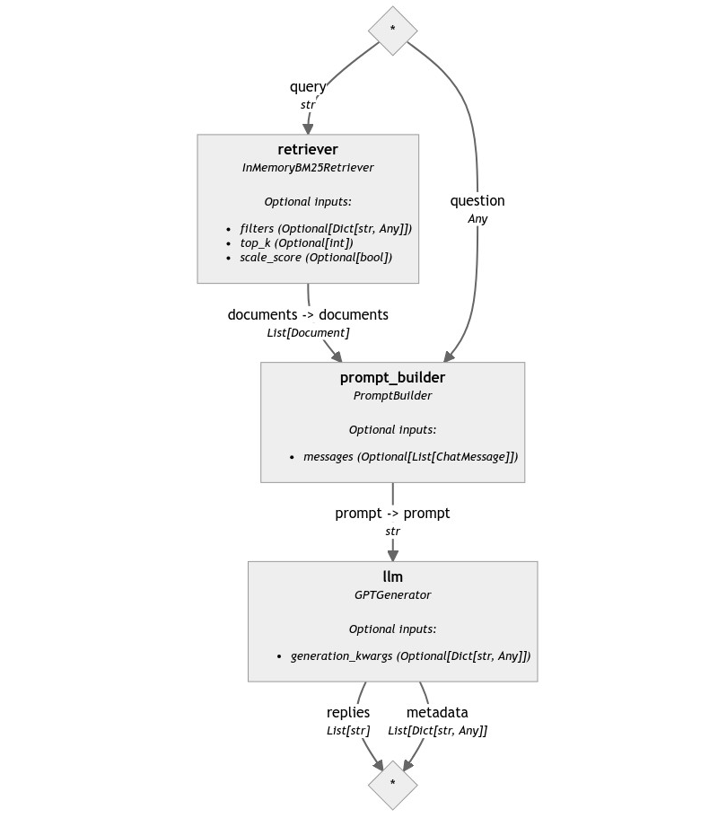
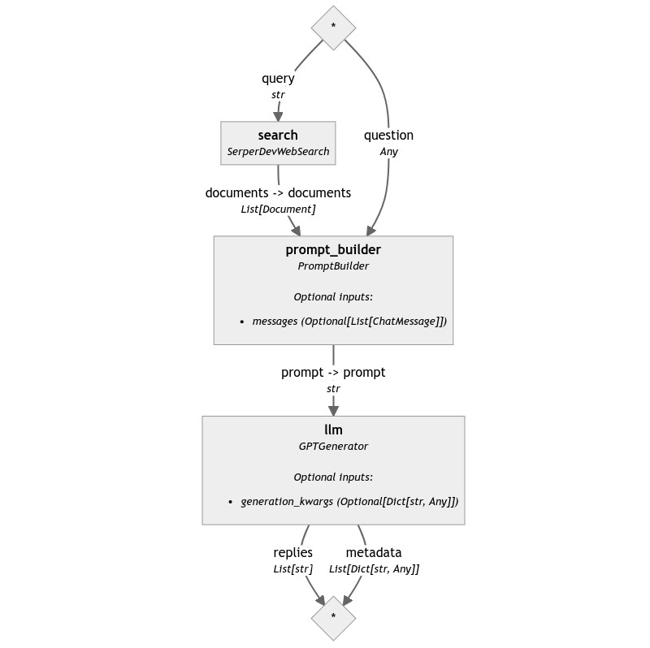
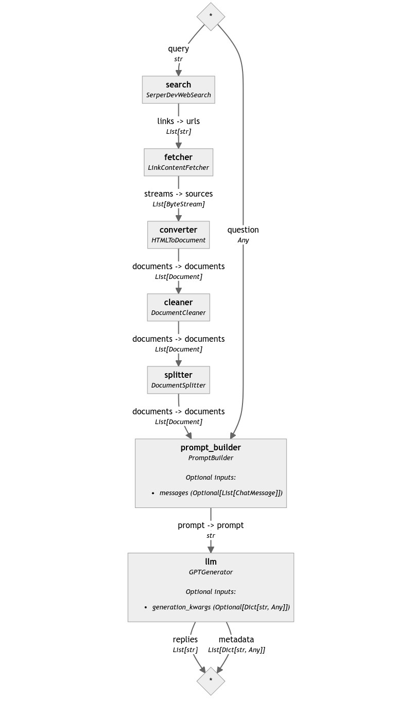
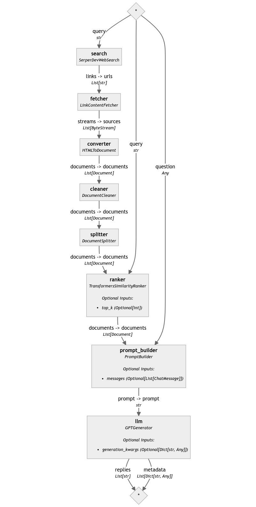
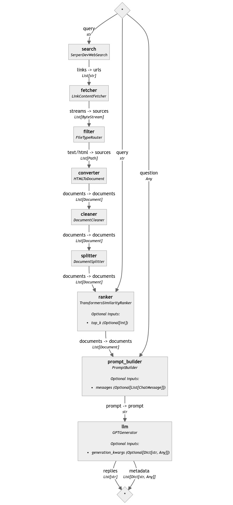

---
layout: blog-post
title: The World of Web RAG
description: Let's discover how to make your LLMs make a quick Google search before answering your questions
featured_image: thumbnail.jpg
images: ["blog/the-world-of-web-rag/thumbnail.jpg"]
alt_image: A person water-skiing in front of the Rose Island sea platform in a vintage picture.
toc: True
date: 2023-11-09
last_updated:  2023-11-09
authors:
  - Sara Zanzottera
tags: ["Haystack 2.0"]
canonical_url: https://www.zansara.dev/posts/2023-11-09-haystack-series-simple-web-rag/
---	

In an earlier post of the Haystack 2.0 series, we've seen how to build RAG and indexing pipelines. An application that uses these two pipelines is practical if you have an extensive, private collection of documents and need to perform RAG on such data only. However, in many cases, you may want to get data from the Internet: from news outlets, documentation pages, and so on.

In this post, we will see how to build a Web RAG application: a RAG pipeline that can search the Web for the information needed to answer your questions.

> 💡 *Do you want to see the code in action? Check out the [Colab notebook](https://colab.research.google.com/drive/1dGMPxReo730j7_zQDZOu-0SGf-pk4XDL?usp=sharing) or the [gist](https://gist.github.com/ZanSara/0907a8f3ae19f62998cc061ed6e8ce53).*

> <i>⚠️ **Warning:**</i> *This code was tested on `haystack-ai==0.130.0`. Haystack 2.0 is still unstable, so later versions might introduce breaking changes without notice until Haystack 2.0 is officially released. The concepts and components, however, stay the same.*


# Searching the Web

As we've seen [earlier](#), a Haystack RAG Pipeline is made of three components: a Retriever, a PromptBuilder, and a Generator, and looks like this:



To make this pipeline use the Web as its data source, we need to change the retriever with a component that does not look into a local document store for information but can search the web.

Haystack 2.0 already provides a search engine component called `SerperDevWebSearch`. It uses [SerperDev's API](https://serper.dev/) to query popular search engines and return two types of data: a list of text snippets coming from the search engine's preview boxes and a list of links, which point to the top search results.

To begin, let's see how to use this component in isolation.

```python
from haystack.preview.components.websearch import SerperDevWebSearch

question = "What's the official language of the Republic of Rose Island?"

search = SerperDevWebSearch(api_key=serperdev_api_key)
results = search.run(query=question)
# returns {
#     "documents": [
#         Document(content='Esperanto', meta={'title': 'Republic of Rose Island - Wikipedia', 'link': 'https://en.wikipedia.org/wiki/Republic_of_Rose_Island'}),
#         Document(content="The Republic of Rose Island was a short-lived micronation on a man-made platform in the Adriatic Sea. It's a story that few people knew of until recently, ...", meta={'title': 'Rose Island - The story of a micronation', 'link': 'https://www.rose-island.co/', 'imageUrl': 'https://encrypted-tbn0.gstatic.com/images?q=tbn:ANd9GcQiRCfTO6OwFS32SX37S-7OadDZCNK6Fy_NZVGsci2gcIS-zcinhOcGhgU&s', 'position': 1},
#         ...
#     ], 
#     "links": [
#         'https://www.rose-island.co/',
#         'https://www.defactoborders.org/places/rose-island',
#         ...
#     ]
# }
```

`SerperDevWebSearch` is a component with a simple interface. Starting from its output, we can see that it returns not one but two different values in the returned dictionary: `documents` and `links`.

`links` is the most straightforward and represents the top results that Google found relevant for the input query. It's a list of strings, each containing a URL. You can configure the number of links to return with the `top_k` init parameter. 

`documents` instead is a list of already fully formed Document objects. The content of these objects corresponds to the "answer boxes" that Google often returns together with its search results. Given that these code snippets are usually clean and short pieces of text, they're perfect to be fed directly to an LLM without further processing.

Other than expecting an API key as an init parameter and `top_k` to control the number of results, `SerperDevWebSearch` also accepts an `allowed_domains` parameter, which lets you configure the domains Google is allowed to look into during search, and `search_params`, a more generic dictionary input that lets you pass any additional search parameter SerperDev's API understand.

# A Minimal Web RAG Pipeline

`SerperDevWebSearch` is actually the bare minimum we need to be able to build our very first Web RAG Pipeline. All we need to do is replace our original example's Retriever with our search component.

This is the result:

```python
from haystack.preview import Pipeline
from haystack.preview.components.builders import PromptBuilder
from haystack.preview.components.generators import GPTGenerator

template = """
Question: {{ question }}

Google Search Answer Boxes:

    {{ document.content }}


Please reformulate the information above to 
answer the user's question.
"""
pipe = Pipeline()

pipe.add_component("search", SerperDevWebSearch(api_key=serperdev_api_key))
pipe.add_component("prompt_builder", PromptBuilder(template=template))
pipe.add_component("llm", GPTGenerator(api_key=api_key))
pipe.connect("search.documents", "prompt_builder.documents")
pipe.connect("prompt_builder", "llm")

question = "What's the official language of the Republic of Rose Island?"
pipe.run({
    "search": {"query": question},
    "prompt_builder": {"question": question}
})
# returns {
#     'llm': {
#         'replies': [
#             "The official language of the Republic of Rose Island is Esperanto. This artificial language was chosen by the residents of Rose Island as their national language when they declared independence in 1968. However, it's important to note that despite having their own language, government, currency, and postal service, Rose Island was never officially recognized as an independent nation by any country."
#         ],
#         'metadata': [...]
#     }
# }
```



This solution is already quite effective for simple questions because Google does most of the heavy lifting of reading the content of the top results, extracting the relevant snippets, and packaging them up in a way that is really easy to access and understand by the model.

However, there are situations in which this approach is not sufficient. For example, for highly technical or nuanced questions, the answer box does not provide enough context for the LLM to elaborate and grasp the entire scope of the discussion. In these situations, we may need to turn to the second output of `SerperDevWebSearch`: the links.

# Fetching URLs

Haystack offers components to read the content of a URL: it's `LinkContentFetcher`. Let's see this component in action.

```python
from haystack.preview.components.fetchers.link_content import LinkContentFetcher

fetcher = LinkContentFetcher()
fetcher.run(urls=["https://en.wikipedia.org/wiki/Republic_of_Rose_Island"])
# returns {
#     "streams": [
#         ByteStream(data=b"<DOCTYPE html>\n<...")
#     ]
# }
```

First, let's notice that `LinkContentFetcher` outputs a list of `ByteStream` objects. `ByteStream` is a Haystack abstraction that makes handling binary streams and files equally easy. When a component produces `ByteStream` as output, you can directly pass these objects to a Converter component that can extract its textual content without saving such binary content to a file.

These features come in handy to connect `LinkContentFetcher` to a component we've already met before: `HTMLToDocument`.

# Processing the page

In a [previous post](#), we've seen how Haystack can convert web pages into clean Documents ready to be stored in a Document Store. We will reuse many of the components we have discussed there, so if you missed it, make sure to check it out.

From the pipeline in question, we're interested in three of its components: `HTMLToDocument`, `DocumentCleaner`, and `DocumentSplitter`. Once the search component returns the links and `LinkContentFetcher` downloaded their content, we can connect it to `HTMLToDocument` to extract the text and `DocumentCleaner` and `DocumentSplitter` to clean and chunk the content, respectively. These documents then can go to the `PromptBuilder`, resulting in a pipeline such as this:

```python
template = """
Question: {{ question }}

Context:

    {{ document.content }}


Please reformulate the information above to answer the user's question.
"""
pipe = Pipeline()

pipe.add_component("search", SerperDevWebSearch(api_key=serperdev_api_key))
pipe.add_component("fetcher", LinkContentFetcher())
pipe.add_component("converter", HTMLToDocument())
pipe.add_component("cleaner", DocumentCleaner())
pipe.add_component("splitter", DocumentSplitter(split_by="sentence", split_length=3))
pipe.add_component("prompt_builder", PromptBuilder(template=template))
pipe.add_component("llm", GPTGenerator(api_key=api_key))
pipe.connect("search.links", "fetcher")
pipe.connect("fetcher", "converter")
pipe.connect("converter", "cleaner")
pipe.connect("cleaner", "splitter")
pipe.connect("splitter", "prompt_builder.documents")
pipe.connect("prompt_builder", "llm")

question = "What's the official language of the Republic of Rose Island?"
pipe.run({
    "search": {"query": question},
    "prompt_builder": {"question": question}
})
```



However, running this pipeline results in a crash.

```
PipelineRuntimeError: llm raised 'InvalidRequestError: This model's maximum context 
length is 4097 tokens. However, your messages resulted in 4911 tokens. Please reduce 
the length of the messages.'
```

Reading the error message reveals the issue right away: the LLM received too much text. And that's to be expected because we just passed the entire content of several web pages to it.

We need to find a way to filter only the most relevant documents from the long list that is generated by `DocumentSplitter`.

# Ranking Documents on the fly

Retrievers are optimized to use the efficient retrieval engines of document stores to sift quickly through vast collections of Documents. However, Haystack also provides smaller, standalone components that work very well on shorter lists and don't require a full-blown vector database engine to function.

These components are called rankers. One example of such a component is `TransformersSimilarityRanker`: a ranker that uses a model from the `transformers` library to rank Documents by their similarity to a given query.

Let's see how it works:

```python
from haystack.preview.components.rankers.transformers_similarity import TransformersSimilarityRanker

ranker = TransformersSimilarityRanker()
ranker.warm_up()
ranker.run(
    query="What's the official language of the Republic of Rose Island?",
    documents=documents,
    top_k=1
  )
# returns {
#     'documents': [
#         Document(content="Island under construction\nRepublic of Rose Island\nThe Republic of Rose Island ( Esperanto : Respubliko de la Insulo de la Rozoj; Italian : Repubblica dell'Isola delle Rose) was a short-lived micronation on a man-made platform in the Adriatic Sea , 11 kilometres (6.8\xa0mi) off the coast of the province of Rimini , Italy, built by Italian engineer Giorgio Rosa, who made himself its president and declared it an independent state on 1 May 1968. [1] [2] Rose Island had its own government, currency, post office, and commercial establishments, and the official language was Esperanto .", meta={'source_id': '03bfe5f7b7a7ec623e854d2bc5eb36ba3cdf06e1e2771b3a529eeb7e669431b6'}, score=7.594357490539551)
#     ]
# }
```

This component has a feature we haven't encountered before: the `warm_up()` method.

Components that need to initialize heavy resources, such as a language model, always perform this operation after initializing them in the `warm_up()` method. When they are used in a Pipeline, `Pipeline.run()` takes care of calling `warm_up()` on all components before running; when used standalone, users need to call `warm_up()` explicitly to prepare the object to run.

`TransformersSimilarityRanker` accepts a few parameters. When initialized, it accepts a `model_name_or_path` with the HuggingFace ID of the model to use for ranking: this value defaults to `cross-encoder/ms-marco-MiniLM-L-6-v2`. It also takes `token`, to allow users to download private models from the Models Hub, `device`, to let them leverage PyTorch's ability to select the hardware to run on, and `top_k`, the maximum number of documents to return. `top_k`, as we see above, can also be passed to `run()`, and the latter overcomes the former if both are set. This value defaults to 10.

Let's also put this component in the pipeline: its place is between the splitter and the prompt builder.

```python
template = """
Question: {{ question }}

Context:

    {{ document.content }}


Please reformulate the information above to answer the user's question.
"""
pipe = Pipeline()

pipe.add_component("search", SerperDevWebSearch(api_key=serperdev_api_key))
pipe.add_component("fetcher", LinkContentFetcher())
pipe.add_component("converter", HTMLToDocument())
pipe.add_component("cleaner", DocumentCleaner())
pipe.add_component("splitter", DocumentSplitter(split_by="sentence", split_length=3))
pipe.add_component("ranker", TransformersSimilarityRanker())
pipe.add_component("prompt_builder", PromptBuilder(template=template))
pipe.add_component("llm", GPTGenerator(api_key=api_key))
pipe.connect("search.links", "fetcher")
pipe.connect("fetcher", "converter")
pipe.connect("converter", "cleaner")
pipe.connect("cleaner", "splitter")
pipe.connect("splitter", "ranker")
pipe.connect("ranker", "prompt_builder.documents")
pipe.connect("prompt_builder", "llm")

question = "What's the official language of the Republic of Rose Island?"

pipe.run({
    "search": {"query": question},
    "ranker": {"query": question},
    "prompt_builder": {"question": question}
})
# returns {
#     'llm': {
#         'replies': [
#             'The official language of the Republic of Rose Island was Esperanto.'
#         ],
#         'metadata': [...]
#     }
# }
```




Note how the ranker needs to know the question to compare the documents, just like the search and prompt builder components do. So, we need to pass the value to the pipeline's `run()` call.

# Filtering file types

The pipeline we just built works great in most cases. However, it may occasionally fail if the search component happens to return some URL that does not point to a web page but, for example, directly to a video, a PDF, or a PPTX.

Haystack does offer some facilities to deal with these file types, but we will see these converters in another post. For now, let's only filter those links out to prevent `HTMLToDocument` from crashing.

This task could be approached with Haystack in several ways, but the simplest in this scenario is to use a component that would typically be used for a slightly different purpose. This component is called `FileTypeRouter`.

`FileTypeRouter` is designed to route different files to their appropriate converters by checking their mime type. It does so by inspecting the content or the extension of the files it receives in input and producing an output dictionary with a separate list for each identified type.

However, we can also conveniently use this component as a filter. Let's see how!

```python
from haystack.preview.components.routers.file_type_router import FileTypeRouter

router = FileTypeRouter(mime_types=["text/html"])
router.run(sources=["Republic_of_Rose_Island.txt", "Republic_of_Rose_Island.html"])
# returns defaultdict(list,
#         {'unclassified': [PosixPath('Republic_of_Rose_Island.txt')],
#          'text/html': [PosixPath('Republic_of_Rose_Island.html')]})
```

`FileTypeRouter` must always be initialized with the list of mime types it is supposed to handle. Not only that, but this component can also deal with files that do not match any of the expected mime types by putting them all under the `unclassified` category.

By putting this component between `LinkContentFetcher` and `HTMLToDocument`, we can make it forward along the pipeline only the files that match the `text/html` mime type and silently discard all others.

Notice how, in the pipeline below, I explicitly connect the `text/html` output only:

```python
template = """
Question: {{ question }}

Google Search Answer Boxes:

    {{ document.content }}


Please reformulate the information above to answer the user's question.
"""
pipe = Pipeline()

pipe.add_component("search", SerperDevWebSearch(api_key=serperdev_api_key))
pipe.add_component("fetcher", LinkContentFetcher())
pipe.add_component("filter", FileTypeRouter(mime_types=["text/html"]))
pipe.add_component("converter", HTMLToDocument())
pipe.add_component("cleaner", DocumentCleaner())
pipe.add_component("splitter", DocumentSplitter(split_by="sentence", split_length=3))
pipe.add_component("ranker", TransformersSimilarityRanker())
pipe.add_component("prompt_builder", PromptBuilder(template=template))
pipe.add_component("llm", GPTGenerator(api_key=api_key))
pipe.connect("search.links", "fetcher")
pipe.connect("fetcher", "filter")
pipe.connect("filter.text/html", "converter")
pipe.connect("converter", "cleaner")
pipe.connect("cleaner", "splitter")
pipe.connect("splitter", "ranker")
pipe.connect("ranker", "prompt_builder.documents")
pipe.connect("prompt_builder", "llm")

question = "What's the official language of the Republic of Rose Island?"

pipe.run({
    "search": {"query": question},
    "ranker": {"query": question},
    "prompt_builder": {"question": question}
})
# returns {
#     'llm': {
#         'replies': [
#             'The official language of the Republic of Rose Island was Esperanto.'
#         ],
#         'metadata': [...]
#     }
# }
```



With this last addition, we added quite a bit of robustness to our pipeline, making it less likely to fail.

# Wrapping up

Web RAG is a use case that can be expanded to cover many use cases, resulting in very complex pipelines. Haystack helps make sense of their complexity by pipeline graphs and detailed error messages in case of mismatch connections. However, pipelines this large can become overwhelming, especially when more branches are added.

In one of our next posts, we will see how to cover such use cases while keeping the resulting complexity as low as possible.
