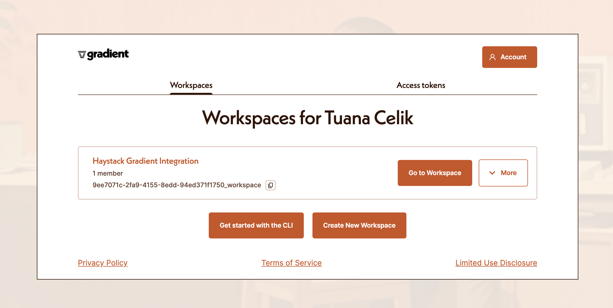
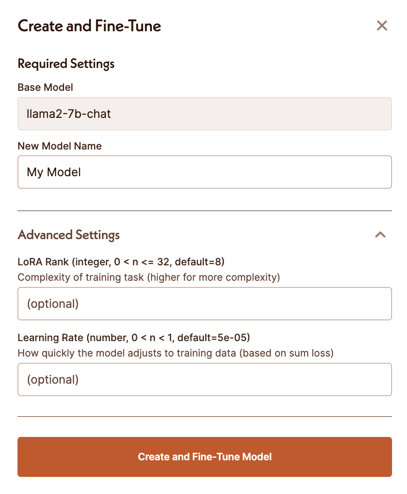

One of the more cumbersome aspects of creating LLM applications is model management. Especially in cases where we need to fine-tune, host, and scale the models ourselves. In this case, having options at hand can be great. Today, we’ve expanded the Haystack 2.0 ecosystem with a new integration that can help you with just that

[Gradient](https://gradient.ai) is an LLM development platform that offers web APIs for fine-tuning, embeddings, and inference on state-of-the-art open-source models. In this article, let’s tave a look at the new Gradient integration for Haystack, and how you can use it in your retrieval-augmented generative pipelines.

> You can find [an example Colab here](https://colab.research.google.com/drive/1CQZoKrU0AM3bJtWcAicYA2q5FTu-nPJj?usp=sharing), which uses embedding and generative models from Gradient for a RAG pipeline on Notion pages.

## What the Gradient Integration Provides

The [Gradient Integration](https://haystack.deepset.ai/integrations/gradient) for Haystack comes with three new components for Haystack pipelines:

-   The `GradientDocumentEmbedder`: You can use this component to create embeddings of documents.
-   The `GradientTextEmbedder`: You can use this component to create embeddings for text snippets such as queries.
-   The `GradientGenerator`: You can use this component to generate responses using LLMs.

## How to use the Gradient Integration

The Gradient platform provides an embeddings endpoint (at the time of writing, it supports [bge-large](https://huggingface.co/BAAI/bge-large-en-v1.5)) and the fine-tuning and deployment of LLMs such as Llama-2, Bloom, and more (with more planned).

To fine-tune and use models via Gradient, the first step is to create a workspace.



Once you have a workspace, you will be able to select a base model and start a fine-tuning job.



### Using the GradientGenerator

You can use the `GradientGenerator` either with any of the available [base models that Gradient provides](https://docs.gradient.ai/docs/models-1#%EF%B8%8F-gradient-hosted-llms), or with a model that you have fine-tuned on the platform.

For example, to use the `llama2-7b-chat` model:

```python
generator = GradientGenerator(access_token='YOUR_GRADIENT_ACCESS_TOKEN',
                              workspace_id="YOUR_WORKSPACE_ID",
                              base_model_slug="llama2-7b-chat",
                              max_generated_token_count=350)

```

Or, to use a model that you’ve fine-tuned on the Gradient platform, provide your `model_adapter_id`

```python
generator = GradientGenerator(access_token='YOUR_GRADIENT_ACCESS_TOKEN',
                              workspace_id="YOUR_WORKSPACE_ID",
                              model_adapter_id="your_finetuned_model_adapter_id",
                              max_generated_token_count=350)

```

### Building a RAG pipeline

In this article, I’ve provided an example [Colab](https://colab.research.google.com/drive/1CQZoKrU0AM3bJtWcAicYA2q5FTu-nPJj?usp=sharing) that does question-answering on your private Notion pages, using the `NotionExporter` integration. We use the `GradientDocumentEmbedder` component to create embeddings of our notion pages and index them into an `InMemoryDocumentStore`. As for the RAG pipeline, you can use the `GradientTextEmbedder` and `GradientGenerator` to:

1.  Embed the user query to retrieve the most relevant documents from our Notion pages
2.  Generate a response using our own fine-tuned LLM from Gradient:

```python
from haystack.components.retrievers import InMemoryEmbeddingRetriever
from haystack.components.builders import PromptBuilder
from gradient_haystack.embedders.gradient_text_embedder import GradientTextEmbedder
from gradient_haystack.generator.base import GradientGenerator

prompt = """ Answer the query, based on the
content in the documents.

Documents:

  {{doc.content}}


Query: {{query}}
"""
text_embedder = GradientTextEmbedder(access_token='YOUR_GRADIENT_ACCESS_TOKEN',
				                             workspace_id="YOUR_WORKSPACE_ID",)
retriever = InMemoryEmbeddingRetriever(document_store=document_store)
prompt_builder = PromptBuilder(template=prompt)
generator = GradientGenerator(access_token='YOUR_GRADIENT_ACCESS_TOKEN',
                              workspace_id="YOUR_WORKSPACE_ID",
                              model_adapter_id="your_finetuned_model_adapter_id",
                              max_generated_token_count=350)

rag_pipeline = Pipeline()

rag_pipeline.add_component(instance=text_embedder, name="text_embedder")
rag_pipeline.add_component(instance=retriever, name="retriever")
rag_pipeline.add_component(instance=prompt_builder, name="prompt_builder")
rag_pipeline.add_component(instance=generator, name="generator")

rag_pipeline.connect("text_embedder", "retriever")
rag_pipeline.connect("retriever.documents", "prompt_builder.documents")
rag_pipeline.connect("prompt_builder", "generator")

```

To run this pipeline:

```python
question = "What are the steps for creating a custom component?"
rag_pipeline.run(data={"text_embedder":{"text": question},
                                "prompt_builder":{"query": question}})

```