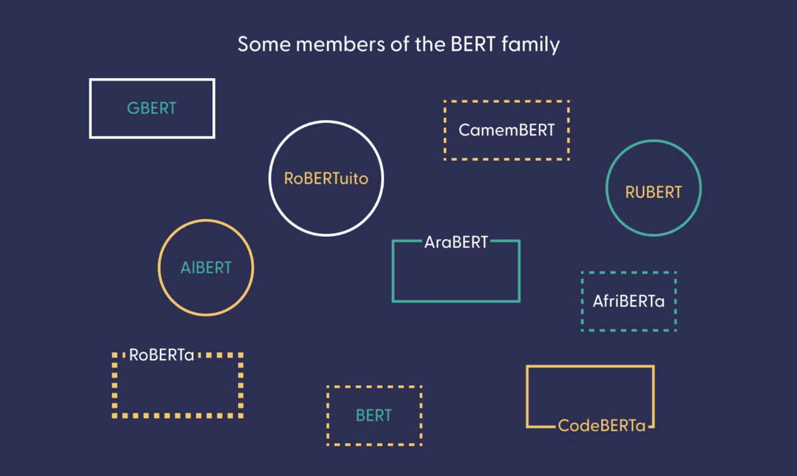
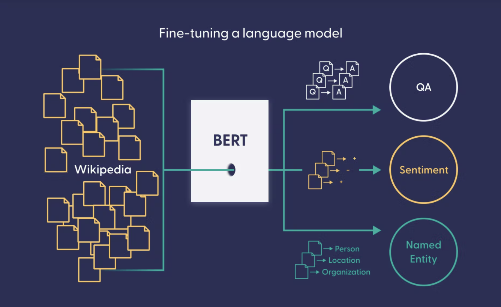
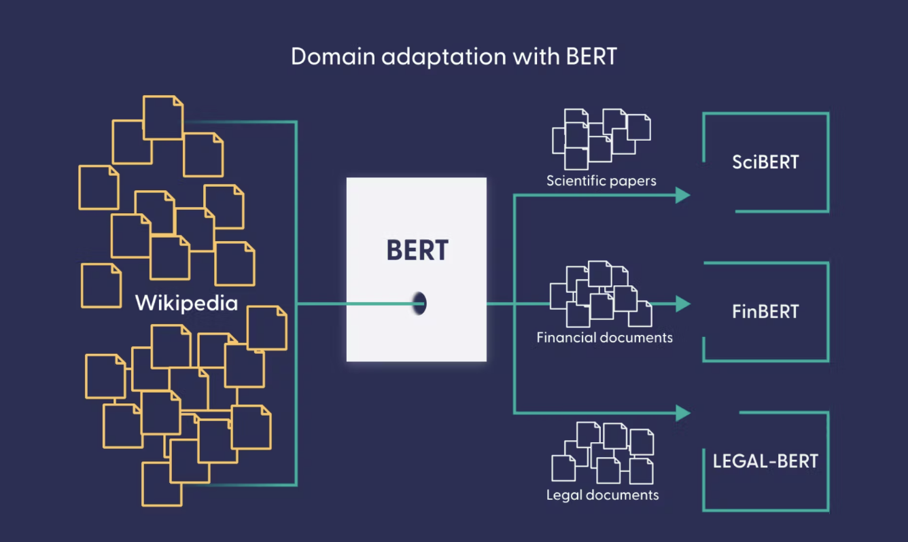

Our aim at  [deepset](https://www.deepset.ai/)  is that everyone, no matter their level of technical background, can harness the power of modern natural language processing (NLP) and language models for their own use case.  [Haystack](https://haystack.deepset.ai/), our open-source framework, makes this a reality.

When we talk to our users, we encounter common sources of confusion about NLP and machine learning. Therefore, in the upcoming blog posts, we want to explain some basic NLP concepts in understandable language. First up: language models.

## Language Models in NLP

Language models take center stage in NLP. But what is a language model? To answer that question, let’s first clarify the term  _model_  and its use in machine learning.

### What is a machine learning model?

The real world is complex and confusing. Models serve to represent a particular field of interest — a domain — in simpler terms. For example, weather models are simplified representations of meteorological phenomena and their interactions. These models help us understand the weather domain better and make predictions about it.

In machine learning, models are much the same. They serve mainly to predict events based on past data, which is why they’re also known as forecasting or predictive models.

The data that we feed to an ML algorithm allows it to devise a model of the data’s domain. That data should represent reality most faithfully, so that the models which are based on it can approximate the real world as closely as possible.

### What is a language model?

A language model is a machine learning model designed to represent the language domain. It can be used as a basis for a number of different language-based tasks, for instance:

-   [Question answering](https://www.deepset.ai/question-answering-use-case)
-   [Semantic search](https://www.deepset.ai/semantic-search-use-case)
-   [Summarization](https://docs.haystack.deepset.ai/docs/summarizer)

and plenty of other tasks that operate on natural language.

In a domain like weather forecasting, it’s easy to see how past data helps a model to predict a future state. But how do you apply that to language? In order to understand how the concept of prediction factors into language modeling, let’s take a step back and talk about linguistic intuition.

#### **Linguistic intuition**

As the speaker of a language, you have assembled an astonishing amount of knowledge about it, much of which cannot be taught explicitly. It includes judgments about grammaticality (whether or not a sentence is syntactically correct), synonymity (whether two words mean roughly the same) and sentence completion. Suppose I asked you to fill in the gap in the following sentence:

“Julia is looking for ___ purse.”

You’d probably say “her” or “my” or any other pronoun. Even a possessive noun phrase like “the cat Pablo’s” would work. But you wouldn’t guess something like “toothbrush” or “Las Vegas.” Why? Because of linguistic intuition.

#### **Training a language model**

Language models seek to model linguistic intuition. That is not an easy feat. As we’ve said, linguistic intuition isn’t learned through schooling but through constant use of a language (Noam Chomsky even postulated the existence of a special “[language organ](https://chomsky.info/198311__/)” in humans). So how can we model it?

Today’s state of the art in NLP is driven by large neural networks. Neural language models like  [BERT](https://en.wikipedia.org/wiki/BERT_(language_model))  learn something akin to linguistic intuition by processing millions of data points. In machine learning, this process is known as “training.”

To train a model, we need to come up with tasks that cause it to learn a representation of a given domain. For language modeling, a common task consists of  [completing the missing word in a sentence](https://towardsdatascience.com/masked-language-modelling-with-bert-7d49793e5d2c), much like in our example earlier. Through this and other training tasks, a language model learns to encode the meanings of words and longer text passages.

So how do you get from a computational representation of a language’s semantic properties to a model that can perform specific tasks like question answering or summarization?

## General-purpose Versus Domain-specific Language Models

General language models like BERT or its bigger sister  [RoBERTa](https://arxiv.org/abs/1907.11692)  require huge amounts of data to learn a language’s regularities. NLP practitioners often use Wikipedia and other freely available collections of textual data to train them. By now, BERT-like models exist for practically all the  [languages with a sufficiently large Wikipedia](https://www.deepset.ai/blog/nlp-resources-beyond-english). In fact, we at deepset have produced several models for German and English, which you can check out on  [our models page](https://www.deepset.ai/models).

So what can you do with these models? Why are they so popular? Well, BERT can be used to enhance language understanding, for example in the  [Google search engine](https://blog.google/products/search/search-language-understanding-bert/). But arguably the biggest value of general-purpose language models is that they can serve as a basis for other language-based tasks like question answering. By exposing it to different datasets and adjusting the training objective, we can adapt a general language model to a specific use case.

### Fine-tuning a language model

There are many tasks that benefit from a representation of linguistic intuition. Examples of such tasks are  [sentiment analysis](https://en.wikipedia.org/wiki/Sentiment_analysis),  [named entity recognition](https://en.wikipedia.org/wiki/Named-entity_recognition), question answering, and others. Adapting a general-purpose language model to such a task is known as  [fine-tuning](https://huggingface.co/docs/transformers/training).

Fine-tuning requires data specific to the task you want the model to accomplish. For instance, to fine-tune your model to the question-answering task, you need a  [dataset of question-answer pairs](https://rajpurkar.github.io/SQuAD-explorer/). Such data often needs to be created and curated manually, which makes it quite expensive to generate. On the bright side, fine-tuning requires much less data than training a general language model.

### Where to look for models

Both general-purpose models and fine-tuned models can be saved and shared. The  [Hugging Face model hub](https://huggingface.co/models)  is the most popular platform for model-sharing, with tens of thousands of models of different sizes, for different languages and use cases. Chances are high that your own use case is already covered by one of the models on the model hub.

To help you find a model that might fit your needs, you can use the interface on the left side of the model hub page to filter by task, language, and other criteria. This lets you specifically look for models that have been trained for question answering, summarization, and many other tasks. Once you’ve found a suitable model, all you need to do is plug it into your  [NLP pipeline](https://docs.haystack.deepset.ai/docs/pipelines), connect to your database, and start experimenting.

### How to handle domain-specific language

Though we often talk about languages as if they were homogeneous entities, the reality is very far from that. There are, for example, some professional domains — like medicine or law — that use highly specialized jargon, which non-experts can barely understand. Similarly, when a general BERT model is used to process data from one of those domains, it might perform poorly — just like a person without a degree in the field.

A technique called  _domain adaptation_  provides the solution: here, the pretrained model undergoes additional training steps, this time on specialized data like legal documents or medical papers.

The Hugging Face model hub contains BERT-based language models that have been adapted to the scientific, medical, legal, or financial domain. These domain-specific language models can then serve as a basis for further downstream tasks. For instance,  [this highly specialized model](https://huggingface.co/StivenLancheros/roberta-base-biomedical-clinical-es-finetuned-ner-CRAFT_AugmentedTransfer_ES)  extracts named entities (like names for cells and proteins) from biomedical texts in English and Spanish.

## What Can Language Models Do?

Language models can seem very smart. In  [this demo](https://huggingface.co/spaces/Tuana/GoT-QA-Haystack), for example, we show how well  [our RoBERTa model](https://huggingface.co/deepset/roberta-base-squad2-distilled)  can answer questions about the Game of Thrones universe. It’s important to note, though, that this language model doesn’t actually  _know_  anything. It is just very good at extracting the right answers from documents — thanks to its mastery of human language and the fine-tuning it received on a question-answering dataset. It operates similarly to a human agent reading through documents to extract information from them, only much, much faster!

Other types of language models take a completely different approach. For example, the famed  [GPT family of generative language models](https://openai.com/blog/better-language-models/)  actually  _do_  [memorize information](https://www.technologyreview.com/2020/07/20/1005454/openai-machine-learning-language-generator-gpt-3-nlp/). They have so many parameters — billions — that they can store information picked up during training  _in addition to_  learning the language’s regularities.

**So what can a language model do? Exactly what it’s been trained to do — not more, not less. Some models are trained to extract answers from text, others to generate answers from scratch. Some are trained to summarize text, others simply learn to represent language.**

If your documents don’t use highly specialized language, a pre-trained model might work just fine — no further training required. Other use cases, however, might benefit from additional training steps. In our upcoming blog post, we’ll explore in more detail how you can work with techniques like fine-tuning and domain adaptation to get the most out of language models.

## Composable NLP with Haystack

Modern NLP builds on decades of research and incorporates complex concepts from math and computer science. That’s why we promote a practice of  [_composable NLP_](https://www.deepset.ai/hugging-face-model-hub-integration)  with Haystack, which lets users build their own NLP-based systems through a mix-and-match approach. You don’t have to be an NLP practitioner to use our framework, just as you don’t need to know anything about hardware or electricity to use a computer.

Want to see how to integrate pre-trained language models into an NLP pipeline? Check out our  [GitHub repository](https://github.com/deepset-ai/haystack)  or sign up to  [deepset Cloud](https://www.deepset.ai/deepset-cloud).

To learn more about NLP, make sure to  [download our free ebook](https://landing.deepset.ai/nlp-for-product-managers)  _NLP for Product Managers_.

Finally, we’d be happy to see you on  [our Discord server](https://haystack.deepset.ai/community), where members of the deepset team answer questions from the community.