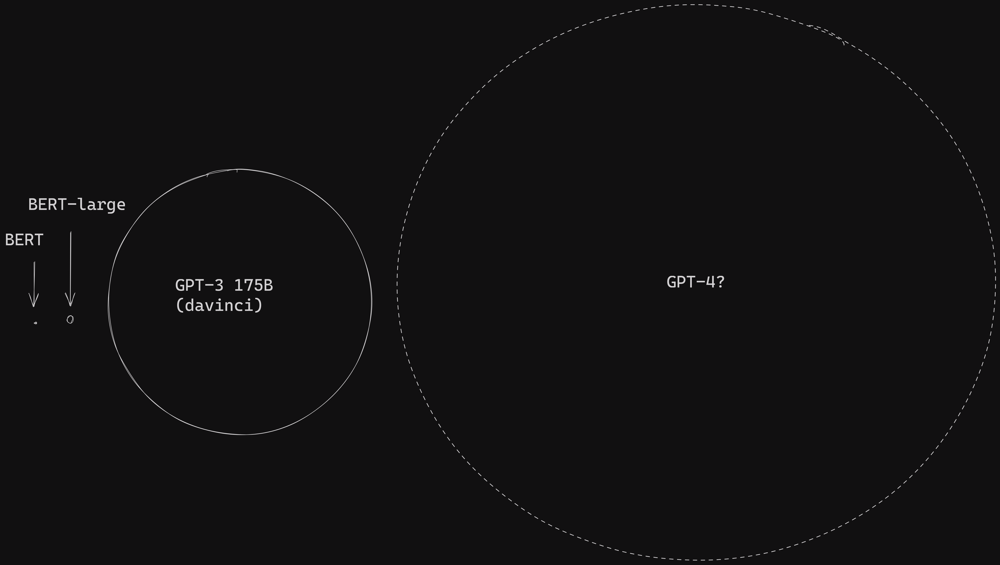
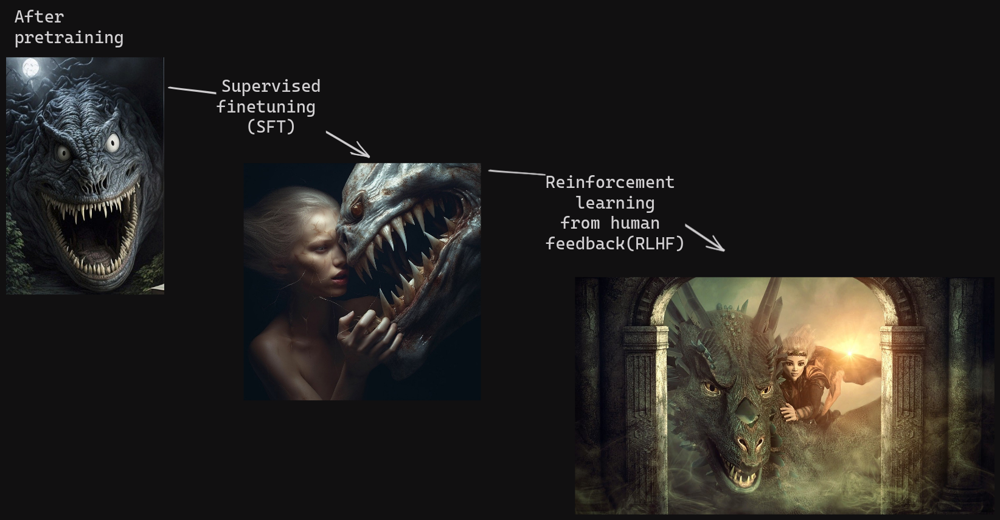

AI is here to stay. But while applications like autonomous driving and even image generation have only touched few people's lives so far, generative AI in the form of high-quality chatbots has taken the world by storm. The informative, creative, and at times deceptively eloquent responses by the likes of ChatGPT are made possible by a novel technology known as large language models (LLMs).

  

In this article, we’ll talk about what LLMs are and how they’re produced, what kinds of LLMs exist, and whether it's truly just their size that sets them apart from other language models. In the end, we’ll show you how you, too, can use LLMs in Haystack, our open source framework for NLP.

## What is a large language model?

As with most groundbreaking technologies, LLMs didn’t come about overnight. Rather, they are part of a long-term trend in natural language processing that has been happening over the last few years. Since the introduction of [BERT](https://haystack.deepset.ai/blog/the-definitive-guide-to-bertmodels), state-of-the-art language models have followed the same architectural paradigm, which saw them develop an ever-better understanding of the intricacies and nuances of natural (that is, human) language.

  

Developers took that new-found ability for processing language to the next level by building ever larger language models, which require an incredible amount of computing power during training: the LLM was born. In addition to their size (which is calculated based on their number of trainable parameters), these models also have to ingest huge amounts of data when they’re trained.

So technically, a large language model is simply, well, a language model that is large. In practice, though, the term LLM has taken on a more specific meaning: it is often used to refer to those large models that are able to generate coherent, human-like output in response to instructions by a user. In this article, therefore, we’ll concentrate on the models that satisfy this definition, and ignore other LLMs.

## How are LLMs created?

Like most modern machine learning models, LLMs are created by feeding a complex neural network architecture with data representing the domain the model needs to learn. Hence, computer vision models ingest image data, while language models need to see textual data during training. Have a look at our [entry-level discussion of language models](https://haystack.deepset.ai/blog/what-is-a-language-model) to learn more.

### Pre-training an LLM

In the first training phase, the LLM learns a representation of the data through text completion. Upon seeing a sequence of words, its training objective is to generate the most likely next word. Through this technique, it learns to emulate our own linguistic intuition. However – and here’s where the “large” part truly makes a difference – while small models arrive at a stage where they can form well-formed, grammatical responses in the language they’re trained on, LLMs go much further. These models have so many parameters that they can easily learn a representation of the world knowledge contained in the data.

  

Let’s look at some examples to make that point clearer. Here’s the kind of intuition a small language model learns compared to that of an LLM:

When instructed correctly, the large model can complete text in a way that produces coherent and informative answers, translations, summaries, and much, much more. That is why prompting or prompt engineering plays such an important role when working with these models. Have a look at [our article on LLM prompting](https://haystack.deepset.ai/blog/beginners-guide-to-llm-prompting/) to learn more.

  

Evidently, an LLM doesn’t only know how language works. It also knows how the world works – at least the part of it that is represented in the training data. This training data consists of huge collections of texts gleaned from the internet (the Common Crawl corpus, for example) and other sources.

  

So far, we only talked about the first step of training language models – be they small, medium-sized, or large. However, in the case of ChatGPT and other instruction-following LLMs like it, the developers included additional complex training steps to arrive at these models’ impressive conversational abilities.

### Fine-tuning an LLM

To recap, a pre-trained LLM can complete text prompts, using not only linguistic intuition but also knowledge about the world. However, that text completion can still take many different forms. Imagine we input the prompt “Explain the moon landing to a 6 year old.” To the pre-trained model, the following two outputs are equally good completions:

  

-   “Many years ago, a group of people first landed on the moon…”
    
-   “Explain gravity to a 5 year old.”  
    (Example [adapted from OpenAI](https://openai.com/research/instruction-following))
    

  

For us who know what a conversation looks like, the second answer sounds as though the model is trolling us. So during the fine-tuning phase, researchers need to teach the LLM the notion of a proper exchange of questions and answers. To that end, they create a dataset of human-generated answers in response to a set of prompts and fine-tune the model on that data. This step is called “supervised finetuning” (SFT).

  

The LLM has now acquired a skeletal understanding of human language-based interactions. But as we all know, such interactions are not always appropriate, especially when you’re trying to emulate a neutral agent in the form of a chatbot. Because the model has ingested a large amount of the internet during training – complete with chat forums and other unvetted content – it is still prone to generating answers that are offensive, unqualified, or even harmful.

To create a truly helpful chatbot, the developers of ChatGPT therefore introduced a second training step that uses “reinforcement learning” – a classic method from machine learning – to guide the model towards more optimal answers. Based on human rankings of different answers to the same prompt, they taught a secondary model to distinguish between good and bad outputs.

  

So in the final step towards ChatGPT as we know it, this secondary model is used to teach the LLM to better match users’ expectations and provide answers that are informative, neutral, and politically correct. This last fine-tuning step is known as “reinforcement learning from human feedback” (RLHF).

## The world of LLMs: size vs. speed

While the release of ChatGPT marked the point where the general public learned about large language models and their abilities, LLMs were being developed well before that – and not just by OpenAI. Google’s LaMDA (137 billion parameters), NVIDIA and Microsoft’s MT NLG (530 billion parameters), and the Chinese BAAI’s model WuDao 2.0 (1.75 trillion parameters) all operate on the principle that bigger is better.

  

All of these are proprietary models: some of them can be used via an API (and for a fee), while others are still entirely gatekept. This runs counter to a widespread standard in NLP, by which a language model’s trained weights are shared for fair general use. (For example, Google’s BERT and Meta’s RoBERTa were open-sourced from the start and could be used out of the box or fine-tuned by anyone.)

  

A closed-source model, on the other hand, is even more of a black box than other neural nets: no one knows exactly which data went into these models or how their output is filtered. In the case of GPT-4, it’s not even clear how big the model actually is. What’s more, being trained on large collections of publicly available internet data, these models are only made possible by the practice of data-sharing in the first place.

  

But the NLP community responded to the companies’ proprietary aspirations with lightning speed, training and open-sourcing its own large language models. You can take a look at the [Open LLM Leaderboard](https://huggingface.co/spaces/HuggingFaceH4/open_llm_leaderboard) on Hugging Face or the [Chatbot Arena](https://chat.lmsys.org/?arena), which hides the predictive models’ identities during experiments, to find out about the best performing models in the space.

  

Open-source models are able to improve so much faster because they can build on each other’s successes. LLMs like Falcon, Vicuna, and Alpaca are trained transparently and on publicly available datasets. And though they are much smaller than their closed-source counterparts, the quality of these models’ output is beginning to catch up.

## LLMs + Haystack = 🚀

Naturally, LLMs have made an enormous impact on the world of NLP. Entirely new areas of research like prompt engineering and hallucinations have sprung up, generating heated debates and an increased speed of development that brings innovations every day.

  

[Haystack, our OSS Python framework for NLP](https://github.com/deepset-ai/haystack), lets you build your own LLM-powered systems by incorporating agents, prompt nodes, and your large language models of choice – be they closed- or open-source – within user-facing applications.

  

Thanks to [Haystack’s modular structure](https://docs.haystack.deepset.ai/docs), changing one line in your code is all that’s needed to switch between models. Experiment with various models on different platforms to see which ones work best for your use case. And once the next powerful OSS LLM comes along, you can simply plug it into your Haystack pipeline and start using it right away. With Haystack, you are ready for the future 🚀

  

Do you like learning about all things NLP? We [host a server in Discord](https://haystack.deepset.ai/community) where we answer questions and organize regular discussions about interesting topics from the world of natural language processing. Make sure to stop by – and if you’re interested in the latest research about LLMs, check out the nlp-discussions channel while you’re there!

  

We hope to welcome you to our growing community of NLP enthusiasts soon! 🙂