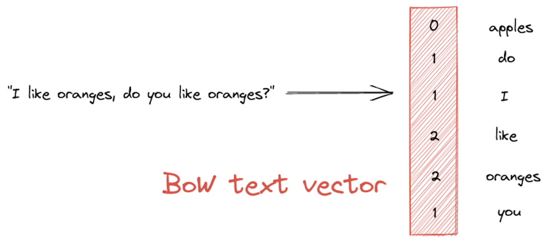

For as long as we have had computers, there has been the question of how to represent data in a way that machines can work with. In natural language processing (NLP), we often talk about text vectorization — representing words, sentences, or even larger units of text as vectors (or “vector embeddings”). Other data types, like images, sound, and videos, may be encoded as vectors as well. But what exactly are those vectors, and how can you use them in your own applications?

In this post, we’ll track the history of text vectorization in machine learning to develop a full understanding of the modern techniques. We’ll briefly look at traditional count-based methods before moving on to Word2Vec embeddings and BERT’s high-dimensional vectors. We will discuss how Transformer-based language models have brought deep semantics to text vectorization, and what that means for modern search systems. Finally, we will look at the recent and exciting trend of vector databases.

## Count-Based Text Vectorization: Simple Beginnings

In programming, a vector is a data structure that is similar to a list or an array. For the purpose of input representation, it is simply a succession of values, with the number of values representing the vector’s “dimensionality.” Vector representations contain information about the qualities of an input object. They offer a uniform format that computers can easily process.

## Bag of Words

One of the simplest vectorization methods for text is a  [bag-of-words](https://en.wikipedia.org/wiki/Bag-of-words_model)  (BoW) representation. A BoW vector has the length of the entire vocabulary — that is, the set of unique words in the corpus. The vector’s values represent the frequency with which each word appears in a given text passage:

### TF-IDF

Weighted BoW text vectorization techniques like  [TF-IDF](https://haystack.deepset.ai/components/retriever#tf-idf)  (short for “term frequency-inverse document frequency), on the other hand, attempt to give higher relevance scores to words that occur in fewer documents within the corpus. To that end, TF-IDF measures the frequency of a word in a text against its overall frequency in the corpus.

Think of a document that mentions the word “oranges” with high frequency. TF-IDF will look at all the other documents in the corpus. If “oranges” occurs in many documents, then it is not a very significant term and is given a lower weighting in the TF-IDF text vector. If it occurs in just a few documents, however, it is considered a distinctive term. In that case, it helps characterize the document within the corpus and as such receives a higher value in the vector.

## BM25

While more sophisticated than the simple BoW approach, TF-IDF has some shortcomings. For example, it does not address the fact that, in short documents, even just a single mention of a word might mean that the term is highly relevant.  [BM25](https://www.elastic.co/blog/practical-bm25-part-2-the-bm25-algorithm-and-its-variables)  was introduced to address this and other issues. It is an improvement over TF-IDF, in that it takes into account the length of the document. It also dampens the effect of having many occurrences of a word in a document.

Because BoW methods will produce long vectors that contain many zeros, they’re often called “sparse.” In addition to being language-independent, sparse vectors are quick to compute and compare.  [Semantic search](https://www.deepset.ai/blog/understanding-semantic-search)  systems use them for quick document retrieval.

Let’s now look at a more recent encoding technique that aims to capture not just the lexical but also the semantic properties of words.

## Word2Vec: Inferring Meaning from Context

Words are more than just a collection of letters. As speakers of a language, we might understand what a word means and how to use it in a sentence. In short, we would understand its semantics. The sparse, count-based methods we saw above do not account for the  _meaning_ of the words or phrases that our system processes.

In 2013, a team led by NLP researcher Tomáš Mikolov came up with the  [Word2Vec method](https://arxiv.org/abs/1301.3781), which could represent the semantic and syntactic properties of words through “word embeddings.” Word2Vec follows the idea that the meaning of words lies in their distributional properties — the contexts in which a word is used. There are two main implementations of Word2Vec ([CBOW](https://www.kdnuggets.com/2018/04/implementing-deep-learning-methods-feature-engineering-text-data-cbow.html)  and  [skip-gram](http://mccormickml.com/2016/04/19/word2vec-tutorial-the-skip-gram-model/)). Both train a shallow neural net to represent words as feature vectors of variable length (typically 300). These vectors are  _dense_, meaning that they consist of mostly floating point values, rather than zeros.

In the high-dimensional Word2Vec embedding space, similar words lie close to each other. For example, we would expect the words “orange” and “apple” to be close, while, say, “house” or “space ship” should be further away from the pair. Semantic textual similarity is measured by way of a distance metric, typically  [cosine similarity](https://deepai.org/machine-learning-glossary-and-terms/cosine-similarity). While it is virtually impossible to picture 300 dimensions in your head, the embeddings can be reduced to just two dimensions for visualization purposes, as in  [this interactive example](https://lamyiowce.github.io/word2viz/).

Often, we will want to encode the meaning of longer passages, like sentences of entire documents. We could add or average the individual word vectors to produce one vector for the entire text. Another approach is the  [Doc2Vec](https://arxiv.org/abs/1405.4053)  model, which has been trained in a manner similar to Word2Vec, only on documents rather than words.

However, despite encoding semantic properties of words, the resulting text vectorization still leaves much to be desired. For one, Word2Vec encodings are rigid: a given word will always be encoded in the same way, regardless of its position in the sentence, or whether it has multiple meanings. The model also has no way to account for unknown words.

Finally, Word2Vec-based methods have not had much success at representing longer text passages. Luckily, all of these problems have been timely addressed by a new technique for producing vectors: the Transformer-powered BERT.

### Transformers: Bringing Deep Semantics to Text Vectorization

The legendary  [BERT](https://arxiv.org/abs/1810.04805)  (“Bidirectional Encoder Representations from Transformers”) language model by Jacob Devlin and colleagues overcomes the obstacles presented by Word2Vec-based embedding methods. BERT is able to produce contextualized word vectors by encoding a word’s position in the text in addition to the word itself. Furthermore, this approach can account for unknown words as well as words with multiple meanings.

BERT’s success is based on its  [Transformer architecture](https://jalammar.github.io/illustrated-transformer/), as well as the vast amounts of data that it uses to learn. During training, BERT “reads” the entire English-language Wikipedia and the BooksCorpus, a large collection of unpublished novels. Successors to BERT, like  [RoBERTa](https://ai.facebook.com/blog/roberta-an-optimized-method-for-pretraining-self-supervised-nlp-systems/), are trained on even bigger text collections. This way, Transformer-based language models learn a deep, context-aware representation of language.

### Semantic Search Systems: Better Document Retrieval with High-Dimensional Vectors

In the context of semantic search systems, we need a way to vectorize both the documents in our document store, as well as the query that we want to match them to. We’ll present two different techniques that use Transformers to accomplish that task: Sentence-BERT and Dense Passage Retrieval.

[Sentence-BERT](https://www.sbert.net/), or SBERT, uses an encoder that can convert longer passages of text into vectors. In a semantic document search system, SBERT generates one vector for each existing document. These vectors are then indexed alongside the original document in the database. At inference time, SBERT converts the new document into a vector and compares it to the vectors in the database. The more similar two vectors are, the more similar their underlying documents.

[Dense Passage Retrieval (DPR)](https://haystack.deepset.ai/components/retriever#dense-passage-retrieval-recommended)  is a popular text vectorization method in the context of question answering systems. It is based on a dual-encoder approach and can retrieve documents that are likely to contain the answer to a given question. Consider an example from the  [DPR paper](https://arxiv.org/abs/2004.04906), where the query “Who is the bad guy in lord of the rings?” is mapped to the sentence “Sala Baker is best known for portraying the villain Sauron in the Lord of the Rings trilogy.”

As the example shows, DPR is able to pair questions and answer passages, even when they do not use the exact same words. The model understands that “bad guy” is a synonym for “villain.” This is what sets Transformer-based methods apart from keyword-matching techniques like TF-IDF and BM25. However, both SBERT and DPR do take longer during indexing time. That is because they run every document through a Transformer model, before storing it in the database alongside its high-dimensional vector representation.

### Vectors First: The Power of Vector Databases

Popular document oriented databases like  [Elasticsearch](https://www.elastic.co/what-is/elasticsearch)  and  [OpenSearch](https://opensearch.org/)  let you store and search your vectorized text along with the original documents. This is useful as it allows you to combine keyword-based approaches with the more recent, Transformer-based methods. But with growing data collections and a shift from lexical, keyword-based to semantic search systems, there’s an increased need for databases that are tailored specifically to vectorized data.

Lately, a new generation of databases has emerged to address that need. Vector-optimized databases were designed specifically for storing and searching vector data. Note that “data” doesn’t just mean text — other data types, such as images or videos, can be stored in a vector database as well. These databases are particularly fast at computing similarity between text vectors through optimization for “[nearest neighbor](https://pub.towardsai.net/knn-k-nearest-neighbors-is-dead-fc16507eb3e?gi=456eb30da280)” algorithms.

Vector databases are highly scalable, allowing for quick search even when on millions of documents. Haystack supports  [FAISS](https://faiss.ai/),  [Milvus](https://milvus.io/), and  [Weaviate](http://weaviate.com/)  vector databases— and we cannot wait to see what you’ll build with them!

## Get Started with Haystack

[Haystack](https://www.deepset.ai/haystack)  is our flagship NLP framework enabling developers to add a variety of modern NLP tasks, such as semantic search, question answering, and summarization to their applications. Compute your own vectors, add them to the  [database of choice](https://haystack.deepset.ai/components/document-store), and start building powerful natural language processing pipelines.

Get started today by checking out our  [GitHub repository](https://github.com/deepset-ai/haystack)  or by joining our community on  [Discord](https://haystack.deepset.ai/community)!