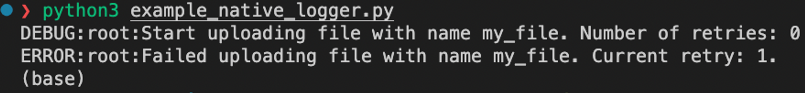
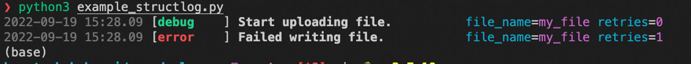
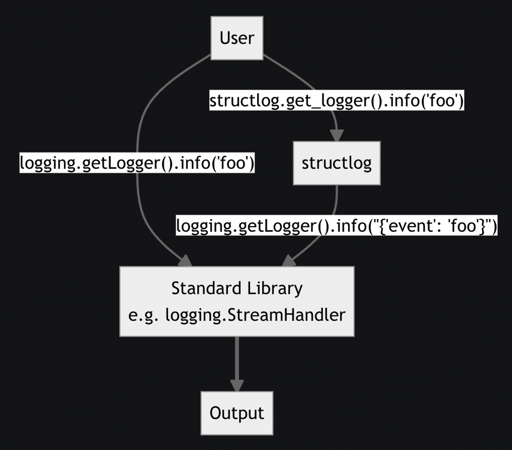
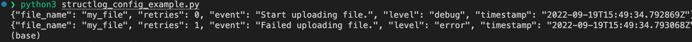

If you are a  **Python developer**  who has been  **struggling with inconsistent**  **and unhelpful logs**, then this article is for you! In this post, we will discuss how structlog can help you write logs that not only assist you in your daily work but also enforce certain best practices to ensure consistency in logging throughout your project.

We will also explore common logging challenges and how structlog can help overcome them. So whether you are a beginner or an experienced developer, keep reading to learn how structlog can revolutionize your logging process!

In the past, I often neglected logs and only wrote a few when they helped me in my development environment. These logs were useful for finding bugs or validating that the code works as intended, but they were only helpful for local debugging.

After learning about structlog, I now know how to write logs that not only assist me in my daily work, but also enforce certain best practices that ensure consistency in logging throughout the project.

This makes parsing logs for your shipped application easier and improves your monitoring in tools like  [Datadog](https://www.datadoghq.com/)  or  [Grafana](https://grafana.com/).

In this article, I will share some of my experiences with  [structlog](https://www.structlog.org/en/stable/)  and demonstrate the power of this library by walking you through an example scenario. Let’s assume that a user wants to upload files and we have already created an endpoint that accepts these requests. In the past, I might have written logs like this:

```python
import logging  
...   
logging.debug("Start uploading file with name %s. Number of retries: %s", file_name, 0)  
...  
logging.error("Failed uploading file with name %s. Current retry: %s.", file_name, retries)  
... 
```
Basically, there is nothing wrong with this code snippet, which prints the following logs.




These two log lines describe what is happening during a request. However, we could improve the notation of the retries, add more context and make the log lines more readable.


## Classic logging challenges

Before we jump into the hands on part, let’s first understand some common logging challenges based on the example above.

### 1. Missing contextual information

The log line precisely describes that a  `my_file`  failed to upload. This information might be sufficient for a development environment where there is only one user and one client sending requests, the data is stored on the local file system, and all requests are executed sequentially.

However, when encountering this kind of log in a production system, typical questions that might arise are:

-   Who sent this request?
-   Which organization does the user belong to?
-   Which file store did we connect to? Is there a session identifier or something else that helps us trace down the error?
-   Is this log line connected to a request identifier?

To obtain this information for log lines, we would need to add this extra information to each log line, and in the worst case, fetch the same value from a database multiple times to add this informational context throughout the codebase.

### 2. Transition from development-only to machine readable logs

Depending on the environment, you may want to have log lines that are prettified to allow humans to read them easily, but also provide them in a machine-readable format in a production system. Within our production deployment, we might want to count the total number of retries or filter for a failed file name. In this scenario, we would need to run substring matches. It would be much easier to write queries that let you filter, maybe even in an SQL-like manner for events.
```
select file_name from logs where retry_count > 1
```
### 3. Inconsistent wording

It is common for log lines within the same Python module to look completely different from one another. Sometimes, important information is even missing. Depending on the author, log lines can look very diverse. Entities can be referred to by different names, and the values of variables may be added to the log with or without quotes, or their wording may be changed throughout the module.

This makes searching for specific events difficult and time-consuming.

## Structlog

> [Structlog](https://www.structlog.org/en/stable/)  offers a lot of nice features that help you write logs in a faster and less painful way. It helps you to add contextual data to your logger and offers a modular configuration for parsing your log lines in a machine readable and developer friendly way.

In our case, this means that we get beautiful colored log lines within our development environment and parsed JSONs for our monitoring, add file names as contextual data and use some more convenience features. It is important to mention that although the native logger can be set up to log as JSON, structlog provides this capability out of the box.

### First step — Replace python’s native logger with structlog

Let’s use structlog for the same code snippet as above. We need to obtain the logger and add the variables to our log messages. A code snippet could look like this:
```python
import structlog   
logger = structlog.get_logger()  
...   
logger.debug("Start uploading file.", file_name=file_name,retries=0)  
...  
logger.error("Failed uploading file.", file_name=file_name,retries=retries)  
...
```
The first thing we might notice is that the variables are not longer loaded to the string but rather  `kwargs`  of the  `debug`  and  `error`  methods. This not only adds the values of these variables to the logger but also binds the key names to the log message. The resulting log lines will look like this:




If we compare this to the solution we had before, we can see that the file name and retries are added to the log lines by mapping key values instead of inserting the values as a raw string.


### Second step — Bind contextual data to loggers

Generally there are two ways of adding contextual data to loggers with structlog.

**1. Explicitly binding variables**, by calling  `.debug(…)`  . We will update the previous code snipped by first binding the  `file_name`  to the logger and using the logger instance to print log messages.
```python
import structlog   
logger = structlog.get_logger()  
...   
log = logger.bind(file_name=file_name)  
log.debug("Start uploading file.", retries=0)  
...  
log.error("Failed uploading file.", retries=retries)  
...
```
This allows us to remove the file name from all the log lines and move it to the top where it is just called once. Structlog will take care of adding it to each log line.

**2. Implicitly binding context variables**, by calling structlog.contextvars.bind_contextvars(…) — This function uses  [context variables](https://docs.python.org/3/library/contextvars.html)  that are used whenever the logger within the same thread prints log messages. A code snippet that prints the same log messages using context variables might look like this:

```python
# /controller/file.py  
  
import structlog   
  
logger = structlog.get_logger()  
...   
structlog.contextvars.bind_contextvars(file_name=file_name)  
logger.debug("Start uploading file.", retries=0)  
...  
logger.error("Failed uploading file.", retries=retries)
```
However, our scenario is  **not the preferred use case**  for using context variables to add values to your logger. As we learned in the logging challenges, contextual data is often missing in the classic approach. Before processing the file, we assume that an authentication and authorization mechanism is in place to validate whether a user has access to the endpoint. In a framework like  [FastAPI](https://fastapi.tiangolo.com/), this workload is handled in middleware. Since we have already fetched the user ID here to authenticate the request, let’s add this key-value pair to the logger:

```python
# /auth/middleware.py   
  
def verify_user(request: Request) -> bool:  
 if not validate(request.token):  
  return False  
   
 user_id = get_user_id(request.token)  
 structlog.contextvars.bind_contextvars(user_id=user_id)  
 return True 
```

This way  [structlog](https://www.structlog.org/en/stable/)  will take care of adding this contextual information for us and we don’t need to worry about adding the user id manually.

## Third Step — Configuration for machine readable logs

After learning how to attach information to log lines using structlog, we now want to configure it to send prettified log lines in our local development environment setup and parsed JSONs for our logging service. We will follow the first and simplest solution from the structlog docs. Before we proceed, we need to understand two concepts from structlog: Preprocessors and Renderers.

**Preprocessors**  are used to extend the content of log messages. This can be done by adding timestamps, modifying fields to obfuscate user names, or dropping log lines based on defined conditions.

**Renderers**  are used to control the representation of log lines. Depending on the use case, they can display beautified and colorful log lines, or machine-readable JSONs.

The ability to write custom implementations of these nodes provides a lot of extensibility.

We will use default structlog preprocessors to define the content of our log lines. The following diagram illustrates how to handle log lines that use a structlog logger. After the output step, we add a renderer based on the environment that formats the log lines as human or machine readable output.



Logging architecture from  [structlog docs](https://www.structlog.org/en/stable/standard-library.html#rendering-within-structlog)

We begin by configuring a set of processors that add timestamps, set the log level, and merge the context variables used in step 2.

```python
import structlog  
from structlog.dev import ConsoleRenderer  
from structlog.processors import JSONRenderer  
  
# Timestamper preprocessor that to add unified timestamps to each log  
timestamper = structlog.processors.TimeStamper(fmt="iso", utc=True)  
  
# Structlog preprocessors  
structlog_processors = [  
  structlog.stdlib.add_log_level  
    structlog.processors.add_log_level,  
    structlog.contextvars.merge_contextvars,  
    structlog.processors.StackInfoRenderer(),  
    structlog.dev.set_exc_info,  
    timestamper,  
]
```

Now we want to define a function that either returns structlogs  `ConsoleRenderer`or  `JSONRenderer`, based on the environment settings and append this renderer to the processors.

```python
# __init__.py  
  
from structlog.dev import ConsoleRenderer  
from structlog.processors import JSONRenderer  
  
def get_renderer() -> Union[JSONRenderer, ConsoleRenderer]:  
    """  
    Get renderer based on the environment settings  
    :return structlog renderer  
    """  
    if os.get("DEV_LOGS", True):  
        return ConsoleRenderer()  
    return JSONRenderer()  
  
  
## Structlog  
structlog.configure(  
    processors=structlog_processors + [get_renderer()],  
    wrapper_class=structlog.stdlib.BoundLogger,  
    context_class=dict,  
    logger_factory=structlog.PrintLoggerFactory(),  
    cache_logger_on_first_use=False,  
)
```

> ⚠️ This will only affect the log lines printed within your application and will not affect logs produced by modules used inside your application. If you also want these logs to be formatted as JSON, you need to follow  [tutorial 3 of the structlog documentation](https://www.structlog.org/en/stable/standard-library.html#rendering-using-structlog-based-formatters-within-logging).

After setting the environment variable  `DEV_LOGS`  to  `False`  our log lines are printed as raw JSONs.




This format can now be used in your monitoring system and easily be parsed and aggregated since its not longer a stream of text, but rather a stream of easy to parse JSONs.

In our local environment we can still use the old colored log lines:


## Limitations

Although structlog alone will not solve all inconsistencies with logging, it can help to use a more consistent and less error-prone workflow.

To increase consistency in our codebase, we use a set of default naming conventions. While these conventions are not enforceable, they can contribute to a common understanding of how to write logs.

1.  `<entity>_id` <- **( required)**  every entity (e.g. file) that is processed needs to be added to the logger
2.  `<entity>_name`  <-  **(optional)**  every entity (e.g. file) can be added with the suffix _name for a better readability
3.  `<entity>_<additional_key>`  <-  **(optional)**  additional properties of entities are allowed to be added with the key name as a suffix
4.  `<custom_usecase_specific_field>`  ←  **(optional)** Sometimes, you may need to add case-specific information. In such cases, you can use additional arbitrary keys. However, it is recommended to follow the naming conventions from 1–3, if possible.

This is for sure not the only possible naming, but the one that works for us best.


## Summary

We have learned the following:

1.  Using a key-value format for variables helps create uniform log messages and promotes consistent naming conventions.
2.  Contextual data can be explicitly added by binding variables to loggers or implicitly added using context variables, which enriches log lines with useful metadata.
3.  Choosing a structlog renderer allows for easy parsing of log lines into a machine-readable or prettified, human-friendly format based on the environment.

**About me:**  I am a developer based in Cologne, working at  [deepset](https://www.deepset.ai/). I am part of the team building “deepset Cloud,” which is powered by the open source framework  [Haystack](https://haystack.deepset.ai/).